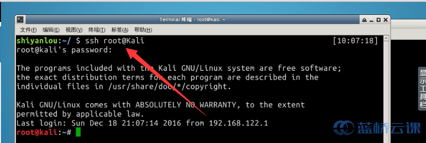
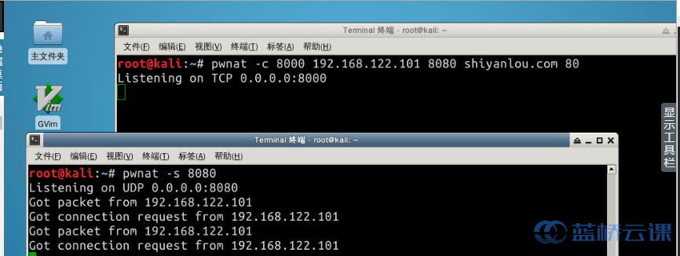
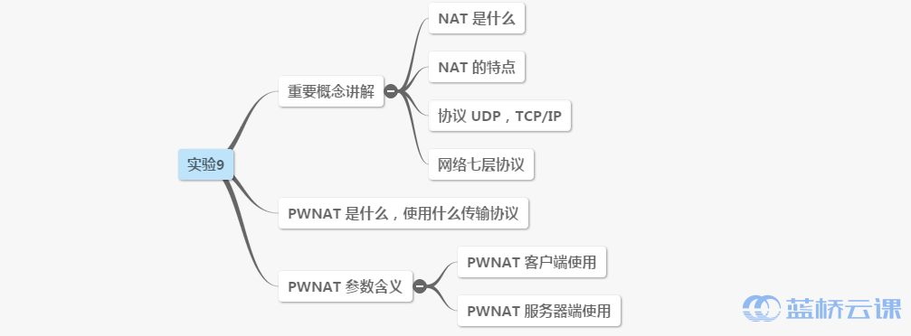

# PWNAT 创建 NAT-NAT 通信隧道

## 一、实验简介

### 1.1 实验介绍

在创建通信隧道的众多工具中，PWNAT 是一款非常好用的通信隧道创建工具。本实验是一个建立 NAT-NAT 通信隧道的实验，NAT 全名为 Network Address Translation，中文意思是网络地址转换。实验中将会介绍如何在 Kali Linux 中使用 PWNAT 工具创建 NAT-NAT 通信隧道。

实验在介绍 PWNAT 使用的同时，对其中涉及到的 TCP/IP 协议，以及网络七层协议等必要的概念基础知识，也会对其相应的概念进行讲解，从而更好地理解 PWNAT 创建 NAT-NAT 隧道通信过程。

**注意：实验用的云主机因为配置成本较高，会限制次数，每个实验不超过6次**

### 1.2 主要知识点

上一节实验介绍的是 Weevely 创建 PHP 挂马文件，下一节介绍的也是木马文件的制作。所以在这一节中，主要介绍一些必需掌握理论知识，实验的概念性知识偏多。实验中需要了解掌握的基本概念如 NAT，UDP，网络七层协议等。本实验的主要知识点列表如下：

- Linux 系统操作的基本知识
- NAT、UDP的基本概念
- TCP/IP 协议的基本知识
- pwnat 工具参数的含义
- pwnat 创建通信隧道的基本流程

### 1.3 实验环境

本课程的实验环境由实验楼提供，由于实验的特殊性，不能与外部联网，以及保存实验环境。在本次实验环境中，宿主机为 Ubuntu 14.04，在宿主机上安装有两台虚拟机，这两台虚拟机分别为 Kali Linux 和 Metasploitable2。我们所有的操作，均基于 Kali Linux 上完成的。

Kali Linux 是一款提前安装有许多信息安全渗透工具的 Linux 操作系统。其中渗透工具 Metasploit 非常受黑客与安全信息人士的喜爱。在本实验中，先讲解必须掌握的概念性知识，接着会介绍如何使用 PWNAT 创建 NAT-NAT 通信隧道。


## 二、启动环境

## 2.1 启动实验环境

本课程所要进行的实验为，PWNAT 创建 NAT-NAT 通信隧道。首先在宿主机 Ubuntu 14.04 上打开 Kali 虚拟机，输入如下命令开启虚拟机，接着输入命令连接 Kali 虚拟机，其中`root@Kali's password` 的密码为 `toor`。**注意：这里的 Kali 中字母 K 是大写的 K，输入小写的 k 会报错**：

```
# 开启 Kali Linux 虚拟机 
sudo virsh start Kali

# 连接 Kali 虚拟机
ssh root@Kali
```


**还有一点值得注意的是，如果在开启 Kali 后，马上进行连接，则会报错误 `ssh: connect to host Kali port 22: No route to host`。报错的原因是因为 Kali 虚拟机还未完全启动，需要一点时间才能完成启动。**

## 三、重要概念讲解

### 3.1 NAT 是什么？

NAT 全名叫 Network Address Translators，中文名为网络地址转换，也叫做网络掩蔽或者 IP 掩蔽（全名为 IP masquerading）。网络地址转换是在 IP 地址日益缺乏的情况下产生的，它的主要目的就是为了能够地址重用。NAT 分为两大类，基本的 NAT 和 NAPT（全名为 Network Address/Port Translator）。

NAT 是 1994 年提出的。当在专用网内部的一些主机本来已经分配到了本地 IP 地址（即仅在本专用网内使用的专用地址），但现在又想和因特网上的主机通信（并不需要加密）时，可使用 NAT 方法。

这种方法需要在专用网连接到因特网的路由器上安装 NAT 软件。装有 NAT 软件的路由器叫做 NAT 路由器，它至少有一个有效的外部全球 IP 地址。这样，所有使用本地地址的主机在和外界通信时，都要在 NAT 路由器上将其本地地址转换成全球 IP 地址，才能和因特网连接。

### 3.2 NAT 的特点

在一个具有 NAT 功能的路由器下的主机并没有创建真正的 IP 地址，并且不能参与一些因特网协议。一些需要初始化从外部网络创建的 TCP 连接和无状态协议（比如 UDP）无法实现。

NAT 除了带来方便和代价之外，对全双工连接支持的缺少在一些情况下，可以看作是一个有好处的特征而不是一个限制。在一定程度上，NAT 依赖于本地网络上的一台机器来初始化，和路由器另一边的主机的任何连接，它可以阻止外部网络上的主机的恶意活动。


> 图片来自互联网：http://samy.pl/pwnat/

### 3.3 PWNAT 是什么，使用什么传输协议？

PWNAT 是不需要任何帮助就在两个 NAT 后面的电脑之间建立连接的程序工具。由著名黑客萨米 MySpaceg 编写。
工具使用了很巧妙的方法。服务端在内网，不停发送 ICMP 到3.3.3.3。

客户端要连接的时候，发一个欺骗的 3.3.3.3 返回的不可达的数据包到服务端的外网 IP。这个 ICMP 会被正确转到内网的服务端。
服务端于是就知道有一个 IP 要连进来，然后两边同时用 UDP 打洞，就直接连上了。

用户数据包协议（英文全名为 User Datagram Protocol，缩写为 UDP），又称用户数据报文协议，是一个简单的面向数据报的传输层协议。

> 部分参考：http://bbs.routerclub.com/blog-681-7082.html

其中，ICMP 是网路协议族的核心协议之一，英文全名为 Internet Control Message Protocol。它是 TCP/IP 协议族的一个子协议，用于在 IP 主机、路由器之间传递控制消息。

在平常的网络通信文档中，我们经常会看到 TCP/IP 这个协议的出现。TCP/IP 是 Transmission Control Protocol/Internet Protocol 的简写，中译名为传输控制协议/因特网互联协议，又名网络通讯协议，`是 Internet 最基本的协议`、Internet 国际互联网络的基础，由`网络层`的 IP 协议和`传输层`的 TCP 协议组成。

网络七层协议依次如下表，顺序由上至下：

| 协议层名称 | 协议层作用                                                   |
| ---------- | ------------------------------------------------------------ |
| 应用层     | 与其它计算机进行通讯的一个应用，它是对应应用程序的通信服务的。 |
| 表示层     | 这一层的主要功能是定义数据格式及加密。                       |
| 会话层     | 它定义了如何开始、控制和结束一个会话，包括对多个双向消息的控制和管理。 |
| 传输层     | 这层的功能包括是否选择差错恢复协议还是无差错恢复协议。       |
| 网络层     | 这层对端到端的包传输进行定义，它定义了能够标识所有结点的逻辑地址，还定义了路由实现的方式和学习的方式。 |
| 数据链路层 | 它定义了在单个链路上如何传输数据。这些协议与被讨论的各种介质有关。 |
| 物理层     | OSI 的物理层规范是有关传输介质的特性标准，这些规范通常也参考了其他组织制定的标准。 |


## 四、过程实现

### 4.1 PWNAT 参数含义

在了解了 NAT 和 PWNAT 是什么，以及网络七层协议之后，我们接下来使用 PWNAT 这个工具来创建 NAT-NAT 通信隧道。首先在 Kali Linux 终端中输入如下命令：

```
# 查看 pwnat 工具使用帮助
pwnat -h
```


上图中显示的参数含义分别为：

| 参数名称 | 参数所代表的含义                             |
| -------- | -------------------------------------------- |
| `-c`     | pwnat 客户端所使用的参数，用以与服务器端连接 |
| `-s`     | pwnat 服务器端所使用的参数，用以与客户端连接 |
| `-6`     | 通信隧道使用 `IPV6` 地址                     |
| `-v`     | 显示pwnat 工具的 Bug 输出信息                |
| `-h`     | 显示 pwnat 工具的帮助帮助信息                |

### 4.2 开启服务器端监听

由上面的 `pwnat -h` 命令查看参数含义可以知道，服务器端的语法为：

```
# 参数： [本地 IP 地址] [代理端口] [允许的主机][允许的端口]
<args>: [local ip] [proxy port (def:2222)] [[allowed host]:[allowed port] ...]
```
在 Kali 命令行终端中，输入如下命令：

```
# 监听本地代理的 8080 端口
pwnat -s 8080
```


由显示的输出信息 `Listening on UDP 0.0.0.0:8080` 中可以看出 `on UDP`，即使用的协议是用户数据报文协议。

### 4.3 开启客户端连接

在宿主机 Ubuntu 中，重新打开新的终端窗口连接 Kali Linux 虚拟机：



同样的，由之前的 `pwnat -h` 查看帮助命令可以知道，PWNAT 客户端的语法命令为：

```
# 参数：[本地 IP 地址] <本地端口> <代理主机> [代理端口] <远程主机地址> <远程端口>
<args>: [local ip] <local port> <proxy host> [proxy port (def:2222)] <remote host> <remote port>
```
在 Kali Linux 的终端中输入如下命令：

```
# 使用 pwnat 开启连接
pwnat -c 8000 192.168.122.101 8080 shiyanlou.com 80
```



**`注意：`在实际的生产环境中，客户端连接的远程主机地址，还得需要自己配置，由于实验未能联网，未能实现真正意义上的打洞穿透。由于联网的原因，远程配置在此不进行配置演示。PWNAT 的服务器端和客户端使用命令，即为上述实验文档所示。当一切配置正常，打洞成功会看到如下形式的提示：**


本实验主要了解 PWNAT 创建 NAT-NAT 隧道通信这一过程，对于文档中提到的 NAT 特点，以及七层网络协议一定要掌握清楚。后门实验的重心，是在攻陷目标主机后，使用木马建立攻击机和目标靶机两者之间的连接。在下一节的实验中，将会介绍新的方法创建木马程序。

## 五、总结和思考

### 5.1 总结和思考

本课程主要介绍了使用 PWNAT 来进行 NAT-NAT 打洞的过程，其中涉及到的知识点，如 NAT、UDP的基本概念，TCP/IP 协议等基本知识，PWNAT 工具参数的含义，以及 PWNAT 创建通信隧道基本流程。对于这些概念性知识，需要不断地加深理解。

除了 PWNAT 外，还有一个类似的工具叫 N2NC，也是基于 UDP 打洞。UDP 是用户数据报文协议，是一个简单的面向数据报的传输层协议。UDP 常常与 TCP/IP 协议一起出现，初学者很容易将这两个协议混淆。上述实验文档内容的结构如下：




## 六、课后作业

### 6.1 课后作业

想深入理解各种通信隧道的建立，首先要了解网络中的各种协议，其中网络七层协议尤其重要。本实验中创建 NAT-NAT 通信隧道的工具 PWNAT，Github 源码地址如下：

> https://github.com/samyk/pwnat

学习完本实验后，请同学们思考如下问题：

- Socket 编程和 PWNAT 创建 NAT-NAT 通信隧道有什么异同？
- 除了使用 PWNAT 这个工具创建 NAT-NAT 通信隧道外，还有没有其它类似工具？ 