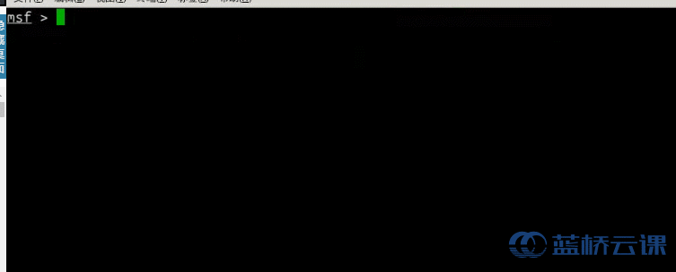
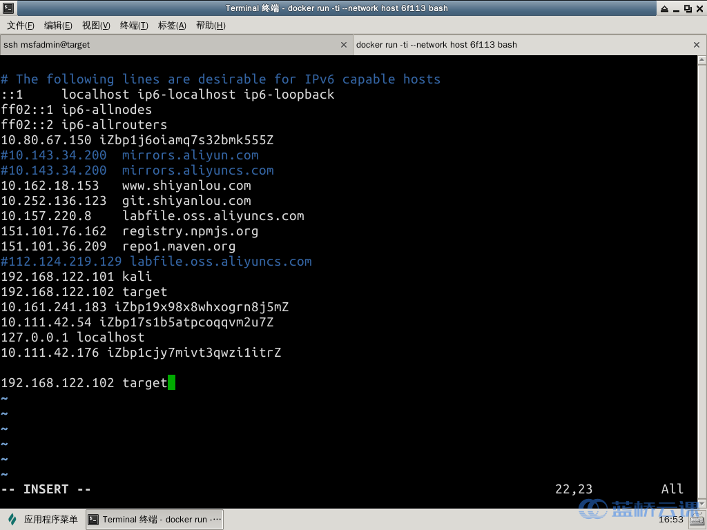
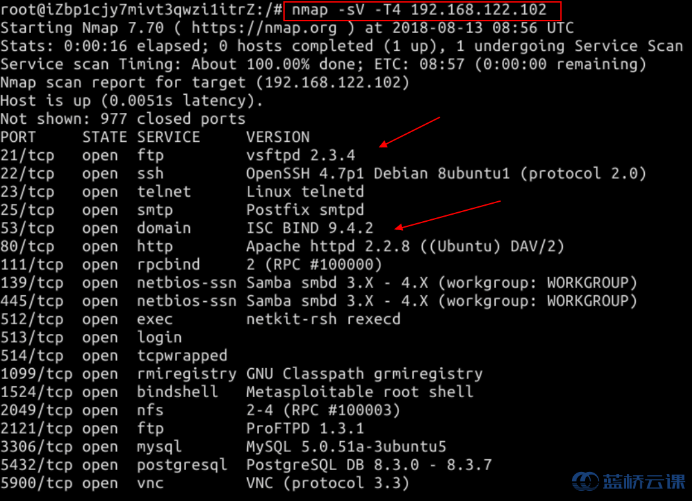
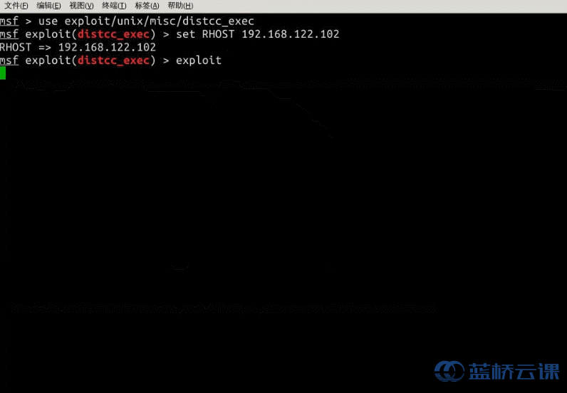
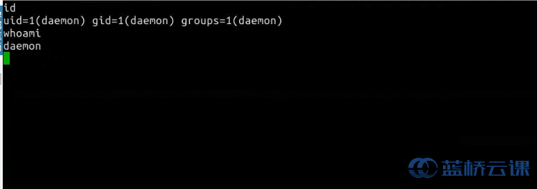
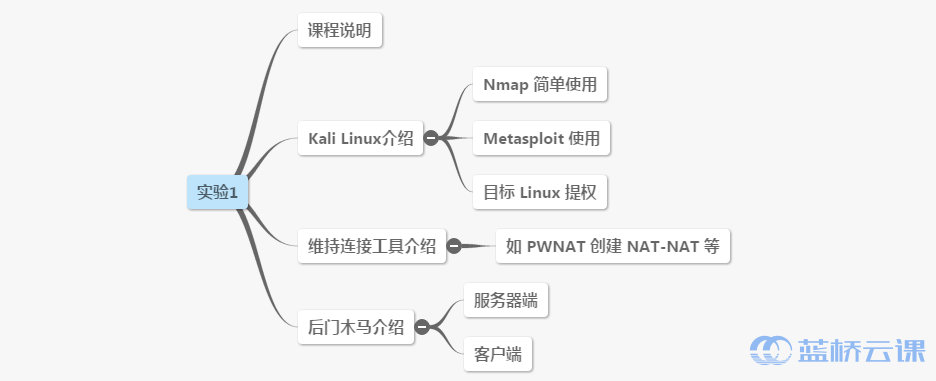

# 维持访问的基本思路介绍

## 1. 课程说明

### 1.1 课程说明

本课程为纯动手的实验，为了能够说清楚实验中的一些操作会加入理论内容。对于理论部分，大多数牛人已经写好文章，实验中会精选最值得读的文章推荐给你，在动手实践的同时扎实理论基础。

本课程主要介绍 Kali Linux 下的对目标主机后门维持访问。

本训练营主要讲后门技术实战，偏重于渗透成功后的维持访问。该课程共包含 10 个实验，每个实验都提供详细的步骤和截图，其中会有三节实验，**`专门用来讲解木马的制作`**，以及对生成的 **`后门木马的源码分析`** 。适用于有一定 Linux 系统基础，想快速上手 Kali 渗透测试的，并且对木马制作感兴趣，以及渗透测试成功后建立后门维持访问的同学。

**注意：实验用的云主机因为配置成本较高，会限制次数，每个实验不超过6次**

## 2. Kali Linux 介绍

### 2.1 Kali Linux 是什么？

Kali Linux 是一个基于 Debian 的用来进行渗透测试和安全审计的 Linux 操作系统，最初在 2013年3月 由具备类似功能的 BackTrack 系统开发而来，由 Offensive Security 团队支持开发。为了支持安全审计和渗透测试的一系列功能，Kali Linux 进行了定制化，包括内核，网络服务和用户都进行了特殊的设置。

Kali Linux 较 Debian 而言，Kali Linux 面向专业的渗透测试和安全审计，因此已经对多处核心地方进行了修改。如设计成了 root 权限登录。由于安全审计的本质，Kali Linux 被设计成使用 “单用户，root 权限" 方案。

Kali Linux 系统内预装了很多安全相关的工具，例如非常有名的 Nmap 端口扫描器、John the Ripper 密码破解器、Metasploit Framework 远程攻击框架等。在该训练营中，我们主要使用 Kali Linux 系统中一些预装工具对目标主机进行渗透攻击，进而感染目标主机留下木马后门，达到持续访问的目的。


## 3. 本节推荐阅读

### 3.1 本节推荐阅读

本节实验推荐阅先阅读下述内容：

> Kali 使用入门：http://docs.kali.org/category/introduction

上述的 Kali 使用入门这篇文章，适合对 Kali 的基本操作不熟悉的同学阅读。

> Metasploitable2 使用指南：https://community.rapid7.com/docs/DOC-1875

这篇文章介绍了 Metasploitable2 的使用教程，是一篇非常好的入门资料。

## 4. Metasploit 介绍

### 4.1 关于 Metasploit 的介绍

Metaploit 是一个免费的、可下载的框架，通过它可以很容易地获取、开发并对计算机软件漏洞实施攻击。它本身附带数百个已知软件漏洞的专业级漏洞工具。允许任何攻击代码和有效负载进行随意组合的模块化的结构是 Metasploit 框架的主要优势。

使用者可以通过不同的搭配在有限的漏洞下导入不同的负载。Metasploit 框架可以通过添加模块实现扩展，允许使用者，攻击代码作者和有效负载的作者专注于写出所需的功能，而无需处理其他问题。

选择攻击代码和有效负载需要目标系统的部分信息，比如其操作系统的版本和安装的网络服务。这些信息可被类似于 Nmap 的端口扫描和操作系统分析工具收集到。类似于 Nexpose 或 Nessus 的弱点扫描工具可以探测到目标系统的弱点。

Metasploit 可以导入弱点扫描数据并通过对比已发现的弱点和拥有的攻击代码模块来进行准确的攻击。使用 Metasploit Framework 框架攻击目标主机的的基本步骤包括：

1. 选择并配置一个攻击代码（exploit 利用漏洞来进入目标系统的代码）。
2. 检查目标系统是否会被此代码影响。
3. 选择并配置一个有效负载 payload，即成功进入后在目标系统上执行的代码。
4. 选择编码方式，入侵防御系统，忽略已被编码的有效负载。
5. 运行代码命令，对目标主机进行攻击。



### 4.2 使用 Metasploit 攻击目标主机

本训练营 Kali 后门技术实战的实验环境由实验楼提供，宿主机的操作系统为 Ubuntu 14.04，宿主机上的攻击机 Kali Linux 采用 docker 安装，宿主机上的虚拟机中装有供实验攻击的目标靶机 Metasploitable2，其中关于目标靶机 Metasploitable2 虚拟系统是一个特别制作的 Ubuntu 操作系统，用于安全工具测试和演示常见漏洞攻击。

首先在实验楼的宿主机 Ubuntu 中输入命令 `sudo virsh list --all` 可以看到名为 `Metasploitable2` 的虚拟机主机。


在实验楼宿主机终端中，输入命令 `sudo virsh start Metasploitable2` 开启靶机。开启靶机可能需要四分钟左右。能够 ping 通靶机，说明靶机已经真正开启了，如下图所示：


在宿主机中，kali 使用的是 docker 容器，执行如下命令可以看到 kali 的 docker 镜像：


使用如下命令可以进入到 kali 虚拟主机中去：

```bash
$ docker run -ti --network host 6f113 bash
```

为了方便攻击，我们把靶机地址加入进 kali 虚拟主机的 /etc/hosts 里：

```bash
192.168.122.102 target
```



> 使用 `vi /etc/hosts` 命令打开 hosts 文件，然后按 `i` 键进入编辑模式，添加好内容过后，按 `esc` ，再输入 `:wq` ，随后按 `enter` 键即可保存退出。

在进入 Kali 虚拟主机之后，我们可以使用扫描神器 Namp 对目标主机进行扫描。Nmap 中文名为网络映射器，是一款用于网络发现和安全审计的网络安全工具，它是自由软件。软件名字 Nmap 是英文 Network Mapper 的简称。

Nmap 可以检测目标主机是否在线、端口开放情况、侦测运行的服务类型及版本信息、侦测操作系统与设备类型等信息。它是网络管理员必用的软件之一，用以评估网络系统安全。在 Kali Linux 终端中输入命令 `nmap -sV -T4 192.168.122.102` 对目标靶机进行扫描，目标靶机的 IP 地址为 `192.168.122.102`：



> 如果我们配置了 /etc/hosts 文件，也可以使用 `nmap -sV -T4 target` 命令扫描。

关于 Nmap 命令行中 `-sV` 参数意思是显示扫描端口的详细信息，而 `-T` 是扫描速度的设置，关于 `-T` 的参数列表如下：

| 参数名称  | 参数所代表的含义                                         |
| --------- | -------------------------------------------------------- |
| `nmap T0` | 非常慢的扫描，用于 IDS(入侵检测系统)逃避                 |
| `nmap T1` | 缓慢的扫描，介于 0 和 2 之间的速度，同样可以躲开某些 IDS |
| `nmap T2` | 降低扫描速度，通常不用                                   |
| `nmap T3` | 默认扫描速度                                             |
| `nmap T4` | 可能会淹没目标，如果有防火墙很可能会触发                 |
| `nmap T5` | 极速扫描，牺牲了准确度来换取速度                         |

在通过 Nmap 扫描神器，我们知道了目标靶机的开放端口，接下来我们使用 Metasploit 对目标靶机进行渗透测试。在下面例子中，我们选用 `Distcc` 漏洞对目标主机进行攻击。在命令行终端中，输入命令 ` msfconsole` 打开 Metasploit 终端，在 Metasploit 终端中输入如下命令：**（注意：msfconsole 打开终端的时间比较久，大概在一分钟左右，主要原因是在加载各种攻击模块，所以运行时间比较慢）：**

```
# 使用相应的攻击模块
# 设置攻击主机的 IP 地址
# 输入攻击命令

msf > use exploit/unix/misc/distcc_exec
msf > set RHOST 192.168.122.102
msf > exploit
```


此时，已经完成了攻击，建立了攻击机和目标靶机两者之间的会话通道，在命令行终端中输入 `whoami` 命令，可以得到反馈显示 `daemon`这个用户名，该用户并非 root 权限。在一般的维持访问的过程中，我们需要得到计算机的 root 权限，进而能在后续创建后门过程中，上传攻击者的木马程序。关于如何利用漏洞攻击服务器在这里不过多介绍，对于更多的利用目标靶机漏洞攻击实战，同学们可以学习实验楼的另一门训练营：
> Kali 服务器攻击实战：https://www.shiyanlou.com/courses/698

## 5. 目标 Linux 系统提权

### 5.1 利用漏洞提权，为后续上传木马作准备

当渗透目标靶机获取了权限后，有时候未必是 root 权限，这个时候我们需要进行提权操作。在命令行终端中，输入 `/usr/bin/nmap --version` 可以查看 Namp 的版本信息。旧版本的 Namp 存在漏洞，可以通过漏洞对当前用户进行提权操作。在命令行终端中输入如下命令：
```
# 第一行代码为在交互模式下启动

/usr/bin/nmap --interactive
nmap > !sh
```
其中 `/usr/bin/nmap --interactive` 的意思是在交互模式中启动。旧版本的 Nmap 存在漏洞，只要输入 `!sh`，就能够提升权限，这个提权命令只存在 Nmap 旧版本中，原因是 Nmap 的代码设计不合理造成的。



在获取 root 权限之后，命令行中输入 `id` 命令，则可以看出较未提权前多了一个 `euid=0(root)`，linux 系统中每个进程都有 2 个 ID，分别为用户 ID 和有效用户 ID。UID 一般表示进程的创建者（属于哪个用户创建），而 EUID 表示进程对于文件和资源的访问权限（具备等同于哪个用户的权限）。


## 6. 维持连接的工具介绍

### 6.1 维持连接的工具介绍

上面介绍完如何使用 Kali Linux 中的预装工具 Metasploit 对目标靶机进行攻击，获取目标靶机的权限，建立了命令通道，接着使用目标靶机中 Nmap 版本存在的旧版本漏洞进行提权，从而获得 root 权限。一般来说，渗透攻击首先要做的就是信息收集，其中包括目标靶机的操作系统版本，开放的网络服务端口，使用服务的软件信息等。

接着对收集到的信息进行分析，查看是否存在相应的版本漏洞。从而利用这些旧版的漏洞，进行渗透攻击，获取目标靶机的权限，达到控制目标靶机的目的。本训练营为后门技术实战，更加偏重于在渗透成功后，维持访问的实战，如使用 PWNAT 创建 NAT-NAT 通信隧道，DNS2TCP 在 DNS 数据流中维持 TCP 连接的原理讲解等。

对于想学习使用 Kali 对目标靶机进行渗透攻击的更多实战，可以学习实验楼的另一门训练营《Kali 服务器攻击实战》，该训练营专门介绍使用 Kali 中的各种模块对软件漏洞进行攻击。

 


## 7. 后门木马介绍

### 7.1 后门木马介绍

后门木马又称特洛伊木马，英文叫做 Trojan horse，它是一种基于远程控制的黑客工具。后门木马在计算机领域中指的是一种后门程序，是黑客用来盗取其他用户的个人信息，甚至是远程控制对方的计算机而加壳制作，然后通过各种手段传播或者骗取目标用户执行该程序，以达到盗取密码等各种数据资料等目的。

与病毒相似，木马程序有很强的隐秘性，随操作系统启动而启动。一个完整的特洛伊木马套装程序包含两部分：服务端（服务器部分）和客户端（控制器部分）。植入对方电脑的是服务端，而黑客正是利用客户端进入运行了服务端的电脑。

运行了木马程序的服务端以后，会产生一个有着容易迷惑用户的名称的进程，暗中打开端口，向指定地点发送数据（如网络游戏的密码，即时通信软件密码和用户上网密码等），黑客甚至可以利用这些打开的端口进入电脑系统。

在本训练营中，将会有三门实验专门介绍如何制作木马，并将生成的木马上传到目标靶机，感染目标靶机。在这其中会对制作的木马源码关键部分进行讲解，了解木马的运作过程，以及如何维持与攻击者的连接。

## 8. 总结

### 8.1 本课总结

本实验主要讲解了在实验楼环境下使用 Kali Linux 对目标靶机 Metasploitable2 进行攻击，其中主要介绍了 MSF 终端的使用。首先使用 Nmap 对目标靶机进行扫描收集信息，对开放的端口进行判断，分析是否可能存在存在漏洞。

在综合信息之后，判断目标靶机可能存在的漏洞，并尝试进行渗透攻击。如果能够攻陷目标主机，则能够拿到目标靶机权限。在很多情况下，拿到的目标靶机不一定是最高权限，这个时候则进行提权。

提权的需要再次分析目标靶机中能够利用的漏洞，在本实验中，我们利用目标靶机的 nmap 版本漏洞过低进行 Linux 目标提权。如果目标靶机的 Nmap 已经升级到最新版本，则不存在这个漏洞，需要重新寻找其他漏洞进行提权。

在演示了目标靶机提权之后，接着介绍维持连接的工具的有哪些工具，以及后门木马是什么。接下来的实验主要是围绕着渗透成功后的维持连接工具介绍，以及对接下来的本训练营实验，如何制作属于自己的木马程序这两个部分进行介绍。



## 9. 作业

### 9.1 课后作业

完成了本节实验课程后，请同学们完成如下课后作业。对于不懂的问题，都可随时在[实验楼问答](https://www.shiyanlou.com/questions)中提出，与老师和同学一起交流。

1. 在实验楼中启动 Kali 虚拟机，使用扫描工具 Nmap 对目标靶机进行扫描。
2. 依照第 4.2 节中内容，使用 Kali 虚拟机对目标靶机进行渗透攻击。
3. 依照第 5.1 小节在渗透攻击成功后，对目标靶机进行提权操作，获取 root 用户权限。