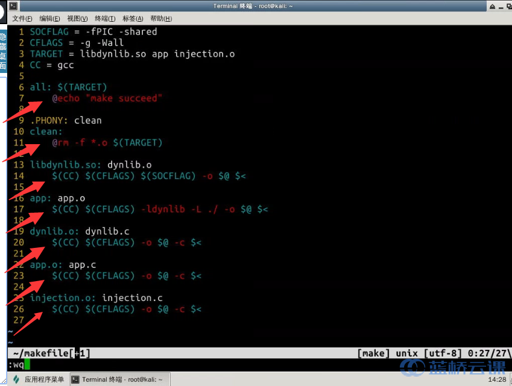
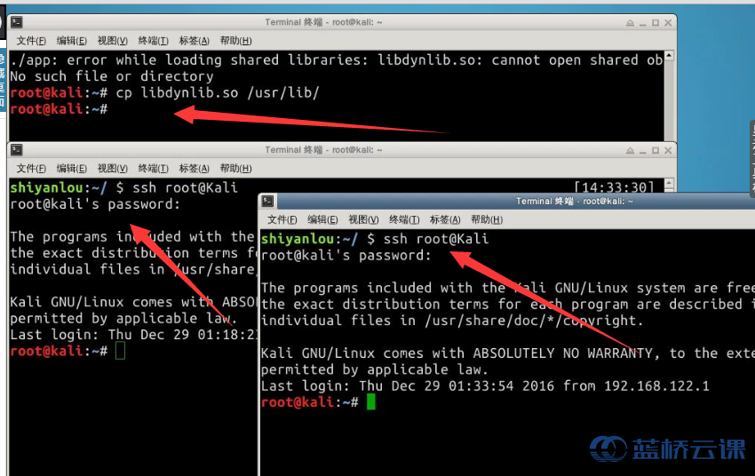
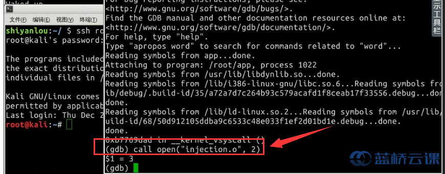
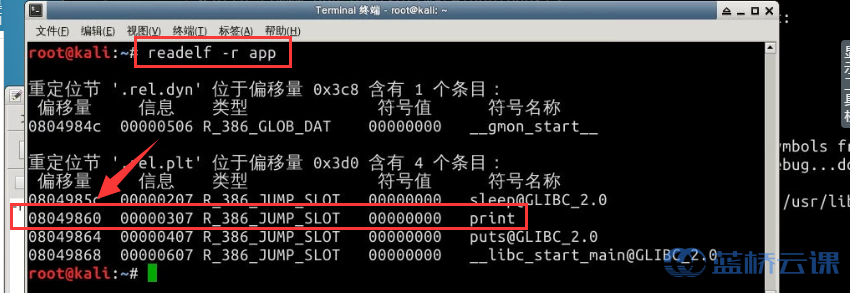
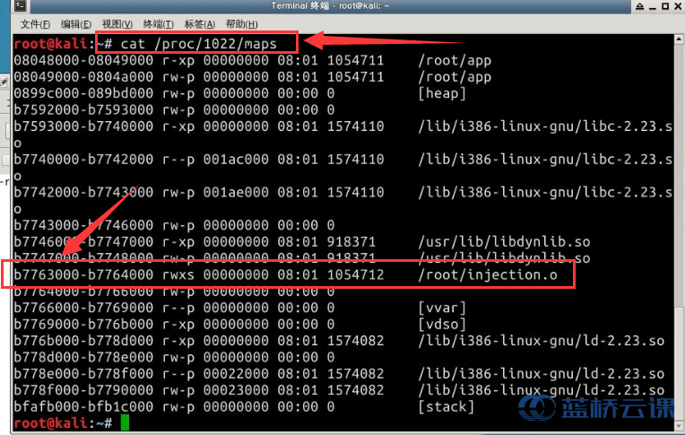
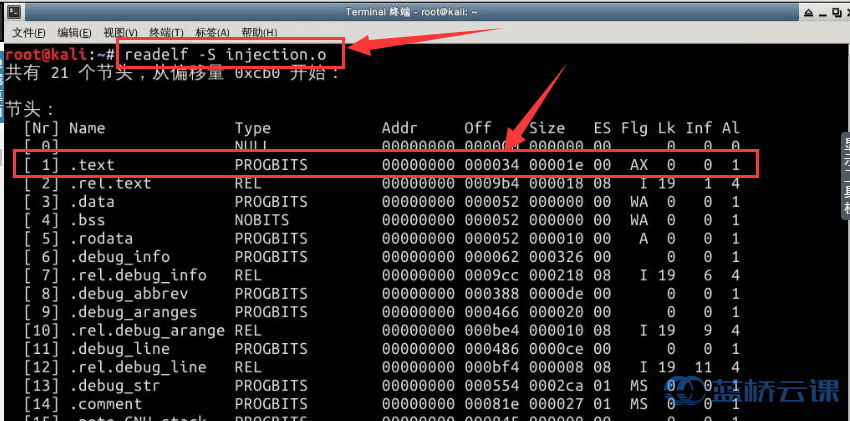
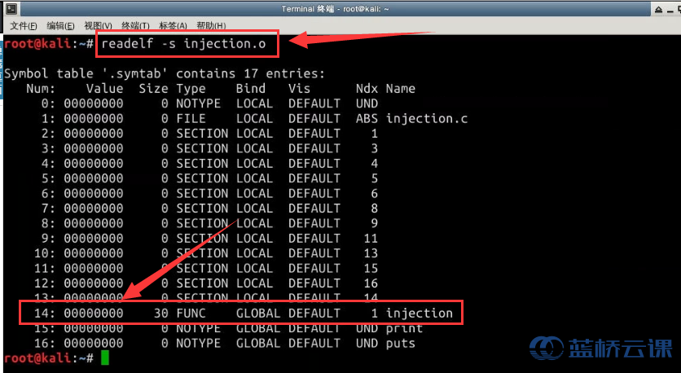

# Linux 环境下向程序中注入后门代码

## 一、实验简介

### 1.1 实验介绍

一般情况下，在一个操作系统里会运行着许多应用程序。对于某个正在运行的程序，我们不想终止程序，但又想更新程序的功能，这种情况下可以使用注入技术对运行的程序进行更新。本实验主要介绍 Linux 环境下向程序中注入后门代码的实验。

其中在本实验里，将会涉及到较多的 Linux 操作系统基础知识，实验难度较大，需要多次地动手实验才能够明白其中的实验原理。在真正的生产环境中，Linux 环境下向程序注入后门代码多数情况下使用的是已经写好的进程注入工具。

这些现成工具的使用，能够大大地提高向程序中注入后门代码的效率。学习完本课程之后，达到的效果是对程序注入工具 `linux-injector` 有了一定的了解。本实验就是一个缩小版的 Demo。

**注意：实验用的云主机因为配置成本较高，会限制次数，每个实验不超过6次**

### 1.2 主要知识点

本实验涉及到的知识点比较多，没有一定 Linux 操作系统基础和 gdb 调试工具使用经验比较难成本实验。本实验重点在讲解如何实现 Linux 环境下向程序中注入后门代码，实验的主要的知识点如下列表：

- Linux 操作系统基本操作
- makefile 文件操作
- Vim 的基本配置
- gdb 的基本使用
- 进程中的基本概念知识

### 1.3 环境介绍

本实验的实验环境由实验楼提供，宿主机的操作系统为 Ubuntu，宿主机上安装有两台虚拟机，这两台虚拟机分别为 Kali Linux 和 Metasploitable2。其中 Kali Linux 操作系统是一个深受广大黑客和信息安全人士喜爱的操作系统，专门用于渗透测试领域。

Kali Linux 上预装了许多渗透软件，一般情况下的渗透测试均在 Kali Linux 上进行，Kali Linux  上的信息扫描神器 Namp，以及渗透框架 Metasploit 在安全攻防领域中发挥着重要的作用。

实验楼的环境中共有三台主机，本实验的操作只用到 Kali Linux 虚拟机。其中实验环境的宿主机 Ubuntu ，Kali Linux 虚拟机，以及 Metasploitable2 虚拟机的账户和密码分别如下表格：

| 主机名称          | 主机 IP 地址    | 主机的账号 | 主机的密码 |
| ----------------- | --------------- | ---------- | ---------- |
| `Ubuntu`          | 192.168.122.1   | shiyanlou  | shiyanlou  |
| `Kali Linux`      | 192.168.122.101 | root       | toor       |
| `Metasploitable2` | 192.168.122.102 | msfadmin   | msfadmin   |

## 二、环境启动

### 2.1 环境启动

本课程所要进行的实验为 Linux 环境下向程序中注入后门代码。实验操环境由实验楼提供，宿主机的操作系统为 Ubuntu，宿主机上安装有两台虚拟机，这两台虚拟机分别为 Kali Linux 和 Metasploitable2。

在本实验里，所有的操作都在实验楼的 Kali Linux 下完成。首先输入如下命令连接 Kali 虚拟机，其中 `root@Kali's password` 的密码为 `toor`。**注意：这里的 Kali 中字母 K 是大写的 K，输入小写的 k 会报错**：

```
# 开启 Kali Linux 虚拟机 
sudo virsh start Kali

# 连接 Kali 虚拟机
ssh root@Kali
```


**还有一点要注意的是，如果在开启 Kali 后，马上进行连接，则会报错误 `ssh: connect to host Kali port 22: No route to host`。报错的原因是因为 Kali 虚拟机还未完全启动，需要一点时间才能完成启动。**


## 三、调试工具介绍

### 3.1 GDB 工具介绍

> GNU 侦错器（GNU Debugger，缩写为 GDB），是 GNU 软件系统中的标准侦错器，此外 GDB 也是个具有移携性的侦错器，经过移携需求的调修与重新编译，如今许多的类 UNIX 操作系统上都可以使用 GDB，而现有 GDB 所能支持除错的编程语言有 C、C++、Pascal 以及 FORTRAN 。---《维基百科》

 GDB 主要可以做 4 大类事（加上一些其他的辅助工作），以帮助用户在程序运行过程中发现 BUG：

- 启动您的程序，并列出可能会影响它运行的一些信息
- 使您的程序在特定条件下停止下来
- 当程序停下来的时候，检查发生了什么
- 对程序做出相应的调整，这样您就能尝试纠正一个错误并继续发现其它错误

### 3.2 GDB 常用参数介绍

GDB 常用命令参数很多，需要记住的重点命令有如下表格：

| 命令参数     | 参数含义                                                     |
| ------------ | ------------------------------------------------------------ |
| `file`       | 加载被调试的可执行程序文件。 因为一般都在被调试程序所在目录下执行GDB，因而文本名不需要带路径。 |
| `r`          | Run 的简写，运行被调试的程序。如果此前没有下过断点，则执行完整个程序；如果有断点，则程序暂停在一个断点处。 |
| `c`          | Contunue 的简写，继续执行被调试的程序，直至下一个断点或程序结束。 |
| `help`       | GDB 的帮助命令，提供对 GDB 各种命令的解释说明。              |
| `p <变量名>` | Print 的简写，显示指定变量，即临时变量或全局变量的值。       |
| `s`          | 执行一行源程序代码，如果此行代码中有函数调用，则进入函数。   |
| `n`          | 执行一行源代码，此行代码中的函数调用也一并执行，s 相当于其他调速器中的 "Step into" 单步跟踪进入。 |
| `q`          | 结束调试，退出当前调试环境。                                 |

### 3.3 Linux 的 makefile 文件使用介绍

一个工程中的源文件不计其数，其按类型、功能、模块分别放在若干个目录中，makefile 定义了一系列的规则来指定，哪些文件需要先编译，哪些文件需要后编译，哪些文件需要重新编译，甚至于进行更复杂的功能操作，因为 makefile 就像一个 Shell 脚本一样，其中也可以执行操作系统的命令。

在本实验 Linux 环境下向程序注入后门木马中，需要用到 makefile 文件。所以请先阅读如下推荐材料，理解并能够看懂makefile 文件含义：
>  [makefile 的使用介绍，makefile 中文教程](http://read.pudn.com/downloads154/ebook/681020/%E4%B8%AD%E6%96%87Makefile%E6%95%99%E7%A8%8B.pdf)

### 3.4 进程注入技术介绍

进程注入技术也可以称为动态注入技术，是代码注入技术的一种。代码注入技术可分为静态注入和动态注入两种。静态注入针对可执行文件如 ELF 或者 PE 格式的文件，通过修改文件内容实现代码注入。动态注入针对进程，通过修改寄存器、内存值等实现代码注入。

相对于静态注入，进程注入不需要改动源文件，但是需要高权限才能够执行，即需要 system 或者 root 权限才能够进行进程注入操作。其中对于程序，进程，线程这三个重要概念如下：

| 概念名称 | 概念解释                                                     |
| -------- | ------------------------------------------------------------ |
| 程序     | 即 Program 或 Procedure，是一组用计算机语言编写的命令序列的集合。程序并不能单独运行，只有将程序装载到内存中，系统为它分配资源才能运行。 |
| 进程     | 即 Process，是计算机中已运行程序的实体。程序本身只是指令的集合，进程才是程序那些指令的真正运行。 |
| 线程     | 即 Thread，是进程中某个单一顺序的控制流，指运行中的程序的调度单位。在单个程序中同时运行多个线程完成不同的工作，称为多线程。多线程主要是为了节约 CPU 时间。 |

## 四、代码实现

### 4.1 编写文件 `.vimrc`

实验楼的 Kali Linux 操作系统的 Vim 默认环境下没有进行配置，所以我们首先需要对 Vim 进行配置，方便在 Vim 中编写代码。配置 vim 的文件为 `.vimrc`，在 Kali Linux 中输入命令 `vi ~/.vimrc` 对文件进行编辑，并输入如下内容：
```
syntax on                   " 自动语法高亮
set wrap                    " 设置自动换行
set nocompatible            " 关闭 vi 兼容模式
set number                  " 显示行号
set nocursorline            " 不突出显示当前行
set nobackup                " 覆盖文件时不备份
set autochdir               " 自动切换当前目录为当前文件所在的目录
set backupcopy=yes          " 设置备份时的行为为覆盖
set autoread                " set to auto read when a file changed from the outside
set ignorecase smartcase    " 搜索时忽略大小写，但在有一个或以上大写字母时仍大小写敏感
set nowrapscan              " 禁止在搜索到文件两端时重新搜索
set incsearch               " 输入搜索内容时就显示搜索结果
set hlsearch                " 搜索时高亮显示被找到的文本
set noerrorbells            " 关闭错误信息响铃
set novisualbell            " 关闭使用可视响铃代替呼叫
set t_vb=                   " 置空错误铃声的终端代码
set showmatch               " 插入括号时，短暂地跳转到匹配的对应括号
set matchtime=2             " 短暂跳转到匹配括号的时间
set nowrap                  " 不自动换行
set magic                   " 显示括号配对情况
set hidden                  " 允许在有未保存的修改时切换缓冲区，此时的修改由 vim 负责保存
set smartindent             " 开启新行时使用智能自动缩进
set backspace=indent,eol,start " 不设定在插入状态无法用退格键和 Delete 键删除回车符
set cmdheight=1             " 设定命令行的行数为 1
set laststatus=2            " 显示状态栏 (默认值为 1, 无法显示状态栏)
set foldenable              " 开始折叠
set foldmethod=syntax       " 设置语法折叠
set foldcolumn=0            " 设置折叠区域的宽度
setlocal foldlevel=1        " 设置折叠层数为
set foldclose=all           " 设置为自动关闭折叠
set encoding=utf-8 fileencodings=ucs-bom,utf-8,cp936 "编码设置

set statusline=\ %<%F[%1*%M%*%n%R%H]%=\ %y\ %0(%{&fileformat}\ [%{(&fenc==\"\"?&enc:&fenc).(&bomb?\",BOM\":\"\")}]\ %c:%l/%L%)\

set tabstop=4
```
在完成编写之后，输入命令 `esc` 和 `:wq` 保存并退出。

### 4.2 编写文件 `dynlib.h` 

输入命令编写文件 `vi dynlib.h`，并填写如下内容：
```
#include<stdio.h>
#include<unistd.h>

extern void print();
```
在完成编写之后，输入命令 `esc` 和 `:wq` 保存并退出。该 `dynlib.y` 作为 `dynlib.c` 的头文件被引用，作用是声明 `print()` 函数。

### 4.3 编写文件 `dynlib.c`

输入命令编写文件 `vi dynlib.c`，并填写如下内容：
```
#include"dynlib.h"

void print()
{
    static int counter;
    counter++;
    printf("%d : PID %d In print\n", counter, getpid());
}
```
在完成编写之后，输入命令 `esc` 和 `:wq` 保存并退出。该 `dynlib.c` 文件的作用是定义一个计数器 `counter`，在循环中不断地累加，并输入累加的次数和当前的进程 PID `getpid()`

### 4.4 编写文件 `app.c` 

输入命令编写文件 `vi app.c`，并填写如下内容：
```
#include"dynlib.h"

int main(int argc, char *argv[])
{
    for( ; ; )
    {
        print();
        printf("Going to sleep...\n");
        sleep(3);
        printf("Waked up...\n");
    }
    return 0;
}
```
在完成编写之后，输入命令 `esc` 和 `:wq` 保存并退出。该  `app.c` 文件的作用是引用 `print()` 函数，和由 `sleep(3)`让进程停止 3 毫秒。并不断地输出 `Going to sleep` 和 `Waked up`。

### 4.5 编写文件 `injection.c`

输入命令编写文件 `vi injection.c`，并填写如下内容：
```
#include<stdio.h>
#include<stdlib.h>

extern void print();

void injection()
{
    print();
    printf("Hello, Mr_Right\n");
}

```
在完成编写之后，输入命令 `esc` 和 `:wq` 保存并退出。该 `injection()` 函数作用是在引用 print 函数的同同时，额外添加一条输出命令。

### 4.6 编写文件 `makefile`

输入命令编写文件 `vi makefile`，并填写如下内容： **`（注意：这里的 makefile 文件需要严格保持缩进命令，见下图的前面箭头所示，箭头所指的地方均为一个 Tab，少打一个或多打一个空格都会报错）`**
```
SOCFLAG = -fPIC -shared
CFLAGS = -g -Wall
TARGET = libdynlib.so app injection.o
CC = gcc

all: $(TARGET)
	@echo "make succeed"

.PHONY: clean
clean:
	@rm -f *.o $(TARGET)

libdynlib.so: dynlib.o
	$(CC) $(CFLAGS) $(SOCFLAG) -o $@ $<

app: app.o
	$(CC) $(CFLAGS) -ldynlib -L ./ -o $@ $<

dynlib.o: dynlib.c
	$(CC) $(CFLAGS) -o $@ -c $<

app.o: app.c
	$(CC) $(CFLAGS) -o $@ -c $<

injection.o: injection.c
	$(CC) $(CFLAGS) -o $@ -c $<

```


在生成 libdynlib.so 时使用了`-fPIC` 选项，生成地址无关性的动态库。makefile 文件在编译过程中起到非常重要的作用。对于 makefile 文件不熟悉的请务必先阅读如下文件，上述代码的作用是生成三个重要要文件 `libdynlib.so` 和可运行文件 `app`，以及 `injection.o`：

>  [makefile 的使用介绍，makefile 中文教程](http://read.pudn.com/downloads154/ebook/681020/%E4%B8%AD%E6%96%87Makefile%E6%95%99%E7%A8%8B.pdf)

### 4.7 生成重要的三个文件

此时在命令行终端中，可以看到已经使用 Vi 命令编写了如下文件：


接着在命令行终端中执行 `make -f makefile`  命令生成三个重要文件  `libdynlib.so` 和可运行文件 `app`，以及 `injection.o`。


直接运行 `./app`会报错，报错的原因是没有将 libdynlib.so 放到 `/usr/lib` 下。解决报错通常有两种办法，一是将 libdynlib.so 文件复制到 `/usr/lib` 下，另一个办法是将动态库所在的目录，即当前目录，添加到 `LD_LIBRARY_PATH`环境变量中。这里我们使用第一种办法，将文件 libdynlib.so 复制到文件夹 `/usr/lib` 下，在命令行终端中输入如下命令：
```
# 复制文件 libdynlib.so 到目录 /usr/lib 下
cp libdynlib.so /usr/lib/
```


为了方便后续的操作，接着在实验楼宿主机 Ubuntu 终端中，新开两个窗口，分别再连接 Kali Linux 虚拟机：`（注意：Kali 的 K 是大写的 K，密码是 toor）`
```
# 连接 Kali Linux 密码是：toor
ssh root@Kali 
```


## 五、过程实现

### 5.1 运行 `app` 程序

首先在已经打开的三个 Kali Linux 中，打开一个窗口运行 `app`，在命令行终端中输入如下命令 `（注意：记下当前运行程序 app 的 PID 值，下面 GDB 调试会用到）`
```
# 运行程序 app
./app
```


### 5.2 运行 `GDB` 进行调试

接着再在另一个 Kali Linux 窗口中使用工具 `GDB` 对 `app` 进行调试，输入如下命令 **（`注意`：每次实验 PID 进程号值是不一样的，下面的命令，需要把 PID 换成自己实验机当前 app 的 PID 值，PID 值由 `./app` 运行后知道）**： 

```
# 语法为 gdb <file> <PID>
gdb app 1022
```


`重要：下图为注入的核心概括`

`重要：下图为注入的核心概括`

`重要：下图为注入的核心概括`


### 5.3 在 `GDB` 使用 `open` 函数

在进行了 5.2 步骤后，`app` 程序进入了调试状态，程序停止运行。在 GDB 的调试窗口中，输入如下命令：
```
# 打开 injection.o 
(gdb) call open("injection.o", 2)
```


其中，使用 `open 函数`，第二个参数 `2` 意思是对于 injection.o 的权限是 2，即 `O_RDWR` 读/写。由于函数 injection 内部函数重定位时修改地址，故需要读写权限，open 函数返回的是文件的描述符。

### 5.4 在 `GDB` 使用 `mmap` 函数

在 GDB 窗口的命令行终端中，使用 `mmap 函数` 进行操作，输入如下命令：**`（注意：其中 4088 为文件长度，要根据自己实验的时候，生成的文件长度来填写，可能你目前实验的机子上 injection.o 文件长度不第一定为 4088）`**
```
# 使用 mmap 函数进行操作
# call mmap(0, <length>, 1|2|4, 1, 3, 0)
(gdb) call mmap(0, 4088, 1|2|4, 1, 3, 0)
```
其中其中 `4088` 由如下命令得到，目前共有三个 Kali Linux 窗口，一个为 `app` 运行的程序，处于暂停状态，一个为 `GDB` 调试的窗口，使用剩下的另一个 Kali Linux 窗口输入如下命令得到 `injection.o 文件长度`：
```
# 查看当前目录下的文件
ls -l
```


其中对于 `mmap 函数` 的函数原型如下所示，对于其参数含义如下列表：
```
#include <sys/mman.h>
void *mmap(void *start, size_t length, int prot, int flags, int fd, off_t offset);
```
| 参数名称 | 参数含义                                                     |
| -------- | ------------------------------------------------------------ |
| `start`  | 表示映射区的开始地址，设置为0时表示由系统决定映射区起始地址。 |
| `length` | 表示映射区的长度，这里为 injection.o 文件的长度              |
| `prot`   | 表示期望的内存保护标志（即映射权限），不能与文件的打开模式冲突，这里为 1， 2， 4（即 `PROT_READ，PROT_WRITE，PROT_EXEC，读 / 写 / 执行`） |
| `flags`  | 指定映射对象的类型，映射选项和映射页是否可以共享，           |
| `fd`     | 表示已经打开的文件描述符，这里为 3。                         |
| `offset` | 表示被映射对象内容的起点，这里为 0。                         |

如果函数执行成功，则返回被映射文件在映射区的起始地址。

### 5.5 在 `GDB` 使用 `p & print`

接着继续在 GDB 调试窗口中输入如下命令：
```
p & print
```
GDB 命令行中显示结果为：

```
# 由命令 p & print 显示的结果
$3 = (void (*)()) 0xb7746530 <print>
```
这一步会结合步骤 5.6 一起解释，记下此时显示的地址 `0xb7746530`。

**（注意：这一步的 0xb7746530 每次运行的结果不一定一样，目前你机子上得到的这个数值，并一定是 0xb7746530 ，该数值在后面需要用到，请记下你自己机子上的 p & print 结果数值）**

### 5.6 在 `GDB` 使用 `p /x *0x08049860`

在刚才输入 `ls -l`的命令行窗口中，输入如下命令得到 print 函数的起始地址：
```
# 查找 print 函数地址
readelf -r app
```
由命令可以得到 print 函数地址如下，我们需要的地址为 `0x08049860`：
```
08049860  00000307 R_386_JUMP_SLOT   00000000   print
```
**（注意：可能你目前的机子得到的数值不一定为 08049860 ，这个函数起始地址以自身机子显示的数值为准）**
**（注意：可能你目前的机子得到的数值不一定为 08049860 ，这个函数起始地址以机子显示的数值为准）**
**（注意：可能你目前的机子得到的数值不一定为 08049860 ，这个函数起始地址以机子显示的数值为准）**


在得到 print 的起始地址之后，使用命令 `p /x *0x08049860`，其中 `0x08049860` 为print 函数起始地址数值。`（注意：不要忘记 * 号）`
```
(gdb) p /x *0x08049860
```
如果上诉所有步骤没有错误，得到的返回结果应该为步骤 5.5 的结果，即 `$3` 中的数值 `0xb7746530` ，如图所示：


### 5.7  使用 injection 函数地址替换 print 函数地址

使用 injection 函数地址替换 print 函数地址，替换的公式为：
```
set print 函数地址 = （injecion 函数地址） + （injection 函数在 .text 段中的偏移量） + （injection 函数在 injection 中的偏移量）
```
在刚才输入 `ls -l`的命令行窗口中，输入如下命令 `cat /proc/1022/maps` 查看 injection 函数地址：

**`（注意：其中的 <PID> 要换成当前的 app 的 PID 值，由于实验的特殊性，每次实验的 PID 是动态非固定的，所以你在实验的时候，使用的 PID 值和演示的是不一样）`**
```
# 语法 cat /proc/<PID>/maps
cat /proc/1022/maps
```
输入命令得到的 injection 函数起始地址为 0xb7763000：
```
# 0xb7763000 为起始地址
b7763000-b7764000 rwxs 00000000 08:01 1054712    /root/injection.o
```


在步骤 5.6 中，我们由命令 `readelf -r app` 得到 print 函数地址为 `0x08049860`。

在刚才输入 `ls -l`的命令行窗口中，输入如下命令得到 injection 函数在 .text 段中的偏移量：
**（注意：是大写的 S ）**
```
# 显示 injection 函数在 .text 段中的偏移量
readelf -S injection.o 
```
由显示结果得到 injection 函数在 .text 段中的偏移量为 0x000034：
```
[ 1] .text             PROGBITS        00000000 000034 00001e 00  AX  0   0  1
```


在刚才输入 `ls -l`的命令行端口中，输入如下命令得到 injection 函数在 injection 中的偏移量：
**（注意：是小写的 s ）**
```
# 显示 injection 函数在 Injection 中的偏移量
readelf -s injection.o 
```
显示的结果可以知道，injection 函数在 injection 中的偏移量为 0x00000000：

**（注意：0x00000000 的偏移量以实际本机上的为准，进程注入实验，许多数值，需要根据当前数值做变化）**
```
14: 00000000    30 FUNC    GLOBAL DEFAULT    1 injection
```


接下来我们使用 injection 函数地址替换 print 函数地址。在 GDB 调试窗口中，输入如下命令：

**（注意：在输入如下命令之前，需要将相应的每个数值换成自己本机实验的数组，每开一次实验，其中的某些地址是变化的，你自己实验的时候，需要替换对应的数值）**

```
# 使用 injection 函数地址替换 print 函数地址，替换的公式为：
# set print 函数地址 = （injecion 函数地址） + （injection 函数在 .text 段中的偏移量） + （injection 函数在 injection 中的偏移量）

set *0x08049860=0xb7763000 + 0x000034 + 0x00000000 
```


set print 函数地址 = injecion 函数地址 + injection 函数在 .text 段中的偏移量 + injection 函数在 injection 中的偏移量

 set *0x08049860=0xb7763000 + 0x000034 + 0x00000000 

### 5.8  阶段性小结

对于上诉各种命令参数得到的起始地址以及偏移量做一个小结。其中的起始地址和偏移量要根据自己所进行实验时的 `具体数值` 来替换相应的地址。由于实验向程序中注入后门代码，程序每次分到 PID 都是不一样的，所以如果直接使用本实验的截图数据地址，必然报错。

下面是步骤 5.1 到步骤 5.7 的重要数据小结：

```
print 函数起始地址：0x08049860
injection 函数起始地址 : 0xb7763000
injection 函数在 .text 段中的偏移量: 0x000034
injection 函数在 injection 中的偏移量：0x00000000
```
在刚才输入 `ls -l`的命令行端口中，输入如下命令得到 `print`，`.rodata` 等重定位的偏移量：
```
# 查找重定位偏移量
readelf -r injectino.o 
```
得到 `print`，`.rodata` 等重定位的偏移量如下：
```
00000007  00000f02 R_386_PC32        00000000   print
0000000f  00000501 R_386_32          00000000   .rodata
00000014  00001002 R_386_PC32        00000000   puts
```


### 5.9 在 `GDB` 中使用 print & print

在 GDB 命令行窗口中，输入如下命令：

```
print & print 
```
得到的结果如下所示，记下其中数值 `0xb7746530`，会在后面的重定位中使用到：
```
$5 = (void (*)()) 0xb7746530 <print>
```


### 5.10 在 `GDB` 中使用 print *

在 GDB 命令行窗口中，输入如下命令：
```
 print *(0xb7763000 + 0x000034 + 0x00000007) 
```
其中 0x00000007 为 print 的 .text 段的重定位偏移量，如何得到重定位偏移量在 5.7 节中进行了演示。命令显示的结果为：

```
# print 符号重定位的附加数
$6 = -4 
```


### 5.11 在 `GDB` 中使用 set 命令

在 GDB 命令行窗口中，输入如下命令：

```
# 重新设定地址
set *(0xb7763000 + 0x000034 + 0x00000007) = 0xb7746530 - (0xb7763000 + 0x000034 + 0x00000007) - 4
```
其中要注意的是每个地址的数值从哪里来的，在步骤阶段性小结中已经提到。


### 5.12 在 `GDB` 中使用 print & system


在 GDB 命令行窗口中，输入如下命令：

```
print & system
```
得到的结果如下所示，记下其中数值 `0xb75cd850 `，会在后面的重定位中使用到：
```
$7 = (<text variable, no debug info> *) 0xb75cd850 <__libc_system>
```
### 5.13 在 `GDB` 中使用 print *

在 GDB 命令行窗口中，输入如下命令：

````
print *(0xb7763000 + 0x000034 + 0x00000014) 
​```
其中 0x00000014 为 .text 段的重定位偏移量，显示的结果为： 
​```
$8 = -4
​```


### 5.14 在 `GDB` 中使用 set 命令

在 GDB 命令行窗口中，输入如下命令：
​```
# 重新设定地址
set *(0xb7763000 + 0x000034 + 0x00000014)  = 0xb75cd850 - (0xb7763000 + 0x000034 + 0x00000014) - 4
​```


### 5.15 在 `GDB` 中使用 print *

在 GDB 命令行窗口中，输入如下命令：

​```
print *(0xb7763000 + 0x000034 + 0x0000000f)
​```
其中 0x0000000f 为 .text 段的重定位偏移量，显示的结果为： 
​```
$9 = 0
​```


### 5.16 在 `GDB` 中使用 set 命令

在刚才输入 `ls -l`的命令行端口中，输入如下命令：
​```
# 查找 .rodata 的偏移量
 readelf -S injection.o 
​```
由命令可知 `.rodata`  的偏移量 `0x000052`

​```
 [ 5] .rodata           PROGBITS        00000000 000052 000010 00   A  0   0  1
​```


​```
# 重新设定地址
set *(0xb7763000 + 0x000034 + 0x0000000f) = 0xb7763000 + 0x000052
​```


### 5.17 退出 GDB 窗口

在 GDB 窗口输入退出命令：
​```
# 输入退出命令
(gdb) q

# 在 [y/n] 中选择 y
(gdb) y 
​```
此时如果一切顺利，`app` 程序窗口会重新别激活，程序继续运行输入，只不过多了一行代码：
​```
hello, Mr_Rihgt！
​```

## 六、常见错误总结

### 6.1 常见错误总结

本实验由于其地址处于变化的状态，只要在调试的 20 个步骤中的任何一个地址出现问题，GDB 使用的过程中打错一个字符地址，则都可能导致实验失败。本实验花费的时间较久。我们再来回顾一下本实验的重要结构：


在实验的过程中，总结有如下常见的实验错误：

- makefile 文件未能正常运行，多数情况是 `tab`  键的问题
- 编译未通过，字母单词少拼，或者漏拼等
- app 程序未能启动，查看是否将相应的 `.so` 文件复制到 `/usr/lib/` 文件夹下
- 使用 GDB 过程中，`.o` 文件的长度未填写正确
- print 函数地址弄错，injection 地址弄错
- 实验地址中，忘记加上 `0x` ，其中 `0x` 表示的是 16 进制数字
- `实验数据完全照抄` 实验文档进行

其中再申明一次，本实验的 PID 为随机分配，某些函数的地址不一定是固定的，对于使用动态变化的地址计算的地址，一定要改成相应的正确地址计算。

## 七、与注入工具 `linux-injector` 比较

### 7.1 注入工具 `linux-injector`  介绍

在真实的生产环境中，多数情况下使用已经写好的现有工具进行程序注入，比如 GitHub 上的这款工具：

> https://github.com/dismantl/linux-injector

其中的一些代源码如：

​```
//=====================================================//
// Copyright (c) 2015, Dan Staples (https://disman.tl) //
//=====================================================//

#include <unistd.h>
#include <stdio.h>
int main() {
  while (1) {
    printf("sleeping...\n");
    sleep(1);
  }
  return 0;
}
​```

​```
...
...
# 存储 PID 状态

static int _save_state(int pid)
{
  # 判断状态是否存在 
  if (!target_state) {
  
  # 检查地址目标地址
    CHECK((target_state = calloc(1, sizeof(struct pstate) + MAX_CODE_SIZE - 1)),
	  "Memory allocation error");
	  
	# 赋值最大长度  
    target_state->mem_len = MAX_CODE_SIZE;
  }
  
  # 由 PID 检查相应的注册进程
  CHECK(ptrace_getregs(pid, &target_state->regs),
	"Failed to get registers of target process");
	
  # 打印输出信息	
  dprintf("Saved registers");
  
  # 由 PID 检查长度
  CHECK(ptrace_readmem(pid, (void*)EIP(&target_state->regs), target_state->mem, target_state->mem_len),
	"Failed to read %ld bytes of memory at target process instruction pointer",
	target_state->mem_len);
	
  # 打印输出信息		
  dprintf("Saved %ld bytes from EIP %p", target_state->mem_len, target_state->mem);
  
  # 成功返回 1
  return 1;
error:
  # 失败返回 0
  return 0;
}
...
...
​```
同学们也可以尝试着拆分阅读。对于现有工具的使用方法，需要联网下载该工具，实验楼的 Kali 训练营默认不联网，不联网的主要原因是 Kali  训练营的实验具有攻击性，为了避免使用 Kali Linux 对实验楼或者其他网站进行攻击：
​```
# 使用 git 克隆注入工具
git clone https://github.com/gaffe23/linux-inject.git

# 进入文件夹
cd linux-inject

# 使用 make 执行相应文件
make
​```
对于其使用案例感兴趣的同学，可以阅读这篇文章：

> http://www.open-open.com/news/view/11812d7

## 八、实验小结

### 8.1 实验小结

本实验由于实验的特殊性，动手实践的过程中，数值很容易发生错误，掌握其实验的代码，以及 GDB 调试过程中的参数含义，才能更好地理解注入代码到运行的 Linux 进程中。

其中值得注意的是，在实验的过程中，一定要将更换的地址填写正确，地址前面的符号如 `0x` 一定不能少。实验的主要结构如下思维导图：


````