# 使用多种安全工具获取目标主机信息

## 一、实验简介

### 1.1 实验介绍

信息收集在渗透测试中，是最重要的阶段之一。本实验的重点是获取信息的工具使用介绍，每个工具使用步骤都配有实验楼截图。在这个阶段，用户需要收集关于靶机的基本信息。得到的靶机信息越多，越有助于提高渗透测试的成功率。在 Kali 系统中，已经预装了一些渗透工具，通过使用这些工具，逐步熟悉获取信息的基本步骤。

**注意：实验用的云主机因为配置成本较高，会限制次数，每个实验不超过6次**

### 1.2 实验知识点

本次实验的主要知识点：

- 扫描目标主机开放的端口工具使用
- 获取目标主机操作系统等基本信息
- 获取目标站点提供的网络服务信息
- 信息综合分析获取攻击

### 1.3 实验环境

实验提供 Kali 环境和目标靶机 Metasploitable2。实验先需要先登录实验楼环境，再在终端中，先启动 Kali 和 Metasploitable2。接着通过 ssh 登录 Kali。

#### Metasploitable2 的介绍

Metasploitable2 虚拟系统是一个特别制作的 ubuntu 操作系统，本身设计作为安全工具测试和演示常见漏洞攻击。版本2 已经可以下载，并且比上一个版本包含更多可利用的安全漏洞。这个版本的虚拟系统兼容 VMware，VirtualBox,和其他虚拟平台。默认只开启一个网络适配器并且开启 NAT 和 Host-only。


## 二、扫描目标主机开放的端口

### 2.1 扫描目标主机开放的端口

一般渗透测试的过程中，必须要了解该目标主机上所打开的端口号。在 Kali Linux 中，默认提供的两个扫描端口工具分别是：Nmap 和 Zenmap。下面将主要介绍这两款工具的使用。

#### 2.1.1 TCP 端口扫描工具 Nmap

Nmap 是一个网络探测和安全扫描程序，系统管理者和个人可以使用这个软件扫描大型的网络，获取那台主机正在运行以及提供什么服务等信息。Nmap 支持很多扫描技术，例如：UDP、TCP Connect()、TCP SYN(半开扫描)、FTP 代理( Bounce 攻击)、反向标志、ICMP、FIN、ACK 扫描、圣诞树(Xmas Tree)、SYN 扫描和 Null 扫描。

先通过 `ssh`登录 Kali，密码是 **`toor`**

```
ssh root@kali
```

登录之后，如图：
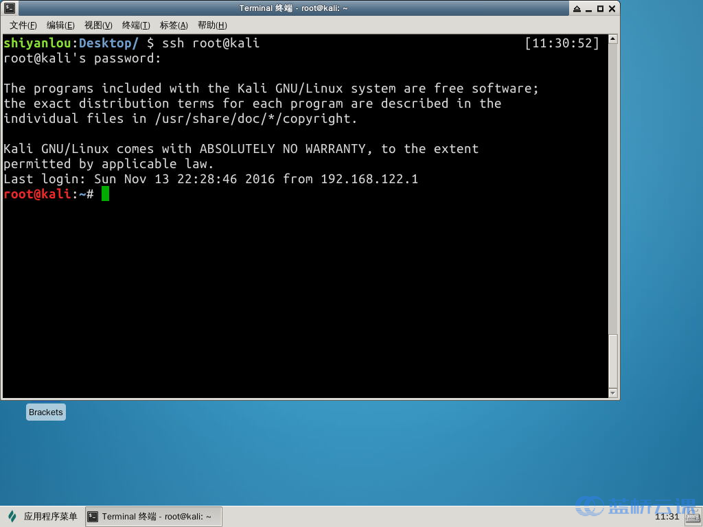

在本次实验中，目标靶机的 IP 地址，可通过 `ping` 命令查看：

```
ping target
```

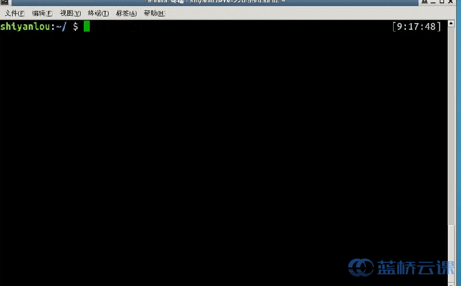


这里演示的目标靶机 IP 地址为 `192.168.122.102`。

#### 2.1.2 扫描神器 Nmap 的使用

Nmap 包含四项基本功能：

- 主机发现（Host Discovery）
- 端口扫描（Port Scanning）
- 版本侦测（Version Detection）
- 操作系统侦测（Operating System Detection）

使用工具 `namp` 输入以下命令，进行端口扫描，得到靶机开放的端口信息：

```
# nmap <target IP>
# 靶机名为 target，或者是 IP 地址：192.168.122.102
```
```
nmap target
```
命令效果图：

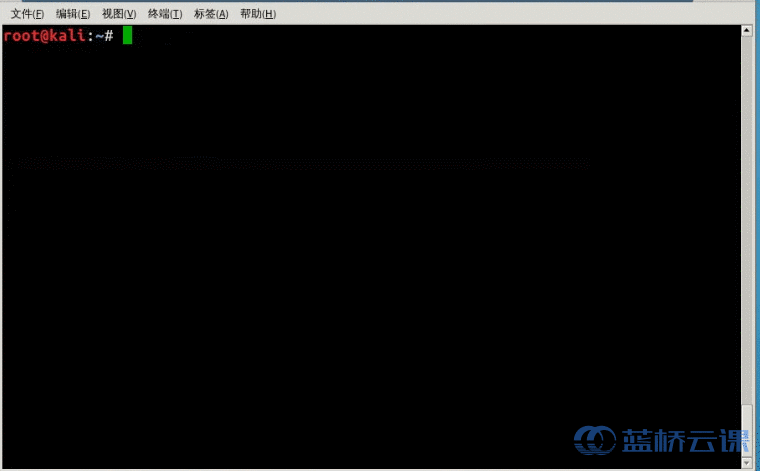

Nmap 可以识别出的 6 种端口状态。这 6 种端口状态如下：

- 开放：工作于开放端口的服务器端的应用程序可以受理TCP 连接、接收UDP 数据包或者响应SCTP（流控制传输协议）请求

- 关闭：虽然我们确实可以访问有关的端口，但是没有应用程序工作于该端口上

- 过滤：Nmap 不能确定该端口是否开放。包过滤设备屏蔽了我们向目标发送的探测包

- 未过滤：虽然可以访问到指定端口，但Nmap 不能确定该端口是否处于开放状态

- 打开｜过滤：Nmap 认为指定端口处于开放状态或过滤状态，但是不能确定处于两者之中的哪种状态。在遇到没有响应的开放端口时，Nmap 会作出这种判断。这可以是由于防火墙丢弃数据包造成的

- 关闭｜过滤：Nmap 认为指定端口处于关闭状态或过滤状态，但是不能确定处于两者之中的哪种状态

`ifconfig` 命令，用于查看网络配置：


#### 2.1.3 主机发现原理

主机发现（Host Discovery），即用于发现目标主机是否在线（Alive，处于开启状态）

主机发现发现的原理与 Ping 命令类似，发送探测包到目标主机，如果收到回复，那么说明目标主机是开启的。Nmap  支持十多种不同的主机探测方式，比如发送 ICMP ECHO/TIMESTAMP/NETMASK 报文、发送 TCPSYN/ACK 包、发送 SCTP INIT/COOKIE-ECHO 包，用户可以在不同的条件下灵活选用不同的方式来探测目标机。

主机发现基本原理，默认情况下，Nmap会发送四种不同类型的数据包来探测目标主机是否在线：

- ICMP echo request
- a TCP SYN packet to port 443
- a TCP ACK packet to port 80
- an ICMP timestamp request


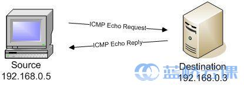

---

#### 2.2.1 扫描工具 Zenmap 的介绍

Zenmap 是 Nmap 官方推出的一款基于 Nmap 的安全扫描图形用户界面。Zenmap 是用 Python 语言编写而成的开源免费的图形界面，能够运行在不同操作系统平台上（Windows/Linux/Unix/Mac OS等）。Zenmap 旨在为 Nmap 提供更加简单的操作方式。简单常用的操作命令可以保存成为 profile，用户扫描时选择 profile 即可，可以方便地比较不同的扫描结果，提供网络拓扑结构( NetworkTopology )的图形显示功能。


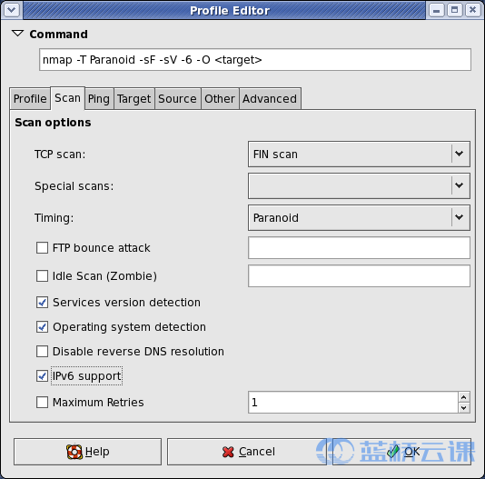


注意：实验楼的环境使用 SSH 登录 Kali，暂时无法使用图形界面。


## 三、获取目标主机操作系统等基本信息

### 3.1 获取目标主机基本信息

在这个阶段中，我们需要尽可能多地收集目标主机操作系统的基本信息。从而提高渗透测试的成功率。信息收集之指纹识别，主动指纹识别工具：如 nmap 的 `-O`， `-sV` 参数。指纹识别虽然听起来高大上，其实就是识别目标主机的操作系统版本与应用版本，以帮助我们进一步探测操作系统和应用级别的漏洞。

#### 3.1.1 主动指纹识别工具


获取目标主机操作系统，命令详细用法：

```
nmap -O <target IP>  # 操作系统探测

```
在 Kali 终端中执行命令，查看下 Kali 这个操作系统：

```
nmap -O 192.168.122.102
```


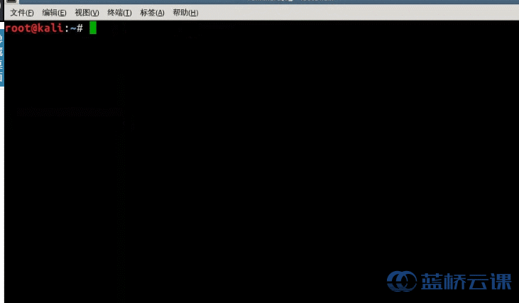


由图看可看出，我们的目标主机: `Running: Linux 2.6x` 为 Linux 操作系统

再说一次，靶机的 IP 地址为：`192.168.122.102`，Kali 主机地址：`192.168.122.101`


获取目标主机操作系统，命令详细用法：

```
nmap -sV <target IP>

```
在 Kali 终端中执行命令，输入如下命令，获取目标主机信息：

```
nmap -sV 192.168.122.102
```


#### 3.1.2 被动指纹识别工具

被动指纹识别工具：不会向目标发送具体探测数据，只是被动地接收数据分析，一般无法被探查发现。p0f：在网络分析方面功能强大，可以用它来分析NAT，负载均衡，应用代理等。

p0f 主要识别信息如下：

- 操作系统类型、端口
- 是否运行与 NAT 模式
- 是否运行于防火墙之后
- 是否运行于负载均衡模式

其中 p0f 的使用规则为：

```
p0f  <target site>

```
在 Kali 终端中执行命令，使用 p0f 查看目标主机：

```
p0f  192.168.122.102
```

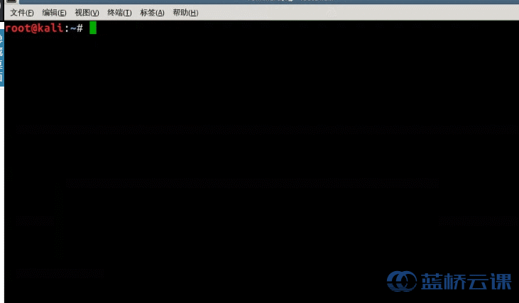


#### 3.1.3 隐蔽扫描（TCP 半开连接扫描）

隐蔽扫描（TCP 半开连接扫描）,命令详细语法：

```
nmap -sS <target IP>  

```
在 Kali 终端中执行命令，进行隐蔽扫描：

```
nmap -sS 192.168.122.102
```

该方法的优点是，不易察觉，隐蔽性高。一般不会在目标计算机上了留下记录。


#### 3.1.4 TCP 连接扫描

TCP 连接扫描,命令详细语法：

```
nmap -sT <target IP>  

```
在 Kali 终端中执行命令，进行 TCP 连接扫描：

```
nmap -sT 192.168.122.102
```


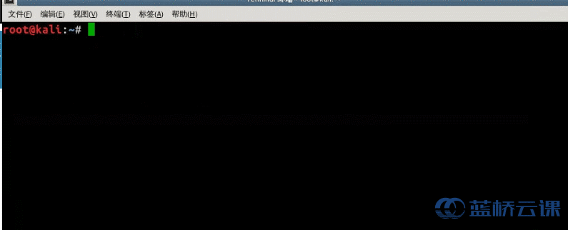


这种扫描会被大多数系统记录下来，但是也可以提供比隐蔽扫描更多的信息。


## 四、获取目标站点网络服务信息

### 4.1 获取网络服务信息

获取目标站点提供的网络服务信息，收集更多关于目标主机的网络服务信息，有助于提高渗透测试的成功率。

打开火狐浏览器，在浏览器中，输入 `http://target` ，测试是否能访问目标靶机，如果一切顺利，你将会看到：

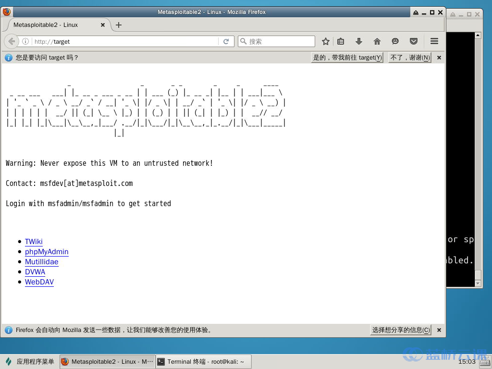


#### 4.1.1 amap 扫描目标主机特定端口

amap 用于对主机的特定端口进行扫描，具体用法如下：

```
amap -bqv <target IP>  <port>

```
在实验楼 Kali 终端中，输入命令，扫描目标主机的 21 号端口：
```
amap -bqv 192.168.122.102 21
```

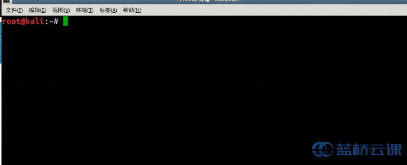


#### 4.1.2 smtp-user-enum 用户枚举

smtp-user-enum 这个工具，主要用于 SMTP 用户枚举，用法：

```
smtp-user-enum -M VRFY -u root -t <target IP>
```
在实验楼 Kali 终端中，输入命令，枚举 SMTP 用户：

```
smtp-user-enum -M VRFY -u root -t 192.168.122.102
```
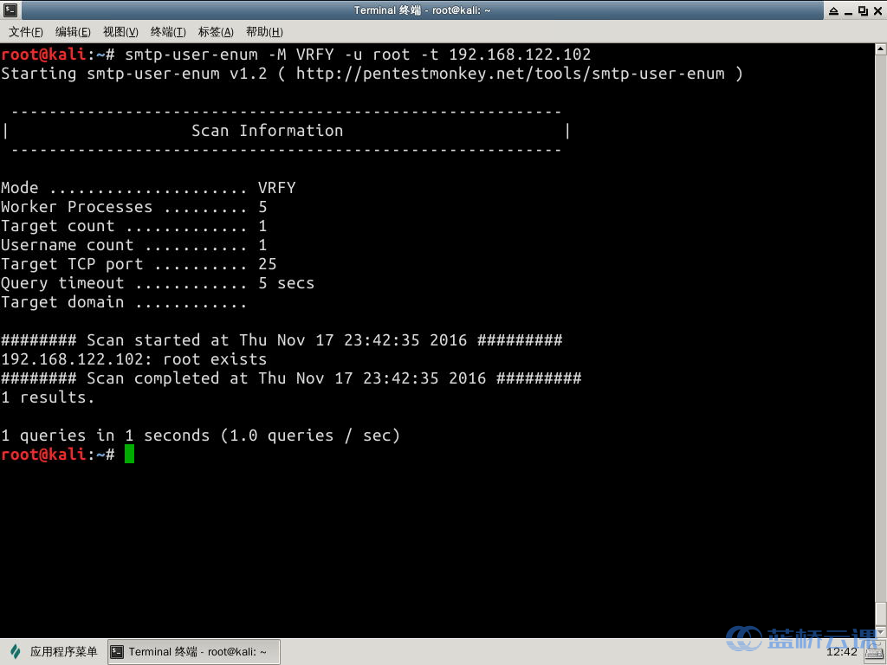

## 五、总结

本次实验中我们尝试了多种常用的安全工具获取目标主机的信息，实践如下的知识点：

- 扫描目标主机开放的端口工具使用
- 获取目标主机操作系统等基本信息
- 获取目标站点提供的网络服务信息
- 信息综合分析获取攻击

## 六、实验作业

按照以上步骤，了解各个渗透工具的使用方法。充分了解 Nmap 这个扫描工具的使用，以便帮助我们更好地收集目标主机信息，提高渗透成功率。


