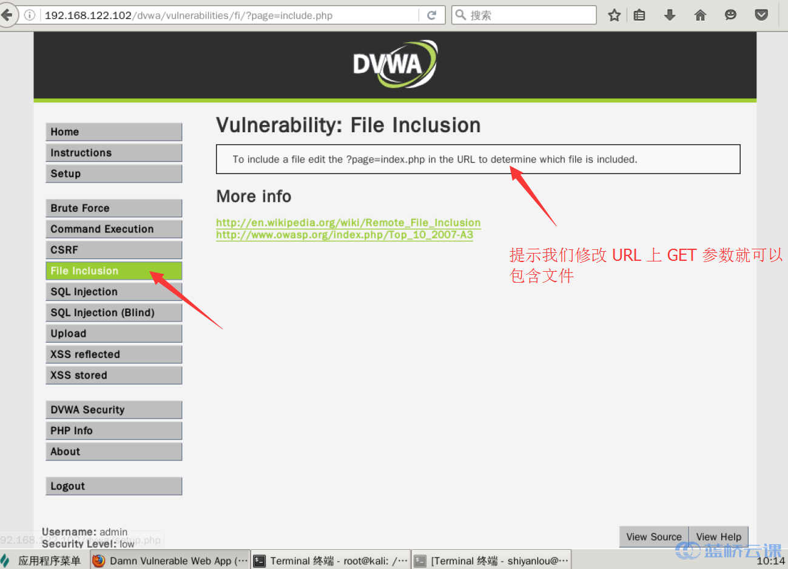
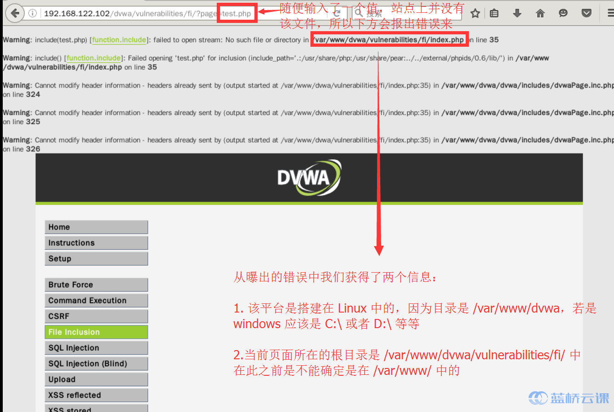
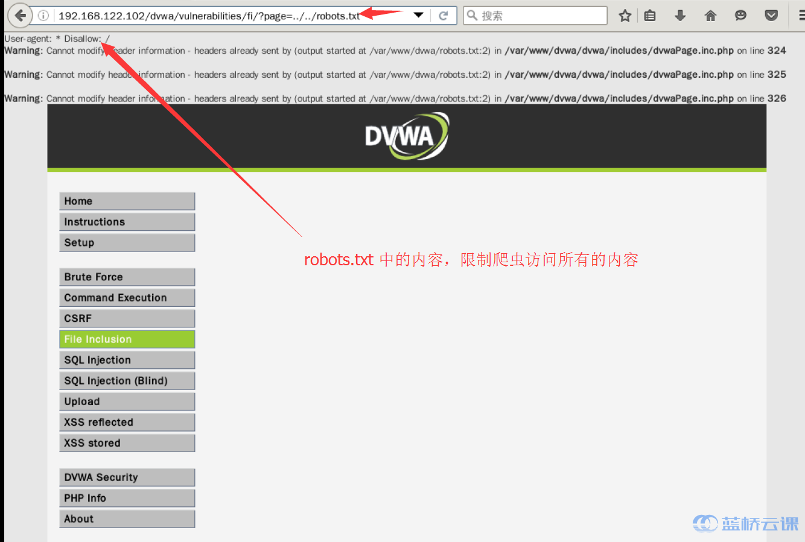
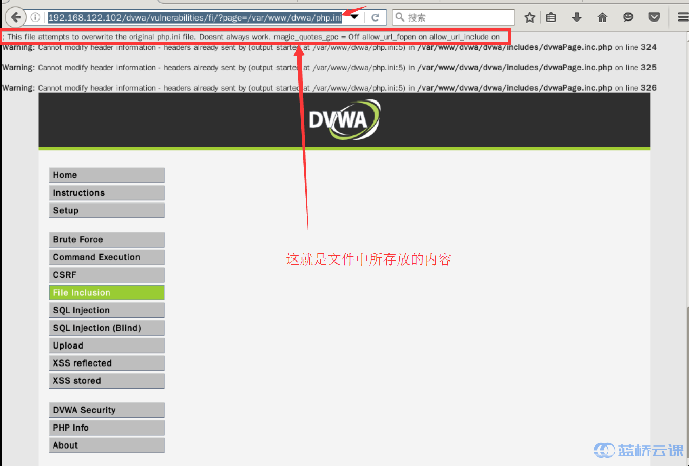
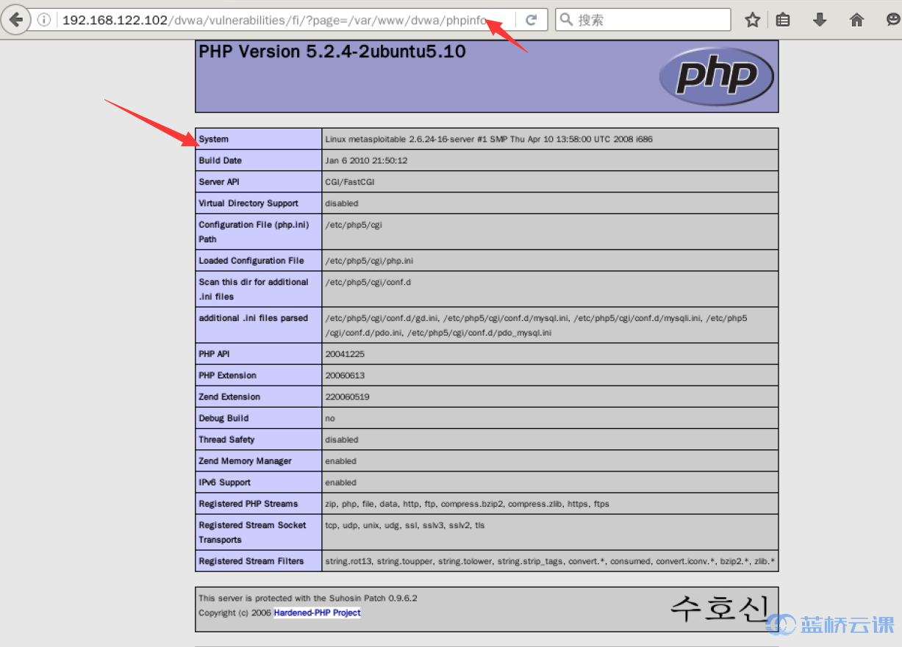
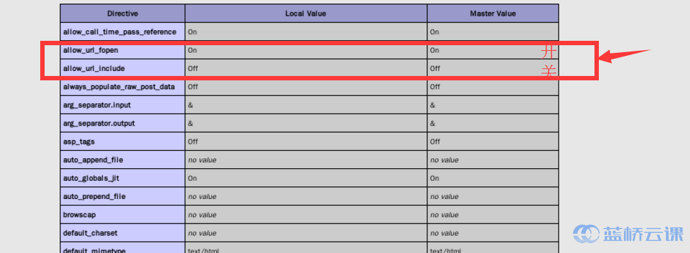
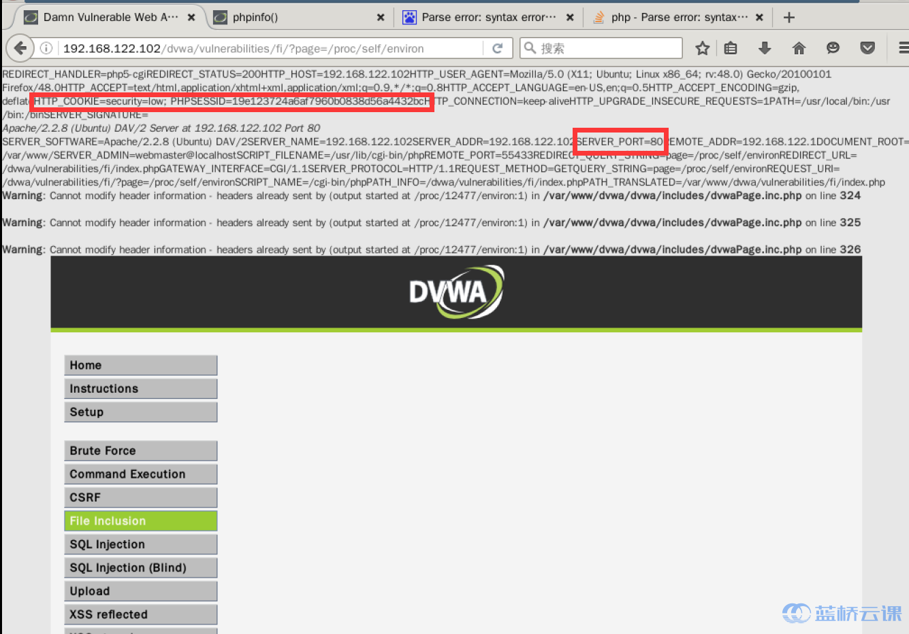
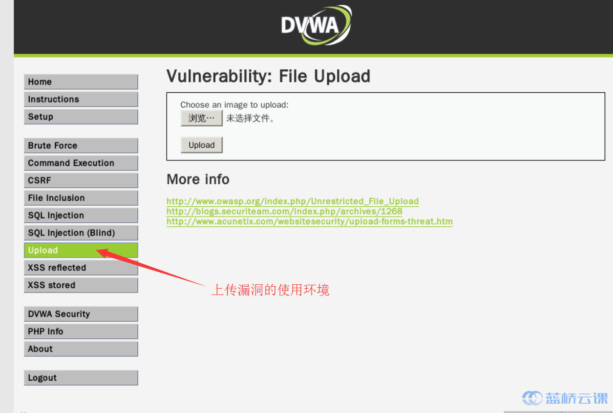
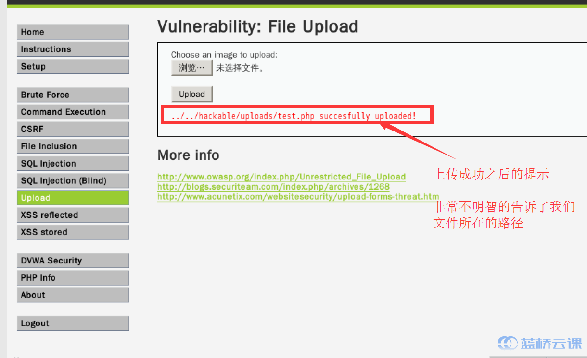
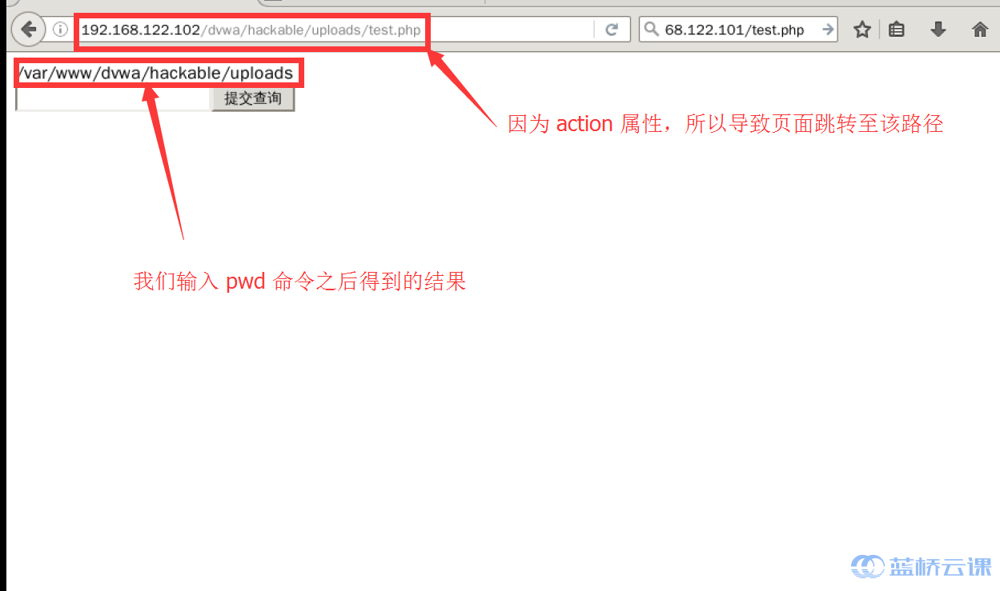

# Kali 实验环境介绍与使用

## 1. 课程说明

本课程为动手实验教程，为了能说清楚实验中的一些操作会加入理论内容，也会精选最值得读的文章推荐给你，在动手实践的同时扎实理论基础。

**注意：实验用的云主机因为配置成本较高，会限制次数，每个实验不超过6次**

## 2. 学习方法

实验楼的 Kali 系列课程包含五个训练营，本训练营主要讲述 Web 应用渗透方法。课程包含20个实验，每个实验都提供详细的步骤和截图。适用于有一定 Linux 系统基础，想快速上手 Kali 渗透测试的同学。

学习方法是多实践，多提问。启动实验后按照实验步骤逐步操作，同时理解每一步的详细内容。

如果实验开始部分有推荐阅读的材料，请务必先阅读后再继续实验，理论知识是实践必要的基础。

## 3. 本节内容简介

本实验中我们初步接触 Kali Linux 和渗透测试的概念。需要依次完成下面几项任务：

- Kali Linux 的简介
- web 渗透的简介
- Kali Linux 的搭建与部署
- Metasploitable2 靶机的了解
- 学习实验楼提供的多机实验环境如何使用
- 尝试简单的命令注入

## 4. 推荐阅读

本节实验推荐阅读下述内容：

1. [Kali 使用入门](http://docs.kali.org/category/introduction)
2. [Metasploitable2 使用指南](https://community.rapid7.com/docs/DOC-1875)

## 5. Kali 简介

### 5.1 Kali Linux 是什么？

[Kali Linux](https://www.kali.org/) 是一个基于 Debian 的用来进行渗透测试和安全审计的 Linux 操作系统，最初在 2013 年 3 月 由具备类似功能的 BackTrack 系统开发而来，由 Offensive Security 团队支持开发。为了支持安全审计和渗透测试的一系列功能，Kali Linux 进行了定制化，包括内核，网络服务和用户都进行了特殊的设置。

Kali 系统内预装了很多安全相关的工具，例如非常有名的 Nmap 端口扫描器、John the Ripper 密码破解器、Metasploit Framework 远程攻击框架等。实验楼的该训练营主要讲述如何利用 Kali Linux 的一系列工具对具备漏洞的靶机进行攻击，同时会介绍下攻击的原理。

Kali Linux 中目前最新版是 2016 年发布的 2.0-2016.2 版本，实验楼的实验环境中使用的就是这个版本的虚拟机。在其中包含了 600 多个渗透测试的工具，并继承了为安全审计定制的内核补丁。



*图片来自 Kali 官网*

### 5.2 渗透测试

渗透测试（Penetration Test）指的是在具备一定授权的情况下，对目标服务器或网络进行信息安全防护能力的评估的过程。包括但不限于采用各种扫描和攻击手段对目标的防护系统进行探测、攻击、破坏以及设置后门。渗透测试是信息安全评估的一部分，目的是为了保证目标系统的网络防御能力达到预期。目前有很多家公司和团队可以提供渗透测试的专业服务，很多互联网公司都对这个领域有大量的人才需求。

### 5.3 漏洞分析

漏洞分析是通过渗透测试的相关扫描和探测工具对目标系统潜在的漏洞进行测试，评估目标系统是否已经完善了补丁或安全策略。如果目标系统仍然存在相应的漏洞，则要对漏洞的风险进行评估，依据发现和利用的难度等指标。

### 5.4 社会工程学

社会工程学（Social Engineering）应用到信息安全领域，指的是通过社会或人际之间的关系接触来获得一定的特权及可用于攻击的敏感信息。

举个例子，通过钓鱼网页的形式获得用户登录某网站的用户名和密码，甚至银行账户信息等。利用的就是在用户不知情的情况下采用伪装和欺骗的形式，很自然的获取必要信息。

## 6. Web 渗透的简介

### 6.1 Web 渗透是什么？

在如今的时代，有不计其数的网站，越来越多的商业交付也是建立在 web 之上，web 逐步成为人们不可或缺的工具，敏感信息与金钱在网上的流动，使得 Web 安全极为的重要。

Web 渗透是渗透测试的一个分支，全称为 Web Application Penetration Testing，从名字我们便知道这是一个针对 web 应用相关的安全评估，使得工程师能够为大家提供一个更加安全的网络。

### 6.2 Web 渗透的方法

要去渗透一个网站我们首先得了解我们可以通过哪些方面去渗透？

Web 应用的架构无外乎会涉及到这样的一些组件：

- Web Browser/Client （通常为我们的浏览器）
- Web Server（通常为网站所在服务器）
- Web app（通常为部署网站的后台应用）
- DB（数据库，数据存储所在）


（此图来自于[thomas G+](http://3.bp.blogspot.com/-iDUx3T0MaAA/UIPRdLbS3FI/AAAAAAAABJo/m9rF6yB45Aw/s1600/DOUBLEGUARD.JPG)）

而这样的方式会受到这样的一些攻击：

- URL interpretation attacks（URL解释攻击）：浏览器是通过 URL 来访问一个网站，而在 URL 中显示一些请求的参数，若是安全级别较低的网站，我们甚至可以通过 URL 访问到服务器上的一些敏感数据；
- Input Validation attacks（输入验证攻击）：浏览器这一端发往HTTP服务端请求数据包皆为输入，而若是服务端没有对输入的数据做严格的校验，就可能被有机可趁；
- SQL Injection attacks（SQL注入攻击）：网站中我们会注册用户，登陆用户等等的操作，而这样的操作都会涉及到数据库，而若是服务端没有很好的控制就会造成不用密码就可登陆，甚至是修改一些敏感的数据；
- Buffer Overflow attacks（缓冲区溢出攻击）：通过网络连接的原理使得服务端无法为用户提供正常的网络服务，例如 DDos 攻击就是这样。

由这样的攻击而衍生出了这样的一些方式：

- XSS（Cross Site Script，跨站脚本攻击）
- Cross Site Request Forgery (CSRF， 跨站请求伪造)
- Session hijacking attack（Session 挟持）
- File inclusion vulnerability（文件包含漏洞）
- file upload attack（文件上传攻击）
- Weak Password Vulnerability（弱密码暴力破解）
- webshell（web 后门攻击）
- SQL Injection（SQL 注入）
- Distributed Denial of Service （DDoS， 分布式拒绝服务）

接下来我们便会通过这样的几个方面介绍来学习该课程。学习之前我们会先了解环境的使用。

## 7. Kali 安装部署

**注意：** 实验楼中已经配置好了 Kali 虚拟机的实验环境，无需再次安装，下列步骤仅供本地环境搭建参考。

Kali Linux 已经被安装到了实验楼环境的虚拟机中，这里我们仅仅进行简单的安装步骤的介绍，供感兴趣的同学在本地环境中安装。

Kali Linux 安装有几种方法：

1. 下载官方 ISO 镜像，安装到物理机器或虚拟机中
2. 下载官方虚拟机镜像，在虚拟机管理软件中启动
3. 下载并部署 ARM 镜像到 ARM 系统中

任何方案都需要从官方网站下载镜像，下载之后务必校验 SHA1 值，避免下载到有安全漏洞的系统。

通常作为学习环境，我们都会安装到本地的虚拟机，实验楼中的环境采用的就是该方案，通过下载现成的虚拟机磁盘镜像避免了安装的复杂过程。如果希望使用官方的 ISO 镜像进行安装，可以从下面的两个链接地址获得帮助：

+ [Kali ISO 下载链接](https://www.kali.org/downloads/) 请注意区分版本，其中的 Light 版本只包含常用的工具，建议下载 Kali Linux 完全版本。
+ [Kali 安装方法](http://docs.kali.org/category/installation)


建议使用 VirtualBox 虚拟化管理软件，该软件在 Ubuntu 上可以通过下面的方式安装：

```
sudo apt-get update
sudo apt-get install virtualbox
```

安装完成后默认会自动配置好虚拟网络，下一步是在 Offensive Security 官网下载虚拟机镜像：

+ [Kali 虚拟机镜像下载链接](https://www.offensive-security.com/kali-linux-vmware-virtualbox-image-download/) 

注意需要根据你使用的虚拟化管理软件下载相应的虚拟机镜像，我们使用的是 VirtualBox，则需要下载下面的这个地址：

+ [Kali VirtualBox 镜像下载链接](https://www.offensive-security.com/kali-linux-vm-vmware-virtualbox-hyperv-image-download/)

虚拟机镜像的版本有四个，推荐下载 64 位的 Kali Linux 64bit VBox，下载得到的是一个 OVA，直接使用 VirtualBox 的导入功能就可以加载到 VirtualBox 中，点击开始虚拟机就启动了。

启动后的 Kali 虚拟环境中默认进入桌面系统，默认的用户名是 root，密码是 toor。由于系统默认没有开启 SSH 服务，但实验楼的环境中已经开启，后续实验中可以通过 SSH 连接到 Kali 环境中。

## 8. 实验环境启动

### 8.1 实验环境介绍

实验楼采用的实验环境包含两台虚拟机，分别是攻击机和靶机：

1. 攻击机：Kali Linux 2.0 虚拟机，主机名是 kali，IP 地址为 192.168.122.101，默认用户名密码为 root/toor
2. 靶机：Metasploitable2 虚拟机，主机名是 target，IP 地址为 192.168.122.102，默认用户密码为 msfadmin/msfadmin

### 8.2 虚拟机管理

上述的两台虚拟机已经被安装到实验楼的虚拟环境中，可以通过 Libvirt 系列命令进行管理和查看。

> Libvirt 是一套免费、开源的支持 Linux 下主流虚拟化工具的 C 函数库，其旨在为包括 Xen 在内的各种虚拟化工具提供一套方便、可靠的编程接口，支持与 C,C++,Ruby,Python 等多种主流开发语言的绑定。当前主流 Linux 平台上默认的虚拟化管理工具 virt-manager(图形化),virt-install（命令行模式）等均基于 libvirt开发而成。

> Libvirt 库是一种实现 Linux 虚拟化功能的 Linux API，它支持各种虚拟机监控程序，包括 Xen 和 KVM，以及 QEMU 和用于其他操作系统的一些虚拟产品。

简单的说 Libvirt 是一套标准化虚拟化管理接口，可以管理上述我们提到的各种虚拟资源。Libvirt 除了各种语言的 SDK 外，还提供一个命令行工具 `virsh`。在我们的实验环境中可以通过下列方式来启动，请花些时间熟悉`virsh` 命令，非常有助于我们后续开发过程中的调试。

```
# 启动 libvirt-bin 服务
sudo service libvirt-bin start
# 查看当前系统中的虚拟机列表，默认返回为空
sudo virsh list
# 查看当前系统中虚拟网络列表，默认返回 default 网络
sudo virsh net-list --all
```

`virsh`常用命令列表：

```
命令	           说明
help	        显示该命令的说明
quit	        结束 virsh，回到 Shell
connect	        连接到指定的虚拟机服务器
create	        启动一个新的虚拟机
destroy	        删除一个虚拟机
start	        开启（已定义的）非启动的虚拟机
define	        从 XML 定义一个虚拟机
undefine        取消定义的虚拟机
dumpxml	        转储虚拟机的设置值
list	        列出虚拟机
reboot	        重新启动虚拟机
save	        存储虚拟机的状态
restore	        回复虚拟机的状态
suspend	        暂停虚拟机的执行
resume	        继续执行该虚拟机
dump	        将虚拟机的内核转储到指定的文件，以便进行分析与排错
shutdown        关闭虚拟机
setmem	        修改内存的大小
setmaxmem       设置内存的最大值
setvcpus        修改虚拟处理器的数量
```


### 8.3 查看并启动实验环境

在实验桌面中，双机 Xfce 终端，打开终端，后续所有的操作命令都在这个终端中输入。



首先使用 `virsh list` 命令查看当前环境中虚拟机的列表和状态，注意需要使用 sudo，另外需要加上参数 `--all` 才会显示所有关机状态的虚拟机：



然后我们使用 `virsh start` 命令启动虚拟机，注意区分大小写，虚拟机的名字是大写的字母开始，再次查看状态虚拟机已经进入 running 状态：



注意由于虚拟机启动需要时间，大概要等四分钟左右我们就可以使用 SSH 访问两台虚拟机了。

首先使用 SSH 连接到 Kali，我们大部分的攻击操作都需要在 Kali 虚拟机中进行，注意用户名root，密码 toor 是不显示的，使用命令 `ssh root@kali` 即可，因为当前实验环境中已经把 IP 地址和主机名的对应写入到了 `/etc/hosts` 文件中，避免输入不好记的 IP 地址：



然后打开一个新的终端标签页，SSH 连接到 Metasploitable2 中，用户名 msfadmin，密码 msfadmin：



在 Kali 虚拟机中 `ping target` 测试两台虚拟机都可以通过内部的虚拟网络进行连接，使用 Ctrl-C 退出 ping：


现在两台实验环境都已经启动了，我们可以开始渗透测试了。

## 9. Metasploitable2 靶机介绍

### 9.1 Metasploitable2 简介

Metasploitable2 是实验楼训练营中使用的靶机系统，本身是一个定制的 Ubuntu 操作系统，用在渗透测试和漏洞演示的场景中。这个系统可以说是充满了常见的安全漏洞，我们后续的实验中都将使用 Kali Linux 对该系统进行渗透测试，发现漏洞并进行攻击。

Metasploitable2 以虚拟机的形式发布，实验楼中使用到的是目前可以下载到的最新版本 2.0.0，不过这个版本在 2012 年之后就没有再更新过。

由于实验楼环境可以快速秒级创建，所以不用担心在渗透测试过程中搞坏了靶机系统，点击停止实验然后再次开始实验就能够获得一个全新的实验环境。

**注意：**本节部分内容来自 [Metasploitable2官方文档](https://community.rapid7.com/docs/DOC-1875)。

### 9.2 Metasploitable2 安装

**注意：**实验楼环境中已经部署好了 Metasploitable2 虚拟机，所以下列步骤仅供感兴趣的同学在本地搭建靶机系统。

首先，需要在以下链接下载最新版本的 Metasploitable2 虚拟机镜像：

+ [Metasploitable2 下载链接](https://sourceforge.net/projects/metasploitable/files/Metasploitable2/)

可以使用 wget 下载，下载得到的是一个 zip 压缩包，需要使用下面的命令进行解压：

```
unzip metasploitable-linux-2.0.0.zip
```

解压后的文件是一个虚拟磁盘，格式为 VMDK。同样，使用 VMware 或 VirtualBox 软件创建一个新的虚拟机，在选择磁盘的时候选使用现有的磁盘，不要选择创建新磁盘。创建好的虚拟机，直接点击开机就可以了。

Metasploitable2 环境中的默认的用户名和密码都是 msfadmin，并且 SSH 服务默认打开，可以直接使用 SSH 登录到系统上。

### 9.3 登录 Metasploitable2

按照 7.3 的步骤，我们使用 SSH 登录到 Metasploitable2中，用户名 msfadmin，密码 msfadmin：


### 9.4 查看开放的服务

为了能够更大范围的测试各种服务的漏洞，当前的系统中开放了很多种服务，使用命令 `netstat -tln` 查看当前系统监听的端口：



从上面的列表中可以发现，当前系统启动了非常多的网络服务，例如 21 端口是 FTP 服务的监听端口，22 是 SSH 服务监听端口，这些服务都具备一定被攻击的风险，后续的若干个实验都会尝试在外部通过相应服务的漏洞攻入 Metasploitable2 系统中。

我们再使用 `rpcinfo` 命令查看当前系统开放的服务：



这个列表中分别列出了端口号和对应的服务。

### 9.5 弱口令

Metasploitable2 上的系统和数据账户都有非常严重的弱口令，至少包括下面的弱口令：

1. msfadmin:msfadmin
2. user:user
3. postgres:postgres
4. sys:batman
5. klog:123456789
6. service:service

### 9.6 后门服务

系统中内置了很多的潜在后门服务，例如 ftp 服务使用的 vsftpd 软件，具备一个可以作为后门的漏洞。这个版本的软件如果接受到的 ftp 用户名后面有笑脸符号，则会自动在 6200 端口上打开一个监听的 Shell。简单的测试方式是使用 telnet 尝试连接 vsftp 服务并发个笑脸 `:)` 符号获取 Shell。

这个简单的实验留作本节的课后作业供大家自己尝试。可以将尝试方法发到讨论去中讨论。

### 9.7 Web 服务

系统中预装了几个具备各种 Web 漏洞的 Web 服务，可以通过打开实验环境中的 Firefox 浏览器，输入 `http://target` 来查看：


这些 Web 应用都具备很多容易利用的 Web 漏洞，我们将在另外一个训练营中学习如何利用 Web 漏洞进行 Web 渗透。

## 10. 实验环境下的扫描操作

### 10.1 登录 Kali

首先使用 SSH 连接到 Kali，我们大部分的攻击操作都需要在 Kali 虚拟机中进行，注意用户名root，密码 toor 是不显示的，使用命令 `ssh root@kali` 即可，因为当前实验环境中已经把 IP 地址和主机名的对应写入到了 `/etc/hosts` 文件中，避免输入不好记的 IP 地址：



### 10.2 扫描目标主机开放的服务

我们可以在 Kali 使用 Nmap 工具扫描 Metasploitable2 中开放的服务，为了节省时间，我们只扫描1-1000号端口，注意 Nmap 的参数使用：


在后续的实验中，我们将学习 Nmap 的详细使用，这里仅仅简单介绍下如何在实验环境的两台虚拟机之间使用工具扫描。

## 11. 总结

本节实验中我们学习了以下内容，任何不清楚的地方欢迎到[实验楼问答](https://www.shiyanlou.com/questions)与我们交流：

1. 理解 Kali Linux 是什么
2. 学习如何安装 Kali Linux
3. 了解 Metasploitable2 靶机
4. 学习实验楼提供的多机实验环境如何使用
5. 尝试由 Kali 向靶机进行简单的漏洞扫描

请务必保证自己能够动手完成整个实验，只看文字很简单，真正操作的时候会遇到各种各样的问题，解决问题的过程才是收获的过程。

## 12. 作业

1. 在本地部署一台 Kali VirtualBox 虚拟机，启动后对本地操作系统进行扫描
2. 在实验楼环境中启动靶机，并完成 9.6 节中通过发笑脸符号给 FTP 服务获得 Shell 权限。