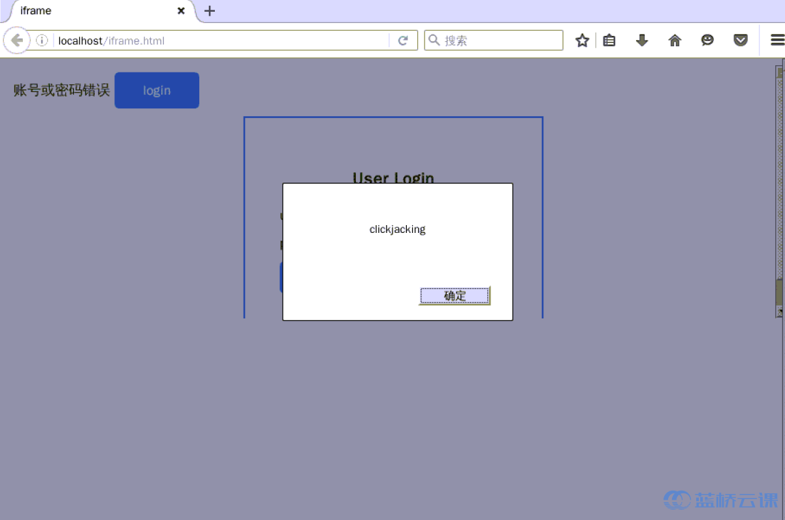
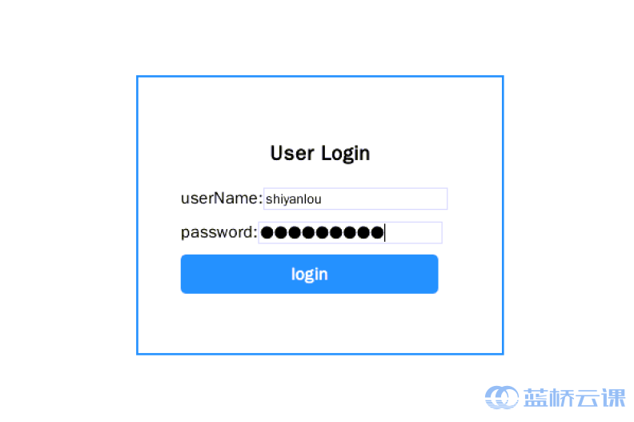
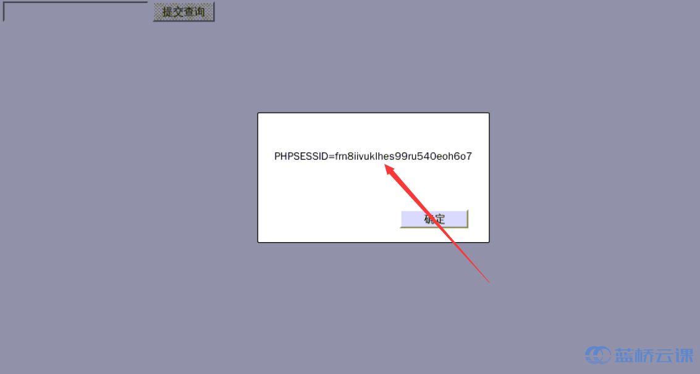
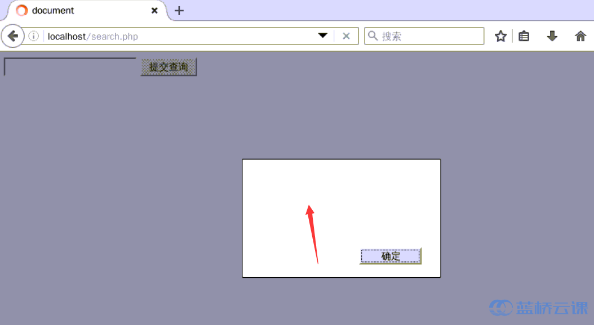
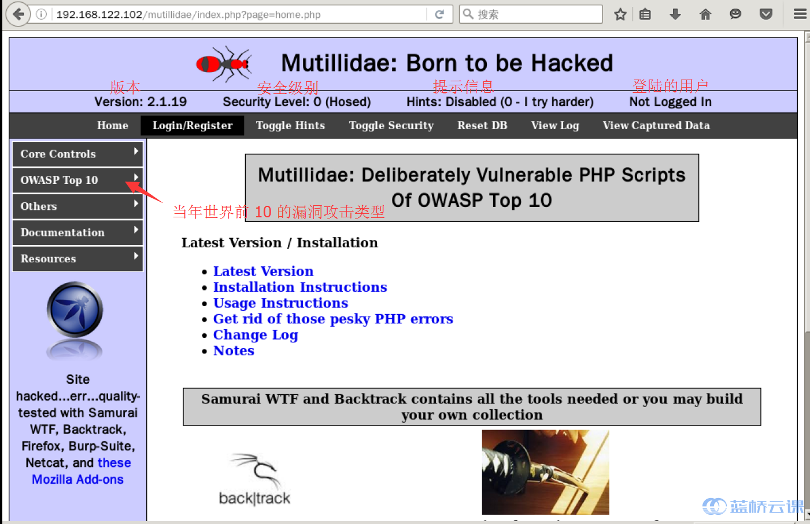
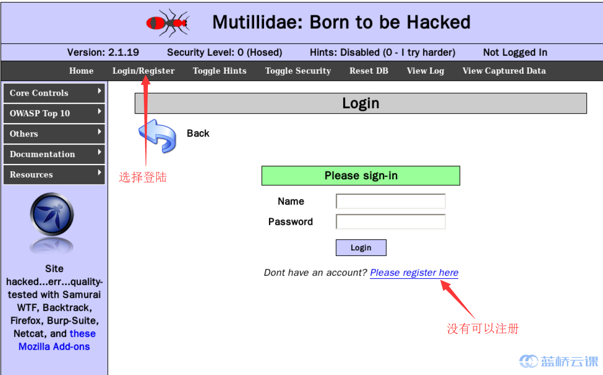

# 验证码安全问题

## 1. 课程说明

> **注意**：本实验环境与上一章节实验环境不同，请勿延续上个实验环境，若是已保留，请结束实验，重新启动实验环境即可。

本课程为动手实验教程，为了能说清楚实验中的一些操作会加入理论内容，也会精选最值得读的文章推荐给你，在动手实践的同时扎实理论基础。

**注意：实验用的云主机因为配置成本较高，会限制次数，每个实验不超过6次**

## 2. 学习方法

实验楼的 Kali 系列课程包含五个训练营，本训练营主要讲述 Web 应用攻击方法。课程包含20个实验，每个实验都提供详细的步骤和截图。适用于有一定 Linux 系统基础，想快速上手 Kali 渗透测试的同学。

学习方法是多实践，多提问。启动实验后按照实验步骤逐步操作，同时理解每一步的详细内容，如果有任何疑问，随时在[实验楼问答](https://www.shiyanlou.com/questions/)中提问，实验楼团队和我都会及时回复大家的所有问题。

如果实验开始部分有推荐阅读的材料，仅供参考。

## 3. 本节内容简介

本实验中我们初步接触 Kali Linux 和渗透测试的概念。需要依次完成下面几项任务（本节环境与其他章节略有区别，注意查看环境搭建环节）：

- 验证码安全简介
- 验证码安全方式
- 绕过验证的实战（及防范）

## 4. 推荐阅读

本节实验推荐阅读下述内容：

1. [验证码识别初篇](http://www.geekso.com/Valite/)
2. [验证码识别中篇](http://www.geekso.com/Valite2/)

## 5. 验证码安全

### 5.1 简介

在现在网上基本都存在验证码，而验证码存在的意义是什么？验证码又会带来怎样的安全隐患？

在以前章节的漏洞学习中我们提到过暴力破解，我们说过这是一种不断的尝试来破解出密码的方式，若是没有限制次数早晚会被试出来，还有当我们的页面在同一时间被过多的访问也会造成资源的损耗，还可能造成拒绝式服务攻击；还有利用程序自动注册、登陆，发消息等等。

所以为了对付这样恶意程序（一般称为机器人），出现了验证码。验证码英文是 CAPTCHA，全称为：Completely Automated Public Turing test to tell Computers and Humans Apart，自动化区分计算机与人类的公共图灵测试。

>**图灵测试**：是图灵于 1950 年提出的一个关于判断机器是否能夠思考的著名实验，测试某机器是否能表现出与人等价或无法区分的智能。（[来自于维基百科](https://zh.wikipedia.org/zh/%E5%9B%BE%E7%81%B5%E6%B5%8B%E8%AF%95)）

有了验证码的阻隔就使得在暴力破解是不能简单的通过一个脚本运行将密码试出，有了验证码就能阻挡攻击者不断刷某个网页的访问。因为最开始的验证码为了就是只能人类识别不能机器自动化识别，所以是自动化区分机器与人类，反图灵的一个举措，这就是验证码的由来。

路易斯·冯·安(Luis von Ahn)是验证码的提出者，创始者。雅虎是第一个尝试者，因为验证码的出现解决了很大一部分垃圾邮件的问题，由此验证码就开始辉煌了。

相信道高一尺魔高一丈，哪里有压迫哪里就有起义，有了验证码的阻碍，攻击者就有对付验证码的举措，对付验证码的举措有这样两种方式：

- 绕过验证码
- 识别验证码

绕过验证码的方式，通过代码的逻辑不严谨，使用某种方式（提交不同方式的参数、xss 的攻击跳过验证等等）跳过验证码输入的步骤，直接攻击。

识别验证码的方式，使用某种程序能够自动识别简单的验证码，从而使得验证码的存在形同虚设。

### 5.2 识别验证码简介

验证码的识别存在多种方式，例如：

1.答案用户可见

有些网站的验证码是一个问题，为了防止用户不能正确回答，会将答案显示在页面中，这样的验证码便非常容易识别，自动识别程序只需要读取页面的 html 代码，定位到答案处就可以。

2.验证码的个数有限

现在验证码都是以图片的形式存在（因为文字的存在会显示在源代码中，HTML 的代码是可轻易查看的），而若是图片的个数有限，并且图片的文件名与验证码之间存在对应关系，这样就可以通过程序遍历一次服务器中的所有验证码，并找出对应关系，如此在后续暴力破解或者是其他攻击时可以通过简单的获取当时的验证码图片名，然后使用 switch 简单的判断即可识别，让验证码形同虚设。

3.识别简单的验证码

若是上述的两个问题都不存在，那么还有的方式就是让机器也能够看懂验证了。当图片的背景较为简单，图片中的文件中规中矩，较为规范时利用程序通过图片切片、取出字模、图片二进制化、去除噪点、对照样本便可识别出图中验证码。若是感兴趣的同学可以仔细阅读我们的推荐阅读，从中阐述了识别的原理与实现的方法。

防止验证码的识别应该注意：

- 验证码不能过短
- 验证码的数字、字母不能简单的放置

由此便涌现了许多较为创新的验证方式，例如曾经 Google 使用的 recaptcha（两张图片的识别，还有语音功能）、拖动滑块到对应位置的验证、12306 的图片识别等等。

而我们在实现验证码时不一定需要使用创新性，但是尽量：

- 使得字母之间有粘连、连接性（也就是不要让字母、数字之间过于独立，这样非常容易识别）；
- 使得字母、数字有一定的倾斜角度摆放，亦或者是稍微加一点扭曲的效果，亦或者是使用较为特殊的字体，亦或者按照不同比例的缩放，这样能够给图片的识别造成较大的困难。

虽然这些注意点都有对应的解决措施（例如二值化，凸多边形填充，多字体训练，字库，水滴切割等等），但总比过于简单来的好，可以过滤掉一大波攻击。但是总的来说加密、混淆是解决问题的一个大方向，有兴趣的同学还可研究研究 Google 使用的 norecaptcha 方式。

4.人工打码

因为上述的方式使得即使很多人都无法识别，更别说机器了。但同时还产生了一种破解密码的方式就是人工打码了，通过一定的结果将验证码发给后台人员，有专门的人来识别验证码，这样的方式没有办法防御，但是也有一定的代价。

### 5.2 绕过验证码简介

上述的方式需要对图像与 OCR 识别有一定的基础，所以还有一种方式便是通过绕过验证码来攻击。

上述的方法就像是两个野蛮人之间的肉搏，而这种方式就像一个矮小的人对付一个巨人时以灵活、技巧取胜。

## 6.绕过验证码实战

### 6.1 环境搭建

不去直接面对验证码，直接跳过验证码来实现后续的攻击。因为在高版本中的 DVWA 中才出现了这样的实验环境，在使用之前我们需要环境的搭建。

课程已经从dvwa官网下载并添加了简单的部署脚本，按照以下步骤部署 dvwa 到实验楼环境中（该方法也适用于本地搭建）:

下载安装脚本：

```
$ wget http://labfile.oss.aliyuncs.com/courses/645/dvwa_deploy.tar.gz
```


解压压缩包：

```
$ tar -zxvf dvwa_deploy.tar.gz
```


由此我们便获得了安装部署的脚本，在安装之前我们需要使用 `sudo apt-get update` 来更新下我们的源，因为在此过程中会安装 mysql、php 已经一些必要的库文件。

执行完之后我们便可使用该命令安装 DVWA 了：

```
$ ./deploy.sh
```

此时我们便成功的安装好了 DVWA 的整个平台，但是 Insecure CAPTCHA 模块中使用的是 Google 的 reCAPTCHA 插件，我们需要添加 API key 才能正常使用该模块，改配置文件放置在 `/var/www/html/dvwa/config/config.inc.php` 中，通过 `vim /var/www/html/dvwa/config/config.inc.php` 来编辑其中的内容：

```
#修改内容

##原文
$_DVWA[ 'recaptcha_public_key' ]  = '';
$_DVWA[ 'recaptcha_private_key' ] = '';

##修改为
$_DVWA[ 'recaptcha_public_key' ]  = '6LdK7xITAAzzAAJQTfL7fu6I-0aPl8KHHieAT_yJg';
$_DVWA[ 'recaptcha_private_key' ] = '6LdK7xITAzzAAL_uw9YXVUOPoIHPZLfw2K1n5NVQ';
```

接着打开浏览器，在地址栏输入`localhost/dvwa`访问初始设定页面：



点击图中的按钮初始化数据库。



初始化成功后的结果如下：



初始化之后，页面会自动跳转到登录页，输入默认用户名`admin`和密码`password`登入系统。



由此我们便搭建好了新的 DVWA 平台。

在使用的时候我们会用到一个插件 Tamper Data，这个插件用于在提交参数到服务器之前修改参数。

使用该命令下载离线安装包：

```
wget http://labfile.oss-cn-hangzhou.aliyuncs.com/courses/982/tamper_data-11.0.1-fx.xpi
```

下载完成之后，我们便开始安装插件了，在 Firefox 的右上角有一个三横线的设置菜单栏，通过它打开提添加组件：


在 addons 页面中，我们选择扩展：


选择从本地安装：


选择刚刚下载好的插件：


在选择之后会询问是否安装，便选择安装，安装完之后提示需要重启浏览器才能生效，就选择重启浏览器，这样我们便安装好了我们需要的插件。

如此我们便做好了所有的准备工作。

>注意：此处若是出现了版本不兼容的情况可以通过这样的方式来修改：

>1.首先打开浏览器，然后在地址栏中输入 `about:config`

>2.在下方的列表中任意一处右键选择新建、选择布尔

>3.输入键值对的名字 `extensions.checkCompatibility.48.0`，后面这个 48.0 是此时 Firefox 的版本号。

>4.确定之后，值选择 false，然后确定即可。

>这个时候你再去安装就可以了

### 5.2 Insecure CAPTCHA

在新版的 DVWA 中，除了增加了 Insecure CAPTCHE 的模块，同时还优化了 Security Level，从原来的 3 个级别（low、medium、high）添加到了 4 个级别，增加了一个 Impossible。

我们依然从 low level 开始学起。所以首先在 DVWA Security 中将 level 从 Impossible 调整至 low。

然后我们回到 Insecure CAPTCHA 选项中：


因为 DVWA 使用的验证码是 Google 的 reCAPTCHE 工具，所以会与 google 相互通信，从而获取验证码，但是因为网络环境原因我们是加载不上的，好在本实验主要是针对绕过验证码的实战，所以没有验证码我们也能做，没有网络的实验环境还好，因为无法通信就会终止与 google 的连接，但是有网络的实验环境就会不断的尝试重连，页面一直处于加载中，可以这样解决：

关闭我们的路由信息即可，无网络的同学可以跳过该步骤：

```
sudo vim resolv.conf
```

然后在所有的语句之前加上 `#` 注释，然后保存退出即可。

此时我们再次访问我们的 Insecure CAPTCHA 页面，就会发现不会不断的加载。

现在我们来尝试修改我们的密码：


将我们的密码修改成 `shiyanlou`，点击 change 之后我们会发现有这样的提示：

```
The CAPTCHA was incorrect. Please try again.
```

这是因为我们没有输入验证码所造成的，而没有显示验证码是 reCAPRCHA 加载不出来。

我们通过 F12 打开开发者工具选择网络选项，然后我们再次修改密码我们，可以看到有这样一些数据包的传送，其中有一个 POST 数据包：


点击数据包我们能够看到数据包的详情，选择参数项，我们可以看到我们提交的参数：



我们看到一共提交了 4 个参数，其中 `password_new` 与 `password_conf` 是新密码与新密码确认的参数，而 `change` 参数是我们的提交请求的按钮，还有一个 `setp` 是干嘛用的呢？

我们来查看一下源码：

```
<?php

if( isset( $_POST[ 'Change' ] ) && ( $_POST[ 'step' ] == '1' ) ) {
    // Hide the CAPTCHA form
    $hide_form = true;

    // Get input
    $pass_new  = $_POST[ 'password_new' ];
    $pass_conf = $_POST[ 'password_conf' ];

    // Check CAPTCHA from 3rd party
    $resp = recaptcha_check_answer( $_DVWA[ 'recaptcha_private_key' ],
        $_SERVER[ 'REMOTE_ADDR' ],
        $_POST[ 'recaptcha_challenge_field' ],
        $_POST[ 'recaptcha_response_field' ] );

    // Did the CAPTCHA fail?
    if( !$resp->is_valid ) {
        // What happens when the CAPTCHA was entered incorrectly
        $html     .= "<pre><br />The CAPTCHA was incorrect. Please try again.</pre>";
        $hide_form = false;
        return;
    }
    else {
        // CAPTCHA was correct. Do both new passwords match?
        if( $pass_new == $pass_conf ) {
            // Show next stage for the user
            echo "
                <pre><br />You passed the CAPTCHA! Click the button to confirm your changes.<br /></pre>
                <form action=\"#\" method=\"POST\">
                    <input type=\"hidden\" name=\"step\" value=\"2\" />
                    <input type=\"hidden\" name=\"password_new\" value=\"{$pass_new}\" />
                    <input type=\"hidden\" name=\"password_conf\" value=\"{$pass_conf}\" />
                    <input type=\"submit\" name=\"Change\" value=\"Change\" />
                </form>";
        }
        else {
            // Both new passwords do not match.
            $html     .= "<pre>Both passwords must match.</pre>";
            $hide_form = false;
        }
    }
}

if( isset( $_POST[ 'Change' ] ) && ( $_POST[ 'step' ] == '2' ) ) {
    // Hide the CAPTCHA form
    $hide_form = true;

    // Get input
    $pass_new  = $_POST[ 'password_new' ];
    $pass_conf = $_POST[ 'password_conf' ];

    // Check to see if both password match
    if( $pass_new == $pass_conf ) {
        // They do!
        $pass_new = mysql_real_escape_string( $pass_new );
        $pass_new = md5( $pass_new );

        // Update database
        $insert = "UPDATE `users` SET password = '$pass_new' WHERE user = '" . dvwaCurrentUser() . "';";
        $result = mysql_query( $insert ) or die( '<pre>' . mysql_error() . '</pre>' );

        // Feedback for the end user
        echo "<pre>Password Changed.</pre>";
    }
    else {
        // Issue with the passwords matching
        echo "<pre>Passwords did not match.</pre>";
        $hide_form = false;
    }

    mysql_close();
}

?> 
```

通过源码，我们可以看到整个处理逻辑是这样的：

- 查看 change 参数是否存在，并且 step 值是不是为 1，若是则
  + 将验证码设置显示与否
  + 获取设置的新密码
  + 检查 CAPTCHA 是否有设置 key，能否正常使用等
- 查看 change 参数是否存在，并且 step 值是不是为 2，若是则
  + 将验证码设置显示与否
  + 获取设置的新密码，检查是否相等：
   - 若是相等则更新数据库密码，并输出密码已修改
   - 若是不能则输出不匹配

从整个过程我们可以看到在 `setp=1` 时，会检查能否显示验证码，验证码输入的正确与否，然后查看两次输入的密码是否相同，但是在 `setp=2` 时并不会去检查验证码的问题，直接判断两次的密码是否相等，然后就更新数据库了，这就是漏洞。

如果我们是直接提交 `setp=2` 的参数，我们便可以绕过验证码。

此时我们通过 `Alt` 键打开菜单栏，然后选择工具，然后打开我们的 Tamper Data:



在弹框中右上角我们选择 `start Tamper`。

接着我们回到 DVWA 页面，再次提交我们修改密码的信息，这次在提交到服务器之前呗 Tamper Data 拦截下来了，询问我们是修改还是提交，选择 `Tamper`：


然后我们在 Tamper Data 的弹窗中将 `setp` 参数修改成 2，然后再提交：


接着我们会看到一个提交 google recaptcha key 的信息，无需修改，提交即可。后面的提交都这样操作，然后我们就会看到界面上提示我们修改成功了：


我们可以通过 `Logout` 退出当前的用户，然后再次登陆，我们会发现密码确实成功的修改了。

这就是漏洞所在，在 `step=2` 的时候，没有做任何对验证码的检查，所以我们可以这样直接绕过验证码输入的那一步。

在实际生活中我们没有办法查看源码，所以我们需要通过抓包，看走正常的流程会提交哪些信息，信息会如何的变化，从而来判断正常会提交哪些参数。最后这样的尝试。在本实验中我们因为网络问题所以没有办法走完整个过程所以没有能够想正常攻击一般来寻找问题。

如此我们便成功的绕过了验证码的输入，接着我们切换至 medium 的级别，我们再次来查看源码，其他的并没有任何的改变，只是添加了一个参数 `passed_captcha`，来判断我们是否成功的通过了验证码。

当然这样的方式我们同样可以通过伪造参数来绕过：


我们通过源码可以看到：

```
    if( !$_POST[ 'passed_captcha' ] ) { 
        $html     .= "<pre><br />You have not passed the CAPTCHA.</pre>"; 
        $hide_form = false; 
        return; 
    } 
```

只是简单的判断是否有这个参数，我们只需要传递这个参数即可。所以我们可以看到我们还是成功的修改了密码。

high 级别的绕过，作为大家的课后作业自行尝试该如何绕过。

通过 impossible 部分的代码，我们可以看到首先必须输入当前的密码，并且添加了 Anti-CSRF 的 token 机制，这样便能够有效的防范 CSRF 攻击，并且也放弃了两步的机制，同时使用 PDO 防止了 mysql 的注入。

由此全面的防范了几乎所有可能存在的问题。

## 6. 总结

本节实验中我们学习了以下内容，任何不清楚的地方欢迎到[实验楼问答](https://www.shiyanlou.com/questions)与我们交流：

- 验证码安全简介
- 验证码安全方式
- 绕过验证的实战

请务必保证自己能够动手完成整个实验，只看文字很简单，真正操作的时候会遇到各种各样的问题，解决问题的过程才是收获的过程。

> **注意**：下一实验环境与本章节实验环境不同，请勿继续使用本机环境

## 7. 作业

1.完成 high 级别的验证码绕过。