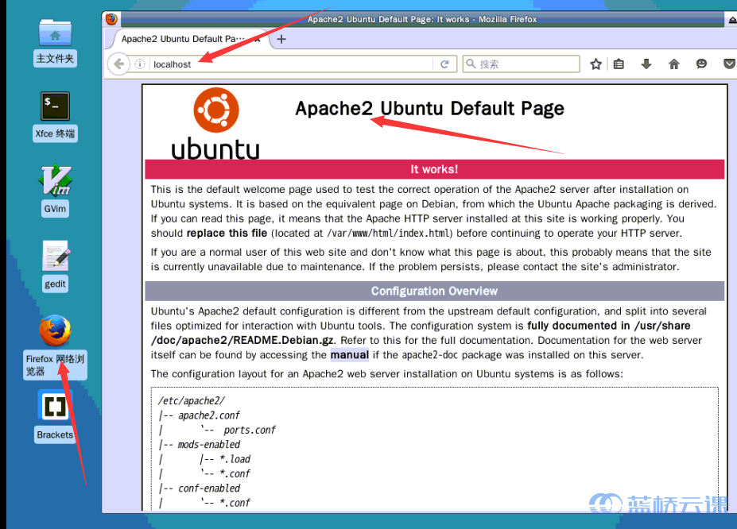
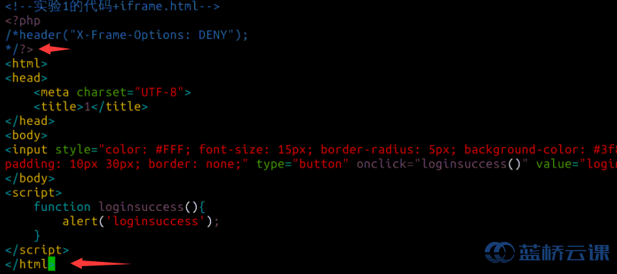
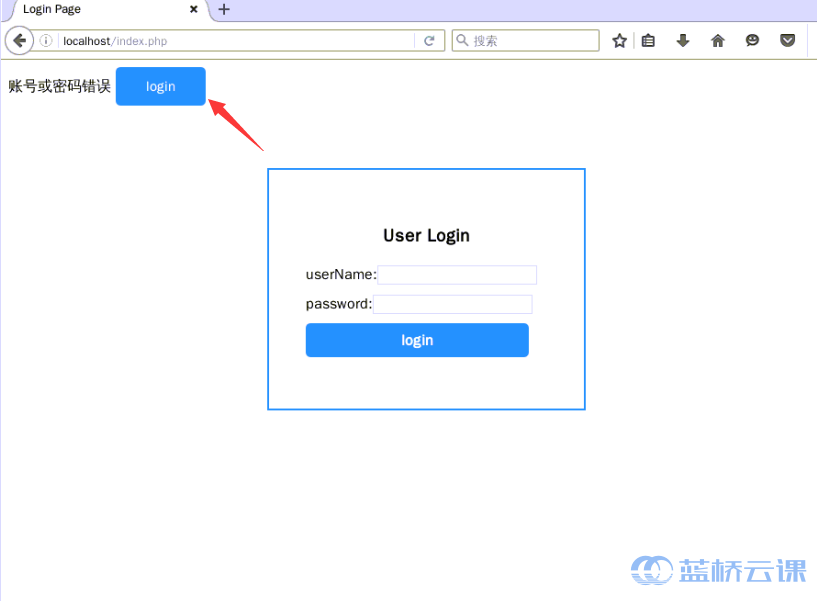
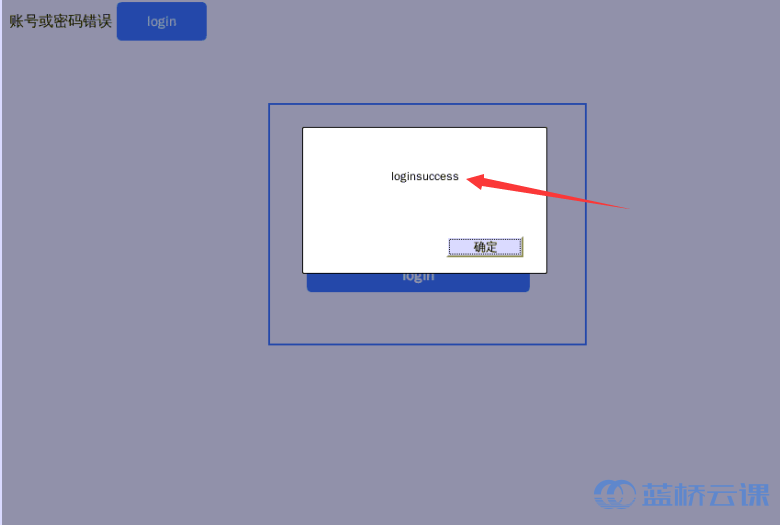
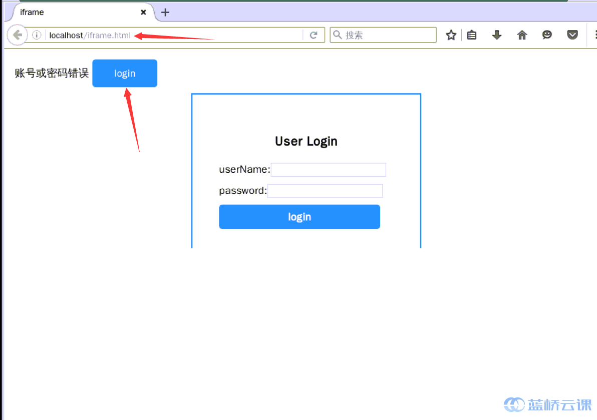

# 如何避免 Web 安全漏洞

## 1. 课程说明

本课程为动手实验教程，为了能说清楚实验中的一些操作会加入理论内容，也会精选最值得读的文章推荐给你，在动手实践的同时扎实理论基础。

**注意：实验用的云主机因为配置成本较高，会限制次数，每个实验不超过6次**

## 2. 学习方法

实验楼的 Kali 系列课程包含五个训练营，本训练营主要讲述 Web 应用攻击方法。课程包含20个实验，每个实验都提供详细的步骤和截图。适用于有一定 Linux 系统基础，想快速上手 Kali 渗透测试的同学。

学习方法是多实践，多提问。启动实验后按照实验步骤逐步操作，同时理解每一步的详细内容。

如果实验开始部分有推荐阅读的材料，请务必先阅读后再继续实验，理论知识是实践必要的基础。

## 3. 本节内容简介

本实验中我们初步接触 Kali Linux 和渗透测试的概念。需要依次完成下面几项任务：

- HTTP Header 防御简介
- 避免点击挟持
- 避免 cookie 窃取

## 5. HTTP Header 防御

### 5.1 简介

本实验我们将讲解 HTTP Header 的一些故事。

在之前的课程中我们学习到与 HTTP Header 注入相关的一些攻击方式，而本章节将谈到的时 HTTP Header 防御相关的事情，在开发的时候我们开启 HTTP Header 的部分功能我们便可以防御注入 Web session 劫持、点击挟持漏洞一类的攻击，而不仅仅时 HTTP Header 注入的攻击。

### 5.2 环境准备

本次实验我们不再使用 kali 与 DVWA 为大家演示，我们为大家准备了一小段 PHP 开发的环境。

通过 `cd /var/www/html/` 命令，我们进入 apache 的根目录中，然后我们通过这样三个命令下载三个为大家准备好的文件：

```
sudo wget http://labfile.oss.aliyuncs.com/courses/717/iframe.html
sudo wget http://labfile.oss.aliyuncs.com/courses/717/index.php
sudo wget http://labfile.oss.aliyuncs.com/courses/717/search.php
```

成功的下载之后我们便可以通过 `ls -lah` 看到我们的 apache 根目录中多了 3 个文件出来 index.php、iframe.html、search.php。


然后我们通过 `sudo service apache2 start` 启动 apache：


打开桌面的 Firefox，在地址栏中输入 `localhost` 我们可以看到 apache 的首页代表我们成功启动好了我们的环境：



### 5.3 避免点击挟持

做好一切的准备工作之后我们首先接触的便是点击挟持漏洞。

点击劫持（clickjacking）是一种在网页中将恶意代码等隐藏在看似无害的内容（如按钮）之下，并诱使用户点击的手段。这种行为又被称为界面伪装（UI redressing）。

举例来说，如用户收到一封包含一段视频的电子邮件，但其中的“播放”按钮并不会真正播放视频，而是链入一购物网站。这样当用户试图“播放视频”时，实际是被诱骗而进入了一个购物网站。（此段来自于维基百科）

简单来说便是让被攻击者看到一个正常的页面，但是若是产生兴趣使用则会落入陷阱。这种攻击的实现非常简单，便是通过一个 iframe 来引用有意思的网页，但是在其表面上会覆盖一层透明的按钮，一旦点击网页便会落入攻击者的陷阱中。我们通过这样的例子来演示一番。

首先我们使用 `sudo vim /var/www/html/index.php` 进入该文件的修改界面，然后我们做如下的修改：


```
<!--\u5b9e\u9a8c1\u7684\u4ee3\u7801+iframe.html-->
<?php
/*header("X-Frame-Options: DENY");
*/?><!--

#将此处末尾行的 `<!--` 注释删除

<script>
    function loginsuccess(){
        alert('loginsuccess');
    }
</script>
</html>-->

#将此处末尾行的 `-->` 注释删除
```

最后变成这样：



然后使用 `:wq` 保存退出，接着在 Firefox 的地址栏中输入 `localhost/index.php`，我们可以看到一个登陆场景的页面：



当我们点击左上角的 login 按钮是会有这样的弹窗提示：



提示我们成功的登陆。

于此同时我们访问 `localhost/iframe.html`。我们可以看到一个一模一样的页面：



但是当我们点击页面的时候我们会发现有不一样的弹窗：


这就是点击挟持，通过一个相同界面的伪装，让你误以为是平时所使用的网站，但却是一个攻击者的网站，在攻击时，一旦点击就不会是一个弹窗了而是获取你的用户名、密码、cookie 等等的作用了。

我们可以查看该页面的源码，实现的原理非常的简单：

```
<!DOCTYPE html>
<html>
<head>
    <title>iframe</title>
    <meta charset="UTF-8">
    <meta name="viewport" content="width=device-width, initial-scale=1.0">
</head>
<body style="width: 100%">
<div onclick="ifsub()" style="position: absolute; width: 100%; height: 100%;">&nbsp;</div>
<iframe src="http://localhost/index.php"  id="iframepage"   name="iframepage" frameBorder=0  width="100%" onLoad="iFrameHeight()" ></iframe>
</body>
<script>
    /*
     * 下面iFrameHeight函数以及上面iframe标签里面的 frameBorder=0  width="100%" onLoad="iFrameHeight()"都是在修改标签样式
     */
    function iFrameHeight() {
        var ifm= document.getElementById("iframepage");
        var subWeb = document.frames ? document.frames["iframepage"].document : ifm.contentDocument;
        if(ifm != null && subWeb != null) {
            ifm.height = subWeb.body.scrollHeight;
        }
    }


    function ifsub(){
        alert('clickjacking');
    }
</script>
</html>
```

只是通过一个 `iframe` 标签来获得我们原先所访问的页面，但是在 iframe 之上我们使用了一个不显示的 `div`，只要点击就会执行我们所嵌入的 javascript 中 `ifsub()` 函数，便是弹窗出来。

从上面的实例中我们可以了解到其实最为关键的便是通过 iframe 来获取一个让用户信以为真的页面，所以要防止这样的漏洞就是让攻击者无法使用 iframe 来引用我们的页面，这样便自然而然的解决了该漏洞。

而解决这个漏洞，非常的简单，我们只需要在我们的页面中添加这样的一个 header 即可：

```
header("X-Frame-Options: DENY");
```

我们通过 `sudo vim /var/www/html/index.php` 命令来修改该文件，我们将内容中：

```
<?php
/*header("X-Frame-Options: DENY");
*/?>
```

的注释删除，修改成这样：

```
<?php
header("X-Frame-Options: DENY");
?>
```

然后使用 `:wq` 保存退出，此时我们再次来访问我们的 `localhost/iframe.html` 页面，我们会发现一片空白，因为攻击者已经无法盗用我们的页面了，所以背景一片空白，如此我们便成功的防止住了点击挟持。

X-Frame-Options 一共有三个值：

- DENY：表示该页面不允许在 frame 中展示，即便是在相同域名的页面中嵌套也不允许。
- SAMEORIGIN：表示该页面可以在相同域名页面的 frame 中展示。
- ALLOW-FROM uri：表示该页面可以在指定来源的 frame 中展示。
  （[此段来自于 MDN](https://developer.mozilla.org/zh-CN/docs/Web/HTTP/X-Frame-Options)）

因为我们设置的是 DENY，所以其他页面便无法使用的 iframe 来嵌套我们的页面了。

我们的参数设置的是一个 header，那么什么是 header？

我们知道 HTTP 协议采用了请求/响应的模型，浏览器或其他客户端发出请求，服务器便会给予响应，而 HTTP 头字段（HTTP header fields）是指在超文本传输协议（HTTP）的请求和响应消息中的消息头部分。它们定义了一个超文本传输协议事务中的操作参数（此段来自于维基百科）

### 5.4 避免 cookie 窃取

有过一点开发基础的同学可能会认为现在大家都不怎么用 iframe 了，以上的技能是不是不够劲爆？

那我们就来谈谈 cookie 的保护，在我们之前的试验中我们曾经使用过反射型 XSS 来获取目标用户的 cookies，然后利用其 session 来做坏事。

那我们如何来保护我们的 cookie 不被外部的脚本所窃取？我们来这个例子。

我们在 Firefox 中输入 `localhost/index.php` 进入我们实现所准备好的登陆页面，紧接着我们输入用户名：`shiyanlou`，密码:`shiyanlou`。


通过登陆的方式使得服务器创建了 session，跳转至 search.php 的页面，在页面中我们内置了获取 cookie 的 javascript 代码，所以跳转过来之后我们可以看到这样的弹窗：


我们通过查看源代码便可知道，我们实现的非常简单：

```
<?php
    session_start();
    $username = isset($_POST['userName'])?$_POST['userName']:'';
    $password = isset($_POST['password'])?$_POST['password']:'';
    if (trim($username) == 'shiyanlou' && trim($password)=='shiyanlou') {
        $_SESSION['name']=$username;
        header("Location:search.php");
    }else{
        echo '账号或密码错误';
    }
?>
```

通过提供的登陆页面，使得 php 获取输入的内容，并比对用户名与密码是否都为 shiyanlou，若都是 shiyanlou 则正确，创建 session 并跳转至 search.php 页面。

在通过 search.php 的源码我们可以看见：

```
session_start();
session_regenerate_id();
if(!isset($_SESSION['name']))
{
    header('Location: index.php');
}
```

只要有登陆，查看有 session 便不会跳转回 index.php

并且执行获取 session 的 javascript：

```
<script>
    alert(document.cookie.split(";"));
</script>
```

由此我们便获取到了 session，攻击者同样可以通过反射型  xss 亦或者是存储型 xss 来注入 javascript 从而获取我们的 sessionid。

我们使用 `sudo vim /var/www/html/search.php` 命令来修改我们的源代码，将首行中

```
#ini_set("session.cookie_httponly", "True");
```

的注释去掉，修改为：

```
ini_set("session.cookie_httponly", "True");
```

接着使用 `:wq` 保存并退出，此时我们再次刷新我们的页面，我们可以看到虽然还有弹窗但是其中并无内容:


而阻止 javascript 获取我们 session 的便是 `httponly` 标记。

而改标记的作用便是 cookie 只能通过 HTTP 协议获取，而不能通过 javascript 来获取，从而能够有效的帮助减少通过 XSS 攻击所造成的身份窃取。

## 11. 总结

本节实验中我们学习了以下内容，任何不清楚的地方欢迎到[实验楼问答](https://www.shiyanlou.com/questions)与我们交流：

- HTTP Header 防御简介
- 避免点击挟持
- 避免 cookie 窃取

请务必保证自己能够动手完成整个实验，只看文字很简单，真正操作的时候会遇到各种各样的问题，解决问题的过程才是收获的过程。

## 12. 作业

1. 通过 F12 查看数据包中的包头的变化，在添加 httponly 与 X-Frame-Options 后。
2. httponly 是否会被 javascript 所覆盖？