# Ajax 安全问题

## 1. 课程说明

本课程为动手实验教程，为了能说清楚实验中的一些操作会加入理论内容，也会精选最值得读的文章推荐给你，在动手实践的同时扎实理论基础。

**注意：实验用的云主机因为配置成本较高，会限制次数，每个实验不超过6次**

## 2. 学习方法

实验楼的 Kali 系列课程包含五个训练营，本训练营主要讲述 Web 应用攻击方法。课程包含20个实验，每个实验都提供详细的步骤和截图。适用于有一定 Linux 系统基础，想快速上手 Kali 渗透测试的同学。

学习方法是多实践，多提问。启动实验后按照实验步骤逐步操作，同时理解每一步的详细内容。

如果实验开始部分有推荐阅读的材料，请务必先阅读后再继续实验，理论知识是实践必要的基础。

## 3. 本节内容简介

本实验中我们初步接触 Kali Linux 和渗透测试的概念。需要依次完成下面几项任务：

- Ajax 安全简介
- 实验环境与工具准备
- Ajax 安全实战

## 4. 推荐阅读

本节实验推荐阅读下述内容：

1.学习之前我们需要大概了解一下 ajax，[ajax 基础](http://www.w3school.com.cn/ajax/)

## 5. Ajax 安全

### 5.1 简介

本实验我们将讨论的事 Ajax 相关的安全问题。

首先大家都知道 AJAX 是 Asynchronous JavaScript and XML 的缩写，异步的 javascript 与 XML。使用 ajax 带来最大的好处是通过后台加载数据，并能够在不重新加载页面的情况下将加载的数据显示出来或者处理。


（此图来自于[billnasara](http://www.billnsara.com/js/ajax.asp)）

也就是我们所说的动态的局部刷新，这样的处理非常方便并使得用户的体验非常好。

但是当我们通过 Ajax 来与后台的数据库交互时就容易产生安全问题，这也是本实验将要讨论的问题。

### 5.2 环境准备

在本试验中我们将使用 mutillidae 平台与非常强大的 burp suite 工具。

>**Burp Suite** 是一个集成化的渗透测试工具，它集合了多种渗透测试组件，使我们自动化地或手工地能更好的完成对 web 应用的渗透测试和攻击。在渗透测试中，我们使用 Burp Suite 将使得测试工作变得更加容易和方便，即使在不需要娴熟的技巧的情况下，只有我们熟悉 Burp Suite 的使用，也使得渗透测试工作变得轻松和高效。

>Burp Suite 是由 Java 语言编写而成，而Java 自身的跨平台性，使得软件的学习和使用更加方便。Burp Suite 不像其他的自动化测试工具，它需要你手工的去配置一些参数，触发一些自动化流程，然后它才会开始工作。（此段来自于 [t0data的gitbook](https://t0data.gitbooks.io/burpsuite/content/chapter1.html)）

首先我们需要使用 Mutillidae，所以需要先搭建好 Mutillidae 的环境，而此次我们不再使用的 Metasploitable2 为我们所提供的 Mutillidae，因为版本较低，无法满足我们的需求。我们将自己搭建一个 Mutillidae。

非常的简单一共只需要三个步骤即可：

- 下载已经准备好的安装包
- 解压安装包
- 初始化数据库

就这样即可使用了。但这样的前提是我们的环境中已经安装好了 apache 与 php，因为 Mutillidae 与 DVWA 相同，都是采用的 PHP + MySQL 的架构，当然 apache 与 nginx 都是可以的，若是大家在机子的环境中搭建需要注意这些组件的存在。

>**注意**：因为环境的变更可能环境中没有安装 Apache，请通过 `sudo apt-get update && sudo apt-get install apache2` 命令来安装

我们使用 wget 来下载我们准备好的安装包：

```
wget http://labfile.oss.aliyuncs.com/courses/717/LATEST-mutillidae-2.6.42.zip
```

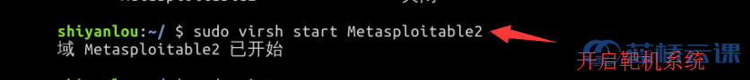

> **注意**：自己搭建环境的同学，从 sourceforge 中下下来的源码中 ajax 部分有一个小 bug，已向作者提出，本环境中的已修改好。需要自己修改的同学可以查看 [sourceforge 中的提交](https://sourceforge.net/p/mutillidae/bugs/23/)。

紧接着我们需要做的便是将该压缩包解压出来：

```
unzip LATEST-mutillidae-2.6.42.zip
```


成功的解压之后我们在当前目录便可看见一个有执行权限的目录 `mutillidae`，我们需要将该目录放置 apache 的根目录中：

```
sudo mv mutillidae /var/www/html/

```

因为只有将其放置 apache 的目录中我们才能通过 web 访问，所以我们需要将这个文件夹都剪切过去。

接着我们需要停止我们的 nginx，然后启动我们的 apache，因为二者都是使用的 80 端口会冲突，所以需要停止一个然后启动另外一个：

```
sudo service nginx stop

sudo service apache2 start
```


与此同时我们还需要开启 MySQL：

```
sudo service mysql start
```


然后我们打开桌面的 Firefox，在地址栏中访问 `localhost/mutillidae`，我们会得到这样的页面：


出现这样的页面是因为 mutillidae 检测到我们没有相关的数据库，我们只需要点击 `setup/reset the DB` 即可，让它自动为我们创建好数据库：


这样的情况便是没有启动 MySQL 的反应：

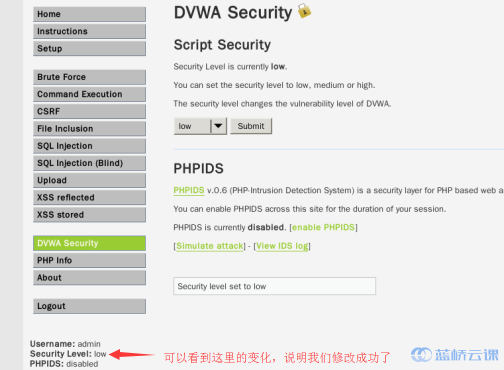

正常启动了 MySQL 的情况应该是这样的：


看到这样的界面说明我们成功的搭建好了我们的 Mutillidae 环境：

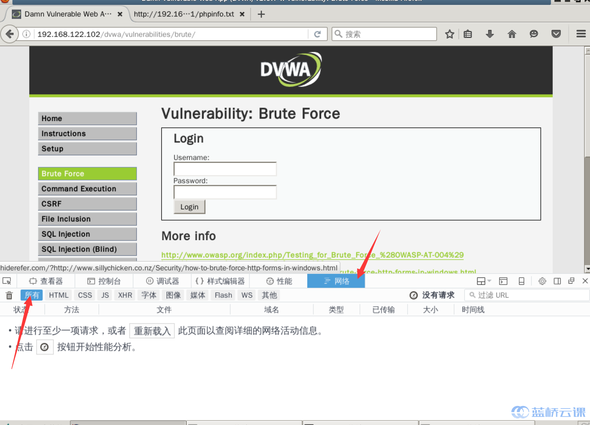

我们在这里可以找到 mutillidae 为我们提供的环境：


如此我们边做好了第一步准备工作，紧接着我们需要安装 Burp Suite。

Burp Suite 的安装十分简单，我们只需要下载其可执行文件 jar 包即可正常的运行，我们通过 `wget http://10.154.42.72/burpsuite_free.jar` 命令即可成功下载：

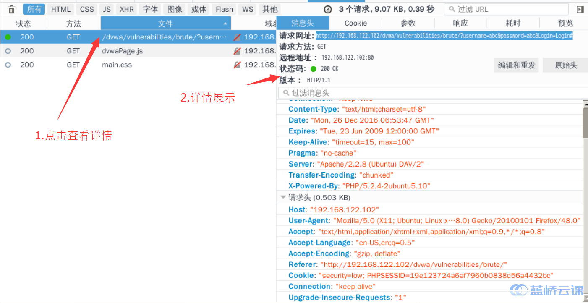

我们只需要执行这样一个命令即可是它运行起来：

```
java -Xmx1g -jar burpsuite_free.jar
```

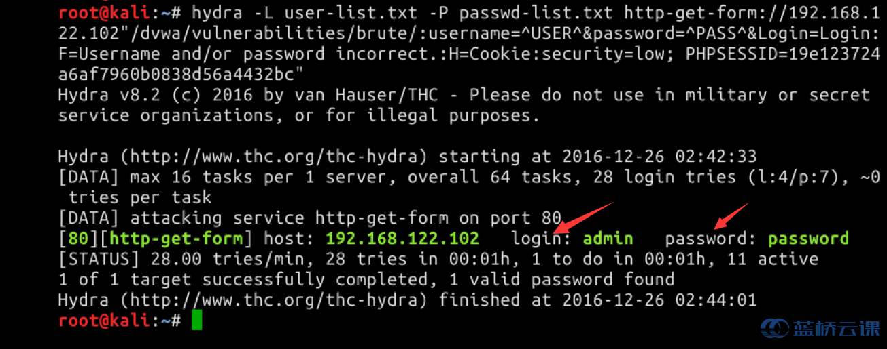

其中 `Xmx` 参数是我们指定其可用最多的内存限制，截图中使用 2G 使得环境较为卡顿，建议试试 1G。而 `&` 是让其在后台运行。

紧接着就是询问我们接收其 Licence 与否，当然是同意了：

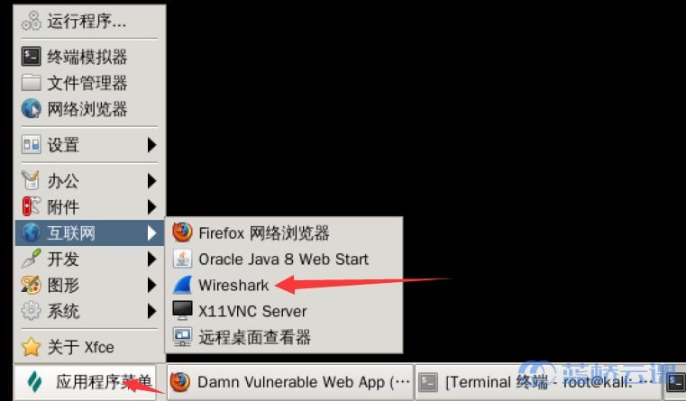

若是遇到这样的问题，则直接选择 delete 即可：


接下来便全部选择 next 即可：

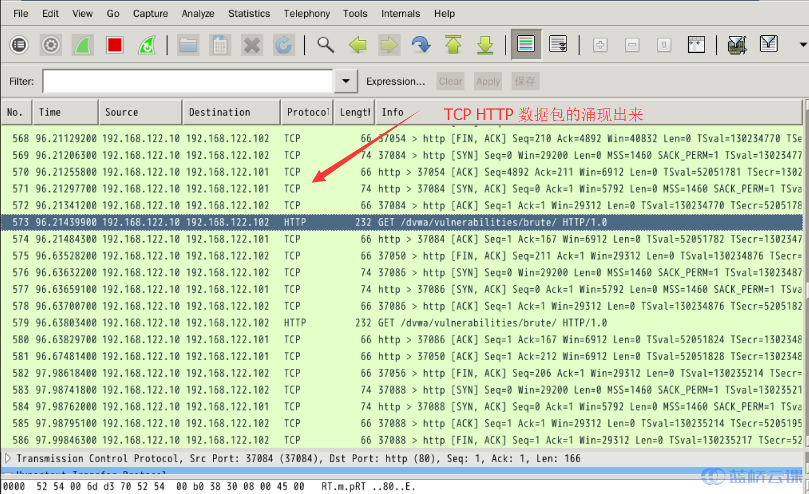

最后选择启动 burp：

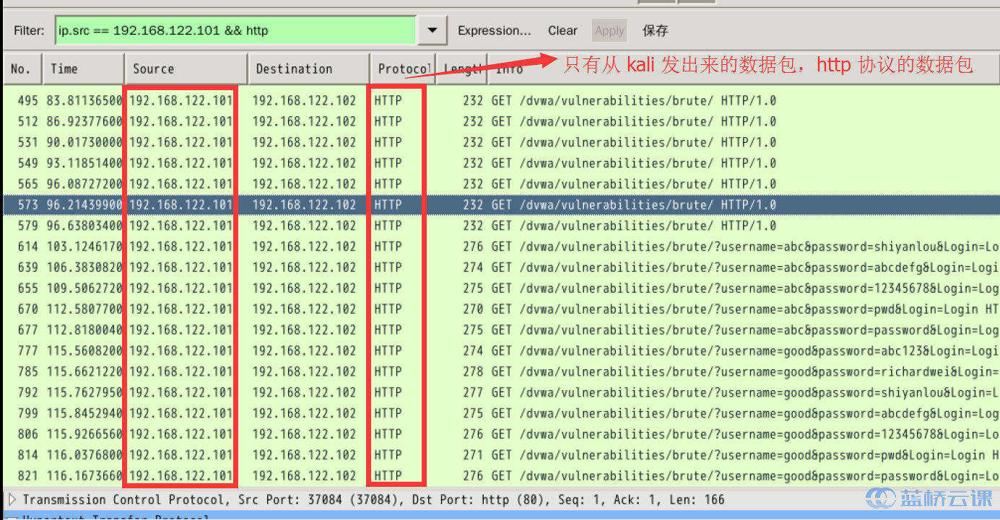

经过一小段的时间等待，我们便可看见 burp 的正常启动了：

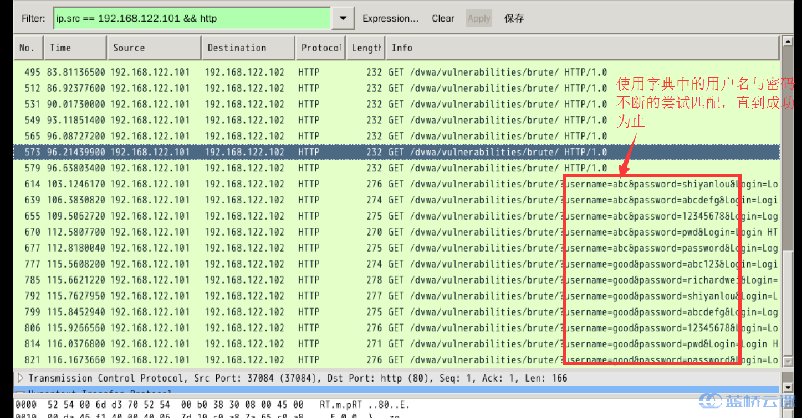

如此我们便成功的启动好了 Burp，然后我们需要将 Burp 与我们的 Firefox 关联起来，在 Firefox 的地址栏中输入 `about:preferences#advanced`，我们便可进入到 Firefox 的高级设置中：


然后我们选择网络：


进入了网络设置的选项卡中，我们选择连接中的设置：

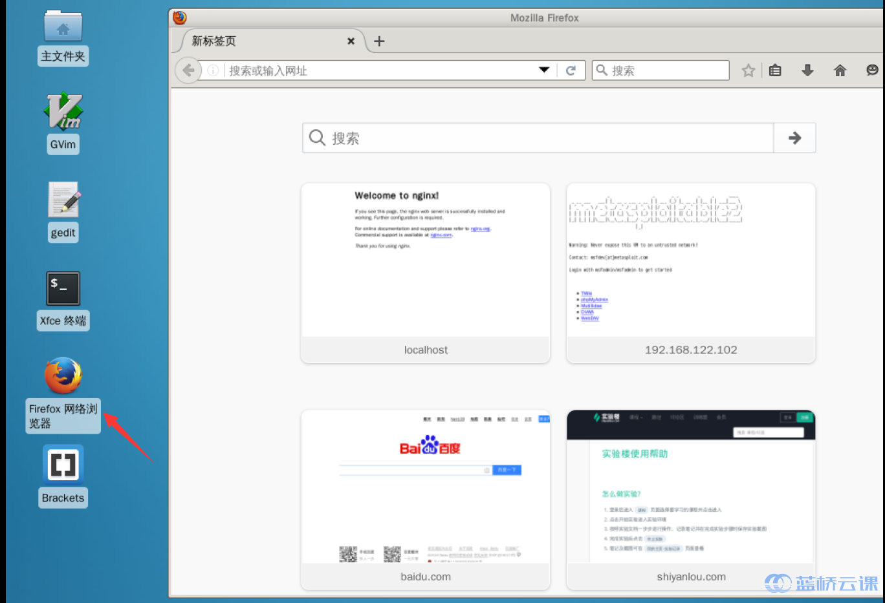

我们手动配置代理，这样即可连接到我们的 Burp 上：


此处的端口可以自行设定，只要不要与已经使用的端口号冲突即可，

然后将下方不是用代理的白名单中内容删除，否则数据包将无法转发到我们的 Brup Suite 中：

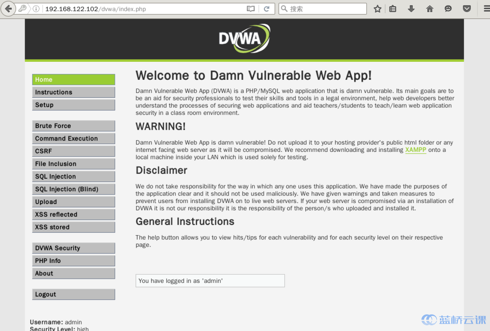

最后点击确定。

与此同时我们切换至 Burp Suite 界面，切换至 proxy 的选项中：


然后修改端口号与 Firefox 中的配置相同，若本来就配置的 8080 则无需修改：


因为环境中的 tomcat 在启动中，使用的 8080 端口，所以我们使用的 8181，当然我们可以停止掉 tomcat 然后便可使用 8080 端口了。

然后选择 Running 即可：


由此我们边做好了所有的准备工作。

此时我们提交任何的请求都会先经过 Burp Suite，我们可以刷新一下页面，页面会一直处于加载中的状态，因为被 Burp Suite 所截取：

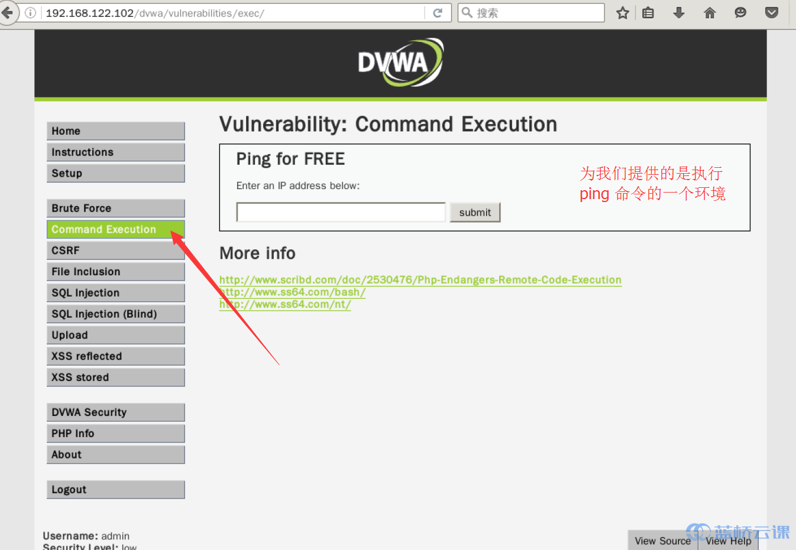

接下来我们将观察我们的实验环境，所以我们可以暂时先关闭 Burp Suite 的截取：


### 5.3 实战

紧接着我们来观察我们的实验环境，这是一个通过列表来查看工具的功能，选择一个工具的名字，点击 `Lookup Tool` 我们就可以看到相关工具的信息了：

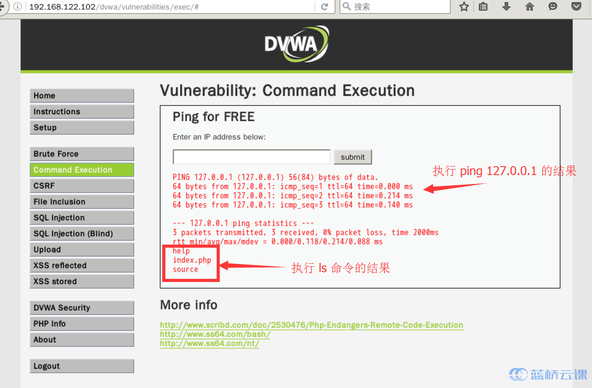

我们没有刷新页面，但是却动态的加载出了内容，我们可以猜想这里使用了 Ajax 的方法。

我们在页面上空白处通过右键查看页面源代码，使用 `ctrl+F` 查找 `XMLHTTP` 这样的关键字：

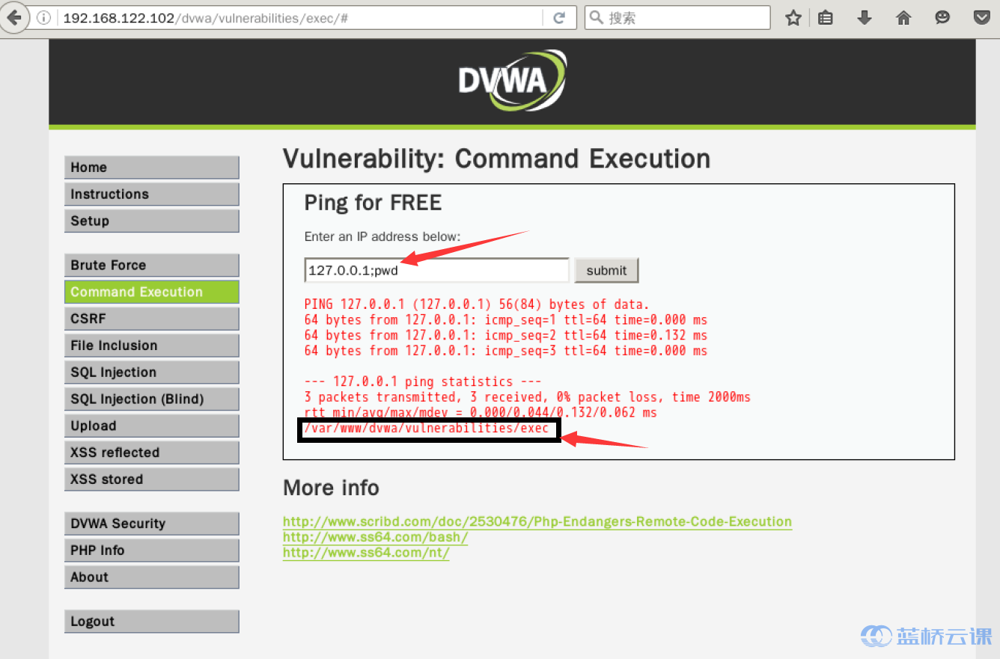

可以看到这样的代码：

```
lXMLHTTP = new XMLHttpRequest();
```

XMLHttpRequest 对象是 AJAX 的使用核心，用于在后台与服务器交换数据。它允许通过 javascript 来执行 HTTP 请求，用户不用等待服务器的响应，可进行其它操作，服务器将 数据返回给 javascript 处理，由此可以迅速更新表单数据，不刷新也能使得用户得到了新数据。

由此我们几乎可以断定该站点使用了 AJAX 技术。

此时我们重新开启 Intercept：


然后我们再次随机选择一个列表内容，然后点击查询：


从上到下都是基本的报头参数，从 Host 到 Cookie 都是正常的，但是在最下面我们可以到又要给 `ToolID` 的参数：


说明该工具在数据库中的 ID 值为 1，数据具体内容的查询通过 ID 值来查询，我们可以尝试此处是否有注入点，我们在 `11` 后添加一个 `'`，然后点击 Forward，之前我们的 SQL 注入课程中有讲解到回显式测试：


转发之后我们回到页面，我们看到了这样的报错：

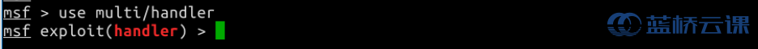

我们可以看到，因为我们的无法错误而导致没有正确执行的异常。说明这就是一个可注入的点。

我们再尝试只是一个 `'`：

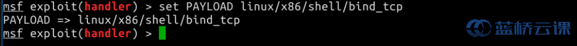

此时我们便发现了 ajax 存在着 SQL 注入的漏洞。

在 Burp 中有个非常强大并且常用的功能就是 Repeater，经常使用 Repeater 来进行请求与响应的消息验证分析，比如修改请求参数，验证输入的漏洞，查看响应内容。

我们再次点击 `Lookup Tool`，然后我们右键 Burp 中消息的拦截，选择 `send to Repeater`:


当然也可以直接使用快捷键 `ctrl+R`。然后我们到中继器中查看：

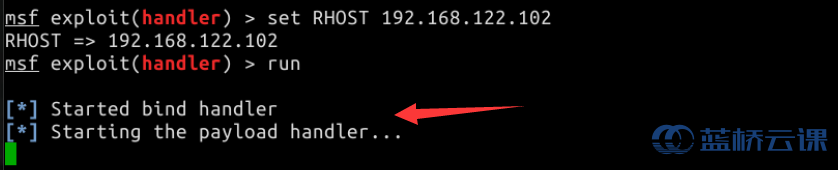

我们可以看到这样的界面：


Repeater 可以这样使用：


从响应的消息中我们可以看出接收端收到 `toolIDRequested` 参数，从 `penTestTools` 表中接收到 `tool_id`、`tool_name`、`phase_to_use`、`tool_type`、`comment` 这样 5 项内容。

由此我们基本上就可以还原出具体的 SQL 语句了：

```
select tool_id,tool_name,phase_to_use,tool_type,comment from penTestTools where id= '1'; 
```

我们可以看到一共搜索了 5 项内容，我们可以通过 union 来展示更多的信息：

```
1' union select version(),null,null,null,null #
```

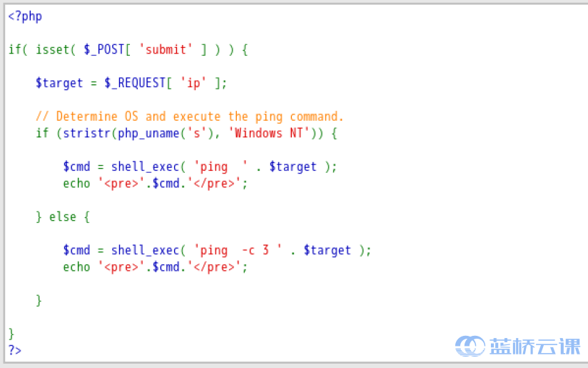

接下来的内容便主要是 SQL 注入类似了。我们还可以使用 `database()` 查看到当前我们使用的数据库：

```
1' union select version(),database(),null,null,null #
```


步步深入，我们还可以查看到表：


因为返回来的是 json，所以数据看起来可能有些乱，我们可以把我们的命令切换回 proxy 执行，发送出去：


紧接着我们就是尝试更多的 SQL 语句，查看更多的信息。

这就是 Ajax 的安全问题，对于这中问题的防范与 SQL 注入的防范类似，我们只需要在我们获取数据时，过滤一下特殊字符即可，例如在 mutillidae 中，便是使用的 `real_escape_string()` 方法将特殊字符转义：


## 6. 总结

本节实验中我们学习了以下内容，任何不清楚的地方欢迎到[实验楼问答](https://www.shiyanlou.com/questions)与我们交流：

- Ajax 安全简介
- 实验环境与工具准备
- Ajax 安全实战

请务必保证自己能够动手完成整个实验，只看文字很简单，真正操作的时候会遇到各种各样的问题，解决问题的过程才是收获的过程。

## 7. 作业

1. 获取数据库中所有用户名与密码；
2. 思考是否有方法能够绕过单引号过滤的防范措施。