# 跨站请求伪造（CSRF）

## 1. 课程说明

本课程为动手实验教程，为了能说清楚实验中的一些操作会加入理论内容，也会精选最值得读的文章推荐给你，在动手实践的同时扎实理论基础。

**注意：实验用的云主机因为配置成本较高，会限制次数，每个实验不超过6次**

## 2. 学习方法

实验楼的 Kali 系列课程包含五个训练营，本训练营主要讲述 Web 应用攻击方法。课程包含20个实验，每个实验都提供详细的步骤和截图。适用于有一定 Linux 系统基础，想快速上手 Kali 渗透测试的同学。

学习方法是多实践，多提问。启动实验后按照实验步骤逐步操作，同时理解每一步的详细内容。

如果实验开始部分有推荐阅读的材料，请务必先阅读后再继续实验，理论知识是实践必要的基础。

## 3. 本节内容简介

本实验中我们初步接触 Kali Linux 和渗透测试的概念。需要依次完成下面几项任务：

- CSRF 简介
- CSRF 实战
- CSRF 防范

## 4. 推荐阅读

本节实验推荐阅读下述内容：

1. [XSS 与 CSRF 的介绍与区别](https://blog.tonyseek.com/post/introduce-to-xss-and-csrf/)

## 5. CSRF 的认识

### 5.1 CSRF 简介

CSRF 的中文名字叫跨站请求伪造，英文全名为：Cross-site request forgery，通常也会被称为 one-click attack 或者 session riding。

这种攻击方式的重点在于其名的末尾两个字：伪造。伪造请求，冒充用户正在操作。

攻击者通过一些技术手段欺骗用户的浏览器去访问一个自己曾经认证过的网站并执行一些操作（如发邮件，发消息，甚至财产操作如转账和购买商品）。由于浏览器曾经认证过，所以被访问的网站会认为是真正的用户操作而去执行。这利用了web中用户身份验证的一个漏洞：简单的身份验证只能保证请求发自某个用户的浏览器，却不能保证请求本身是用户自愿发出的。（来自[维基百科](https://zh.wikipedia.org/wiki/%E8%B7%A8%E7%AB%99%E8%AF%B7%E6%B1%82%E4%BC%AA%E9%80%A0)）

这里所谓的认证指的是 cookie，在服务端与客户端都会保存一个 cookie 值串，在随后的请求中将这些信息发送至服务器，Web 服务器就可以使用这些信息来识别不同的用户。这样访问任何页面用户都是保持登陆的状态。

这样大家可能还是不知道什么是 CSRF 攻击，我们说到服务端识别用户是通过 cookie，例如我在访问一个电商网站，我们每访问一个页面都会提交一个请求，cookie 会包含在请求中，这样访问每个页面的时候都会显示我在登陆。正是利用这一点，攻击者诱导用户访问某个连接，就可以悄悄的修改其密码，或者是其他操作。

在没有窃取任何信息情况下形成的攻击。


（此图来自于[blogspot.com](http://4.bp.blogspot.com/_l_SAzJ_Vs1Y/S0QT7n1zvXI/AAAAAAAAADk/HuRAmcPHHsc/w1200-h630-p-nu/Ilustrasi+Serangan+XSRF.JPG)）

### 5.2 CSRF 比较

这样的描述让大家很容易想到反射性 XSS 攻击，其实 XSS 攻击与 CSRF 攻击常常被人们所混淆。

因为很多情况 CSRF 攻击需要使用到 XSS 的一些手法来完成，这样的攻击一般称之为 XSRF，但是 CSRF 的攻击方法并不止有 XSS 这一种。

通常注入 javascript 代码，来窃取一些信息，或者弹窗等一些恶意操作的我们归类于 XSS。例如注入代码让用户跳转至其他页面，弹窗，窃取 html，攻击服务器的操作。

利用用户的 cookie 做一些用户不知情、不愿意的操作我们归类与 CSRF。例如利用参数通过某个链接修改用户的密码，转账等一些操作。

### 5.3 CSRF 环境

与之前的实验相同，我们还是使用 dvwa 的环境，同样我们需要启动我们的实验环境，若是已经非常熟悉该步骤的同学可以跳过这一步。

在实验桌面中，双击 Xfce 终端，打开终端：


使用 `sudo virsh start Metasploitable2` 命令即可启动我们的靶机系统虚拟机：


等待大约四分钟，待得虚拟机完全启动之后我们打开桌面上的 Firefox：


访问我们的靶机系统所使用的 IP 地址`192.168.122.102`：


正常的启动靶机系统之后，我们访问其 IP 地址可以得到这样的一个页面。

点击 DVMA 我们便可进入到 DVMA 的登陆页面，默认的登陆用户与密码是 admin 与 password，登陆之后便会进入这样的页面：


为了能够进行最简单的攻击，我们会把安全默认调制最低，首先进入安全模式的调整页面：


然后调整安全的 level 到 low：


当看到页面的下方 Level 的显示变化后，说明修改成功了：


### 5.4 CSRF 初试

进入 DVWA 为我们所提供的 CSRF 的实验页面：

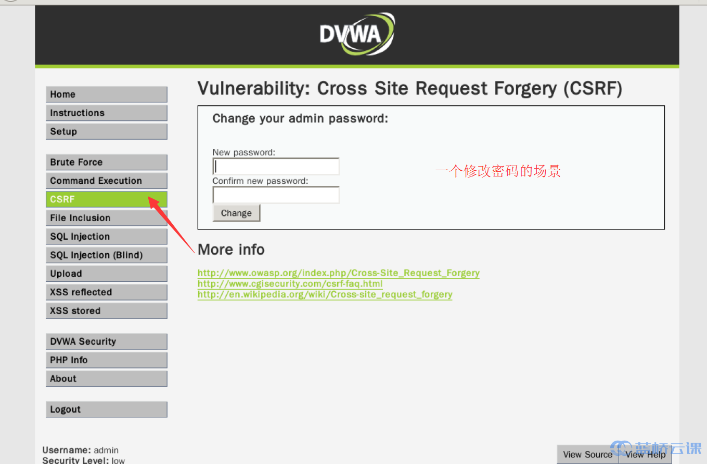

我们可以看到，实验环境为我们提供了一个修改密码的场景，在该场景中我们直接输入新的密码与确认新密码就可以修改了：

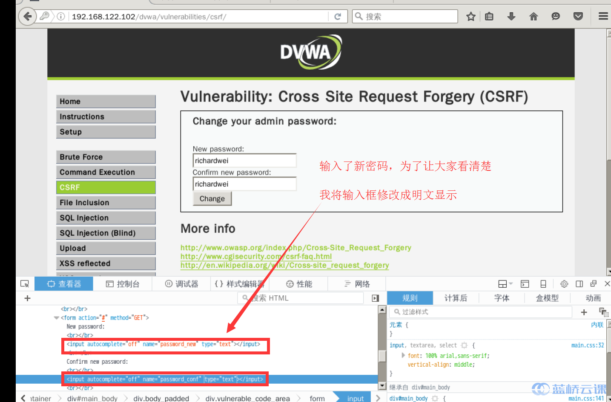

点击 change 的按钮：

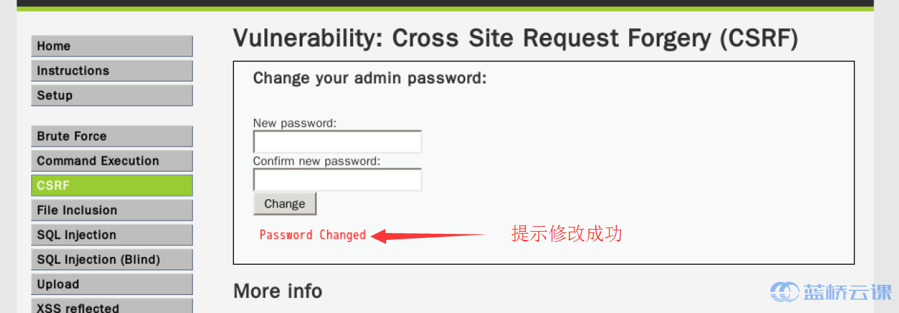

提示成功的修改了密码，我们可以关掉浏览器尝试重新登陆：

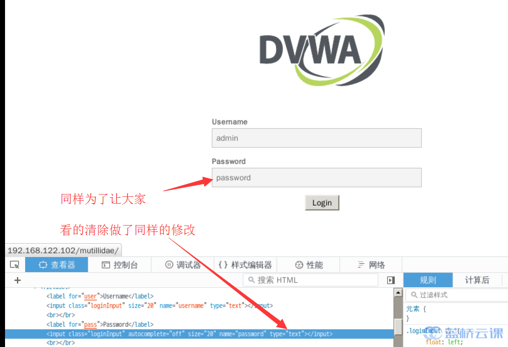/wm)

此时我们会发现 `login failed`，我们尝试刚刚设置的密码，是可以登陆进来的，说明我们修改成功了。

> **注意**：重新登陆之后需要重新修改 dvwa security 的级别，因为默认登陆使用的都是 high 级别的。

我们再次来到 CSRF 的修改密码页面，我们再次来修改密码：

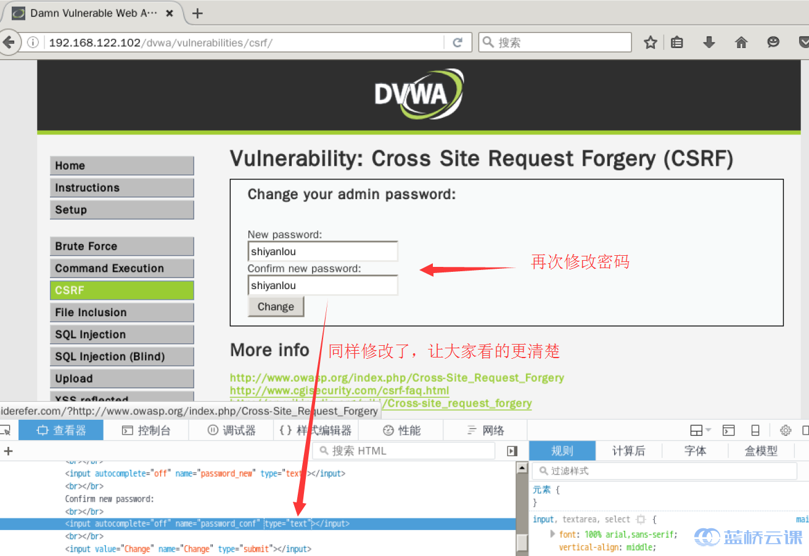

我们再次点击 `change` 按钮，我们把注意力投放到我们的 URL 上：

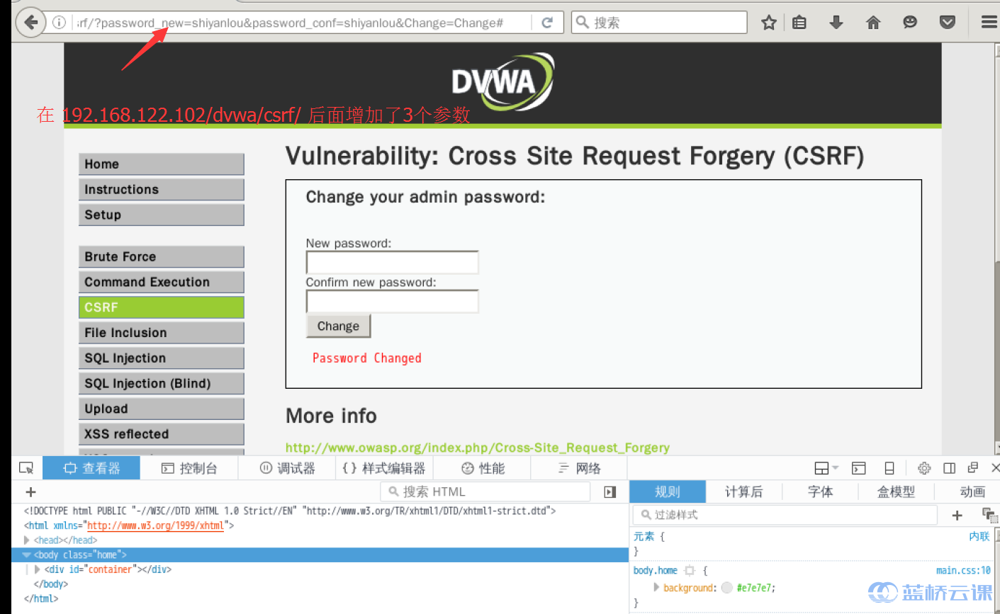

可以看出这是通过 GET 方式来提交的代码，由此可以看出该站点此时多么的不安全，不说其他光是通过 URL 我就可以知道新修改的用户名、密码。

此时我们不要关闭该页面，我们在打开一个 dvwa 的页面（也就是再打开一个页面，访问 `192.168.122.102/dvwa`），我们可以看到不用再次登陆也能够访问，这就是因为 cookies 存在的原因，那如果我们访问这个 URL 会有怎样的效果呢？

```
http://192.168.122.102/dvwa/vulnerabilities/csrf/?password_new=test_shiyanlou&password_conf=test_shiyanlou&Change=Change#
```

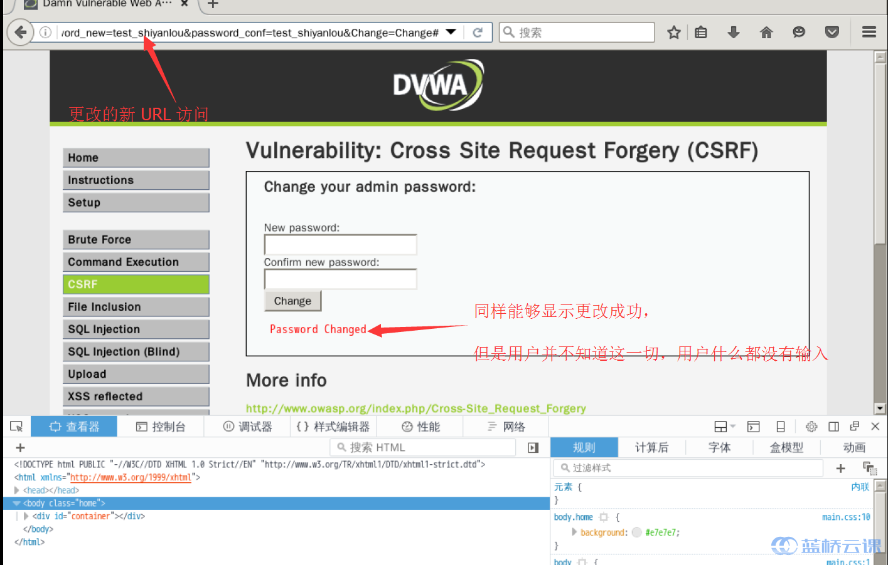

我们可以看到同样可以修改成功，但是用户并没有输入任何的内容，用户根本就不知道又再次被修改了。我们可以验证一下是否真的修改成 `test_shiyanlou` 了。

我们再次关闭浏览器（为的是不使用刚刚的 cookie 访问 dvwa 站点），重新打开浏览器，访问 dvwa 站点：

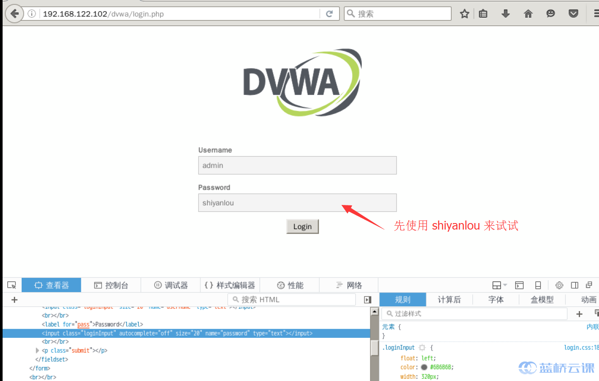

我们可以看到使用 `shiyanlou` 密码登陆失败 `login failed`，说明我们刚刚更改成功了。那我们再试试 `test_shiyanlou`：

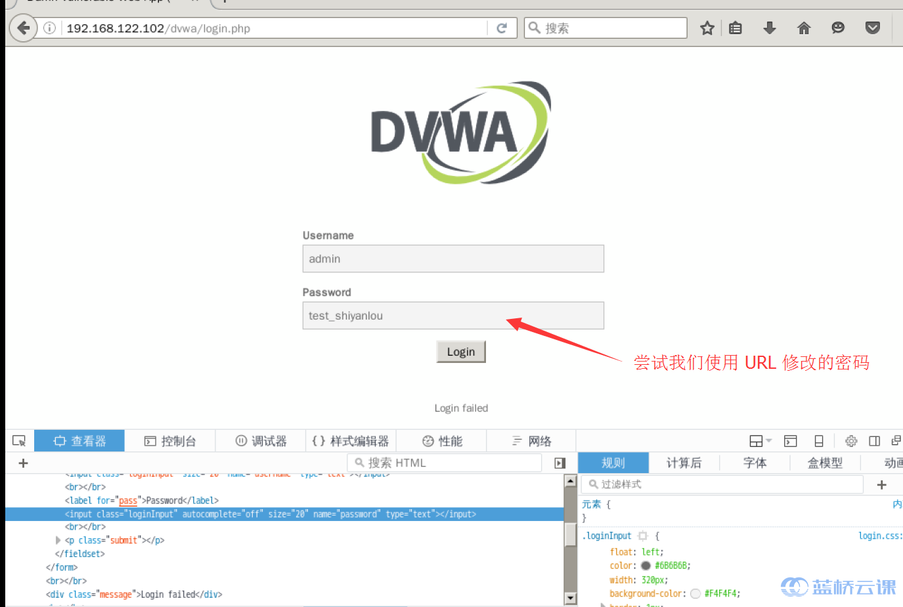

我们可以看到，成功的登陆 dvwa 的平台，说明我们刚刚修改成功了，这就是 CSFR，在不盗取用户任何信息的情况，巧妙的借用用户之手更改了他的密码。

这样的方式过于简单粗暴，用户一看就看出来，不会去点击，我们可以将其伪装成一个下载连接，点击了就中招，我们可以将其伪装成一个图片，点击了就中招，等等。

若是在知道对方的 cookie 情况下，我们还可以使用 curl 来完成这一步：

我们在本地使用可以通过 F12 中网络选项查看到 cookie 值：

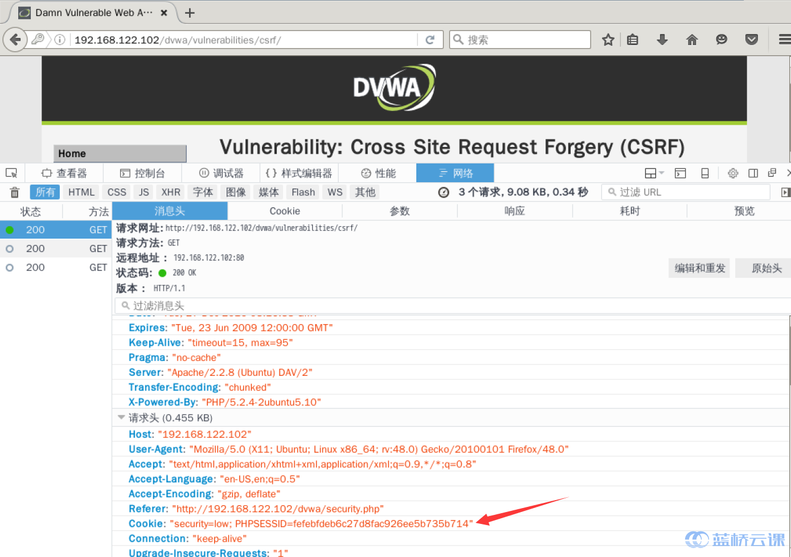

然后我们在 shiyanlou 终端中使用这样的命令：

```
curl --cookie "security=low; PHPSESSID=fefebfdeb6c27d8fac926ee5b735b714" --location "http://192.168.122.102/dvwa/vulnerabilities/csrf/?password_new=shiyanlou&password_conf=shiyanlou&Change=Change#"
```

注意此处的 cookie 应该输入你自己的 cookie，然后在 URL 中 password 输入自己想输入的 URL。

执行了之后我们可以看到为我们返回了一个页面的源代码回来：

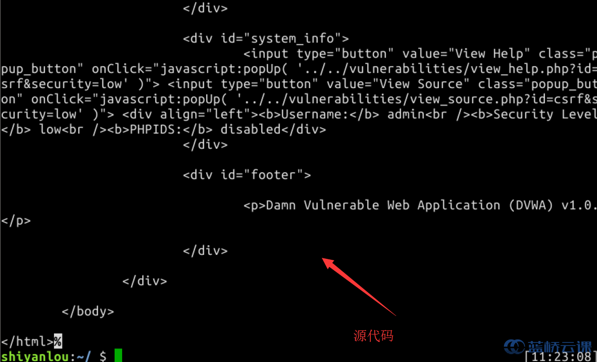

细心的同学会找到 `<pre> Password Changed </pre>` 的字样，说明我们修改成功了。

若是不想找，我们还可以把刚刚的命令修改成这样：

```
curl --cookie "security=low; PHPSESSID=fefebfdeb6c27d8fac926ee5b735b714" --location "http://192.168.122.102/dvwa/vulnerabilities/csrf/?password_new=shiyanlou&password_conf=shiyanlou&Change=Change#" | grep Password
```


验证一下我们是否成功登陆，只需要关闭浏览器、重新打开尝试登陆，或者点击左下角的 `logout` 然后重新登陆便可知道。

还可以通过这样的方式让用户在不知不觉下就中招（该创意参考于 [tipstrickshack_blog](http://tipstrickshack.blogspot.com/2012/10/how-to-exploit-csfr-vulnerabilitycsrf.html)）：

创建一个 404 的页面，使用 img 标签，使用 css 来使其不现实，这样用户就在不知不觉直接就中招了。

首先我们在 shiyanlou 账户的终端下创建一个 test 的 html：

```
vim test.html
```

然后在该文件中存放这样的内容：

```html
<html>
<body>


<h1>Welcome to nginx!</h1>

</body>

</html>
```

可以看到，我们就用了两个标题 404、无法找到来迷惑大家，然后用 img 标签使其自动加载我们放置的钓鱼连接，但是不显示，这样就算中招了也不知道。

保存退出后，我们在家目录中找到该文件：

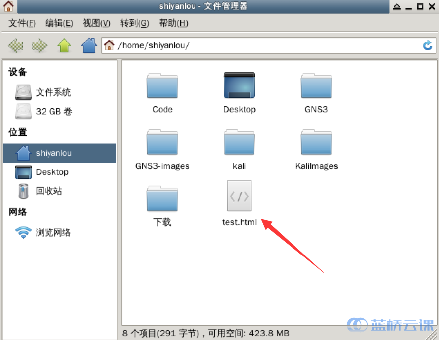

双击后会在 firefox 中打开，成功加载后，我们回到 DVWA 平台，我们 `Logout` 后，再次登陆我们会发现密码已经变了，无法登陆。

这就是 CSRF，利用 cookie 就是伪造用户，来做一些他们并不知道的事情。

### 5.4 CSRF 防范

我们再次登陆 DVWA，我们来查看源码：

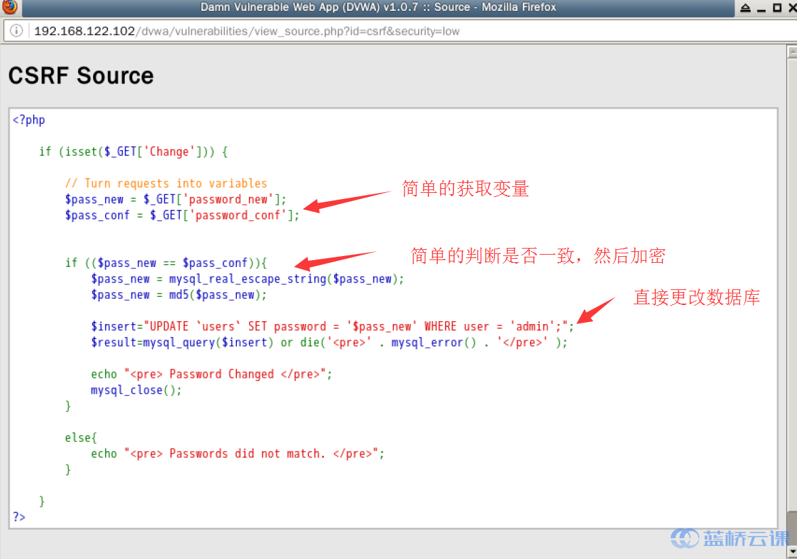/wm)

我们看到源码中直接获取变量，然后简单的判断，最终就加密存放至数据库中。

我们可以更改至 medium 的 Security level。然后我们再次来看源码此时我们看到多了一个判断：

```
 if ( eregi ( "127.0.0.1", $_SERVER['HTTP_REFERER'] ) ){ 
```

eregi() 函数用于正则匹配，看第二个参数字符中能够匹配到第一个字符串，并且不区分大小写，在 php5.3 中便不在支持该函数了。所以添加这段代码的作用便是在更改密码之前判断我们跳转过来的 URL 中是否包含有 `127.0.0.1`，若是能够匹配到，则更改密码，若是无法匹配到，则不修改密码。

这种方式很挫，因为我使用该平台的时候不一定是通过 `127.0.0.1` 来访问的，所以在高版本中这里的 `127.0.0.1` 被修改成 `$_SERVER[ 'SERVER_NAME'`。

我们发现这样判断即使我们正常修改也没有办法修改，因为我们不是通过 `127.0.0.1` 来访问的，这样也可以破解，那个函数的作用就是检查来源 URL 中有没有 `127.0.0.1` 字段，我们只需要把我们刚刚创建的 `test.html` 名字修改成 `127.0.0.1.html` 就可以了：

```bash
sudo mv test.html /usr/share/nginx/html/127.0.0.1.html
```

因为只有通过服务器的跳转才能获取到 `$_SERVER['HTTP_REFERER']`，所以我们必须通过服务器访问才有效，刚刚我们是直接访问的文件，现在我们是将其剪切到 `/usr/share/nginx/html` 中，该目录是 nginx 的根目录，确认 `service nginx start` 是启动的状态，我们便可访问 `192.168.122.1/127.0.0.1.html` 便可修改密码了。

>**注意**：修改 127.0.0.1.html 中的密码才能证明密码被修改过。

看来中级的防范措施并不是一个很好的方法，我们将 Security level 的级别修改到 high。

我们回到 CSRF 可以看到页面发生了变化，现在修改密码需要三个参数，不仅仅需要新密码与确认密码，还必须知道当前使用的密码。这样攻击者在不知道当前密码的情况下是无法悄悄修改密码的。

这样的方式简单、直接有效的防止了这样的攻击发生。

除此之外还可以添加 token，在每次提交表单的时候核对一次 token 的值，但若是在 cookie 被盗用情况下就没有什么作用了。

还有一种方式：输入验证码。这样就不是一个简简单单的连接就修改密码了。

## 6. 总结

本节实验中我们学习了以下内容，任何不清楚的地方欢迎到[实验楼问答](https://www.shiyanlou.com/questions)与我们交流：

- CSRF 简介
- CSRF 实战
- CSRF 防范

请务必保证自己能够动手完成整个实验，只看文字很简单，真正操作的时候会遇到各种各样的问题，解决问题的过程才是收获的过程。

## 7. 作业

1.完成将 test 页面转移到 nginx 的根目录中，并修改名为 127.0.0.1，访问该页面成功修改密码，截图并放在实验报告中。